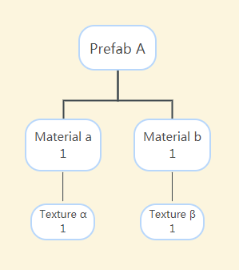
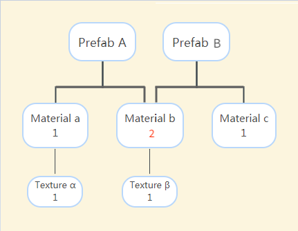
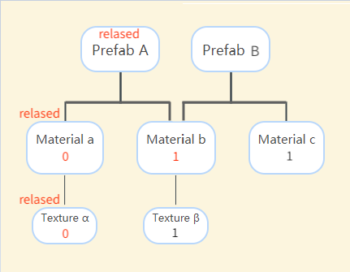

# Asset Manager资源管理

[toc]

在游戏的开发过程中，一般需要使用到大量的图片、音频等资源来丰富整个游戏内容，而大量的资源就会带来管理上的困难。所以 Creator 提供了 **Asset Manager** 资源管理模块来帮助开发者管理其资源的使用，大大提升开发效率和使用体验。

**Asset Manager** 是 Creator 在 v2.4 新推出的资源管理器，用于替代之前的 `cc.loader`。新的 Asset Manager 资源管理模块具备加载资源、查找资源、销毁资源、缓存资源、Asset Bundle 等功能，相比之前的 `cc.loader` 拥有更好的性能，更易用的 API，以及更强的扩展性。所有函数和方法可通过 `cc.assetManager` 进行访问，所有类型和枚举可通过 `cc.AssetManager` 命名空间进行访问。

**注意**：为了带来平滑的升级体验，我们会在一段时间内保留对 `cc.loader` 的兼容，但还是建议新项目统一使用 **Asset Manager**。

## 加载资源

### 动态加载资源

除了在编辑场景时，可以将资源应用到对应组件上，Creator 还支持在游戏运行过程中动态加载资源并进行设置。而动态加载资源 Asset Manager 提供了以下两种的方式：

1. 通过将资源放在 resources 目录下，并配合 `cc.resources.load` 等 API 来实现动态加载。

2. 开发者可以自己规划资源制作为 Asset Bundle，再通过 Asset Bundle 的 `load` 系列 API 进行资源的加载。例如：

   ```js
    cc.resources.load('images/background', cc.SpriteFrame, (err, asset) => {
      this.getComponent(cc.Sprite).spriteFrame = asset;
    });
   ```

相关的 API 列表如下：

| 类型     | 支持           | 加载       | 释放         | 预加载       | 获取 | 查询资源信息    |
| :------- | :------------- | :--------- | :----------- | :----------- | :--- | :-------------- |
| 单个资源 | Asset Bundle   | load       | release      | preload      | get  | getInfoWithPath |
| 文件夹   | Asset Bundle   | loadDir    | releaseAsset | preloadDir   | N/A  | getDirWithPath  |
| 场景     | Asset Bundle   | loadScene  | N/A          | preloadScene | N/A  | getSceneInfo    |
| 单个资源 | `cc.resources` | load       | release      | preload      | get  | getInfoWithPath |
| 文件夹   | `cc.resources` | loadDir    | releaseAsset | preloadDir   | N/A  | getDirWithPath  |
| 脚本     | Asset Manager  | loadScript | N/A          | N/A          | N/A  | N/A             |
| 远程     | Asset Manager  | loadRemote | releaseAsset | N/A          | N/A  | N/A             |

相关文档可参考：

- [加载资源](https://docs.cocos.com/creator/manual/zh/scripting/dynamic-load-resources.html)
- [Asset Bundle](https://docs.cocos.com/creator/manual/zh/scripting/asset-bundle.html)

所有加载到的资源都会被缓存在 `cc.assetManager` 中。

## Asset Bundle 介绍

从 v2.4 开始，Creator 正式支持 Asset Bundle 功能。Asset Bundle 作为资源模块化工具，允许开发者按照项目需求将贴图、脚本、场景等资源划分在多个 Asset Bundle 中，然后在游戏运行过程中，按照需求去加载不同的 Asset Bundle，以减少启动时需要加载的资源数量，从而减少首次下载和加载游戏时所需的时间。
Asset Bundle 可以按需求随意放置，比如可以放在远程服务器、本地、或者小游戏平台的分包中。也可以跨项目复用，用于加载子项目中的 Asset Bundle。

## 内置 Asset Bundle

从 v2.4 开始，项目中所有的资源都会分类放在 Creator 内置的 4 个 Asset Bundle 中：


| 内置 Asset Bundle | 功能说明                                                     | 配置                                                         |
| :---------------- | :----------------------------------------------------------- | :----------------------------------------------------------- |
| `internal`        | 存放所有内置资源以及其依赖资源                               | 通过配置 **资源管理器** 中的 `internal -> resources` 文件夹，但目前不支持修改默认配置 |
| `main`            | 存放所有在 **构建发布** 面板的 **参与构建场景** 中勾选的场景以及其依赖资源 | 通过配置 **构建发布** 面板的 **主包压缩类型** 和 **配置主包为远程包** 两项 |
| `resources`       | 存放 `resources` 目录下的所有资源以及其依赖资源              | 通过配置 **资源管理器** 中的 `assets -> resources` 文件夹    |
| `start-scene`     | 如果在 **构建发布** 面板中勾选了 **初始场景分包**，则首场景将会被构建到 `start-scene` 中。具体内容可参考 [初始场景的资源加载](https://docs.cocos.com/creator/manual/zh/publish/publish-wechatgame.html#初始场景的加载速度)。 | 无法进行配置                                                 |

与其他 Asset Bundle 一样，内置 Asset Bundle（除了 `internal`）也可以根据不同平台进行配置。

在构建完成后，内置 Asset Bundle 会根据配置决定它所生成的位置，具体的配置方法以及生成规则请参考 [配置 Asset Bundle](https://docs.cocos.com/creator/manual/zh/scripting/asset-bundle.html#配置方法)。

### 加载内置 Asset Bundle

内置 Asset Bundle 的加载有以下两种方式:

- 通过在 **构建发布** 面板配置 **资源服务器地址**

- 通过自定义构建模板功能修改 `main.js` 中的代码，如下所示：

  ```js
  // ...
  
  let bundleRoot = [];
  // 加入 internal bundle 的 URL 地址
  bundleRoot.push('http://myserver.com/assets/internal');
  // 如果有 resources bundle, 则加入 resources bundle 的 URL 地址
  bundleRoot.push('http://myserver.com/assets/resources');
  // 加入 main bundle 的 URL 地址
  bundleRoot.push('http://myserver.com/assets/main');
  
  var count = 0;
  function cb (err) {
      if (err) {
          return console.error(err.message, err.stack);
      }
      count++;
      if (count === bundleRoot.length + 1) {
          cc.game.run(option, onStart);
      }
  }
  
  cc.assetManager.loadScript(settings.jsList.map(x => 'src/' + x), cb);
  
  for (let i = 0; i < bundleRoot.length; i++) {
      cc.assetManager.loadBundle(bundleRoot[i], cb);
  }
  ```

## 优先级

当文件夹设置为 Asset Bundle 之后，会将文件夹中的资源以及文件夹外的相关依赖资源都合并到同一个 Asset Bundle 中。这样就有可能出现某个资源虽然不在 Asset Bundle 文件夹中，但因为同时被两个 Asset Bundle 所依赖，所以属于两个 Asset Bundle 的情况，如图所示：


另一种情况是某个资源在一个 Asset Bundle 文件夹中，但同时又被其他 Asset Bundle 所依赖，如图所示：


在这两种情况下，资源 c 既属于 Asset Bundle A，也属于 Asset Bundle B。那资源 c 究竟存在于哪一个 Asset Bundle 中呢？此时就需要通过调整 Asset Bundle 的优先级来指定了。
Creator 开放了 10 个可供配置的优先级，编辑器在构建时将会按照优先级 **从大到小** 的顺序对 Asset Bundle 依次进行构建。

- 当同个资源被 **不同优先级** 的多个 Asset Bundle 引用时，资源会优先放在优先级高的 Asset Bundle 中，低优先级的 Asset Bundle 只会存储一条记录信息。此时低优先级的 Asset Bundle 会依赖高优先级的 Asset Bundle。
  如果你想在低优先级的 Asset Bundle 中加载此共享资源，必须在加载低优先级的 Asset Bundle **之前** 先加载高优先级的 Asset Bundle。
- 当同个资源被 **相同优先级** 的多个 Asset Bundle 引用时，资源会在每个 Asset Bundle 中都复制一份。此时不同的 Asset Bundle 之间没有依赖关系，可按任意顺序加载。所以请尽量确保共享的资源（例如 `Texture`、`SpriteFrame`、`Audio` 等）所在的 Asset Bundle 优先级更高，以便让更多低优先级的 Asset Bundle 共享资源，从而最小化包体。

四个内置 Asset Bundle 文件夹的优先级分别为：

| Asset Bundle  | 优先级 |
| :------------ | :----- |
| `internal`    | 11     |
| `main`        | 7      |
| `resources`   | 8      |
| `start-scene` | 9      |

当四个内置 Asset Bundle 中有相同资源时，资源会优先存储在优先级高的 Asset Bundle — `internal` 文件夹中。建议其他自定义的 Asset Bundle 优先级 **不要高于** 内置的 Asset Bundle，以便尽可能共享内置 Asset Bundle 中的资源。

## 压缩类型

Creator 目前提供了 **默认**、**无压缩**、**合并所有 JSON**、**小游戏分包**、**Zip** 这几种压缩类型用于优化 Asset Bundle。所有 Asset Bundle 默认使用 **默认** 压缩类型，开发者可重新设置包括内置 Asset Bundle（除了 `internal`）在内的所有 Asset Bundle 的压缩类型。

| 压缩类型          | 功能说明                                                     |
| :---------------- | :----------------------------------------------------------- |
| **默认**          | 构建 Asset Bundle 时会将相互依赖的资源的 JSON 文件合并在一起，从而减少运行时的加载请求次数 |
| **无压缩**        | 构建 Asset Bundle 时没有任何压缩操作                         |
| **合并所有 JSON** | 构建 Asset Bundle 时会将所有资源的 JSON 文件合并为一个，从而最大化减少请求数量，但可能会增加单个资源的加载时间 |
| **小游戏分包**    | 在提供了分包功能的小游戏平台，会将 Asset Bundle 设置为对应平台上的分包。具体内容请参考 [小游戏分包](https://docs.cocos.com/creator/manual/zh/publish/subpackage.html) |
| **Zip**           | 在部分小游戏平台，构建 Asset Bundle 时会将资源文件压缩成一个 Zip 文件，从而减少运行时的加载请求数量 |

如果开发者在不同平台对 Asset Bundle 设置了不同的压缩类型，那么在构建时将根据对应平台的设置来构建 Asset Bundle。

如果开发者在旧项目中使用了分包功能，也就是在 **属性检查器** 中勾选了 **配置为子包** 选项，那么当项目升级到 v2.4 之后，将自动转变为 Asset Bundle，并将 Asset Bundle 的压缩类型在支持的平台上设置为 **小游戏分包**。

## Asset Bundle 的构造

在构建时，配置为 Asset Bundle 的文件夹中的所有 **代码** 和 **资源**，会进行以下处理：

- **代码**：文件夹中的所有代码会根据发布平台合并成一个 `index.js` 或 `game.js` 的入口脚本文件，并从主包中剔除。
- **资源**：文件夹中的所有资源以及文件夹外的相关依赖资源都会放到 `import` 或 `native` 目录下。
- **资源配置**：所有资源的配置信息包括路径、类型、版本信息都会被合并成一个 `config.json` 文件。

构建后生成的 Asset Bundle 目录结构如下图所示：


### Asset Bundle 中的脚本

Asset Bundle 支持脚本分包。如果开发者的 Asset Bundle 中包含脚本文件，则所有脚本会被合并为一个 js 文件，并从主包中剔除。在加载 Asset Bundle 时，就会去加载这个 js 文件。

**注意**：

1. 有些平台不允许加载远程的脚本文件，例如微信小游戏，在这些平台上，Creator 会将 Asset Bundle 的代码拷贝到 `src/scripts` 目录下，从而保证正常加载。
2. 不同 Asset Bundle 中的脚本建议最好不要互相引用，否则可能会导致在运行时找不到对应脚本。如果需要引用某些类或变量，可以将该类和变量暴露在一个你自己的全局命名空间中，从而实现共享。

## FAQ

- **Q**：Asset Bundle 与 v2.4 之前的资源分包有什么区别？
  **A**：
  1. 资源分包实际上是将一些图片和网格拆分出去单独放在一个包内，但这个包是不完整的、无逻辑的，无法复用。
     Asset Bundle 是通过逻辑划分对资源进行模块化。Asset Bundle 中包含资源、脚本、元数据和资源清单，所以 Asset Bundle 是完整的、有逻辑的、可复用的，我们可以从 Asset Bundle 中加载出整个场景或其他任何资源。Asset Bundle 通过拆分，可以极大减少首包中的 json 数量以及 `settings.js` 的大小。
  2. 资源分包本质上是由小游戏平台控制的一项基础功能。例如微信小游戏支持分包功能，Creator 就在此基础上做了一层封装，帮助开发者设置资源分包，如果微信小游戏不支持分包功能了，则 Creator 也不支持。
     Asset Bundle 则完全由 Creator 设计实现，是一个帮助开发者对资源进行划分的模块化工具，与游戏平台无关，理论上可支持所有平台。
  3. 资源分包与平台相关，意味着需要按照平台要求的方式设置，比如微信小游戏的分包无法放在远程服务器上，只能放在腾讯的服务器上。
     而 Asset Bundle 不受这些限制，Asset Bundle 可以放在本地、远程服务器，甚至就放在微信小游戏的分包中。
- **Q**：Asset Bundle 是否支持大厅加子游戏的模式？
  **A**：支持，子游戏的场景可以放在 Asset Bundle 中，在需要时加载，子游戏甚至可以在其它项目中预先以 Asset Bundle 的形式构建出来，然后在主项目中加载使用。
- **Q**：Asset Bundle 可以减少 `settings.js` 的大小吗？
  **A**：当然可以。实际上从 v2.4 开始，打包后的项目完全是基于 Asset Bundle 的，`setting.js` 不再存储跟资源相关的任何配置信息，所有的配置信息都会存储在每个 Asset Bundle 的 `config.json` 中。每一个 `config.json` 只存储各自 Asset Bundle 中的资源信息，也就减小了首包的包体。可以简单地理解为所有的 `config.json` 加起来等于之前的 `settings.js`。
- **Q**：Asset Bundle 支持跨项目复用吗？
  **A**：当然支持，不过需要满足以下条件：
  1. 引擎版本相同。
  2. Asset Bundle 中引用到的所有脚本都要放在 Asset bundle 下。
  3. Asset Bundle 没有其他外部依赖 bundle，如果有的话，必须加载。
- **Q**：Asset Bundle 支持分离首场景吗？
  **A**：目前仅支持小游戏平台。你可以在 **构建发布** 面板中勾选 **初始场景分包**，则首场景会被放到内置 Asset Bundle 的 `start-scene` 中，从而实现分离首场景。
- **Q**：Asset Bundle 支持嵌套设置吗？比如 A 文件夹中有 B 文件夹，A 和 B 都可以设置为 Asset Bundle？
  **A**：Asset Bundle 不支持嵌套。

更多关于 Asset Bundle 的配置方法、加载、获取等内容，可参考文档 [加载 Asset Bundle](https://docs.cocos.com/creator/manual/zh/scripting/asset-bundle.html)。

### 预加载

为了减少下载的延迟，`cc.assetManager` 和 Asset Bundle 中不但提供了加载资源的接口，每一个加载接口还提供了对应的预加载版本。开发者可在游戏中进行预加载工作，然后在真正需要时完成加载。预加载只会下载必要的资源，不会进行反序列化和初始化工作，所以性能消耗更小，适合在游戏过程中使用。

```js
start () {
    cc.resources.preload('images/background', cc.SpriteFrame);
    setTimeOut(this.loadAsset.bind(this), 10000);
}

loadAsset () {
    cc.resources.load('images/background', cc.SpriteFrame, (err, asset) => {
        this.getComponent(cc.Sprite).spriteFrame = asset;
    });
}
```

关于预加载的更多内容请参考 [预加载与加载](https://docs.cocos.com/creator/manual/zh/asset-manager/preload-load.html)。

## 加载与预加载

为了尽可能缩短下载时间，很多游戏都会使用预加载。Asset Manager 中的大部分加载接口包括 `load`、`loadDir`、`loadScene` 都有其对应的预加载版本。加载接口与预加载接口所用的参数是完全一样的，两者的区别在于：

1. 预加载只会下载资源，不会对资源进行解析和初始化操作。
2. 预加载在加载过程中会受到更多限制，例如最大下载并发数会更小。
3. 预加载的下载优先级更低，当多个资源在等待下载时，预加载的资源会放在最后下载。
4. 因为预加载没有做任何解析操作，所以当所有的预加载完成时，不会返回任何可用资源。

相比 Creator v2.4 以前的版本，以上优化手段充分降低了预加载的性能损耗，确保了游戏体验顺畅。开发者可以充分利用游戏过程中的网络带宽缩短后续资源的加载时间。

因为预加载没有去解析资源，所以需要在预加载完成后配合加载接口进行资源的解析和初始化，来完成资源加载。例如：

```js
cc.resources.preload('images/background', cc.SpriteFrame);

// wait for while 
cc.resources.load('images/background', cc.SpriteFrame, function (err, spriteFrame) {
    spriteFrame.addRef();
    self.getComponent(cc.Sprite).spriteFrame = spriteFrame;
});
```

**注意**：加载不需要等到预加载完成后再调用，开发者可以在任何时候进行加载。正常加载接口会直接复用预加载过程中已经下载好的内容，缩短加载时间。

## Asset Bundle

开发者可以将自己的场景、资源、代码划分成多个 Asset Bundle，并在运行时动态加载资源，从而实现资源的模块化，以便在需要时加载对应资源。例如：

```js
cc.assetManager.loadBundle('testBundle', function (err, bundle) {
    bundle.load('textures/background', (err, asset) => {
        // ...
    });
});
```

更多关于 Asset Bundle 的介绍请参考 [bundle](https://docs.cocos.com/creator/manual/zh/asset-manager/bundle.html)。

## 释放资源

Asset Manager 提供了更为方便的资源释放机制，在释放资源时开发者只需要关注该资源本身而不再需要关注其依赖资源。引擎会尝试对其依赖资源根据引用数量进行释放，以减少用户管理资源释放的复杂度。例如：

```js
cc.resources.load('prefabs/enemy', cc.Prefab, function (err, asset) {
    cc.assetManager.releaseAsset(asset);
});
```

Creator 还提供了引用计数机制来帮助开发者控制资源的引用和释放。例如：

- 当需要持有资源时，请调用 `addRef` 来增加引用，确保该资源不会被其他引用到的地方自动释放。

  ```js
  cc.resources.load('textures/armor', cc.Texture2D, function (err, texture) {
      texture.addRef();
      this.texture = texture;
  });
  ```

- 当不再需要持有该资源时，请调用 `decRef` 来减少引用，`decRef` 还将根据引用计数尝试自动释放。

  ```js
  this.texture.decRef();
  this.texture = null;
  ```

更多详细内容请参考文档 [资源释放](https://docs.cocos.com/creator/manual/zh/asset-manager/release-manager.html)。

## 资源释放

Asset Manager 中提供了资源释放模块，用于管理资源的释放。

在资源加载完成后，会被临时缓存到 `cc.assetManager` 中，以便下次复用。但是这也会造成内存和显存的持续增长，所以有些资源如果不需要用到，可以通过 **自动释放** 或者 **手动释放** 的方式进行释放。释放资源将会销毁资源的所有内部属性，比如渲染层的相关数据，并移出缓存，从而释放内存和显存（对纹理而言）。

## 自动释放

场景的自动释放可以直接在编辑器中设置。在 **资源管理器** 选中场景后，**属性检查器** 中会出现 **自动释放资源** 选项。


勾选后，点击右上方的 **应用** 按钮，之后在切换该场景时便会自动释放该场景所有的依赖资源。建议场景尽量都勾选自动释放选项，以确保内存占用较低，除了部分高频使用的场景（例如主场景）。

另外，所有 `cc.Asset` 实例都拥有成员函数 `cc.Asset.addRef` 和 `cc.Asset.decRef`，分别用于增加和减少引用计数。一旦引用计数为零，Creator 会对资源进行自动释放（需要先通过释放检查，具体可参考下部分内容的介绍）

```js
start () {
    cc.resources.load('images/background', cc.Texture2D, (err, texture) => {
        this.texture = texture;
        // 当需要使用资源时，增加其引用
        texture.addRef();
        // ...
    });
}

onDestroy () {
    // 当不需要使用资源时，减少引用
    // Creator 会在调用 decRef 后尝试对其进行自动释放
    this.texture.decRef();
}
```

自动释放的优势在于不用显式地调用释放接口，开发者只需要维护好资源的引用计数，Creator 会根据引用计数自动进行释放。这大大降低了错误释放资源的可能性，并且开发者不需要了解资源之间复杂的引用关系。对于没有特殊需求的项目，建议尽量使用自动释放的方式来释放资源。

### 释放检查

为了避免错误释放正在使用的资源造成渲染或其他问题，Creator 会在自动释放资源之前进行一系列的检查，只有检查通过了，才会进行自动释放。

1. 如果资源的引用计数为 0，即没有其他地方引用到该资源，则无需做后续检查，直接摧毁该资源，移除缓存。
2. 资源一旦被移除，会同步触发其依赖资源的释放检查，将移除缓存后的资源的 **直接** 依赖资源（不包含后代）的引用都减 1，并同步触发释放检查。
3. 如果资源的引用计数不为 0，即存在其他地方引用到该资源，此时需要进行循环引用检查，避免出现自己的后代引用自己的情况。如果循环引用检查完成之后引用计数仍不为 0，则终止释放，否则直接摧毁该资源，移除缓存，并触发其依赖资源的释放检查（同步骤 2）。

## 手动释放

当项目中使用了更复杂的资源释放机制时，可以调用 Asset Manager 的相关接口来手动释放资源。例如：

```js
cc.assetManager.releaseAsset(texture);
```

因为资源管理模块在 v2.4 做了升级，所以释放接口与之前的版本有一点区别：

1. `cc.assetManager.releaseAsset` 接口仅能释放单个资源，且为了统一，接口只能通过资源本身来释放资源，不能通过资源 uuid、资源 url 等属性进行释放。
2. 在释放资源时，开发者只需要关注资源本身，引擎会 **自动释放** 其依赖资源，不再需要通过 `getDependsRecursively` 手动获取依赖。

**注意**：`release` 系列接口（例如 `release`、`releaseAsset`、`releaseAll`）会直接释放资源，而不会进行释放检查，只有其依赖资源会进行释放检查。所以当显式调用 `release` 系列接口时，可以确保资源本身一定会被释放。

## 引用计数统计

在 v2.4 之前，Creator 选择让开发者自行控制所有资源的释放，包括资源本身及其依赖项，开发者必须手动获取资源所有的依赖项并选择需要释放的依赖项。这种方式给予了开发者最大的控制权，对于小型项目来说工作良好。但随着 Creator 的发展，项目的规模不断扩大，场景所引用的资源不断增加，其他场景也可能复用了这些资源，这就会导致释放资源的复杂度越来越高，开发者要掌握所有资源的使用非常困难。

为了解决这个痛点，Asset Manager 提供了一套基于引用计数的资源释放机制，让开发者可以简单高效地释放资源，不用担心项目规模的急剧膨胀。需要说明的是 Asset Manager 只会自动统计资源之间的静态引用，并不能真实地反应资源在游戏中被动态引用的情况，动态引用还需要开发者进行控制以保证资源能够被正确释放。原因如下：

- JavaScript 是拥有垃圾回收机制的语言，会对其内存进行管理，在浏览器环境中引擎无法知道某个资源是否被销毁。
- JavaScript 无法提供赋值运算符的重载，而引用计数的统计则高度依赖于赋值运算符的重载。

### 资源的静态引用

当开发者在编辑器中编辑资源时（例如场景、预制体、材质等），需要在这些资源的属性中配置一些其他的资源，例如在材质中设置贴图，在场景的 Sprite 组件上设置 SpriteFrame。那么这些引用关系会被记录在资源的序列化数据中，引擎可以通过这些数据分析出依赖资源列表，像这样的引用关系就是静态引用。

引擎对资源的静态引用的统计方式为：

1. 在使用 `cc.assetManager` 或者 Asset Bundle 加载某个资源时，引擎会在底层加载管线中记录该资源所有 **直接依赖资源** 的信息，并将所有 **直接依赖资源** 的引用计数加 1，然后将该资源的引用计数初始化为 0。
2. 在释放资源时，取得该资源之前记录的所有 **直接依赖资源** 信息，并将所有依赖资源的引用计数减 1。

因为在释放检查时，如果资源的引用计数为 0，才可以被自动释放。所以上述步骤可以保证资源的依赖资源无法先于资源本身被释放，因为依赖资源的引用计数肯定不为 0。也就是说，只要一个资源本身不被释放，其依赖资源就不会被释放，从而保证在复用资源时不会错误地进行释放。下面我们来看一个例子：

1. 假设现在有一个 A 预制体，其依赖的资源包括 a 材质和 b 材质。a 材质引用了 α 贴图，b 材质引用了 β 贴图。那么在加载 A 预制体之后，a、b 材质的引用计数都为 1，α、β 贴图的引用计数也都为 1。

   

2. 假设现在又有一个 B 预制体，其依赖的资源包括 b 材质和 c 材质。则在加载 B 预制体之后，b 材质的引用计数为 2，因为它同时被 A 和 B 预制体所引用。而 c 材质的引用计数为 1，α、β 贴图的引用计数也仍为 1。

   

3. 此时释放 A 预制体，则 a，b 材质的引用计数会各减 1

   - a 材质的引用计数变为 0，被释放，所以贴图 α 的引用计数减 1 变为了 0，也被释放。

   - b 材质的引用计数变为 1，被保留，所以贴图 β 的引用计数仍为 1，也被保留。

   - 因为 B 预制体没有被释放，所以 c 材质的引用计数仍为 1，被保留。

     

### 资源的动态引用

当开发者在编辑器中没有对资源做任何设置，而是通过代码动态加载资源并设置到场景的组件上，则资源的引用关系不会记录在序列化数据中，引擎无法统计到这部分的引用关系，这些引用关系就是动态引用。

如果开发者在项目中使用动态加载资源来进行动态引用，例如：

```js
cc.resources.load('images/background', cc.SpriteFrame, function (err, spriteFrame) {
    self.getComponent(cc.Sprite).spriteFrame = spriteFrame;
});
```

此时会将 SpriteFrame 资源设置到 Sprite 组件上，引擎不会做特殊处理，SpriteFrame 的引用计数仍保持 0。如果动态加载出来的资源需要长期引用、持有，或者复用时，建议使用 `addRef` 接口手动增加引用计数。例如：

```js
cc.resources.load('images/background', cc.SpriteFrame, function (err, spriteFrame) {
    self.getComponent(cc.Sprite).spriteFrame = spriteFrame;
    spriteFrame.addRef();
});
```

增加引用计数后，可以保证该资源不会被提前错误释放。而在不需要引用该资源以及相关组件，或者节点销毁时，请 **务必记住** 使用 `decRef` 移除引用计数，并将资源引用设为 `null`，例如：

```js
this.spriteFrame.decRef();
this.spriteFrame = null;
```

## 缓存管理器

在某些平台上，比如微信小游戏，因为存在文件系统，所以可以利用文件系统对一些远程资源进行缓存。此时需要一个缓存管理器来管理所有缓存资源，例如缓存资源、清除缓存资源、修改缓存周期等。从 v2.4 开始，Creator 在所有存在文件系统的平台上都提供了缓存管理器，以便对缓存进行增删改查操作。例如：

```js
// 获取某个资源的缓存
cc.assetManager.cacheManager.getCache('http://example.com/bundle1/import/9a/9aswe123-dsqw-12xe-123xqawe12.json');

// 清除某个资源的缓存
cc.assetManager.cacheManager.removeCache('http://example.com/bundle1/import/9a/9aswe123-dsqw-12xe-123xqawe12.json');
```

更多缓存管理器的介绍请参考 [缓存管理器](https://docs.cocos.com/creator/manual/zh/asset-manager/cache-manager.html)。

在 Web 平台，资源下载完成之后，缓存是由浏览器进行管理，而不是引擎。
而在某些非 Web 平台，比如微信小游戏，这类平台具备文件系统，可以利用文件系统对一些远程资源进行缓存，但并没有实现资源的缓存机制。此时需要由引擎实现一套缓存机制用于管理从网络上下载下来的资源，包括缓存资源、清除缓存资源、查询缓存资源等功能。

从 v2.4 开始，Creator 在所有存在文件系统的平台上都提供了缓存管理器，以便对缓存进行增删改查操作，开发者可以通过 `cc.assetManager.cacheManager` 进行访问。

## 资源下载流程

引擎下载资源的逻辑如下：

1. 判断资源是否在游戏包内，如果在则直接使用；
2. 如果不在则查询资源是否在缓存中，如果在缓存中则直接使用；
3. 如果不在则查询资源是否在临时目录中，如果在临时目录中则直接使用（原生平台没有临时目录，跳过该步骤）；
4. 如果不在就从远程服务器下载资源，资源下载到临时目录后直接使用（原生平台则是将资源下载到缓存目录）；
5. 后台缓慢地将临时目录中的资源保存到本地缓存目录中（原生平台跳过该步骤）；
6. 当缓存空间占满后，此时会使用 LRU 算法删除比较久远的资源（原生平台的缓存空间没有大小限制，跳过该步骤，开发者可以手动调用清理）。

小游戏的资源管理可参考文档 [微信小游戏的资源管理](https://docs.cocos.com/creator/manual/zh/publish/publish-wechatgame.html#微信小游戏的资源管理)。

## 查询缓存文件

缓存管理器提供了 `getCache` 接口以查询所有的缓存资源，开发者可以通过传入资源的原路径来查询缓存路径。

```js
cc.resources.load('images/background', cc.Texture2D, function (err, texture) {
    var cachePath = cc.assetManager.cacheManager.getCache(texture.nativeUrl);
    console.log(cachePath);
});
```

## 查询临时文件

当资源下载到本地后，可能会以临时文件的形式存储在临时目录中。缓存管理器提供了 `tempFiles` 接口以查询所有下载到临时目录中的资源，开发者可以通过传入资源的原路径进行查询。

```js
cc.assetManager.loadRemote('http://example.com/background.jpg', function (err, texture) {
    var tempPath = cc.assetManager.cacheManager.getTemp(texture.nativeUrl);
    console.log(tempPath);
});
```

## 缓存资源

缓存管理器中提供了一些参数用于控制资源的缓存：

- `cacheManager.cacheDir` —— 控制缓存资源的存储目录。

- `cacheManager.cacheInterval` —— 控制缓存单个资源的周期，默认 500ms 缓存一次。

- `cacheManager.cacheEnabled` —— 控制是否要缓存资源，默认为缓存。另外，开发者也可以通过指定可选参数 `cacheEnabled` 来覆盖全局设置，例如：

  ```js
  cc.assetManager.loadRemote('http://example.com/background.jpg', {cacheEnabled: true}, callback);
  ```

## 清理缓存

缓存管理器提供了 `removeCache`, `clearCache`, `clearLRU` 这三个接口用于清理缓存资源：

- `removeCache` —— 清理单个缓存资源，使用时需要提供资源的原路径，例如：

  ```js
  cc.assetManager.loadRemote('http://example.com/background.jpg', function (err, texture) {
      cc.assetManager.cacheManager.removeCache(texture.nativeUrl);
  });
  ```

- `clearCache` —— 清理所有缓存资源，请慎重使用。

- `clearLRU` —— 清理比较久远的资源。小游戏平台会在缓存空间满了后自动调用 `clearLRU`。

## 可选参数

`cc.assetManager` 和 Asset Bundle 的部分接口都额外提供了 `options` 参数，可以极大地增加灵活性以及扩展空间。`options` 中除了可以配置 Creator 内置的参数之外，还可以自定义任意参数，这些参数将提供给下载器、解析器以及加载管线。

```js
bundle.loadScene('test', { priority: 3 }, callback);
```

更多关于 `options` 的内容可参考文档 [可选参数](https://docs.cocos.com/creator/manual/zh/asset-manager/options.html)。

如果不需要配置引擎内置参数或者自定义参数来扩展引擎功能，可以无视它，直接使用更简单的 API 接口，比如 `cc.resources.load`。

为了增加灵活性和可扩展性，Asset Manager 中大部分的加载接口包括 `cc.assetManager.loadAny` 和 `cc.assetManager.preloadAny` 都提供了 `options` 参数。`options` 除了可以配置 Creator 的内置参数，还可以自定义任意参数用于扩展引擎功能。如果开发者不需要配置引擎内置参数或者扩展引擎功能，可以无视它，直接使用更简单的 API 接口，比如 `cc.resources.load`。

目前 `options` 中引擎已使用的参数包括：

```
uuid`, `url`, `path`, `dir`, `scene`, `type`, `priority`, `preset`, `audioLoadMode`, `ext`, `bundle`, `onFileProgress`, `maxRetryCount`, `maxConcurrency`, `maxRequestsPerFrame`, `version`, `responseType`, `withCredentials`, `mimeType`, `timeout`, `header`, `reload`, `cacheAsset`, `cacheEnabled
```

**注意**：请 **不要** 使用以上字段作为自定义参数的名称，避免与引擎功能发生冲突。

## 控制底层加载管线

可选参数是上层业务逻辑与底层加载管线之间的沟通工具。上层业务逻辑提供参数，用于控制下载器、解析器以及加载管线。

### 控制下载器和解析器

可选参数 `priority`, `maxConcurrency`, `maxRequestsPerFrame`, `maxRetryCount` 分别用于控制下载器对于下载请求的优先级排序、下载并发数限制、每帧能发起的请求数限制、最大重试次数。

```js
cc.assetManager.loadAny({'path': 'image/background'}, {priority: 2, maxRetryCount: 10}, callback);
```

### 控制下载器和解析器的处理方法

下载器/解析器中的文本文件和二进制文件等资源的处理方法，可接受可选参数 `responseType`, `withCredentials`, `mimeType`, `timeout`, `header`, `onFileProgress` 用于设置 XHR 的返回类型、头部以及下载进度回调等参数。

```js
// 获取 XHR 的下载进度回调
cc.assetManager.loadAny({'path': 'image/background'}, {onFileProgress: function (loaded, total) {
    console.log(loaded/total);
}}, callback);
```

而可选参数 `audioLoadMode` 则用于控制音频文件的处理方法是否使用 `WebAudio` 来加载音频。

```js
// 使用 WebAudio 远程加载音频
cc.assetManager.loadRemote('http://example.com/background.mp3', {audioLoadMode: cc.AudioClip.LoadMode.WEB_AUDIO}, callback);
```

**注意**：想要获取资源的加载进度必须在服务器端做好相关配置。

更多关于处理方法的介绍请参考 [下载与解析](https://docs.cocos.com/creator/manual/zh/asset-manager/downloader-parser.html)。

### 控制加载流程

可选参数 `reload`, `cacheAsset`, `cacheEnabled` 用于控制加载管线是否复用缓存中的资源、是否缓存资源、以及是否缓存文件。

```js
cc.assetManager.loadRemote(url, {reload: true, cacheAsset: false, cacheEnabled: true}, (err, asset) => {});
```

而可选参数 `uuid`, `url`, `path`, `dir`, `scene`, `type`, `ext`, `bundle` 等，则是用于搜索资源。

```js
cc.assetManager.loadAny({'path': 'images/background', type: cc.SpriteFrame, bundle: 'resources'}, callback);

cc.assetManager.loadAny({'dir': 'images', type: cc.SpriteFrame, bundle: 'resources'}, callback);
```

这种方式完全等价于直接使用 `cc.resources.load` 和 `cc.resources.loadDir`。

## 扩展引擎

开发者可以通过在 [管线](https://docs.cocos.com/creator/manual/zh/asset-manager/pipeline-task.html) 和 [自定义处理方法](https://docs.cocos.com/creator/manual/zh/asset-manager/downloader-parser.html#自定义处理方法) 中使用可选参数来扩展引擎的加载功能。

```js
// 扩展管线
cc.assetManager.pipeline.insert(function (task, done) {
    var input = task.input;
    for (var i = 0; i < input.length; i++) {
        if (input[i].options.myParam === 'important') {
            console.log(input[i].url);
        }
    }
    task.output = task.input;
    done();
}, 1);

cc.assetManager.loadAny({'path': 'images/background'}, {'myParam': 'important'}, callback);

// 注册处理方法
cc.assetManager.downloader.register('.myformat', function (url, options, callback) {
    // 下载对应资源
    var img = new Image();
    if (options.isCrossOrigin) {
        img.crossOrigin = 'anonymous';
    }

    img.onload = function () {
        callback(null, img);
    };

    img.onerror = function () {
        callback(new Error('download failed'), null);
    };

    img.src = url;

});

cc.assetManager.parser.register('.myformat', function (file, options, callback) {
    // 解析下载完成的文件
    callback(null, file);
});

cc.assetManager.loadAny({'url': 'http://example.com/myAsset.myformat'}, {isCrossOrigin: true}, callback);
```

通过可选参数，再结合管线和自定义处理方法，引擎可以获得极大的扩展度。Asset Bundle 可以看做是使用可选参数扩展的第一个实例。


## 加载管线

为了更方便地扩展资源加载流程，Asset Manager 底层使用了名为 **管线与任务**、**下载与解析** 的机制来完成资源的加载工作，极大地增加了灵活性和可扩展性。如果需要扩展加载管线或自定义管线，可以参考：

- [管线与任务](https://docs.cocos.com/creator/manual/zh/asset-manager/pipeline-task.html)
- [下载与解析](https://docs.cocos.com/creator/manual/zh/asset-manager/downloader-parser.html)

## 下载与解析

Asset Manager 底层使用了多条加载管线来加载和解析资源，每条管线中都使用了 `downloader` 和 `parser` 模块，也就是下载器和解析器。开发者可以通过 `cc.assetManager.downloader` 和 `cc.assetManager.parser` 来访问。

## 下载器

下载器是一个全局单例，包括 **下载重试**、**下载优先级排序** 和 **下载并发数限制** 等功能。

### 下载重试

下载器如果下载资源失败，会自动重试下载，开发者可以通过 `maxRetryCount` 和 `retryInterval` 属性来设置重试下载的相关参数。

- `maxRetryCount` 属性用于设置重试下载的最大次数，默认 3 次。若不需要重试下载，可设置为 0，则下载失败时会立即返回错误。

  ```js
  cc.assetManager.downloader.maxRetryCount = 0;
  ```

- `retryInterval` 属性用于设置重试下载的间隔时间，默认 2000 ms。若设置为 4000 ms，则下载失败时会先等待 4000 ms，然后再重新下载。

  ```js
  cc.assetManager.downloader.retryInterval = 4000;
  ```

### 下载优先级

Creator 开放了四个下载优先级，下载器将会按照优先级 **从大到小** 的顺序来下载资源。

| 资源                 | 优先级 | 说明                                                         |
| :------------------- | :----- | :----------------------------------------------------------- |
| 脚本或 Asset Bundle  | 2      | 优先级最高                                                   |
| 场景资源             | 1      | 包括场景中的所有资源，确保场景能够快速加载                   |
| 开发者手动加载的资源 | 0      |                                                              |
| 预加载资源           | -1     | 优先级最低，因为预加载更多是提前加载资源，时间要求相对较为宽松 |

开发者也可以通过可选参数 `priority` 传入一个优先级来覆盖默认设置，从而控制加载顺序。详情可参考下方的“通过可选参数设置”部分。

### 设置下载并发数

开发者可以通过 `maxConcurrency` 和 `maxRequestsPerFrame` 来设置下载器的最大下载并发数等限制。

- `maxConcurrency` 用于设置下载的最大并发连接数，若当前连接数超过限制，将会进入等待队列。

  ```js
  cc.assetManager.downloader.maxConcurrency = 10;
  ```

- `maxRequestsPerFrame` 用于设置每帧发起的最大请求数，从而均摊发起请求的 CPU 开销，避免单帧过于卡顿。如果此帧发起的连接数已经达到上限，将延迟到下一帧发起请求。

  ```js
  cc.assetManager.downloader.maxRequestsPerFrame = 6;
  ```

另外，`downloader` 中使用了一个 `jsb.Downloader` 类的实例，用于在 **原生平台** 从服务器上下载资源。`jsb.Downloader` 与 Web 的 [XMLHttpRequest](https://docs.cocos.com/creator/manual/zh/scripting/network.html) 类似。目前 `jsb.Downloader` 类的实例的下载并发数限制默认为 **32**，超时时长默认为 **30s**，如果需要修改默认值，可以在 `main.js` 中修改：

```js
// main.js
cc.assetManager.init({ 
    bundleVers: settings.bundleVers,
    remoteBundles: settings.remoteBundles,
    server: settings.server,
    jsbDownloaderMaxTasks: 32, // 最大并发数
    jsbDownloaderTimeout: 60 // 超时时长
});
```

## 解析器

解析器用于将文件解析为引擎可识别的资源，开发者可以通过 `cc.assetManager.parser` 来访问。

## 通过可选参数设置

在下载器和解析器中的设置都是全局设置，若开发者需要单独设置某个资源，可以通过 **可选参数** 传入专有设置来覆盖全局设置，例如：

```js
cc.assetManager.loadAny({'path': 'test'}, {priority: 2, maxRetryCount: 1, maxConcurrency: 10}, callback);
```

具体内容可参考文档 [可选参数](https://docs.cocos.com/creator/manual/zh/asset-manager/options.html)。

## 预设

Creator 预先对正常加载、预加载、场景加载、Asset Bundle 加载、远程资源加载、脚本加载这 6 种加载情况的下载/解析参数做了预设，其中预加载因为性能考虑，所以限制较大，最大并发数更小。如下所示：

```js
{
    'default': {
        priority: 0,
    },

    'preload': {
        maxConcurrency: 2, 
        maxRequestsPerFrame: 2,
        priority: -1,
    },

    'scene': {
        maxConcurrency: 8, 
        maxRequestsPerFrame: 8,
        priority: 1,
    },

    'bundle': {
        maxConcurrency: 8, 
        maxRequestsPerFrame: 8,
        priority: 2,
    },

    'remote': {
        maxRetryCount: 4
    },

    'script': {
        priority: 2
    }
}
```

开发者可以通过 `cc.assetManager.presets` 对每种预设进行修改，使用时需要传入预设的名称来访问对应的参数项。

```js
// 修改预加载的预设优先级为 1
let preset = cc.assetManager.presets.preload;
preset.priority = 1;
```

也可以增加自定义预设，并通过可选参数 `preset` 传入。

```js
// 自定义预设，并通过可选参数 preset 传入
cc.assetManager.presets.mypreset = {maxConcurrency: 10, maxRequestsPerFrame: 6};
cc.assetManager.loadAny({'path': 'test'}, {preset: 'mypreset'}, callback);
```

**注意**：通过可选参数、预设以及下载器/解析器本身，均能设置下载和解析过程中的相关参数（例如下载并发数、重试次数等）。当使用多种方式设置了同一个参数时，引擎会按照 **可选参数 > 预设 > 下载器/解析器** 的先后顺序进行选取使用。也就是说，如果引擎在可选参数中找不到相关设置时，会去预设中查找，如果预设中也找不到时，才会去下载器/解析器中查找。

## 自定义处理方法

下载器和解析器都拥有一张注册表，在使用 `downloader` 或 `parser` 时，下载器和解析器会根据传入的后缀名称去注册表中查找对应的下载方式和解析方式，并将参数传入对应的处理方式之中。当开发者需要修改目前格式的处理方式，或者在项目中增加一个自定义格式时，可以通过注册自定义的处理方式来实现扩展引擎。下载器与解析器都提供了 `register` 接口用于注册处理方法，使用方式如下：

```js
cc.assetManager.downloader.register('.myformat', function (url, options, callback) {
    // 下载对应资源
    ......
});

cc.assetManager.parser.register('.myformat', function (file, options, callback) {
    // 解析下载完成的文件
    ......
});
```

自定义的处理方法需要接收三个参数：

- 第一个参数为处理对象，在下载器中是 url，在解析器中是文件。
- 第二个参数是可选参数，可选参数可以在调用加载接口时指定。
- 第三个参数是完成回调，当注册完成处理方法时，需要调用该函数，并传入错误信息或结果。

在注册了处理方法之后，当下载器/解析器遇到带相同扩展名的请求时，会使用对应的处理方式，这些自定义的处理方式将供全局所有加载管线使用。

```js
cc.assetManager.loadAny({'url': 'http://example.com/myAsset.myformat'}, callback);
```

需要注意的是，处理方法可以接收传入的可选参数，开发者可以利用可选参数实现自定义扩展，具体内容可查看文档 [可选参数](https://docs.cocos.com/creator/manual/zh/asset-manager/options.html#扩展引擎)。

# 管线与任务

为了更方便地修改或者扩展引擎资源加载流程，Asset Manager 底层使用了名为 **管线与任务** 和 **下载与解析** 的机制对资源进行加载，本篇内容主要介绍 **管线与任务**。

虽然在 v2.4 之前的 `cc.loader` 已经开始使用管线的概念来进行资源加载，但是在 Asset Manager 中，我们对管线进行了重构，使得逻辑更加清晰，也更容易扩展。开发者可以扩展现有管线，也可以使用引擎提供的类 `cc.AssetManager.Pipeline` 来自定义管线。

## 管线

**管线** 可以理解为一系列过程的串联组合，当一个请求经过管线时，会被管线的各个阶段依次进行处理，最后输出处理后的结果。如下图所示：


管线与一般的固定流程相比，优势在于管线中的所有环节都是可拼接和组合的，这意味着开发者可以在现有管线的任意环节插入新的阶段或者移除旧的阶段，极大地增强了灵活性和可扩展性。

### 内置管线

Asset Manager 中内置了三条管线：


- 第一条管线用于转换资源路径，找到真实资源路径。
- 第二条管线用于正常加载。
- 第三条管线用于预加载。

**注意**：第二条管线用到了下载器和解析器，第三条管线则用到了下载器，具体内容可参考 [下载与解析](https://docs.cocos.com/creator/manual/zh/asset-manager/downloader-parser.html)。

### 自定义管线

开发者可以对内置管线进行自定义扩展以实现自己的定制需求：

```js
cc.assetManager.pipeline.insert(function (task, done) {
    task.output = task.input; 
    for (var i = 0; i < task.input; i++) {
        console.log(task.input[i].content);
    }
    done();
}, 1);
```

也可以构建一条新的管线：

```js
var pipeline = new cc.AssetManager.Pipeline('test', [(task, done) => {
    console.log('first step');
    done();
}, (task, done) => {
    console.log('second step');
    done();
}]);
```

构建管线需要一系列方法，每个方法需要传入一个任务参数和一个完成回调参数。开发者可以在方法中访问任务的所有内容，在完成时调用完成回调即可。

## 任务

**任务** 就是在管线中流动的请求，一个任务中包括输入、输出、完成回调、[可选参数](https://docs.cocos.com/creator/manual/zh/asset-manager/options.html) 等内容。当任务在管线中流动时，管线的各个阶段会取出任务的输入，做出一定的处理后存回到输出中。

```js
cc.assetManager.pipeline.insert(function (task, done) {
    for (var i = 0; i < task.input.length; i++) {
        task.input[i].content = null;
    }
    task.output = task.input;
    done();
}, 1);
```

具体内容可参考 [cc.AssetManager.Task](https://docs.cocos.com/creator/api/zh/classes/Task.html) 类型。

## 更多参考

- [Asset Bundle](https://docs.cocos.com/creator/manual/zh/asset-manager/bundle.html)
- [资源释放](https://docs.cocos.com/creator/manual/zh/asset-manager/release-manager.html)
- [下载与解析](https://docs.cocos.com/creator/manual/zh/asset-manager/downloader-parser.html)
- [加载与预加载](https://docs.cocos.com/creator/manual/zh/asset-manager/preload-load.html)
- [缓存管理器](https://docs.cocos.com/creator/manual/zh/asset-manager/cache-manager.html)
- [可选参数](https://docs.cocos.com/creator/manual/zh/asset-manager/options.html)
- [管线与任务](https://docs.cocos.com/creator/manual/zh/asset-manager/pipeline-task.html)