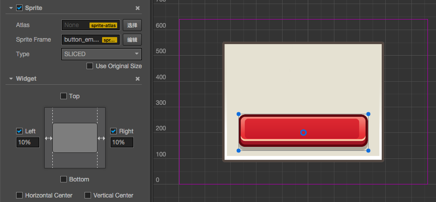
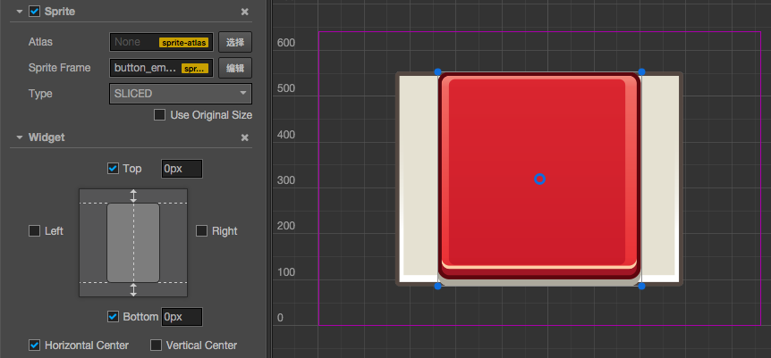
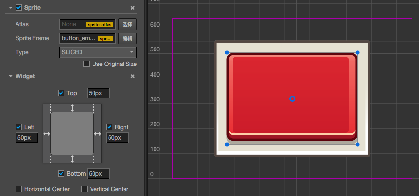
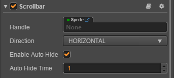
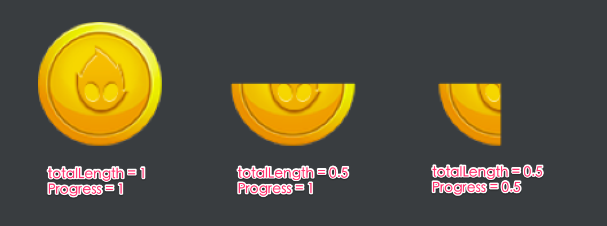
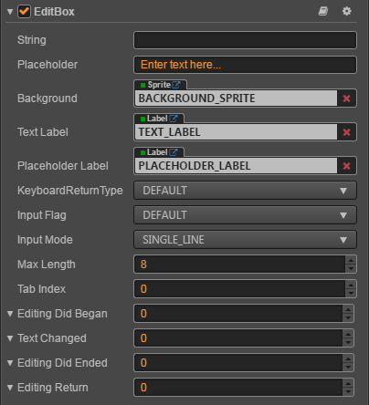
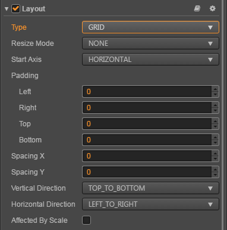
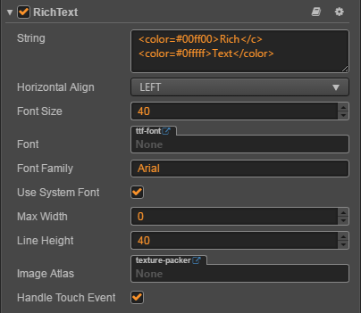
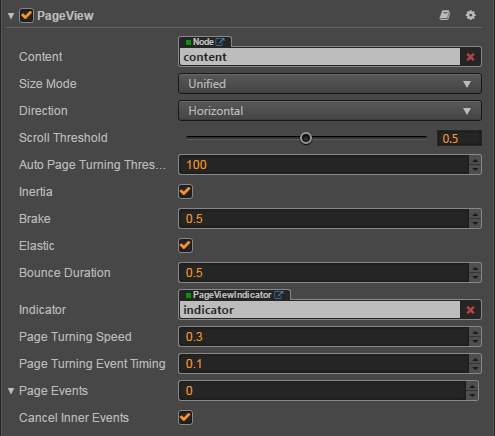
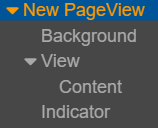

[toc]

# Canvas（画布）组件参考

**Canvas（画布）** 组件能够随时获得设备屏幕的实际分辨率并对场景中所有渲染元素进行适当的缩放。场景中的 Canvas 同时只能有一个，建议所有 UI 和可渲染元素都设置为 Canvas 的子节点。

# 常用 


## 选项

| 选项              | 说明                                                 |
| ----------------- | ---------------------------------------------------- |
| Design Resolution | 设计分辨率（内容生产者在制作场景时使用的分辨率蓝本） |
| Fit Height        | 适配高度（设计分辨率的高度自动撑满屏幕高度）         |
| Fit Width         | 适配宽度（设计分辨率的宽度自动撑满屏幕宽度）         |

## 适配屏幕尺寸

Canvas 在做屏幕适配时，只会对整个游戏的画面进行缩放或拉伸，并不会修改所在节点的尺寸。节点尺寸将默认跟设计分辨率保持一致，因此不会跟屏幕实际大小完全贴合。所以为了让子节点能够正确适配屏幕实际大小，通常我们需要让 Canvas 所在节点的尺寸对齐到全屏幕。因此在编辑器中添加 Canvas 组件时，还会自动添加一个 Widget 组件，使 Canvas 所在节点能够自动撑满全屏。


开发者如需固定 Canvas 节点的尺寸为设计分辨率，可以手动移除或禁用 Widget 组件。另外，当旧项目升级到 v2.3 时，编辑器会自动添加 Widget 组件，开发者无需手动添加。

# Widget 组件参考

Widget (对齐挂件) 是一个很常用的 UI 布局组件。它能使当前节点自动对齐到父物体的任意位置，或者约束尺寸，让你的游戏可以方便地适配不同的分辨率。


## 选项

| 选项             | 说明                                                     | 备注                                                         |
| ---------------- | -------------------------------------------------------- | ------------------------------------------------------------ |
| Top              | 对齐上边界                                               | 选中后，将在旁边显示一个输入框，用于设定当前节点的上边界和父物体的上边界之间的距离。 |
| Bottom           | 对齐下边界                                               | 选中后，将在旁边显示一个输入框，用于设定当前节点的下边界和父物体的下边界之间的距离。 |
| Left             | 对齐左边界                                               | 选中后，将在旁边显示一个输入框，用于设定当前节点的左边界和父物体的左边界之间的距离。 |
| Right            | 对齐右边界                                               | 选中后，将在旁边显示一个输入框，用于设定当前节点的右边界和父物体的右边界之间的距离。 |
| HorizontalCenter | 水平方向居中                                             |                                                              |
| VerticalCenter   | 竖直方向居中                                             |                                                              |
| Target           | 对齐目标                                                 | 指定对齐参照的节点，当这里未指定目标时会使用直接父级节点作为对齐目标。 当父节点是整个场景时，则对齐到屏幕的可见区域（`visibleRect`），可用于将 UI 停靠在屏幕边缘。 |
| Align Mode       | 指定 widget 的对齐方式，用于决定运行时 widget 应何时更新 | 通常设置为 `ON_WINDOWS_RESIZE`，仅在初始化和每当窗口大小改变时重新对齐。 设置为 ONCE 时，仅在组件初始化时进行一次对齐。 设置为 ALWAYS 时，每帧都会对当前 Widget 组件执行对齐逻辑。 |


## 约束尺寸宽度拉伸，左右边距 10%：



### 高度拉伸，上下边距 0，同时水平居中：



### 水平和竖直同时拉伸，边距 50 px：



如果左右同时对齐，或者上下同时对齐，那么在相应方向上的尺寸就会被拉伸。下面演示一下，在场景中放置两个矩形 Sprite，大的作为对话框背景，小的作为对话框上的按钮。按钮节点作为对话框的子节点，并且按钮设置成 Sliced 模式以便展示拉伸效果。

## 对节点位置、尺寸的限制

如果 `Align Mode` 属性设为 `ALWAYS` 时，会在运行时每帧都按照设置的对齐策略进行对齐，组件所在节点的位置（position）和尺寸（width，height）属性可能会被限制，不能通过 API 或动画系统自由修改。这是因为通过 Widget 对齐是在每帧的最后阶段进行处理的，因此对 Widget 组件中已经设置了对齐的相关属性进行设置，最后都会被 Widget 组件本身的更新所重置。

如果需要同时满足对齐策略和可以在运行时改变位置和尺寸的需要，可以通过以下两种方式实现：

1. 确保 **Widget** 组件的 `Align Mode` 属性设置为 `ONCE`，该属性只会负责在组件初始化（onEnable）时进行一次对齐，而不会每帧再进行一次对齐。可以在初始化时自动完成对齐，然后就可以通过 API 或动画系统对 UI 进行移动变换了。
2. 通过调用 **Widget** 组件的对齐边距 API，包括 `top`、`bottom`、`left`、`right`，直接修改 Widget 所在节点的位置或某一轴向的拉伸。这些属性也可以在动画编辑器中添加相应关键帧，保证对齐的同时实现各种丰富的 UI 动画。

## 注意

Widget 组件会自动调整当前节点的坐标和宽高，不过目前调整后的结果要到下一帧才能在脚本里获取到，除非你先手动调用 [updateAlignment](https://docs.cocos.com/creator/api/zh/classes/Widget.html#updatealignment)。

# UI 控件

本篇文档将介绍 UI 系统中常用的非核心控件，使用核心渲染组件和对齐策略，这些控件将构成我们游戏中 UI 的大部分交互部分。您将会了解以下 UI 控件的用法：

- ScrollView（滚动视图）、ScrollBar（滚动条）和 Mask（遮罩）
- Button（按钮）
- ProgressBar（进度条）
- EditBox（输入框）

以下介绍的 UI 控件都可以通过 **层级管理器** 左上角创建节点菜单中的 **创建 UI 节点** 子菜单来创建。

## ScrollView

ScrollView 是一种带滚动功能的容器，它提供一种方式可以在有限的显示区域内浏览更多的内容。通常 ScrollView 会与 **Mask** 组件配合使用，同时也可以添加 **ScrollBar** 组件来显示浏览内容的位置。

## ScrollView 属性

| 属性                 | 功能说明                                                     |
| -------------------- | ------------------------------------------------------------ |
| content              | 它是一个节点引用，用来创建 ScrollView 的可滚动内容，通常这可能是一个包含一张巨大图片的节点。 |
| Horizontal           | 布尔值，是否允许横向滚动。                                   |
| Vertical             | 布尔值，是否允许纵向滚动。                                   |
| Inertia              | 滚动的时候是否有加速度。                                     |
| Brake                | 浮点数，滚动之后的减速系数。取值范围是 0-1，如果是 1 则立马停止滚动，如果是 0，则会一直滚动到 content 的边界。 |
| Elastic              | 布尔值，是否回弹。                                           |
| Bounce Duration      | 浮点数，回弹所需要的时间。取值范围是 0-10。                  |
| Horizontal ScrollBar | 它是一个节点引用，用来创建一个滚动条来显示 content 在水平方向上的位置。 |
| Vertical ScrollBar   | 它是一个节点引用，用来创建一个滚动条来显示 content 在垂直方向上的位置 |
| Scroll Events        | 列表类型，默认为空，用户添加的每一个事件由节点引用，组件名称和一个响应函数组成。详情见下方的 Scrollview 事件。 |
| CancelInnerEvents    | 如果这个属性被设置为 true，那么滚动行为会取消子节点上注册的触摸事件，默认被设置为 true。 |


ScrollView 是一个典型的组合型控件，通常由以下节点组成：

### ScrollView 根节点

这个节点上包含 ScrollView 组件，组件属性的详细说明可以查阅 [ScrollView 组件参考](https://docs.cocos.com/creator/manual/zh/components/scrollview.html)

### content（内容）节点

content 节点用来承载将会在滚动视图中显示的内容，这个节点的约束框通常会远远大于 ScrollView 根节点的约束框，也只有在 content 节点比 ScrollView 节点大时，视图才能有效的滚动。

content 节点可以包括任意数量的子节点，配合 [Layout 组件](https://docs.cocos.com/creator/manual/zh/ui/auto-layout.html)，可以确保 content 节点的约束框等于所有子节点约束框的总和。

### Mask（遮罩）节点

ScrollView 中的遮罩是可选的，但我们通常都希望能够隐藏 content 中超出 ScrollView 约束框范围的内容。

[Mask 组件](https://docs.cocos.com/creator/manual/zh/components/mask.html) 能够隐藏自身约束框范围外的子节点内容，注意 **Mask** 属于渲染组件，因此不能和其他渲染组件（如 Sprite，Label 等）共存于同一个节点上，我们需要额外的一个节点专门用来放置 Mask，否则 ScrollView 将无法设置用于背景的 **Sprite** 组件。

### ScrollBar（滚动条）节点

滚动条也是可选的，在有鼠标的设备上，我们可以通过滚动条提供鼠标拖拽快速滚动的功能。而在移动设备上，滚动条通常只用于指示内容的总量和当前显示范围。

我们可以同时设置横向和纵向两个滚动条，每个滚动条节点都包含一个 **ScrollBar** 组件。滚动条节点也可以包括子节点，来同时显示滚动条的前景和背景。详细的属性设置请查阅 [ScrollBar 组件参考](https://docs.cocos.com/creator/manual/zh/components/scrollbar.html)。

另外值得注意的是，ScrollBar 的 **handle** 部分的尺寸是可变的，推荐使用 **Sliced**（九宫格）模式的 Sprite 作为 ScrollBar 的 handle。

ScrollBar 允许用户通过拖动滑块来滚动一张图片，它与 `Slider` 组件有点类似，但是 ScrollBar 主要是用于滚动，而 Slider 则用来设置数值。



点击 **属性检查器** 下面的 **添加组件** 按钮，然后从 **UI 组件** 中选择 **ScrollBar**，即可添加 ScrollBar 组件到节点上。

## ScrollBar 属性

| 属性             | 功能说明                                                     |
| ---------------- | ------------------------------------------------------------ |
| Handle           | ScrollBar 前景图片，它的长度/宽度会根据 ScrollView 的 content 的大小和实际显示区域的大小来计算。 |
| Direction        | 滚动方向，目前包含水平和垂直两个方向。                       |
| Enable Auto Hide | 是否开启自动隐藏，如果开启了，那么在 ScrollBar 显示后的 `Auto Hide Time` 时间内会自动消失。 |
| Auto Hide Time   | 自动隐藏时间，需要配合设置 `Enable Auto Hide`                |

## 详细说明

ScrollBar 一般不会单独使用，它需要与 `ScrollView` 配合使用，另外 ScrollBar 需要指定一个 `Sprite` 组件，即属性面板里面的 `Handle`。

通常我们还会给 ScrollBar 指定一张背景图片，用来指示整个 ScrollBar 的长度或者宽度。

## Button（按钮）

通过 **层级管理器** 菜单创建的 **Button** 节点，由带有 **Button** 组件的父节点和一个带有 **Label** 组件的子节点组成。Button 父节点提供交互功能和按钮背景图显示，Label 子节点提供按钮上标签文字的渲染。

您可以根据美术风格和设计需要，将 Label 节点删除或者替换成需要的其他图标 Sprite。

关于 **Button** 组件的详细属性说明可以查阅 [Button 组件参考](https://docs.cocos.com/creator/manual/zh/components/button.html)。

Button 组件可以响应用户的点击操作，当用户点击 Button 时，Button 自身会有状态变化。另外，Button 还可以让用户在完成点击操作后响应一个自定义的行为。


点击 **属性检查器** 下面的 **添加组件** 按钮，然后从 **UI 组件** 中选择 **Button**，即可添加 Button 组件到节点上。

## Button 属性

| 属性                    | 功能说明                                                     |
| ----------------------- | ------------------------------------------------------------ |
| Target                  | Node 类型，当 Button 发生 Transition 的时候，会相应地修改 Target 节点的 SpriteFrame，颜色或者 Scale。 |
| interactable            | 布尔类型，设为 false 时，则 Button 组件进入禁用状态。        |
| Enable Auto Gray Effect | 布尔类型，当设置为 true 的时候，如果 button 的 interactable 属性为 false，则 button 的 sprite Target 会变为灰度。 |
| Transition              | 枚举类型，包括 NONE、COLOR、SPRITE 和 SCALE。每种类型对应不同的 Transition 设置。详情见下方的 **Button Transition** 部分。 |
| Click Event             | 列表类型，默认为空，用户添加的每一个事件由节点引用、组件名称和一个响应函数组成。详情见下方的 **Button 事件** 部分。 |

> **注意**：当 Transition 为 SPRITE 且 disabledSprite 属性有关联一个 spriteFrame 的时候，此时将忽略 Enable Auto Gray Effect 属性

### Transition 说明

Button 的 `Transition` 属性用于设置当按钮处在普通（Normal）、按下（Pressed）、悬停（Hover）、禁用（Disabled）四种状态下 `Target` 属性引用的背景图节点的表现。可以从以下三种模式中选择：

- `NONE`（无 Transtion），这个模式下按钮不会自动响应交互事件来改变自身外观，但您可以在按钮上加入自定义的脚本来精确控制交互的表现行为。
- `COLOR`（颜色变化），选择这个模式后，能看到四种状态属性并可以为每一种状态设置一个颜色叠加，在按钮转换到对应状态时，设置的状态颜色会和按钮背景图的颜色进行相乘作为展示的颜色。这个模式还允许通过 `Duration` 属性设置颜色变化过程的时间长度，实现颜色渐变的效果。
- `SPRITE`（图片切换），选择这个模式后，可以为四种状态分别指定一个 `SpriteFrame` 图片资源，当对应的状态被激活后，按钮背景图就会被替换为对应的图片资源。要注意如果设置了 `Normal` 状态的图片资源，按钮背景的 Sprite 属性中的 `SpriteFrame` 会被覆盖。
- `SCALE`（缩放），选择这个模式后，按下时会对button进行缩放。


| 属性     | 功能说明                          |
| -------- | --------------------------------- |
| Normal   | Button 在 Normal 状态下的颜色。   |
| Pressed  | Button 在 Pressed 状态下的颜色。  |
| Hover    | Button 在 Hover 状态下的颜色。    |
| Disabled | Button 在 Disabled 状态下的颜色。 |
| Duration | Button 状态切换需要的时间间隔。   |


### Scale Transition


| 属性      | 功能                                                         |
| --------- | ------------------------------------------------------------ |
| Duration  | Button 状态切换需要的时间间隔。                              |
| ZoomScale | 当用户点击按钮后，按钮会缩放到一个值，这个值等于 Button 原始 scale * zoomScale，zoomScale 可以为负数 |


### Click Events 点击事件

`Click Events` 属性是一个数组类型，将它的容量改为 `1` 或更多就可以为按钮按下（鼠标或触摸）事件添加一个或多个响应回调方法。新建 `Click Events` 后，就可以拖拽响应回调方法所在组件的节点到 `Click Event` 的 `Target` 属性上，然后选择节点上的一个组件，并从列表中选择组件里的某个方法作为回调方法。

Button 上的点击事件是为了方便设计师在制作 UI 界面时可以自行指定按钮功能而设置的，要让按钮按照自定义的方式响应更多样化的事件，可以参考 [系统内置事件](https://docs.cocos.com/creator/manual/zh/scripting/internal-events.html)文档，手动在按钮节点上监听这些交互事件并做出处理。


### 通过属性检查器添加回调


| 序号 | 属性            | 功能说明                                             |
| ---- | --------------- | ---------------------------------------------------- |
| 1    | Target          | 带有脚本组件的节点。                                 |
| 2    | Component       | 脚本组件名称。                                       |
| 3    | Handler         | 指定一个回调函数，当用户点击 Button 时会触发此函数。 |
| 4    | CustomEventData | 用户指定任意的字符串作为事件回调的最后一个参数传入。 |


### 通过脚本添加回调

通过脚本添加回调有以下两种方式：

1. 这种方法添加的事件回调和使用编辑器添加的事件回调是一样的，都是通过 Button 组件实现。首先需要构造一个 `cc.Component.EventHandler` 对象，然后设置好对应的 `target`、`component`、`handler` 和 `customEventData` 参数。

   ```js
    // here is your component file, file name = MyComponent.js 
    cc.Class({
        extends: cc.Component,
        properties: {},
   
        onLoad: function () {
            var clickEventHandler = new cc.Component.EventHandler();
            clickEventHandler.target = this.node; // 这个 node 节点是你的事件处理代码组件所属的节点
            clickEventHandler.component = "MyComponent";// 这个是代码文件名
            clickEventHandler.handler = "callback";
            clickEventHandler.customEventData = "foobar";
   
            var button = this.node.getComponent(cc.Button);
            button.clickEvents.push(clickEventHandler);
        },
   
        callback: function (event, customEventData) {
            // 这里 event 是一个 Event 对象，你可以通过 event.target 取到事件的发送节点
            var node = event.target;
            var button = node.getComponent(cc.Button);
            // 这里的 customEventData 参数就等于你之前设置的 "foobar"
        }
    });
   ```

2. 通过 `button.node.on('click', ...)` 的方式来添加，这是一种非常简便的方式，但是该方式有一定的局限性，在事件回调里面无法 获得当前点击按钮的屏幕坐标点。

   ```js
    // 假设我们在一个组件的 onLoad 方法里面添加事件处理回调，在 callback 函数中进行事件处理:
   
    cc.Class({
        extends: cc.Component,
   
        properties: {
            button: cc.Button
        },
   
        onLoad: function () {
            this.button.node.on('click', this.callback, this);
        },
   
        callback: function (button) {
            // do whatever you want with button
            // 另外，注意这种方式注册的事件，也无法传递 customEventData
        }
    });
   ```

## ProgressBar（进度条）

进度条是由 **ProgressBar** 组件驱动一个 **Sprite** 节点的属性来实现根据设置的数值显示不同长度或角度的进度。ProgressBar 有三种基本工作模式（由 `Mode` 属性设置）：

- HORIZONTAL 水平进度条
- VERTICAL 垂直进度条
- FILLED 填充进度条

其他的基本属性设置请查阅 [ProgressBar 组件参考](https://docs.cocos.com/creator/manual/zh/components/progress.html)。

## ProgressBar 属性

| 属性         | 功能说明                                                     |
| ------------ | ------------------------------------------------------------ |
| Bar Sprite   | 进度条渲染所需要的 Sprite 组件，可以通过拖拽一个带有 **Sprite** 组件的节点到该属性上来建立关联。 |
| Mode         | 支持 **HORIZONTAL**（水平）、**VERTICAL**（垂直）和 **FILLED**（填充）三种模式，可以通过配合 **reverse** 属性来改变起始方向。 |
| Total Length | 当进度条为 100% 时 Bar Sprite 的总长度/总宽度。在 **FILLED** 模式下 **Total Length** 表示取 Bar Sprite 总显示范围的百分比，取值范围从 0 ~ 1。 |
| Progress     | 浮点，取值范围是 0~1，不允许输入该范围之外的数值。           |
| Reverse      | 布尔值，默认的填充方向是从左至右/从下到上，开启后变成从右到左/从上到下。 |

**注意**：`Mode`、`Total Length`、`Progress`、`Reverse` 属性只作用于 **Bar Sprite** 对象。

## 详细说明

添加 ProgressBar 组件之后，通过从 **层级管理器** 中拖拽一个带有 **Sprite** 组件的节点到 Bar Sprite 属性上，此时便可以通过拖动 progress 滑块来控制进度条的显示了。

Bar Sprite 可以是自身节点、子节点，或者任何一个带有 **Sprite** 组件的节点。另外，Bar Sprite 可以自由选择 Simple、Sliced 和 Filled 渲染模式。

在进度条的模式选择 **FILLED** 的情况下，Bar Sprite 的 **Type** 也需要设置为 **FILLED**，否则会出现警告。


### 水平和垂直模式（HORIZONTAL & VERTICAL）

当模式选择 `HORIZONTAL` 或 `VERTICAL` 时，进度条可以通过修改 `Bar Sprite` 引用节点的尺寸（`width` 或 `height` 属性）来改变进度条显示的长度。在这两种模式下 `Bar Sprite` 推荐使用 `Sliced` 九宫格显示模式，这样在节点尺寸产生拉伸的情况下仍能保持高质量的图像渲染结果。

在这两种模式下，`Total Length` 属性的单位是像素，用来指定进度条在 100% 的状态下（`Progress` 属性值为 1）时 `Bar Sprite` 的长度。这个属性保证我们在编辑场景时可以自由设置 `Progress` 为小于 1 的值，而 `Bar Sprite` 总是能够记录我们希望的总长度。

### 填充模式（FILLED）

和上面两种模式不同，填充模式下的进度条会通过按照一定百分比剪裁 `Bar Sprite` 引用节点来显示不同进度，因此我们需要对 `Bar Sprite` 引用的 **Sprite** 组件进行特定的设置。首先将该 Sprite 的 `Type` 属性设置为 `FILLED`，然后选择一个填充方向（HORIZONTAL、VERTICAL、RADIAL），详情请查阅 [Sprite 填充模式](https://docs.cocos.com/creator/manual/zh/components/sprite.html#--2) 参考文档。

要注意进度条在选择了填充模式后，`Total Length` 的单位变成了百分比小数，取值范围为 0 ~ 1。设置的 `Total Length` 数值会同步到 `Bar Sprite` 的 `Fill Range` 属性，使之保持一致。下图显示了填充模式进度条当 `Bar Sprite` 的 `Fill Type` 设置为 `RADIAL` 时，不同的 `Total Length` 对显示的影响。



## EditBox（输入框）

请参考 [EditBox 组件参考](https://docs.cocos.com/creator/manual/zh/components/editbox.html) 文档里每个属性的说明进行设置。

# EditBox 组件参考

EditBox 是一种文本输入组件，该组件让你可以轻松获取用户输入的文本。



点击 **属性检查器** 下面的 **添加组件** 按钮，然后从 **UI 组件** 中选择 **EditBox**，即可添加 EditBox 组件到节点上。

## EditBox 属性

| 属性               | 功能说明                                                     |
| ------------------ | ------------------------------------------------------------ |
| String             | 输入框的初始输入内容，如果为空则会显示占位符的文本           |
| Placeholder        | 输入框占位符的文本内容                                       |
| Background         | 输入框背景节点上挂载的 Sprite 组件对象                       |
| Text Label         | 输入框输入文本节点上挂载的 Label 组件对象                    |
| Placeholder Label  | 输入框占位符节点上挂载的 Label 组件对象                      |
| KeyboardReturnType | 指定移动设备上面回车按钮的样式                               |
| Input Flag         | 指定输入标识：可以指定输入方式为密码或者单词首字母大写（仅支持 Android 平台） |
| Input Mode         | 指定输入模式: ANY 表示多行输入，其它都是单行输入，移动平台上还可以指定键盘样式。 |
| Max Length         | 输入框最大允许输入的字符个数                                 |
| Tab Index          | 修改 DOM 输入元素的 tabIndex，这个属性只有在 Web 上面修改有意义。 |
| Editing Did Began  | 开始编辑文本输入框触发的事件回调，详情请参考下方的 Editing Did Began 事件。 |
| Text Changed       | 编辑文本输入框时触发的事件回调，详情请参考下方的 Text Changed 事件。 |
| Editing Did Ended  | 结束编辑文本输入框时触发的事件回调，详情请参考下方的 Editing Did Ended 事件。 |
| Editing Return     | 当用户按下回车按键时的事件回调，目前不支持 windows 平台，详情请参考下方的 Editing Return 事件。 |

## 详细说明

- Keyboard Return Type 特指在移动设备上面进行输入的时候，弹出的虚拟键盘上面的回车键样式。
- 如果需要输入密码，则需要把 Input Flag 设置为 password，同时 Input Mode 必须是 Any 之外的选择，一般选择 Single Line。
- 如果要输入多行，可以把 Input Mode 设置为 Any。
- 背景图片支持九宫格缩放

# Layout 组件参考

Layout 是一种容器组件，容器能够开启自动布局功能，自动按照规范排列所有子物体，方便用户制作列表、翻页等功能。

- 水平布局容器

  

- 垂直布局容器

  

- 网格布局容器

  

点击 **属性检查器** 下面的 **添加组件** 按钮，然后从 **UI 组件** 中选择 **Layout**，即可添加 Layout 组件到节点上。

## Layout 属性

| 属性                 | 功能说明                                                     |
| -------------------- | ------------------------------------------------------------ |
| Type                 | 布局类型，支持 NONE、HORIZONTAL、VERTICAL 和 GRID。          |
| Resize Mode          | 缩放模式，支持 NONE，CHILDREN 和 CONTAINER。                 |
| Padding Left         | 排版时，子物体相对于容器左边框的距离。                       |
| Padding Right        | 排版时，子物体相对于容器右边框的距离。                       |
| Padding Top          | 排版时，子物体相对于容器上边框的距离。                       |
| Padding Bottom       | 排版时，子物体相对于容器下边框的距离。                       |
| Spacing X            | 水平排版时，子物体与子物体在水平方向上的间距。NONE 模式无此属性。 |
| Spacing Y            | 垂直排版时，子物体与子物体在垂直方向上的间距。NONE 模式无此属性。 |
| Horizontal Direction | 指定水平排版时，第一个子节点从容器的左边还是右边开始布局。当容器为 Grid 类型时，此属性和 Start Axis 属性一起决定 Grid 布局元素的起始水平排列方向。 |
| Vertical Direction   | 指定垂直排版时，第一个子节点从容器的上面还是下面开始布局。当容器为 Grid 类型时，此属性和 Start Axis 属性一起决定 Grid 布局元素的起始垂直排列方向。 |
| Cell Size            | 此属性只在 Grid 布局、Children 缩放模式时存在，指定网格容器里面排版元素的大小。 |
| Start Axis           | 此属性只在 Grid 布局时存在，指定网格容器里面元素排版指定的起始方向轴。 |
| Affected By Scale    | 子节点的缩放是否影响布局。                                   |

## 详细说明

添加 Layout 组件之后，默认的布局类型是 NONE，它表示容器不会修改子物体的大小和位置，当用户手动摆放子物体时，容器会以能够容纳所有子物体的最小矩形区域作为自身的大小。

通过修改 **属性检查器** 里面的 `Type` 可以切换布局容器的类型，可以切换成水平，垂直或者网格布局。

另外，所有的容器均支持 ResizeMode（NONE 容器只支持 NONE 和 CONTAINER）。

- 当 **ResizeMode** 设置为 NONE 时，子物体和容器的大小变化互不影响。
- 设置为 CHILDREN 则子物体大小会随着容器的大小而变化。
- 设置为 CONTAINER 则容器的大小会随着子物体的大小变化。

在使用网格布局时，当 **Start Axis** 设置为 HORIZONTAL 时，将在新行开始之前填充整行。设置为 VERTICAL 时，它将在新列开始之前填充整个列。

> **注意**：
>
> 1. Layout 不会考虑子节点的缩放和旋转。
> 2. Layout 设置后的结果需要到下一帧才会更新，除非你设置完以后手动调用 `updateLayout` API。

# SafeArea 组件参考

该组件会将所在节点的布局适配到 iPhone X 等异形屏手机的安全区域内，可适配 Android 和 iOS 设备，通常用于 UI 交互区域的顶层节点。


点击 **属性检查器** 下方的 **添加组件** 按钮，然后从 **UI 组件** 中选择 **SafeArea**，即可添加 SafeArea 组件到节点上。需要注意的是在添加 SafeArea 组件时，会自动添加 Widget 组件（如果节点上没有的话），且不能删除。


开发者只需要将 SafeArea 组件添加到节点上即可，该组件在启用时会通过 `cc.sys.getSafeAreaRect();` 获取当前 iOS 或 Android 设备的安全区域，并通过 Widget 组件实现适配。

> **注意**：在使用 SafeArea 时若发现无效，请检查 **项目 -> 项目设置 -> 模块设置** 中的 SafeArea 模块是否有勾选。

具体用法可参考官方范例中的 **SafeArea**（[GitHub](https://github.com/cocos-creator/example-cases/tree/v2.4.3/assets/cases/02_ui/16_safeArea) | [Gitee](https://gitee.com/mirrors_cocos-creator/example-cases/tree/v2.4.3/assets/cases/02_ui/16_safeArea)）。

# RichText 组件参考

RichText 组件用来显示一段带有不同样式效果的文字，你可以通过一些简单的 BBCode 标签来设置文字的样式。 目前支持的样式有：颜色（color）、字体大小（size）、字体描边（outline）、加粗（b）、斜体（i）、下划线（u）、换行（br）、图片（img）和点击事件（on），并且不同的 BBCode 标签支持相互嵌套。




点击 **属性检查器** 下面的 **添加组件** 按钮，然后从 **渲染组件** 中选择 **RichText**，即可添加 RichText 组件到节点上。

## RichText 属性

| 属性               | 功能说明                                                     |
| ------------------ | ------------------------------------------------------------ |
| String             | 富文本的内容字符串，你可以在里面使用 BBCode 来指定特定文本的样式 |
| Horizontal Align   | 水平对齐方式                                                 |
| Font Size          | 字体大小，单位是 point（**注意**：该字段不会影响 BBCode 里面设置的字体大小） |
| Font               | 富文本定制字体，所有的 label 片断都会使用这个定制的 TTF 字体 |
| Font Family        | 富文本定制系统字体。                                         |
| Use System Font    | 是否使用系统字体。                                           |
| Max Width          | 富文本的最大宽度，传 0 的话意味着必须手动换行。              |
| Line Height        | 字体行高，单位是 point                                       |
| Image Atlas        | 对于 img 标签里面的 src 属性名称，都需要在 imageAtlas 里面找到一个有效的 spriteFrame，否则 img tag 会判定为无效。 |
| Handle Touch Event | 选中此选项后，RichText 将阻止节点边界框中的所有输入事件（鼠标和触摸），从而防止输入事件穿透到底层节点。 |

## BBCode 标签格式

### 基本格式

目前支持的标签类型有：size、color、b、i、u、img 和 on，分别用来定制字体大小、字体颜色、加粗、斜体、下划线、图片和点击事件。

每一个标签都有一个起始标签和一个结束标签：

- 起始标签的名字和属性格式必须符合要求，且全部为小写。
- 结束标签的名字不做任何检查，只需要满足结束标签的定义即可。

下面分别是应用 size 和 color 标签的一个例子：

```
<color=green>你好</color>，<size=50>Creator</>
```

### 支持标签

> **注意**：所有的 tag 名称必须是小写，且属性值是用 **=** 号赋值。

| 名称    | 描述                                                         | 示例                                                        | 注意事项                                                     |
| :------ | :----------------------------------------------------------- | :---------------------------------------------------------- | :----------------------------------------------------------- |
| color   | 指定字体渲染颜色，颜色值可以是内置颜色，比如 white、black 等，也可以使用 16 进制颜色值，比如 #ff0000 表示红色 | `<color=#ff0000>Red Text</color>`                           | 内置颜色值参考 [cc.Color](https://docs.cocos.com/creator/api/zh/classes/Color.html) |
| size    | 指定字体渲染大小，大小值必须是一个整数                       | `<size=30>enlarge me</size>`                                | Size 值必须使用等号赋值                                      |
| outline | 设置文本的描边颜色和描边宽度                                 | `<outline color=red width=4>A label with outline</outline>` | 如果你没有指定描边的颜色或者宽度的话，那么默认的颜色是白色（#ffffff），默认的宽度是 1 |
| b       | 指定使用粗体来渲染                                           | `<b>This text will be rendered as bold</b>`                 | 名字必须是小写，且不能写成 bold                              |
| i       | 指定使用斜体来渲染                                           | `<i>This text will be rendered as italic</i>`               | 名字必须是小写，且不能写成 italic                            |
| u       | 给文本添加下划线                                             | `<u>This text will have a underline</u>`                    | 名字必须是小写，且不能写成 underline                         |
| on      | 指定一个点击事件处理函数，当点击该 Tag 所在文本内容时，会调用该事件响应函数 | `<on click="handler"> click me! </on>`                      | 除了 on 标签可以添加 click 属性，color 和 size 标签也可以添加，比如 `<size=10 click="handler2">click me</size>` |
| param   | 当点击事件触发时，可以在回调函数的第二个参数获取该数值       | `<on click="handler" param="test"> click me! </on>`         | 依赖 click 事件                                              |
| br      | 插入一个空行                                                 | `<br/>`                                                     | 注意：`<br></br>` 和 `<br>` 都是不支持的。                   |
| img     | 给富文本添加图文混排功能，img 的 src 属性必须是 ImageAtlas 图集里面的一个有效的 spriteframe 名称 | ``                      | **注意**：只有 `` 这种写法是有效的。如果你指定一张很大的图片，那么该图片创建出来的精灵会被等比缩放，缩放的值等于富文本的行高除以精灵的高度。 |

#### img 标签的可选属性

为了更好地排版，我们为 img 标签类型提供了可选属性，你可以使用 `width` 及 `height` 来指定 SpriteFrame 的大小，这将允许该图片可以大于或是小于行高（但此设定不会改变行高）。

当你改变了 SpriteFrame 的高度或宽度后，或许会需要使用 `align` 来调整该图片在行中的对齐方式。

| 属性   | 描述                                                         | 示例                             | 注意事项                                                     |
| :----- | :----------------------------------------------------------- | :------------------------------- | :----------------------------------------------------------- |
| height | 指定 SpriteFrame 的渲染高度，大小值必须为整数                | ``    | 如果你只使用了高度属性，该 SpriteFrame 会自动计算宽度以保持图片比例 |
| width  | 指定 SpriteFrame 的渲染宽度，大小值必须为整数                | ``     | 你可以同时使用高度及宽度属性 `` |
| align  | 指定 SpriteFrame 在行中的对齐方式，值必需为 `bottom`、`top` 或 `center` | `` | 预设对齐方式为 bottom                                        |

为了支持定制图片排版，我们还提供了 `offset` 属性，用于微调 SpriteFrame 在 RichText 中的位置。设置 `offset` 时需注意属性值必须为整数，并且如设置不当将导致图片与文字重叠。

| offset 属性 | 示例                            | 描述                                       | 注意事项                                        |
| :---------- | :------------------------------ | :----------------------------------------- | :---------------------------------------------- |
| Y           | ``    | 指定 SpriteFrame 的 y 轴加上 5             | 当 offset 只设定一个值的时候，它代表 y 轴的偏移 |
| Y           | ``   | 指定 SpriteFrame 的 y 轴减少 5             | 你可以设定负整数来减少 y 轴                     |
| X, Y        | `` | 指定 SpriteFrame 的 x 轴加上 6，y 轴减少 5 | 偏移属性的值只能包含 `0-9`、`-` 和 `,` 字符     |

### 标签嵌套

标签与标签是支持嵌套的，且嵌套规则跟 HTML 是一样的。比如下面的嵌套标签设置一个文本的渲染大小为 30，且颜色为绿色。

```
<size=30><color=green>I'm green</color></size>
```

也可以实现为:

```
<color=green><size=30>I'm green</size></color>
```

有以下两种方式可以设置 RichText 的颜色：

1. 选中节点，在 **属性检查器** 的 **Node -> Color** 中设置 RichText 的整体颜色
2. 使用 bbcode 对 RichText 内部分别设置颜色

> **注意**：两者不可混用，如果混用了，运行时将以 **第二种** 方式设置的颜色为准。

## 文本缓存类型（Cache Mode）

由于富文本组件是由多个 Label 节点拼装而成，所以对于复杂的富文本，drawcall 数量也会比较高，因此引擎为富文本组件提供了 Label 组件的文本缓存类型设置，来适当减少 drawcall 的增加。对于每种缓存类型的具体说明，参照 [Label 组件的文本缓存类型](https://docs.cocos.com/creator/manual/zh/components/label.html)

| 属性   | 功能说明                                                     |
| :----- | :----------------------------------------------------------- |
| NONE   | 默认值，对富文本所拆分创建的每个 Label 节点，设置其 CacheMode 为 NONE 类型，即将每个 Label 的整段文本生成一张位图并单独进行渲染。 |
| BITMAP | 选择后，对富文本所拆分创建的每个 Label 节点，设置其 CacheMode 为 BITMAP 类型，即将每个 Label 的整段文本生成一张位图，并将该位图添加到动态图集中，再依据动态图集进行合并渲染。 |
| CHAR   | 选择后，对富文本所拆分创建的每个 Label 节点，设置其 CacheMode 为 CHAR 类型，即将每个 Label 的文本以“字”为单位缓存到全局共享的位图中，相同字体样式和字号的每个字符将在全局共享一份缓存。 |

> **注意**：使用文本缓存类型时不能剔除 **项目 -> 项目设置 -> 模块设置** 面板中的 **RenderTexture** 模块。

## 详细说明

富文本组件全部由 JS 层实现，采用底层的 Label 节点拼装而成，并且在上层做排版逻辑。这意味着，你新建一个复杂的富文本，底层可能有十几个 label 节点，而这些 label 节点都是采用系统字体渲染的。所以一般情况下，你不应该在游戏的主循环里面频繁地修改富文本的文本内容，这可能会导致性能比较低。另外，如果能不使用富文本组件，就尽量使用普通的文本组件，并且 **BMFont 的效率是最高的**。

# Toggle 组件参考

Toggle 是一个 CheckBox，当它和 ToggleGroup 一起使用的时候，可以变成 RadioButton。


点击 **属性检查器** 下面的 **添加组件** 按钮，然后从 **UI 组件** 中选择 **Toggle**，即可添加 Toggle 组件到节点上。

## Toggle 属性

| 属性         | 功能说明                                                     |
| ------------ | ------------------------------------------------------------ |
| isChecked    | 布尔类型，如果这个设置为 true，则 check mark 组件会处于 enabled 状态，否则处于 disabled 状态。 |
| checkMark    | cc.Sprite 类型，Toggle 处于选中状态时显示的图片              |
| toggleGroup  | cc.ToggleGroup 类型，Toggle 所属的 ToggleGroup，这个属性是可选的。如果这个属性为 null，则 Toggle 是一个 CheckBox，否则，Toggle 是一个 RadioButton。 |
| Check Events | 列表类型，默认为空，用户添加的每一个事件由节点引用，组件名称和一个响应函数组成。详情见下方的 **Toggle 事件** 部分。 |

> **注意**：因为 Toggle 继承自 Button，所以关于 Toggle 的 Button 相关属性的详细说明和用法请参考 [Button 组件](https://docs.cocos.com/creator/manual/zh/components/button.html)。

## 详细说明

Toggle 组件的节点树一般为：


这里需要注意的是，checkMark 组件所在的节点在 **场景编辑器** 中需要放在 background 节点的上层。

# ToggleContainer 组件参考


ToggleContainer 不是一个可见的 UI 组件，它可以用来修改一组 Toggle 组件的行为。当一组 Toggle 属于同一个 ToggleContainer 的时候，任何时候只能有一个 Toggle 处于选中状态。

**注意**：所有包含 Toggle 组件的一级子节点都会自动被添加到该容器中

点击 **属性检查器** 下面的 **添加组件** 按钮，然后从 **UI 组件** 中选择 **ToggleContainer**，即可添加 ToggleContainer 组件到节点上。

## ToggleContainer 属性

| 属性             | 功能说明                                                     |
| ---------------- | ------------------------------------------------------------ |
| Allow Switch Off | 如果这个设置为 true，那么 toggle 按钮在被点击的时候可以反复地被选中和未选中。 |
| Check Events     | Toggle 按钮的点击事件列表。默认为空，用户添加的每一个事件由节点引用，组件名称和一个响应函数组成。详情见下方的 **ToggleContainer 事件** 部分 |

## ToggleContainer 事件

| 属性            | 功能说明                                                     |
| --------------- | ------------------------------------------------------------ |
| Target          | 带有脚本组件的节点。                                         |
| Component       | 脚本组件名称。                                               |
| Handler         | 指定一个回调函数，当 ToggleContainer 的事件发生的时候会调用此函数。 |
| CustomEventData | 用户指定任意的字符串作为事件回调的最后一个参数传入。         |

## 详细说明

ToggleContainer 一般不会单独使用，它需要与 **Toggle** 配合使用来实现 RadioButton 的单选效果。

# Slider 组件参考

Slider 是一个滑动器组件。


点击 **属性检查器** 下面的 **添加组件** 按钮，然后从 **UI 组件** 中选择 **Slider**，即可添加 Slider 组件到节点上。

## Slider 属性

| 属性        | 功能说明                                                 |
| ----------- | -------------------------------------------------------- |
| handle      | 滑块按钮部件，可以通过该按钮进行滑动调节 Slider 数值大小 |
| direction   | 滑动器的方向，分为横向和竖向                             |
| progress    | 当前进度值，该数值的区间是 0-1 之间                      |
| slideEvents | 滑动器组件事件回调函数                                   |

## Slider 事件


| 属性            | 功能说明                                                   |
| --------------- | ---------------------------------------------------------- |
| Target          | 带有脚本组件的节点。                                       |
| Component       | 脚本组件名称。                                             |
| Handler         | 指定一个回调函数，当 Slider 的事件发生的时候会调用此函数。 |
| CustomEventData | 用户指定任意的字符串作为事件回调的最后一个参数传入。       |

Slider 的事件回调有两个参数，第一个参数是 Slider 本身，第二个参数是 CustomEventData

## 详细说明

Slider 通常用于调节数值的 UI（例如音量调节），它主要的部件一个滑块按钮，该部件用于用户交互，通过该部件可进行调节 Slider 的数值大小。

通常一个 Slider 的节点树如下图：


# PageView 组件参考

PageView 是一种页面视图容器.



点击 **属性检查器** 下面的 **添加组件** 按钮，然后从 **UI 组件** 中选择 **PageView**，即可添加 PageView 组件到节点上。

## PageView 属性

| 属性                        | 功能说明                                                     |
| --------------------------- | ------------------------------------------------------------ |
| Content                     | 它是一个节点引用，用来创建 PageView 的可滚动内容             |
| Size Mode                   | 页面视图中每个页面大小类型，目前有 Unified 和 Free 类型。详情可参考 [SizeMove API](https://docs.cocos.com/creator/api/zh/enums/PageView.SizeMode.html) |
| Direction                   | 页面视图滚动方向                                             |
| Scroll Threshold            | 滚动临界值，默认单位百分比，当拖拽超出该数值时，松开会自动滚动下一页，小于时则还原 |
| Auto Page Turning Threshold | 快速滑动翻页临界值，当用户快速滑动时，会根据滑动开始和结束的距离与时间计算出一个速度值，该值与此临界值相比较，如果大于临界值，则进行自动翻页 |
| Inertia                     | 否开启滚动惯性                                               |
| Brake                       | 开启惯性后，在用户停止触摸后滚动多快停止，0 表示永不停止，1 表示立刻停止 |
| Elastic                     | 布尔值，是否回弹                                             |
| Bounce Duration             | 浮点数，回弹所需要的时间。取值范围是 0-10                    |
| Indicator                   | 页面视图指示器组件，详情可参考下方的 CCPageViewIndicator 设置。 |
| Page Turning Speed          | 每个页面翻页时所需时间，单位：秒。                           |
| Page Turning Event Timing   | 设置 PageView、PageTurning 事件的发送时机                    |
| Page Events                 | 数组，滚动视图的事件回调函数                                 |
| Cancel Inner Events         | 布尔值，是否在滚动行为时取消子节点上注册的触摸事件           |

### CCPageViewIndicator 设置

CCPageViewIndicator 是可选的，该组件是用来显示页面的个数和标记当前显示在哪一页。详情可参考 [PageviewIndicator 组件](https://docs.cocos.com/creator/manual/zh/components/pageviewindicator.html)

建立关联可以通过在 **层级管理器** 里面拖拽一个带有 PageViewIndicator 组件的节点到 PageView 组件的 Indicator 属性中。

## 详细说明

PageView 组件必须有指定的 content 节点才能起作用，content 中的每个子节点为一个单独页面，该每个页面的大小为 PageView 节点的大小，操作效果分为以下两种：

- **缓慢滑动**：通过拖拽视图中的页面到达指定的 ScrollThreshold 数值（该数值是页面大小的百分比）以后松开会自动滑动到下一页。
- **快速滑动**：快速的向一个方向进行拖动，自动滑倒下一页，每次滑动最多只能一页。

通常一个 PageView 的节点树如下图：



# PageviewIndicator 组件参考

PageviewIndicator 用于显示 PageView 当前的页面数量和标记当前所在的页面。


点击 **属性检查器** 下面的 **添加组件** 按钮，然后从 **UI 组件** 中选择 **PageviewIndicator**，即可添加 PageviewIndicator 组件到节点上。

## PageviewIndicator 属性

| 属性         | 功能说明                                      |
| ------------ | --------------------------------------------- |
| Sprite Frame | 每个页面标记显示的图片                        |
| Direction    | 页面标记摆放方向，分别为 水平方向 和 垂直方向 |
| Cell Size    | 每个页面标记的大小                            |
| Spacing      | 每个页面标记之间的边距                        |

## 详细说明

PageviewIndicator 一般不会单独使用，它需要与 `PageView` 配合使用，可以通过相关属性，来进行创建相对应页面的数量的标记，当你滑动到某个页面的时，PageviewIndicator 就会高亮它对应的标记。

# BlockInputEvents 组件参考

BlockInputEvents 组件将拦截所属节点 bounding box 内的所有输入事件（鼠标和触摸），防止输入穿透到下层节点，一般用于上层 UI 的背景。

当我们制作一个弹出式的 UI 对话框时，对话框的背景默认不会截获事件。也就是说虽然它的背景挡住了游戏场景，但是在背景上点击或触摸时，下面被遮住的游戏元素仍然会响应点击事件。这时我们只要在背景所在的节点上添加这个组件，就能避免这种情况。

