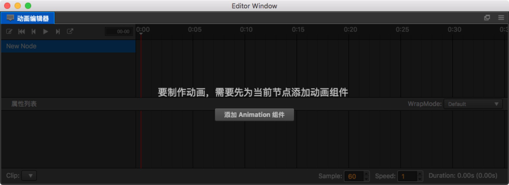
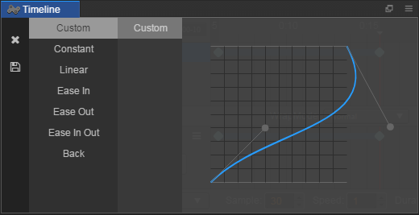
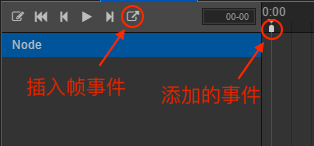
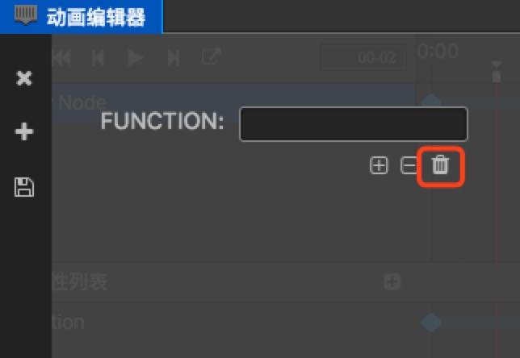
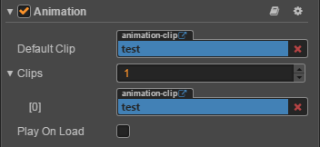
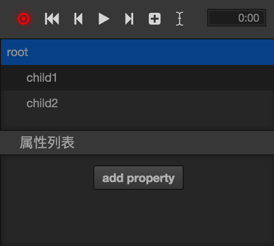

# 动画系统

[toc]

本章将介绍 Cocos Creator 的动画系统，除了标准的位移、旋转、缩放动画和序列帧动画以外，这套动画系统还支持任意组件属性和用户自定义属性的驱动，再加上可任意编辑的时间曲线和创新的移动轨迹编辑功能，能够让内容生产人员不写一行代码就制作出细腻的各种动态效果。

**注意**：Cocos Creator 自带的动画编辑器适用于制作一些不太复杂的、需要与逻辑进行联动的动画，例如 UI 动画。如果要制作复杂的特效、角色动画、嵌套动画，可以考虑改用 Spine 或者 DragonBones 进行制作。

# 关于 Animation

## Animation 组件

之前我们了解了 Cocos Creator 是组件式的结构。那么 Animation 也不例外，它也是节点上的一个组件。

## Clip 动画剪辑

动画剪辑就是一份动画的声明数据，我们将它挂载到 Animation 组件上，就能够将这份动画数据应用到节点上。

### 节点数据的索引方式

数据中索引节点的方式是以挂载 Animation 组件的节点为根节点的相对路径。 所以在同个父节点下的同名节点，只能够产生一份动画数据，并且只能应用到第一个同名节点上。

### clip 文件的参数

**sample**：定义当前动画数据每秒的帧率，默认为 60，这个参数会影响时间轴上每两个整数秒刻度之间的帧数量（也就是两秒之内有多少格）。

**speed**：当前动画的播放速度，默认为 1

**duration**：当动画播放速度为 1 的时候，动画的持续时间

**real time**：动画从开始播放到结束，真正持续的时间

**wrap mode**：循环模式

## 动画编辑模式

动画在普通模式下是不允许编辑的，只有在动画编辑模式下，才能够编辑动画文件。但是在编辑模式下，无法对节点进行 **增加 / 删除 / 改名** 操作。

- 打开编辑模式：选中一个包含 Animation 组件，并且包含有一个以上 clip 文件的节点。然后在动画编辑器左上角点击唯一的按钮。
- 退出编辑模式：点击动画编辑器左上角的编辑按钮，或者点击场景编辑器左上角的 **关闭** 按钮

## 熟悉动画编辑器

动画编辑器一共可以划分为 6 个主要部分。


1. 常用按钮区域，这里负责显示一些常用功能按钮，从左到右依次为：开关录制状态、返回第一帧、上一帧、播放/暂停、下一帧、新建动画剪辑、插入动画事件。
2. 时间轴与事件，这里主要是显示时间轴，添加的自定义事件也会在这里显示。
3. 层级管理（节点树），当前动画剪辑可以影响到的节点数据。
4. 节点内关键帧的预览区域，这里主要是显示各个节点上的所有帧的预览时间轴。
5. 属性列表，显示当前选中的节点在选中的动画剪辑中已经包含了的属性列表。
6. 关键帧，每个属性相对应的帧都会显示在这里。

### 时间轴的刻度单位表示方式

时间轴上刻度的表示法是 `01-05`。该数值由两部分组成，冒号前面的是表示当前秒数，冒号后面的表示在当前这一秒里的第几帧。

`01-05` 表示该刻度在时间轴上位于从动画开始经过了 1 秒又 5 帧的时间。

因为帧率（sample）可以随时调整，因此同一个刻度表示的时间点也会随着帧率变化而有所不同。

- 当帧率为 30 时，`01-05` 表示动画开始后 1 + 5/30 = 1.1667 秒。
- 当帧率为 10 时，`01-05` 表示动画开始后 1 + 5/10 = 1.5 秒。

虽然当前刻度表示的时间点会随着帧率变化，但一旦在一个位置添加了关键帧，该关键帧所在的总帧数是不会改变的，假如我们在帧率 30 时向 `01-05` 刻度上添加了关键帧，该关键帧位于动画开始后总第 35 帧。之后把帧率修改为 10，该关键帧仍然处在动画开始后第 35 帧，而此时关键帧所在位置的刻度读数为 `03-05`。换算成时间以后正好是之前的 3 倍。

## 基本操作

### 更改时间轴缩放比例

在操作中如果觉得动画编辑器显示的范围太小，需要按比例缩小，让更多的关键帧显示到编辑器内怎么办？

- 在上图中 2、4、6 区域内滚动鼠标滚轮，可以放大，或者缩小时间轴的显示比例。

### 更改当前选中的时间轴节点

- 在时间轴（图 2 区域）区域内点击任意位置或者拖拽，都可以更改当前的时间节点。
- 在图 4 区域内拖拽标示的红线即可。

### 播放 / 暂停动画

- 在图 1 区域内点击播放按钮，按钮会自动变更为暂停，再次点击则是暂停。
- 播放状态下，保存场景等操作会终止播放。

### 修改 clip 属性

- 在插件底部，修改对应的属性，在输入框失去焦点的时候就会更新到实际的 clip 数据中。

## 快捷键

- left：向前移动一帧，如果已经在第 0 帧，则忽略当前操作
- right：向后移动一帧
- delete：删除当前所选中的关键帧
- k：正向的播放动画，抬起后停止
- j：反向播放动画，抬起后停止
- ctrl / cmd + left：跳转到第 0 帧
- ctrl / cmd + right：跳转到有效的最后一帧

# 创建Animation组件和动画剪辑

## 创建 Animation 组件

在每个节点上，我们都可以添加不同的组件。如果我们想在这个节点上创建动画，也必须为它新建一个 Animation 组件。创建的方法有两种：

- 选中相应的节点，在属性检查器中点击右上方的 **+**，或者下方的 **添加组件**，在其他组件中选择 Animation。

- 打开动画编辑器，然后在层级管理器中选中需要添加动画的节点，在动画编辑器中点击 **添加 Animation 组件** 按钮。

  

## 创建与挂载动画剪辑

现在我们的节点上已经有了 Animation 组件了，但是还没有相应的动画剪辑数据，动画剪辑也有两种创建方式：

- 在资源管理器中点击左上方的 **+**，或者右键空白区域，选择 Animation Clip，这时候会在管理器中创建一个名为 `New AnimationClip` 的剪辑文件。单单创建还是不够的，我们再次在层级管理器中点选刚刚的节点，在属性检查器中找到 Animation，这时候的 Clips 显示的是 0，我们将它改成 1。然后将刚刚在资源管理器中创建的 `New AnimationClip`，拖入刚刚出现的 **animation-clip 选择框** 内。

- 如果 Animation 组件中还没有添加动画剪辑文件，则可以在动画编辑器中直接点击 **新建 AnimationClip** 按钮，根据弹出的窗口创建一个新的动画剪辑文件。需要注意的是，如果选择覆盖已有的剪辑文件，被覆盖的文件内容会被清空。

  

至此我们已经完成了动画制作之前的准备工作，下一步就是要创建动画曲线了。

## 剪辑内的数据

一个动画剪辑内可能包含了多个节点，每个节点上挂在多个动画属性，每个属性内的数据才是实际的关键帧。

### 节点数据

动画剪辑通过节点的名字定义数据的位置，本身忽略了根节点，其余的子节点通过与根节点的 **相对路径** 索引找到对应的数据。有时候我们会在制作完成动画后，将节点重命名，这样会造成动画数据出现问题，如下图：


这时候我们要手动指定数据对应的节点，可以将鼠标移入节点，点击节点右侧出现的更多按钮，并选择 “移动数据”。要注意的是，根节点名字是被忽略的，所以根节点名字是固定的，并不能修改，并且一直显示在页面左侧。

如上图，`/New Node/test` 节点没有数据，我想将 `/New Node/efx_flare` 上的数据移到这里：

1. 鼠标移到丢失的节点 `/New Node/efx_flare` 上
2. 点击右侧出现的按钮
3. 选择移动数据
4. 将路径改为 `/New Node/test`，并回车

# 编辑动画序列

我们刚刚已经在节点上挂载了动画剪辑，现在我们可以在动画剪辑中创建一些动画曲线了。

我们首先了解一下动画属性，动画属性包括了节点自有的 `position`、`rotation` 等属性，也包含了组件 Component 中自定义的属性。 组件包含的属性前会加上组件的名字，比如 `cc.Sprite.spriteFrame`。 比如下图的 position 那条就是属性轨道，而对应的蓝色菱形就是关键帧。


## 添加一个新的属性轨道

常规的添加方式，我们需要先选中节点，然后在属性区域右上角点击 `+`。 弹出菜单中，会将可以添加的所有属性罗列出来，选中想要添加的属性，就会对应新增一个轨道。

## 删除一个属性轨道

将鼠标焦点移动到要删除的属性轨道上，右边会显示一个  按钮，点击按钮，在弹出菜单中选择 **删除属性**，选中后对应的属性就会从动画数据中删除。


## 添加关键帧

在属性列表中点击对应属性轨道右侧的  按钮，在弹出的菜单中选择 `插入关键帧` 按钮。


也可以在编辑模式下直接更改节点对应的属性轨道 - 例如直接在 **场景编辑器** 中拖动当前选中的节点，`position` 属性轨道上就会在当前的时间上添加一个关键帧。需要注意的是，如果更改的属性轨道不存在，则会忽略此次的操作，所以如果想要修改后自动插入关键帧，需要预先创建好属性轨道。

## 选择关键帧

点击我们创建的关键帧后关键帧会呈现选中状态，此时关键帧由蓝变白。如果需要多选，可以按住 ctrl 再次选择其他关键帧。或者直接在属性区域拖拽框选。


## 移动关键帧

此时我们将鼠标移动到任意一个被选中的关键帧上，按下鼠标左键并拖动，鼠标会变换成左右箭头，这时候就可以拖拽所有被选中的关键帧了。

## 更改关键帧

在时间轴上选中需要修改的关键帧，直接在 **属性检查器** 内修改相对应的属性即可（确保动画编辑器处于编辑状态）。例如属性列表中有 position、x、y 三个属性轨道，选中关键帧之后，则可以修改 **属性检查器** 中的 position、x、y 属性。

或者在时间轴上选择一个没有关键帧的位置，然后在属性检查器中修改相对应的属性，便会自动插入一帧。

## 删除关键帧

选中关键帧后，点击对应属性轨道的  按钮，选择 `删除选中帧`。或者直接按下键盘上的 `delete` 按键，则所有被选中的节点都会被删除。

## 复制/粘贴关键帧

> 仅支持 v1.9.2 以上版本

在动画编辑器内选中关键帧之后，可以按下 ctrl + c（Windows）或 command + c（Mac）复制当前的关键帧。然后选中某一个时间轴上的点，按下 ctrl + v（Windows）或 command + v（Mac）会将刚刚复制的关键帧粘贴到选中的时间点上。

根据选中的节点数量有两种建立索引的方式：

1. 只选择了一个节点上的数据的时候，直接粘贴到当前选中节点上
2. 如果复制的是多个节点上的数据，则会把复制的节点的路径信息也粘贴到当前的 clip 内

如果复制的节点在粘贴的节点树内不存在，则会显示为丢失的节点。

## 节点操作

动画是按照节点的名字来进行索引关联的，有时候我们会在 **层级管理器** 内改变节点的层级关系，而 **动画编辑器** 内的动画就会找不到当初指定对应的节点。
这时候我们需要手动更改一下动画上节点的搜索路径：

1. 鼠标移动到要迁移的节点上，点击右侧出现的菜单按钮
2. 选择移动节点数据
3. 修改节点的路径数据

根节点的数据我们是不能改变的，我们可以修改后续的节点路径，比如我们要将 /root/New Node 的帧动画移动到根节点上，我们可以将 New Node 删除，剩下 /root/ 然后回车（/root/是无法修改的根节点路径）。再比如我们要将 /root 跟节点上的动画数据移动到 /root/New Node 上，我们只需要将路径改成 /root/New Node

# 编辑序列帧动画

我们刚刚了解了属性帧的操作，现在来看看具体怎么创建一个帧动画。

## 为节点新增 Sprite 组件

首先我们需要让节点正常显示纹理，所以需要为节点添加 Sprite 组件。在 **层级管理器** 中选中节点，然后点击 **属性检查器** 最下方的 **添加组件** 按钮，选择 **渲染组件 -> Sprite**，即可添加 Sprite 组件到节点上。

## 在属性列表中添加 cc.Sprite.spriteFrame

节点可以正常显示纹理后，还需要为纹理创建一个动画轨道。在 **动画编辑器** 中点击 **Add Property**，然后选择 `cc.Sprite.spriteFrame`。

## 添加帧

从 **资源管理器** 中将纹理拖拽到属性帧区域，放在 `cc.Sprite.spriteFrame` 轨道上。再将下一帧需要显示的纹理拖到指定位置，然后点击播放就可以预览刚刚创建的动画了。

 **Ease In** 等。选中效果后，在效果列表的右侧会出现一些预设的参数，可以根据需求选择。

## 自定义曲线

有时候预设的效果不能满足动画需求，我们也可以手动修改曲线。

在时间曲线编辑器右侧的预览图中，有两个灰色的控制点，拖拽控制点即可更改曲线的轨迹。如果控制点需要拖出视野外，则可以使用鼠标滚轮或者右上角的小比例尺来缩放预览图，支持的比例从 0.1 到 1。



# 添加动画事件

在游戏中，经常需要在动画结束或者某一帧的特定时刻，执行一些函数方法。那么在动画编辑器中怎么实现呢？

## 添加事件

首先选中某个位置，然后点击按钮区域最左侧的按钮（add event），这时候在时间轴上会出现一个白色的矩形，这就是我们添加的事件。



## 删除事件

双击刚刚出现的白色矩形，打开事件编辑器后点击 function 后面的回收图标，会提示是否删除这个 event，点击确认则删除。



也可以在动画编辑器中右键点击 event，选择 `删除`。

## 指定事件触发函数以及传入参数

双击刚刚出现的白色矩形，可以打开事件编辑器，在编辑器内，我们可以手动输入需要触发的 function 名字，触发的时候会根据这个函数名，去各个组件内匹配相应的方法。

如果需要添加传入的参数，则在 Params 旁点击 `+` 或者 `-`，只支持 Boolean、String、Number 三种类型的参数。

# 使用脚本控制动画

## Animation 组件

Animation 组件提供了一些常用的动画控制函数，如果只是需要简单的控制动画，可以通过获取节点的 Animation 组件来做一些操作。

### 播放动画

```javascript
var anim = this.getComponent(cc.Animation);

// 如果没有指定播放哪个动画，并且有设置 defaultClip 的话，则会播放 defaultClip 动画
anim.play();

// 指定播放 test 动画
anim.play('test');

// 指定从 1s 开始播放 test 动画
anim.play('test', 1);

// 使用 play 接口播放一个动画时，如果还有其他的动画正在播放，则会先停止其他动画
anim.play('test2');
```

Animation 对一个动画进行播放的时候会判断这个动画之前的播放状态来进行下一步操作。

如果动画处于：

- **停止** 状态，则 Animation 会直接重新播放这个动画
- **暂停** 状态，则 Animation 会恢复动画的播放，并从当前时间继续播放下去
- **播放** 状态，则 Animation 会先停止这个动画，再重新播放动画

```javascript
var anim = this.getComponent(cc.Animation);

// 播放第一个动画
anim.playAdditive('position-anim');

// 播放第二个动画
// 使用 playAdditive 播放动画时，不会停止其他动画的播放。如果还有其他动画正在播放，则同时会有多个动画进行播放
anim.playAdditive('rotation-anim');
```

Animation 是支持同时播放多个动画的，播放不同的动画并不会影响其他的动画的播放状态，这对于做一些复合动画比较有帮助。

### 暂停、恢复、停止动画

```javascript
var anim = this.getComponent(cc.Animation);

anim.play('test');

// 指定暂停 test 动画
anim.pause('test');

// 暂停所有动画
anim.pause();

// 指定恢复 test 动画
anim.resume('test');

// 恢复所有动画
anim.resume();

// 指定停止 test 动画
anim.stop('test');

// 停止所有动画
anim.stop();
```

**暂停**、**恢复**、**停止** 几个函数的调用比较接近。

**暂停** 会暂时停止动画的播放，当 **恢复** 动画的时候，动画会继续从当前时间往下播放。
而 **停止** 则会终止动画的播放，再次播放这个动画时会重新播放动画。

### 设置动画的当前时间

```javascript
var anim = this.getComponent(cc.Animation);

anim.play('test');

// 设置 test 动画的当前播放时间为 1s
anim.setCurrentTime(1, 'test');

// 设置所有动画的当前播放时间为 1s
anim.setCurrentTime(1);
```

你可以在任何时候对动画设置当前时间，但是动画不会立刻根据设置的时间进行状态的更改，需要在下一个动画的 **update** 中才会根据这个时间重新计算播放状态。

## AnimationState

**Animation** 只提供了一些简单的控制函数，希望得到更多的动画信息和控制的话，需要使用到 **AnimationState**。

### AnimationState 是什么？

如果说 **AnimationClip** 是作为动画数据的承载，那么 **AnimationState** 则是 **AnimationClip** 在运行时的实例，它将动画数据解析为方便程序中做计算的数值。
**Animation** 在播放一个 **AnimationClip** 的时候，会将 **AnimationClip** 解析成 **AnimationState**。
**Animation** 的播放状态实际都是由 **AnimationState** 来计算的，包括动画是否循环、怎么循环、播放速度等。

### 获取 AnimationState

```javascript
var anim = this.getComponent(cc.Animation);
// play 会返回关联的 AnimationState
var animState = anim.play('test');

// 或者直接获取
var animState = anim.getAnimationState('test');
```

### 获取动画信息

```javascript
var anim = this.getComponent(cc.Animation);
var animState = anim.play('test');

// 获取动画关联的 clip
var clip = animState.clip;

// 获取动画的名字
var name = animState.name;

// 获取动画的播放速度
var speed = animState.speed;

// 获取动画的播放总时长
var duration = animState.duration;

// 获取动画的播放时间
var time = animState.time;

// 获取动画的重复次数
var repeatCount = animState.repeatCount;

// 获取动画的循环模式
var wrapMode = animState.wrapMode

// 获取动画是否正在播放
var playing = animState.isPlaying;

// 获取动画是否已经暂停
var paused = animState.isPaused;

// 获取动画的帧率
var frameRate = animState.frameRate;
```

从 **AnimationState** 中可以获取到所有动画的信息，你可以利用这些信息来判断需要做哪些事情。

### 设置动画播放速度

```javascript
var anim = this.getComponent(cc.Animation);
var animState = anim.play('test');

// 使动画播放速度加速
animState.speed = 2;

// 使动画播放速度减速
animState.speed = 0.5;
```

**speed** 值越大速度越快，值越小则速度越慢

### 设置动画的循环模式与循环次数

```javascript
var anim = this.getComponent(cc.Animation);
var animState = anim.play('test');

// 设置循环模式为 Normal
animState.wrapMode = cc.WrapMode.Normal;

// 设置循环模式为 Loop
animState.wrapMode = cc.WrapMode.Loop;

// 设置动画循环次数为 2 次
animState.repeatCount = 2;

// 设置动画循环次数为无限次
animState.repeatCount = Infinity;
```

**AnimationState** 允许动态设置循环模式，目前提供了多种循环模式，这些循环模式可以从 **cc.WrapMode** 中获取到。

如果动画的 **WrapMode** 为 **Loop** 的话，需要与 **repeatCount** 配合使用才能达到效果。默认在解析动画剪辑的时候，如果动画循环类型为：

- **Loop** 类型，**repeatCount** 将被设置为 **Infinity**，即无限循环。
- **Normal** 类型，**repeatCount** 将被设置为 1。

## 动画事件

动画编辑器支持可视化编辑帧事件（如何编辑请参考 [这里](https://docs.cocos.com/creator/manual/zh/animation/animation-event.html)），在脚本里书写动画事件的回调非常简单。动画事件的回调其实就是一个普通的函数，在动画编辑器里添加的帧事件会映射到动画根节点的组件上。

### 实例

假设在动画的结尾添加了一个帧事件，如下图：


那么在脚本中可以这么写：

```javascript
cc.Class({
    extends: cc.Component,

    onAnimCompleted: function (num, string) {
        console.log('onAnimCompleted: param1[%s], param2[%s]', num, string);
    }
});
```

将上面的组件加到动画的 **根节点** 上，当动画播放到结尾时，动画系统会自动调用脚本中的 `onAnimCompleted` 函数。动画系统会搜索动画根节点中的所有组件，如果组件中有实现动画事件中指定的函数的话，就会对它进行调用，并传入事件中填的参数。

## 注册动画回调

除了动画编辑器中的帧事件提供了回调外，动画系统还提供了动态注册回调事件的方式。目前支持的回调事件包括：

- play：开始播放时
- stop：停止播放时
- pause：暂停播放时
- resume：恢复播放时
- lastframe：假如动画循环次数大于 1，当动画播放到最后一帧时
- finished：动画播放完成时

当在 `cc.Animation` 注册了一个回调函数后，它会在播放一个动画时，对相应的 `cc.AnimationState` 注册这个回调，在 `cc.AnimationState` 停止播放时，对 `cc.AnimationState` 取消注册这个回调。

`cc.AnimationState` 其实才是动画回调的发送方，如果希望对单个 `cc.AnimationState` 注册回调，那么可以先获取到这个 `cc.AnimationState` 再单独对它进行注册。

### 实例

```javascript
var animation = this.node.getComponent(cc.Animation);

// 注册
animation.on('play',      this.onPlay,        this);
animation.on('stop',      this.onStop,        this);
animation.on('lastframe', this.onLastFrame,   this);
animation.on('finished',  this.onFinished,    this);
animation.on('pause',     this.onPause,       this);
animation.on('resume',    this.onResume,      this);

// 取消注册
animation.off('play',      this.onPlay,        this);
animation.off('stop',      this.onStop,        this);
animation.off('lastframe', this.onLastFrame,   this);
animation.off('finished',  this.onFinished,    this);
animation.off('pause',     this.onPause,       this);
animation.off('resume',    this.onResume,      this);

// 对单个 cc.AnimationState 注册回调
var anim1 = animation.getAnimationState('anim1');
anim1.on('lastframe', this.onLastFrame, this);
```

## 动态创建 Animation Clip

```javascript
var animation = this.node.getComponent(cc.Animation);
// frames 这是一个 SpriteFrame 的数组.
var clip = cc.AnimationClip.createWithSpriteFrames(frames, 17);
clip.name = "anim_run";
clip.wrapMode = cc.WrapMode.Loop;

// 添加帧事件
clip.events.push({
    frame: 1,               // 准确的时间，以秒为单位。这里表示将在动画播放到 1s 时触发事件
    func: "frameEvent",     // 回调函数名称
    params: [1, "hello"]    // 回调参数
});

animation.addClip(clip);
animation.play('anim_run');
```

# Animation（动画）组件参考

**Animation（动画）** 组件可以以动画方式驱动所在节点和子节点上的节点和组件属性，包括用户自定义脚本中的属性。



点击 **属性检查器** 下面的 **添加组件** 按钮，然后从 **其他组件** 中选择 **Animation**，即可添加 **Animation（动画）** 组件到节点上。

## Animation 属性

| 属性         | 功能说明                                                     |
| ------------ | ------------------------------------------------------------ |
| Default Clip | 默认的动画剪辑，如果这一项设置了值，并且 **Play On Load** 也为true，那么动画会在加载完成后自动播放 **Default Clip** 的内容 |
| Clips        | 列表类型，默认为空，在这里面添加的 **AnimationClip** 会反映到 **动画编辑器** 中，用户可以在 **动画编辑器** 里编辑 **Clips** 的内容 |
| Play On Load | 布尔类型，是否在动画加载完成后自动播放 **Default Clip** 的内容 |

## 详细说明

如果一个动画需要包含多个节点，那么一般会新建一个节点来作为动画的 **根节点**，将 **Animation（动画）** 组件添加到这个 **根节点** 上，然后这个根节点下的其他子节点都会自动进入到这个动画中。

假如添加了如下所示的节点树：


那么在动画编辑器中的层级就会显示为：

