# 物理和碰撞系统

本章将介绍 Cocos Creator 的碰撞系统，目前 Cocos Creator 内置了一个简单易用的碰撞检测系统，支持 **圆形**、**矩形** 以及 **多边形** 相互间的碰撞检测。

# 编辑碰撞组件

当添加了一个碰撞组件后，可以通过点击 **inspector** 中的 **editing** 来开启碰撞组件的编辑，如下图。

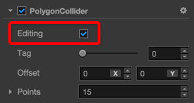

## 多边形碰撞组件

如果编辑的是 **多边形碰撞组件** 的话，则会出现类似下图所示的 **多边形编辑区域**。区域中的这些点都是可以拖动的，拖动的结果会反映到 **多边形碰撞组件** 的 **points** 属性中。

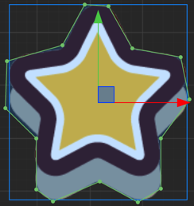

当鼠标移动到两点连成的线段上时，鼠标指针会变成 **添加** 样式，这时点击鼠标左键会在这个地方添加一个点到 **多边形碰撞组件** 中。

当按住 **ctrl** 或者 **command** 键时，移动鼠标到多边形顶点上，会发现顶点以及连接的两条线条变成红色，这时候点击鼠标左键将会删除 **多边形碰撞组件** 中的这个点。

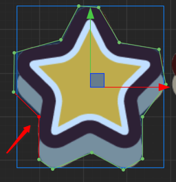

在 CocosCreator 1.5 中，多边形碰撞组件中添加了一个 **Regenerate Points** 的功能，这个功能可以根据组件依附的节点上的 **Sprite** 组件的贴图的像素点来自动生成相应轮廓的顶点。

**Threshold** 指明生成贴图轮廓顶点间的最小距离，值越大则生成的点越少，可根据需求进行调节。


## 圆形碰撞组件

如果编辑的是 **圆形碰撞组件** 的话，则会出现类似下图所示的 **圆形编辑区域**：

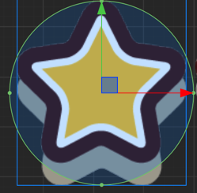

当鼠标悬浮在 **圆形编辑区域** 的边缘线上时，边缘线会变亮，这时点击鼠标左键拖动将可以修改 **圆形碰撞组件** 的半径大小。

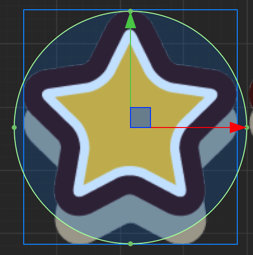

## 矩形碰撞组件

如果编辑的是 **矩形碰撞组件** 的话，则会出现类似下图所示的 **矩形编辑区域**：

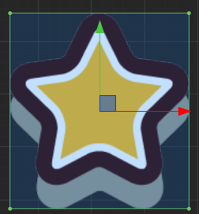

当鼠标悬浮在 **矩形碰撞区域** 的顶点上时，点击鼠标左键拖拽可以同时修改 **矩形碰撞组件** 的长宽；
当鼠标悬浮在 **矩形碰撞区域** 的边缘线上时，点击鼠标左键拖拽将修改 **矩形碰撞组件** 的长或宽中的一个方向。

按住 **Shift** 键拖拽时，在拖拽过程中将会保持按下鼠标那一刻的 **长宽比例**；
按住 **Alt** 建拖拽时，在拖拽过程中将会保持 **矩形中心点位置** 不变。

## 修改碰撞组件偏移量

在所有的碰撞组件编辑中，都可以在各自的 **碰撞中心区域** 点击鼠标左键拖拽来快速编辑碰撞组件的 **偏移量**。

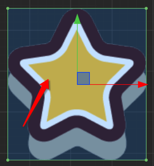


点击 **添加分组** 按钮后即可添加一个新的分组，默认会有一个 **Default** 分组。

**需要注意的是：分组添加后是不可以删除的，不过你可以任意修改分组的名字**

## 碰撞分组配对

在 **分组列表** 下面可以进行 **碰撞分组配对** 表的管理，如下图


这张表里面的行与列分别列出了 **分组列表** 里面的项，**分组列表** 里的修改将会实时映射到这张表里。你可以在这张表里面配置哪一个分组可以对其他的分组进行碰撞检测，假设 **a 行 b 列** 被勾选上，那么表示 **a 行** 上的分组将会与 **b 列** 上的分组进行碰撞检测。

> **注意**：运行时修改节点的 group 之后，需要调用物理组件 Collider 的 apply，修改才会生效。

根据上面的规则，在这张表里产生的碰撞对有：

Platform - Bullet Collider - Collider Actor - Wall Actor - Platform

# 碰撞系统脚本控制

Cocos Creator 中内置了一个简单易用的碰撞检测系统，它会根据添加的碰撞组件进行碰撞检测。当一个碰撞组件被启用时，这个碰撞组件会被自动添加到碰撞检测系统中，并搜索能与之进行碰撞的其他已添加的碰撞组件来生成一个碰撞对。需要注意的是，一个节点上的碰撞组件，无论如何都是不会相互进行碰撞检测的。

## 碰撞检测系统的使用

### 碰撞系统接口

获取碰撞检测系统：

```javascript
var manager = cc.director.getCollisionManager();
```

默认碰撞检测系统是禁用的，如果需要使用则需要以下方法开启碰撞检测系统：

```javascript
manager.enabled = true;
```

默认碰撞检测系统的 debug 绘制是禁用的，如果需要使用则需要以下方法开启 debug 绘制：

```javascript
manager.enabledDebugDraw = true;
```

开启后在运行时可显示 **碰撞组件** 的 **碰撞检测范围**，如下图：

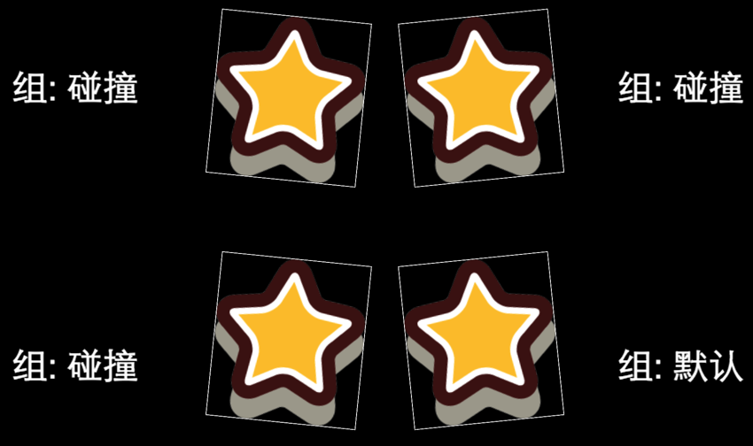

如果还希望显示碰撞组件的包围盒，那么可以通过以下接口来进行设置：

```javascript
manager.enabledDrawBoundingBox = true;
```

结果如下图所示：

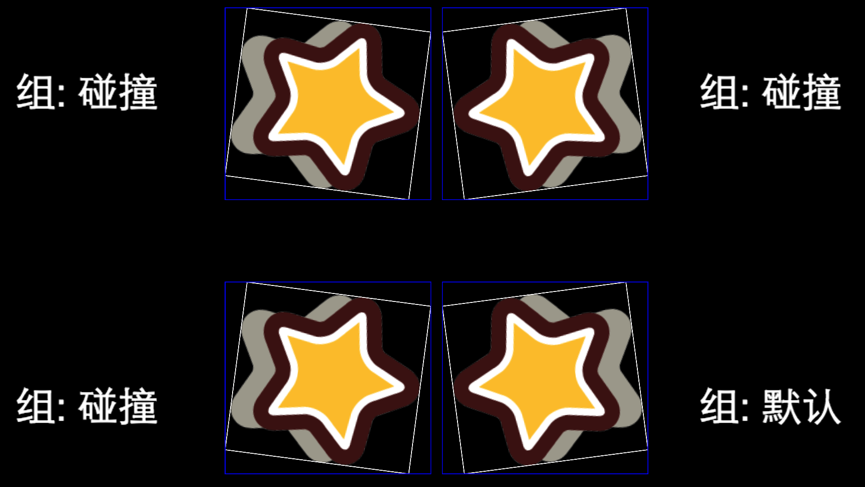

### 碰撞系统回调

当碰撞系统检测到有碰撞产生时，将会以回调的方式通知使用者，如果产生碰撞的碰撞组件依附的节点下挂的脚本中有实现以下函数，则会自动调用以下函数，并传入相关的参数。

```javascript
/**
 * 当碰撞产生的时候调用
 * @param  {Collider} other 产生碰撞的另一个碰撞组件
 * @param  {Collider} self  产生碰撞的自身的碰撞组件
 */
onCollisionEnter: function (other, self) {
    console.log('on collision enter');

    // 碰撞系统会计算出碰撞组件在世界坐标系下的相关的值，并放到 world 这个属性里面
    var world = self.world;

    // 碰撞组件的 aabb 碰撞框
    var aabb = world.aabb;

    // 节点碰撞前上一帧 aabb 碰撞框的位置
    var preAabb = world.preAabb;

    // 碰撞框的世界矩阵
    var t = world.transform;

    // 以下属性为圆形碰撞组件特有属性
    var r = world.radius;
    var p = world.position;

    // 以下属性为 矩形 和 多边形 碰撞组件特有属性
    var ps = world.points;
},
/**
 * 当碰撞产生后，碰撞结束前的情况下，每次计算碰撞结果后调用
 * @param  {Collider} other 产生碰撞的另一个碰撞组件
 * @param  {Collider} self  产生碰撞的自身的碰撞组件
 */
onCollisionStay: function (other, self) {
    console.log('on collision stay');
},
/**
 * 当碰撞结束后调用
 * @param  {Collider} other 产生碰撞的另一个碰撞组件
 * @param  {Collider} self  产生碰撞的自身的碰撞组件
 */
onCollisionExit: function (other, self) {
    console.log('on collision exit');
}
```

### 点击测试

```javascript
properties: {
    collider: cc.BoxCollider
},

start () {
    // 开启碰撞检测系统，未开启时无法检测
    cc.director.getCollisionManager().enabled = true;
    // cc.director.getCollisionManager().enabledDebugDraw = true;

    this.collider.node.on(cc.Node.EventType.TOUCH_START, function (touch, event) {
        // 返回世界坐标
        let touchLoc = touch.getLocation();
        // https://docs.cocos.com/creator/api/zh/classes/Intersection.html 检测辅助类
        if (cc.Intersection.pointInPolygon(touchLoc, this.collider.world.points)) {
            console.log("Hit!");
        }
        else {
            console.log("No hit");
        }
    }, this);
}
```

更多的范例可以到 [GitHub](https://github.com/cocos-creator/example-cases/tree/v2.4.3/assets/cases/collider) | [Gitee](https://gitee.com/mirrors_cocos-creator/example-cases/tree/v2.4.3/assets/cases/collider) 上查看。

# Collider 组件参考

点击 **属性检查器** 下面的 **添加组件** 按钮，然后从 **碰撞组件** 中选择需要的 **Collider** 组件，即可添加 **Collider** 组件到节点上。

## Collider 组件属性

| 属性    | 功能说明                                                     |
| ------- | ------------------------------------------------------------ |
| Tag     | 标签。当一个节点上有多个碰撞组件时，在发生碰撞后，可以使用此标签来判断是节点上的哪个碰撞组件被碰撞了。 |
| Editing | 是否编辑此碰撞组件，只在编辑器中有效                         |

## 详细说明

一个节点上可以挂多个碰撞组件，这些碰撞组件之间可以是不同类型的碰撞组件。

碰撞组件目前包括了 **Polygon（多边形）**，**Circle（圆形）**，**Box（矩形）** 这几种碰撞组件，这些组件都继承自 **Collider** 组件，所以 **Collider** 组件的属性它们也都享有。

### Polygon（多边形）碰撞组件属性


| 属性              | 功能说明                                                     |
| ----------------- | ------------------------------------------------------------ |
| Regenerate Points | 根据组件所在节点上的 Sprite 组件的贴图像素点来自动生成相应轮廓的顶点。 |
| Threshold         | 指明生成贴图轮廓顶点间的最小距离，值越大则生成的点越少，可根据需求进行调节。 |
| Offset            | 组件相对于节点的 **偏移量**。                                |
| Points            | 组件的 **顶点数组**。                                        |

### Circle（圆形）碰撞组件属性


| 属性   | 功能说明                      |
| ------ | ----------------------------- |
| Offset | 组件相对于节点的 **偏移量**。 |
| Radius | 组件的 **半径**。             |

### Box（矩形）碰撞组件属性


| 属性   | 功能说明                      |
| ------ | ----------------------------- |
| Offset | 组件相对于节点的 **偏移量**。 |
| Size   | 组件的 **长宽**。             |

更多关于 **Collider** 的信息请前往 [碰撞系统](https://docs.cocos.com/creator/manual/zh/physics/collision/)

# 物理系统

物理系统将 box2d 作为内部物理系统，并且隐藏了大部分 box2d 实现细节（比如创建刚体，同步刚体信息到节点中等）。 你可以通过物理系统访问一些 box2d 常用的功能，比如点击测试，射线测试，设置测试信息等。

## 物理系统相关设置

### 开启物理系统

物理系统默认是关闭的，如果需要使用物理系统，那么首先需要做的事情就是开启物理系统，否则你在编辑器里做的所有物理编辑都不会产生任何效果。

```javascript
cc.director.getPhysicsManager().enabled = true;
```

### 绘制物理调试信息

物理系统默认是不绘制任何调试信息的，如果需要绘制调试信息，请使用 **debugDrawFlags**。 物理系统提供了各种各样的调试信息，你可以通过组合这些信息来绘制相关的内容。

```javascript
cc.director.getPhysicsManager().debugDrawFlags = cc.PhysicsManager.DrawBits.e_aabbBit |
    cc.PhysicsManager.DrawBits.e_pairBit |
    cc.PhysicsManager.DrawBits.e_centerOfMassBit |
    cc.PhysicsManager.DrawBits.e_jointBit |
    cc.PhysicsManager.DrawBits.e_shapeBit
    ;
```

设置绘制标志位为 **0**，即可以关闭绘制。

```javascript
cc.director.getPhysicsManager().debugDrawFlags = 0;
```

### 物理单位到世界坐标系单位的转换

box2d 使用 **米 - 千克 - 秒（MKS）** 单位制，box2d 在这样的单位制下运算的表现是最佳的。但是我们在 2D 游戏运算中一般使用 **世界坐标系中的单位**（简称世界单位）来作为长度单位制，所以我们需要一个比率来进行物理单位到世界单位上的相互转换。

一般情况下我们把这个比率设置为 32，这个值可以通过 `cc.PhysicsManager.PTM_RATIO` 获取，并且这个值是只读的。通常用户是不需要关心这个值的，物理系统内部会自动对物理单位与世界单位进行转换，用户访问和设置的都是进行 2d 游戏开发中所熟悉的世界单位。

### 设置物理重力

重力是物理表现中非常重要的一点，大部分物理游戏都会使用到重力这一物理特性。默认的重力加速度是 `(0, -320)` 世界单位/秒^2，按照上面描述的转换规则，即 `(0, -10)` 米/秒^2。

如果希望重力加速度为 0，可以这样设置：

```javascript
cc.director.getPhysicsManager().gravity = cc.v2();
```

如果希望修改重力加速度为其他值，比如每秒加速降落 640 个世界单位，那么可以这样设置：

```javascript
cc.director.getPhysicsManager().gravity = cc.v2(0, -640);
```

### 设置物理步长

物理系统是按照一个固定的步长来更新物理世界的，默认这个步长即是你的游戏的帧率：`1/framerate`。但是有的游戏可能会不希望按照这么高的频率来更新物理世界，毕竟这个操作是比较消耗时间的，那么你可以通过降低步长来达到这个效果。

```javascript
var manager = cc.director.getPhysicsManager();

// 开启物理步长的设置
manager.enabledAccumulator = true;

// 物理步长，默认 FIXED_TIME_STEP 是 1/60
manager.FIXED_TIME_STEP = 1/30;

// 每次更新物理系统处理速度的迭代次数，默认为 10
manager.VELOCITY_ITERATIONS = 8;

// 每次更新物理系统处理位置的迭代次数，默认为 10
manager.POSITION_ITERATIONS = 8;
```

**注意**：降低物理步长和各个属性的迭代次数，都会降低物理的检测频率，所以会更有可能发生刚体穿透的情况，使用时需要考虑到这个情况。

## 查询物体

通常你可能想知道在给定的场景中都有哪些实体。 比如如果一个炸弹爆炸了，在范围内的物体都会受到伤害，或者在策略类游戏中，可能会希望让用户选择一个范围内的单位进行拖动。

物理系统提供了几个方法来高效快速地查找某个区域中有哪些物体，每种方法通过不同的方式来检测物体，基本满足游戏所需。

### 点测试

点测试将测试是否有碰撞体会包含一个世界坐标系下的点，如果测试成功，则会返回一个包含这个点的碰撞体。注意，如果有多个碰撞体同时满足条件，下面的接口只会返回一个随机的结果。

```javascript
var collider = cc.director.getPhysicsManager().testPoint(point);
```

### 矩形测试

矩形测试将测试指定的一个世界坐标系下的矩形，如果一个碰撞体的包围盒与这个矩形有重叠部分，则这个碰撞体会给添加到返回列表中。

```javascript
var colliderList = cc.director.getPhysicsManager().testAABB(rect);
```

### 射线测试

射线检测用来检测给定的线段穿过哪些碰撞体，我们还可以获取到碰撞体在线段穿过碰撞体的那个点的法线向量和其他一些有用的信息。

```javascript
var results = cc.director.getPhysicsManager().rayCast(p1, p2, type);

for (var i = 0; i < results.length; i++) {
    var result = results[i];
    var collider = result.collider;
    var point = result.point;
    var normal = result.normal;
    var fraction = result.fraction;
}
```

射线检测的最后一个参数指定检测的类型，射线检测支持四种类型。这是因为 box2d 的射线检测不是从射线起始点最近的物体开始检测的，所以检测结果不能保证结果是按照物体距离射线起始点远近来排序的。CocosCreator 物理系统将根据射线检测传入的检测类型来决定是否对 box2d 检测结果进行排序，这个类型会影响到最后返回给用户的结果。

- cc.RayCastType.Any

  检测射线路径上任意的碰撞体，一旦检测到任何碰撞体，将立刻结束检测其他的碰撞体，最快。

- cc.RayCastType.Closest

  检测射线路径上最近的碰撞体，这是射线检测的默认值，稍慢。

- cc.RayCastType.All

  检测射线路径上的所有碰撞体，检测到的结果顺序不是固定的。在这种检测类型下，一个碰撞体可能会返回多个结果，这是因为 box2d 是通过检测夹具(fixture)来进行物体检测的，而一个碰撞体中可能由多个夹具（fixture）组成的，慢。更多细节可到 [物理碰撞组件](https://docs.cocos.com/creator/manual/zh/physics/physics/collider-component.html) 查看。

- cc.RayCastType.AllClosest

  检测射线路径上所有碰撞体，但是会对返回值进行删选，只返回每一个碰撞体距离射线起始点最近的那个点的相关信息，最慢。

#### 射线检测的结果

射线检测的结果包含了许多有用的信息，你可以根据实际情况来选择如何使用这些信息。

- collider

  指定射线穿过的是哪一个碰撞体。

- point

  指定射线与穿过的碰撞体在哪一点相交。

- normal

  指定碰撞体在相交点的表面的法线向量。

- fraction

  指定相交点在射线上的分数。

可以通过下面这张图更好的理解射线检测的结果。

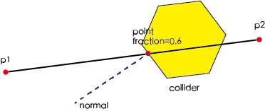

# 刚体

刚体是组成物理世界的基本对象，你可以将刚体想象成一个你不能看到（绘制）也不能摸到（碰撞）的带有属性的物体。

## 刚体属性

### 质量

刚体的质量是通过 [碰撞组件](https://docs.cocos.com/creator/manual/zh/physics/physics/collider-component.html) 的 **密度** 与 **大小** 自动计算得到的。当你需要计算物体应该受到多大的力时可能需要使用到这个属性。

```javascript
var mass = rigidbody.getMass();
```

### 移动速度

```javascript
// 获取移动速度
var velocity = rigidbody.linearVelocity;
// 设置移动速度
rigidbody.linearVelocity = velocity;
```

移动速度衰减系数，可以用来模拟空气摩擦力等效果，它会使现有速度越来越慢。

```javascript
// 获取移动速度衰减系数
var damping = rigidbody.linearDamping;
// 设置移动速度衰减系数
rigidbody.linearDamping = damping;
```

有些时候可能会希望获取刚体上某个点的移动速度，比如一个盒子旋转着往前飞，碰到了墙，这时候可能会希望获取盒子在发生碰撞的点的速度，可以通过 `getLinearVelocityFromWorldPoint` 来获取。

```javascript
var velocity = rigidbody.getLinearVelocityFromWorldPoint(worldPoint);
```

或者传入一个 `cc.Vec2` 对象作为第二个参数来接收返回值，这样你可以使用你的缓存对象来接收这个值，避免创建过多的对象来提高效率。

**刚体的 get 方法都提供了 out 参数来接收函数返回值。**

```javascript
var velocity = cc.v2();
rigidbody.getLinearVelocityFromWorldPoint(worldPoint, velocity);
```

### 旋转速度

```javascript
// 获取旋转速度
var velocity = rigidbody.angularVelocity;
// 设置旋转速度
rigidbody.angularVelocity = velocity;
```

旋转速度衰减系数，与移动衰减系数相同。

```javascript
// 获取旋转速度衰减系数
var velocity = rigidbody.angularDamping;
// 设置旋转速度衰减系数
rigidbody.angularDamping = velocity;
```

### 旋转，位移与缩放

旋转，位移与缩放是游戏开发中最常用的功能，几乎每个节点都会对这些属性进行设置。而在物理系统中，系统会自动对节点的这些属性与 box2d 中对应属性进行同步。

> **注意**：
>
> 1. box2d 中只有旋转和位移，并没有缩放，所以如果设置节点的缩放属性时，会重新构建这个刚体依赖的全部碰撞体。一个有效避免这种情况发生的方式是将渲染的节点作为刚体节点的子节点，缩放只对这个渲染节点作缩放，尽量避免对刚体节点进行直接缩放。
> 2. 每个物理时间步之后会把所有刚体信息同步到对应节点上去，而处于性能考虑，节点的信息只有在用户对节点相关属性进行显示设置时才会同步到刚体上，并且刚体只会监视他所在的节点，即如果修改了节点的父节点的旋转位移是不会同步这些信息的。

### 固定旋转

做平台跳跃游戏时通常都不会希望主角的旋转属性也被加入到物理模拟中，因为这样会导致主角在移动过程中东倒西歪的，这时可以设置刚体的 `fixedRotation` 属性。

```javascript
rigidbody.fixedRotation = true;
```

### 开启碰撞监听

只有开启了刚体的碰撞监听，刚体发生碰撞时才会回调到对应的组件上。

```javascript
rigidbody.enabledContactListener = true;
```

## 刚体类型

box2d 原本的刚体类型是三种：**Static**、**Dynamic**、**Kinematic**。Cocos Creator 多添加了一个类型：**Animated**。

Animated 是从 Kinematic 类型衍生出来的，一般的刚体类型修改 **旋转** 或 **位移** 属性时，都是直接设置的属性，而 Animated 会根据当前旋转或位移属性，与目标旋转或位移属性计算出所需的速度，并且赋值到对应的移动或旋转速度上。
添加 Animated 类型主要是防止对刚体做动画时可能出现的奇怪现象，例如穿透。

- `cc.RigidBodyType.Static`

  静态刚体，零质量，零速度，即不会受到重力或速度影响，但是可以设置他的位置来进行移动。

- `cc.RigidBodyType.Dynamic`

  动态刚体，有质量，可以设置速度，会受到重力影响。

- `cc.RigidBodyType.Kinematic`

  运动刚体，零质量，可以设置速度，不会受到重力的影响，但是可以设置速度来进行移动。

- `cc.RigidBodyType.Animated`

  动画刚体，在上面已经提到过，从 Kinematic 衍生的类型，主要用于刚体与动画编辑结合使用。

## 刚体方法

### 获取或转换旋转位移属性

使用这些 API 来获取世界坐标系下的旋转位移会比通过节点来获取相关属性更快，因为节点中还需要通过矩阵运算来得到结果，而这些 api 是直接得到结果的。

#### 获取刚体世界坐标值

```javascript
// 直接获取返回值
var out = rigidbody.getWorldPosition();

// 或者通过参数来接收返回值
out = cc.v2();
rigidbody.getWorldPosition(out);
```

#### 获取刚体世界旋转值

```javascript
var rotation = rigidbody.getWorldRotation();
```

#### 局部坐标与世界坐标转换

```javascript
// 世界坐标转换到局部坐标
var localPoint = rigidbody.getLocalPoint(worldPoint);
// 或者
localPoint = cc.v2();
rigidbody.getLocalPoint(worldPoint, localPoint);
// 局部坐标转换到世界坐标
var worldPoint = rigidbody.getWorldPoint(localPoint);
// 或者
worldPoint = cc.v2();
rigidbody.getLocalPoint(localPoint, worldPoint);
// 局部向量转换为世界向量
var worldVector = rigidbody.getWorldVector(localVector);
// 或者
worldVector = cc.v2();
rigidbody.getWorldVector(localVector, worldVector);
var localVector = rigidbody.getLocalVector(worldVector);
// 或者
localVector = cc.v2();
rigidbody.getLocalVector(worldVector, localVector);
```

### 获取刚体质心

当对一个刚体进行力的施加时，一般会选择刚体的质心作为施加力的作用点，这样能保证力不会影响到旋转值。

```javascript
// 获取本地坐标系下的质心
var localCenter = rigidbody.getLocalCenter();

// 或者通过参数来接收返回值
localCenter = cc.v2();
rigidbody.getLocalCenter(localCenter);

// 获取世界坐标系下的质心
var worldCenter = rigidbody.getWorldCenter();

// 或者通过参数来接收返回值
worldCenter = cc.v2();
rigidbody.getWorldCenter(worldCenter);
```

### 力与冲量

移动一个物体有两种方式，可以施加一个力或者冲量到这个物体上。力会随着时间慢慢修改物体的速度，而冲量会立即修改物体的速度。

当然你也可以直接修改物体的位置，只是这看起来不像真实的物理，你应该尽量去使用力或者冲量来移动刚体，这会减少可能带来的奇怪问题。

```javascript
// 施加一个力到刚体上指定的点上，这个点是世界坐标系下的一个点
rigidbody.applyForce(force, point);

// 或者直接施加力到刚体的质心上
rigidbody.applyForceToCenter(force);

// 施加一个冲量到刚体上指定的点上，这个点是世界坐标系下的一个点
rigidbody.applyLinearImpulse(impulse, point);
```

力与冲量也可以只对旋转轴产生影响，这样的力叫做扭矩。

```javascript
// 施加扭矩到刚体上，因为只影响旋转轴，所以不再需要指定一个点
rigidbody.applyTorque(torque);

// 施加旋转轴上的冲量到刚体上
rigidbody.applyAngularImpulse(impulse);
```

### 其他

有些时候需要获取刚体在某一点上的速度时，可以通过 `getLinearVelocityFromWorldPoint` 来获取，比如当物体碰撞到一个平台时，需要根据物体碰撞点的速度来判断物体相对于平台是从上方碰撞的还是下方碰撞的。

```javascript
rigidbody.getLinearVelocityFromWorldPoint(worldPoint);
```

# 物理碰撞组件

**物理碰撞组件** 继承自 **碰撞组件**，编辑和设置 **物理碰撞组件** 的方法和 [编辑碰撞组件](https://docs.cocos.com/creator/manual/zh/physics/collision/edit-collider-component.html) 是基本一致的。

## 物理碰撞组件属性

- sensor - 指明碰撞体是否为传感器类型，传感器类型的碰撞体会产生碰撞回调，但是不会发生物理碰撞效果。
- density - 碰撞体的密度，用于刚体的质量计算
- friction - 碰撞体摩擦力，碰撞体接触时的运动会受到摩擦力影响
- restitution - 碰撞体的弹性系数，指明碰撞体碰撞时是否会受到弹力影响

### 物理碰撞组件内部细节

物理碰撞组件内部是由 box2d 的 b2Fixture 组成的，由于 box2d 内部的一些限制，一个多边形物理碰撞组件可能会由多个 b2Fixture 组成。

这些情况为：

1. 当多边形物理碰撞组件的顶点组成的形状为凹边形时，物理系统会自动将这些顶点分割为多个凸边形。
2. 当多边形物理碰撞组件的顶点数多于 `b2.maxPolygonVertices`(一般为 8) 时，物理系统会自动将这些顶点分割为多个凸边形。

一般情况下这些细节是不需要关心的，但是当使用射线检测并且检测类型为 `cc.RayCastType.All` 时，一个碰撞体就可能会检测到多个碰撞点，原因即是检测到了多个 b2Fixture。

# 碰撞回调

当物体在场景中移动并碰撞到其他物体时，box2d 会处理大部分必要的碰撞检测，我们一般不需要关心这些情况。但是制作物理游戏最主要的点是有些情况下物体碰撞后应该发生些什么，比如角色碰到怪物后会死亡，或者球在地上弹动时应该产生声音等。

我们需要一个方式来获取到这些碰撞信息，物理引擎提供的方式是在碰撞发生时产生回调，在回调里我们可以根据产生碰撞的两个碰撞体的类型信息来判断需要作出什么样的动作。

**注意**：

1. 需要先在 [rigidbody](https://docs.cocos.com/creator/manual/zh/physics/physics/rigid-body.html) 中 **开启碰撞监听**，才会有相应的回调产生。
2. 回调中的信息在物理引擎都是以缓存的形式存在的，所以信息只有在这个回调中才是有用的，不要在你的脚本里直接缓存这些信息，但可以缓存这些信息的副本。
3. 在回调中创建的物理物体，比如刚体，关节等，这些不会立刻就创建出 box2d 对应的物体，会在整个物理系统更新完成后再进行这些物体的创建。

## 定义回调函数

定义一个碰撞回调函数很简单，只需要在刚体所在的节点上挂一个脚本，脚本中添加上你需要的回调函数即可。

```js
cc.Class({
    extends: cc.Component,

    // 只在两个碰撞体开始接触时被调用一次
    onBeginContact: function (contact, selfCollider, otherCollider) {
    },

    // 只在两个碰撞体结束接触时被调用一次
    onEndContact: function (contact, selfCollider, otherCollider) {
    },

    // 每次将要处理碰撞体接触逻辑时被调用
    onPreSolve: function (contact, selfCollider, otherCollider) {
    },

    // 每次处理完碰撞体接触逻辑时被调用
    onPostSolve: function (contact, selfCollider, otherCollider) {
    }
});
```

在上面的代码示例中，我们添加了所有的碰撞回调函数到这个脚本中，一共有四个类型的回调函数，每个回调函数都有三个参数。每种回调函数的作用如注释所示，你可以根据自己的需求来实现相应的回调函数。

## 回调的顺序

我们可以通过拆分一个简单的示例的碰撞过程来描述碰撞回调函数的回调顺序和回调的时机，假设有两个刚体正相互移动，三角形往右运动，方块往左运动，即将碰撞到了一起。

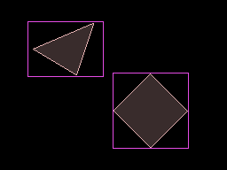

碰撞的过程

|                                                              |                                                              |
| ------------------------------------------------------------ | ------------------------------------------------------------ |
| 碰撞 1 碰撞 2 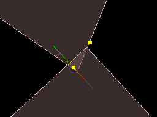碰撞 3 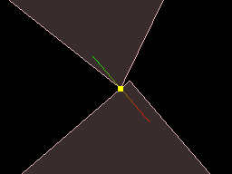 | 当两个碰撞体相互覆盖时，box2d 默认的行为是给每个碰撞体一个冲量去把它们分开，但是这个行为不一定能在一个时间步内完成。 像这里显示的一样，示例中的碰撞体会在三个时间步内相互覆盖直到“反弹”完成并且它们相互分离。 在这个时间里我们可以定制我们想要的行为，**onPreSolve** 会在每次物理引擎处理碰撞前回调，我们 可以在这个回调里修改碰撞信息，而 **onPostSolve** 会在处理完成这次碰撞后回调，我们可以在这个回调中获取到物理引擎计算出的碰撞的冲量信息。 下面给出的输出信息能使我们更清楚回调的顺序。`        ...    Step    Step    BeginContact    PreSolve    PostSolve    Step    PreSolve    PostSolve    Step    PreSolve    PostSolve    Step    EndContact    Step    Step    ... ` |
|                                                              |                                                              |

## 回调的参数

回调的参数包含了所有的碰撞接触信息，每个回调函数都提供了三个参数：**contact**、**selfCollider**、**otherCollider**。

**selfCollider** 和 **otherCollider** 很容易理解，如名字所示，**selfCollider** 指的是回调脚本的节点上的碰撞体，**otherCollider** 指的是发生碰撞的另一个碰撞体。

最主要的信息都包含在 **contact** 中，这是一个 `cc.PhysicsContact` 类型的实例，可以在 api 文档中找到相关的 API。contact 中比较常用的信息就是碰撞的位置和法向量，contact 内部是按照刚体的本地坐标来存储信息的，而我们一般需要的是世界坐标系下的信息，我们可以通过 `contact.getWorldManifold` 来获取这些信息。

### worldManifold

```javascript
var worldManifold = contact.getWorldManifold();
var points = worldManifold.points;
var normal = worldManifold.normal;
```

`worldManifold` 具有以下成员：

- points

  碰撞点数组，它们不一定会精确的在碰撞体碰撞的地方上，如下图所示（除非你将刚体设置为子弹类型，但是会比较耗性能），但实际上这些点在使用上一般都是够用的。

  

  > **注意**：不是每一个碰撞都会有两个碰撞点，在模拟的更多的情况下只会产生一个碰撞点，下面列举一些其他的碰撞示例。
  >
  > 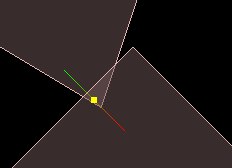
  >
  > 
  >
  > 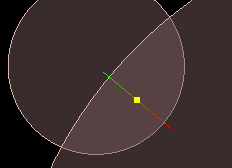

- normal

  碰撞点上的法向量，由自身碰撞体指向对方碰撞体，指明解决碰撞最快的方向。

  

  在图中所示的线条即碰撞点上的法向量，在这个碰撞中，解决碰撞最快的途径是添加冲量将三角形往左上推，将方块往右下推。需要注意的是这里的法向量只是一个方向，并不带有位置属性，也不会连接到这些碰撞点中的任何一个。

  你还需要明白的是 **碰撞法向量并不是碰撞体碰撞的角度**，他只会指明可以解决两个碰撞体相互覆盖这一问题最短的方向。比如上面的例子中如果三角形移动得更快一点，覆盖的情形像下图所示的话：

  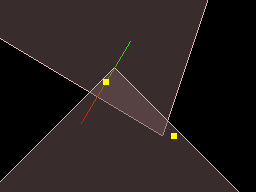

  那么最短的方式将会是把三角形往右上推，所以使用法向量来作为碰撞角度不是一个好主意。如果你希望知道碰撞的真正的方向，可以使用下面的方式：

  ```javascript
  var vel1 = triangleBody.getLinearVelocityFromWorldPoint(worldManifold.points[0]);
  var vel2 = squareBody.getLinearVelocityFromWorldPoint(worldManifold.points[0]);
  var relativeVelocity = vel1.sub(vel2);
  ```

  这个代码可以获取到两个碰撞体相互碰撞时在碰撞点上的相对速度。

### 禁用 contact

```javascript
contact.disabled = true;
```

禁用掉 contact 会使物理引擎在计算碰撞时会忽略掉这次碰撞，禁用将会持续到碰撞完成，除非在其他回调中再将这个 contact 启用。

或者如果你只想在本次物理处理步骤中禁用 contact，可以使用 `disabledOnce`。

```javascript
contact.disabledOnce = true;
```

### 修改 contact 信息

前面有提到我们在 **onPreSolve** 中修改 contact 的信息，因为 **onPreSolve** 是在物理引擎处理碰撞信息前回调的，所以对碰撞信息的修改会影响到后面的碰撞计算。

```js
// 修改碰撞体间的摩擦力
contact.setFriction(friction);

// 修改碰撞体间的弹性系数
contact.setRestitution(restitution);
```

> **注意**：这些修改只会在本次物理处理步骤中生效。

# 关节组件

物理系统包含了一系列用于链接两个刚体的关节组件。关节组件可以用来模拟真实世界物体间的交互，比如铰链，活塞，绳子，轮子，滑轮，机动车，链条等。学习如何使用关节组件可以有效地帮助创建一个真实有趣的场景。

目前物理系统中提供了以下可用的关节组件：

- Revolute Joint - 旋转关节，可以看做一个铰链或者钉，刚体会围绕一个共同点来旋转。
- Distance Joint - 距离关节，关节两端的刚体的锚点会保持在一个固定的距离。
- Prismatic Joint - 棱柱关节，两个刚体位置间的角度是固定的，它们只能在一个指定的轴上滑动。
- Weld Joint - 焊接关节，根据两个物体的初始角度将两个物体上的两个点绑定在一起。
- Wheel Joint - 轮子关节，由 Revolute 和 Prismatic 组合成的关节，用于模拟机动车车轮。
- Rope Joint - 绳子关节，将关节两端的刚体约束在一个最大范围内。
- Motor Joint - 马达关节，控制两个刚体间的相对运动。

## 关节的共同属性

虽然每种关节都有不同的表现，但是它们都有一些共同的属性。

- connectedBody - 关节链接的另一端的刚体
- anchor - 关节本端链接的刚体的锚点
- connectedAnchor - 关节另一端链接的刚体的锚点
- collideConnected - 关节两端的刚体是否能够互相碰撞

每个关节都需要链接上两个刚体才能够发挥他的功能，我们把和关节挂在同一节点下的刚体视为关节的本端，把 **connectedBody** 视为另一端的刚体。

通常情况下，每个刚体会围绕自身周围的位置来设定此点。 根据关节组件类型的不同，此点决定了物体的旋转中心，或者是用来保持一定距离的坐标点，等等。

**collideConnected** 属性允许你决定关节两端的刚体是否需要继续遵循常规的碰撞规则。 比如如果你现在准备制作一个布娃娃，你可能会希望大腿和小腿能够部分重合，然后在膝盖处链接到一起，那么就需要设置 **collideConnected** 属性为 false。 如果你正在制作一个升降机，你可能希望升降机平台和地板能够碰撞，那么就需要设置 **collideConnected** 属性为 true。

# 高级设置

> 文：youyou

Box2D 提供了非常多的参数来改变物理运行状态，除了 `RigidBody`、`Collider`、`Joint`、`World` 之外，还有一些属于 Box2D 内部宏的参数。这些宏的参数可以在 **box2d.js（web 平台）** / **Box2D/Common/b2Settings.h（native 平台）** 文件开头找到。

每个物理游戏需要的参数都可能是不同的，不同的情况会需要不同的参数配置。下面会介绍一些宏参数，在某些情况下调整这些宏参数能得到更好的物理模拟效果。

## 案例

`b2_velocityThreshold`（默认为 **1.0f**）

> 弹性碰撞的速度阈值。当碰撞发生时如果相对速度小于速度阈值，那这次的碰撞会被认为是非弹性碰撞。

- 案例 1

  当给物理世界设置了一个很大的重力，或者将刚体的 **gravity scale** 设置的很大，当刚体降落到一个平台上时，可能会由于速度一直大于这个阈值而造成刚体一直抖动而无法停止的情况。
  **解决方法**：将 `b2_velocityThreshold` 阈值提高。

- 案例 2

  像桌球游戏这种类型的游戏可能会出现这样的情况，当一个小球碰到并停靠在桌子的边缘，这个小球就再也离不开边缘了。
  **解决方法**：将 `b2_velocityThreshold` 阈值降低。