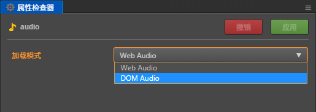

# 音乐和音效

[toc]

## 使用 AudioSource 组件播放

1. 在 **层级管理器** 上创建一个空节点

2. 选中空节点，在 **属性检查器** 最下方点击 **添加组件 -> 其他组件 -> AudioSource** 来添加 AudioSource 组件

3. 将 **资源管理器** 中所需的音频资源拖拽到 AudioSource 组件的 Clip 中，如下所示:

   

然后根据需要对 AudioSource 组件的其他参数项进行设置即可，参数详情可参考 [AudioSource 组件参考](https://docs.cocos.com/creator/manual/zh/components/audiosource.html)。

- **通过脚本控制 AudioSource 组件**

  如果只需要在游戏加载完成后自动播放音频，那么勾选 AudioSource 组件的 **Play On Load** 即可。如果要更灵活的控制 AudioSource 的播放，可以在自定义脚本中获取 **AudioSource 组件**，然后调用相应的 API，如下所示：

  ```js
    // AudioSourceControl.js
    cc.Class({
        extends: cc.Component,
  
        properties: {
            audioSource: {
                type: cc.AudioSource,
                default: null
            },
        },
  
        play: function () {
            this.audioSource.play();
        },
  
        pause: function () {
            this.audioSource.pause();
        },
    });
  ```

  然后在编辑器的 **属性检查器** 中添加对应的用户脚本组件。选择相对应的节点，在 **属性检查器** 最下方点击 **添加组件 -> 用户脚本组件 -> 用户脚本**，即可添加脚本组件。然后将带有 AudioSource 组件的节点拖拽到脚本组件中的 **Audio Source** 上，如下所示：

  

## 使用 AudioEngine 播放

AudioEngine 与 AudioSource 都能播放音频，它们的区别在于 AudioSource 是组件，可以添加到场景中，由编辑器设置。而 AudioEngine 是引擎提供的纯 API，只能在脚本中进行调用。如下所示：

1. 在脚本的 properties 中定义一个 AudioClip 资源对象

2. 直接使用 `cc.audioEngine.play(audio, loop, volume);` 播放，如下所示：

   ```js
    // AudioEngine.js
    cc.Class({
        extends: cc.Component,
   
        properties: {
            audio: {
                default: null,
                type: cc.AudioClip
            }
        },
   
        onLoad: function () {
            this.current = cc.audioEngine.play(this.audio, false, 1);
        },
   
        onDestroy: function () {
            cc.audioEngine.stop(this.current);
        }
    });
   ```

目前建议使用 [audioEngine.play](https://docs.cocos.com/creator/api/zh/classes/audioEngine.html#play) 接口来统一播放音频。或者也可以使用 [audioEngine.playEffect](https://docs.cocos.com/creator/api/zh/classes/audioEngine.html#playeffect) 和 [audioEngine.playMusic](https://docs.cocos.com/creator/api/zh/classes/audioEngine.html#playmusic) 这两个接口，前者主要是用于播放音效，后者主要是用于播放背景音乐。具体可查看 API 文档。

AudioEngine 播放的时候，需要注意这里传入的是一个完整的 AudioClip 对象（而不是 url）。所以不建议在 play 接口内直接填写音频的 url 地址，而是希望用户在脚本的 properties 中先定义一个 AudioClip，然后在编辑器的 **属性检查器** 中添加对应的用户脚本组件，将音频资源拖拽到脚本组件的 audio-clip 上。如下所示：


**注意**：如果音频播放相关的设置都完成后，在部分浏览器上预览或者运行时仍听不到声音，那可能是由于浏览器兼容性导致的问题。例如：Chrome 禁用了 WebAudio 的自动播放，而音频默认是使用 Web Audio 的方式加载并播放的，此时用户就需要在 **资源管理器** 中选中音频资源，然后在 **属性检查器** 中将音频的加载模式修改为 DOM Audio 才能在浏览器上正常播放。详情可参考 [声音资源](https://docs.cocos.com/creator/manual/zh/asset-workflow/audio-asset.html) 和 [兼容性说明](https://docs.cocos.com/creator/manual/zh/audio/compatibility.html)。



# AudioSource 组件参考


## 属性

| 属性         | 说明                         |
| ------------ | ---------------------------- |
| Clip         | 用来播放的音频资源对象       |
| Volume       | 音量大小，范围在 0~1 之间    |
| Mute         | 是否静音                     |
| Loop         | 是否循环播放                 |
| Play on load | 是否在组件激活后自动播放音频 |
| preload      | 是否在未播放的时候预先加载   |

更多音频接口的脚本接口请参考 [AudioSource API](https://docs.cocos.com/creator/api/zh/classes/AudioSource.html)。

#### 关于自动播放的问题

一些移动端的浏览器或 **WebView** 不允许自动播放音频，用户需要在触摸事件中手动播放音频。

```js
cc.Class({
    extends: cc.Component,
    properties: {
       audioSource: cc.AudioSource
    },

    start () {
       let canvas = cc.find('Canvas');
       canvas.on('touchstart', this.playAudio, this);
    },

    playAudio () {
      this.audioSource.play();
    }
});
```

# 音频兼容性说明

## DOM Audio

一般的浏览器都支持 **Audio** 标签的方式播放音频。引擎内的 DOM Audio 模式通过创建 Audio 标签来播放一系列的声音。但是在某些浏览器上可能会出现下列情况：

1. 部分移动浏览器内，Audio 的回调缺失，会导致加载时间偏长的问题。所以我们尽量推荐使用 WebAudio。
2. iOS 系统上的浏览器，必须是用户主动操作的事件触发函数内，才能够播放这类型的音频。使用 javascript 主动播放可能会被忽略。

## WebAudio

WebAudio 的兼容性比 DOM 模式好了不少，不过也有一些特殊情况：

- iOS 系统上的浏览器，默认 WebAudio 时间轴是不会前进的，只有在用户第一次触摸并播放音频之后，时间轴才会启动。也就是说页面启动并播放背景音乐可能做不到。最好的处理方式就是引导用户点击屏幕，然后播放声音。

## iOS WeChat 自动播放音频

WeChat 内加载 js sdk 之后，会有一个事件 `WeixinJSBridgeReady`，在这个事件内，也是可以主动播放音频的。所以如果需要启动立即播放背景音乐，可以这么写：

```javascript
document.addEventListener('WeixinJSBridgeReady', function () {
    cc.resources.load('audio/music_logo', cc.AudioClip, (err, audioClip) => {
        var audioSource = this.addComponent(cc.AudioSource);
        audioSource.clip = audioClip;
        audioSource.play();
    });
});
```

并在引擎启动之后，使用其他方式播放音频的时候停止这个音频的播放。