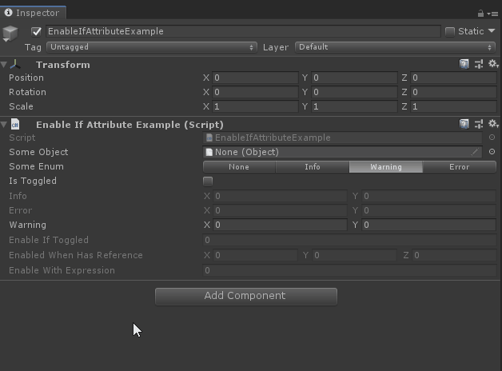

# EnableIf

> *用于任何属性，并且可以在检查器中启用或禁用该属性。相关属性时，使用此选项可启用属性。*

##### 这个特性的效果主要是当指定条件满足时，启用对应的属性，默认传入的参数为对应属性的名称，如果为True或者不为null时，启用对应属性



```cs
    [EnableIf("IsToggled")]
    public int EnableIfToggled;

    [EnableIf("SomeObject")]
    public Vector3 EnabledWhenHasReference;
```

##### 还以指定一个选项值，当指定的属性与这个值拼配时，显示属性

```cs
    [EnableIf("SomeEnum", InfoMessageType.Info)]
    public Vector2 Info;

    [EnableIf("SomeEnum", InfoMessageType.Error)]
    public Vector2 Error;

    [EnableIf("SomeEnum", InfoMessageType.Warning)]
    public Vector2 Warning;
```

##### 可以使用@特殊符号写入表达式，其表达式的值作为实参

```cs
    [EnableIf("@this.IsToggled && this.SomeObject != null || this.SomeEnum == InfoMessageType.Error")]
    public int EnableWithExpression;
```

##### 完整示例代码

```cs
using Sirenix.OdinInspector;
using UnityEngine;

public class EnableIfAttributeExample : MonoBehaviour
{
    public UnityEngine.Object SomeObject;

    [EnumToggleButtons]
    public InfoMessageType SomeEnum;

    public bool IsToggled;

    [EnableIf("SomeEnum", InfoMessageType.Info)]
    public Vector2 Info;

    [EnableIf("SomeEnum", InfoMessageType.Error)]
    public Vector2 Error;

    [EnableIf("SomeEnum", InfoMessageType.Warning)]
    public Vector2 Warning;

    [EnableIf("IsToggled")]
    public int EnableIfToggled;

    [EnableIf("SomeObject")]
    public Vector3 EnabledWhenHasReference;

    [EnableIf("@this.IsToggled && this.SomeObject != null || this.SomeEnum == InfoMessageType.Error")]
    public int EnableWithExpression;
}
```

