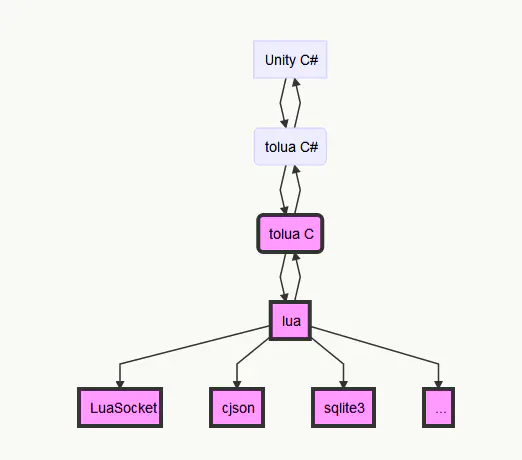

# tolua编译

转载：https://www.jianshu.com/p/5a35602adef8?appinstall=0

做U3D手机游戏，最热门的技术组合是c#+lua，使用lua是因为可以热更新，而将c#与lua粘合起来的框架，目前最热门的是[tolua框架](https://link.jianshu.com?t=https://github.com/topameng/tolua)，tolua框架有两部分组成，一个是c#部分，一个是c部分，整个框架在游戏代码中的位置是这样子的。如下图所示：



tolua C 起到承上启下的作用，是C#和lua的中间层，在和C#交互方面，作为非c#托管代码,会提供一些函数让c# DllImport，c#会通过Marshal等与非托管代码交互；在和lua交互方面，它符合lua扩展库标准，一方面通过lua的C API与lua虚拟机交互，另一方面会提供接口给lua脚本使用。

  还有一些lua的扩展库，比如cjson、LuaSocket、sqlite3、lpeg、bit、pbc等手机游戏常用库，这些库扩展了lua的能力，本文要介绍的就是将这些第三方扩展库和lua源码(图中红色部分)一起编译成tolua的native库，windows平台叫做tolua.dll，android叫做libtolua.so，mac平台叫tolua.bundle，而iOS平台由于不允许使用动态库，所以会编译成静态库libtolua.a。

  首先，先从[tolua_runtime的github](https://link.jianshu.com?t=https://github.com/topameng/tolua_runtime)获取tolua.c开发包（感谢topament大佬）。

## 在windows平台编译

  用vs可以编译，但是我没试过，我是使用mingw来编译的，需要准备的工具：msys2(这个才可以编译x86_64)。
  安装[MSYS2](https://link.jianshu.com?t=http://www.msys2.org/)，关于如何在msys2安装gcc和make可以参考[tolua_runtime/wiki](https://link.jianshu.com?t=https://github.com/topameng/tolua_runtime/wiki)，安装msys2和下载好gcc和make软件包后(可能链接时会报找不到libintl-8.dll的错，顺便也安装一下mingw-w64-x86_64-gettext这个软件包，pacman -S mingw-w64-x86_64-gettext)，编译win32位程序要用mingw32.exe和编译win64位要用。mingw64.exe。

### 来到下载好的tolua_runtime目录

执行脚本build_win_32.sh，这就编译好了windows平台下x86动态库。

执行脚本build_win_64.sh，这就编译好了windows平台下x86_64动态库。

脚本主要是执行make和gcc，如过自己有一些特殊的扩展库要编译，自行修改一下脚本添加就好，我在tolua_runtime下载下来的脚本中添加了pbc和lsqlite3的编译，下面是build_win64.sh的内容；

```cmake
#!/bin/bash
# 62 Bit Version
mkdir -p window/x86_64

cd luajit
mingw32-make clean

mingw32-make BUILDMODE=static CC="gcc -m64 -O3"
cp src/libluajit.a ../window/x86_64/libluajit.a
mingw32-make clean

cd ..

gcc -m64 -O3 -std=gnu99 -shared \
 tolua.c \
 int64.c \
 uint64.c \
 pb.c \
 pbc-lua.c \
 lsqlite3.c \
 lpeg.c \
 struct.c \
 cjson/strbuf.c \
 cjson/lua_cjson.c \
 cjson/fpconv.c \
 lsqlite3/shell.c \
 lsqlite3/sqlite3.c \
 luasocket/auxiliar.c \
 luasocket/buffer.c \
 luasocket/except.c \
 luasocket/inet.c \
 luasocket/io.c \
 luasocket/luasocket.c \
 luasocket/mime.c \
 luasocket/options.c \
 luasocket/select.c \
 luasocket/tcp.c \
 luasocket/timeout.c \
 luasocket/udp.c \
 luasocket/wsocket.c \
 luasocket/compat.c \
 -o Plugins/x86_64/tolua.dll \
 -I./ \
 -Iluajit/src \
 -Icjson \
 -Iluasocket \
 -Ipbc \
 -Ilsqlite3 \
 -lws2_32 \
 -Wl,--whole-archive window/x86_64/libluajit.a window/x86_64/libpbc.a -Wl,--no-whole-archive -static-libgcc -static-libstdc++
```

在ming64.exe打开的终端中进行编译。

将编译好的tolua.dll拷贝到unity的Plugins下对应平台目录下就可以使用。

## 编译android平台的动态库

android平台用得最多的cpu架构体系是Acorn公司的arm和Intel公司x86，由于arm市场占有率最高，大多android的app也就只编译了arm版本，所以Intel也专门针对arm体系架构做了一个转换程序，也就是说，arm程序在x86机子上也可以跑起来。所以，一般来说，只要编译arm就可以了（最常用的CPU和ABI是ARMv7a），当然，将x86也编译起来是极好的，据以往分析闪退的经验，在x86机子上闪退的一大元凶就是那个转换程序出了问题，代价就是会增加包体的大小(每多支持一个CPU架构，就是多编译一个动态库so)。

先来看一看这个编译脚本build_arm.sh:

```cmake
cd luajit/src

# Android/ARM, armeabi-v7a (ARMv7 VFP), Android 4.0+ (ICS)
NDK=D:/android-ndk-r10e
NDKABI=21
NDKVER=$NDK/toolchains/arm-linux-androideabi-4.9
NDKP=$NDKVER/prebuilt/windows-x86_64/bin/arm-linux-androideabi-
NDKF="--sysroot $NDK/platforms/android-$NDKABI/arch-arm" 
NDKARCH="-march=armv7-a -mfloat-abi=softfp -Wl,--fix-cortex-a8"

make clean
make HOST_CC="gcc -O2 -m32" CROSS=$NDKP TARGET_SYS=Linux TARGET_FLAGS="$NDKF $NDKARCH"
cp ./libluajit.a ../../android/jni/libluajit.a
make clean

cd ../../android
ndk-build clean APP_ABI="armeabi-v7a,x86"
ndk-build APP_ABI="armeabi-v7a"
cp libs/armeabi-v7a/libtolua.so ../Plugins/Android/libs/armeabi-v7a
ndk-build clean APP_ABI="armeabi-v7a,x86"
```

这个脚本主要分三部分，第一部分定义变量；第二部分编译luajit的arm版，生成luajit.a；第三部分用ndk的ndk-build程序最终编译出libtolua.so，ndk-build其实也是封装了make调用最终调用gcc进行交叉编译的。

luajit的Makefile支持多平台编译，所以通过设置参数直接调用gcc进行编译，（luajit在编译过程中间还会生成一些中间代码，所以还是建议用官方提供的Makefile来编译），但并不是所有c库都有支持多平台Makefile，所以最方便也最保险的方法是通过ndk-build工具和填写Android.mk来编译，就像第三部分那样。看一下我的Android.mk：

```cmake
LOCAL_PATH := $(call my-dir)

include $(CLEAR_VARS)
LOCAL_MODULE := libluajit
LOCAL_SRC_FILES := libluajit.a
include $(PREBUILT_STATIC_LIBRARY)

include $(CLEAR_VARS)
LOCAL_FORCE_STATIC_EXECUTABLE := true
LOCAL_MODULE := tolua
LOCAL_C_INCLUDES := $(LOCAL_PATH)/../../luajit/src
LOCAL_C_INCLUDES += $(LOCAL_PATH)/../../
LOCAL_C_INCLUDES += $(LOCAL_PATH)/../../lsqlite3

LOCAL_CPPFLAGS := -O2
LOCAL_CFLAGS :=  -O2 -std=gnu99
LOCAL_SRC_FILES :=  ../../tolua.c \
                    ../../int64.c \
                    ../../uint64.c \
                    ../../pb.c \
                    ../../lpeg.c \
                    ../../struct.c \
                    ../../pbc-lua.c \
                    ../../lsqlite3.c \
                    ../../cjson/strbuf.c \
                    ../../cjson/lua_cjson.c \
                    ../../cjson/fpconv.c \
                    ../../lsqlite3/shell.c \
                    ../../lsqlite3/sqlite3.c \
                    ../../luasocket/auxiliar.c \
                    ../../luasocket/buffer.c \
                    ../../luasocket/except.c \
                    ../../luasocket/inet.c \
                    ../../luasocket/io.c \
                    ../../luasocket/luasocket.c \
                    ../../luasocket/mime.c \
                    ../../luasocket/options.c \
                    ../../luasocket/select.c \
                    ../../luasocket/tcp.c \
                    ../../luasocket/timeout.c \
                    ../../luasocket/udp.c \
                    ../../luasocket/usocket.c \
                    ../../luasocket/compat.c \
                    ../../pbc/alloc.c \
                    ../../pbc/array.c \
                    ../../pbc/bootstrap.c \
                    ../../pbc/context.c \
                    ../../pbc/decode.c \
                    ../../pbc/map.c \
                    ../../pbc/pattern.c \
                    ../../pbc/proto.c \
                    ../../pbc/register.c \
                    ../../pbc/rmessage.c \
                    ../../pbc/stringpool.c \
                    ../../pbc/varint.c \
                    ../../pbc/wmessage.c \


LOCAL_WHOLE_STATIC_LIBRARIES += libluajit
include $(BUILD_SHARED_LIBRARY)
```

编译android下的so要用mingw32.exe，下载好Android-ndk工具包，然后修改一下编译脚本中的ndk路径,将ndk路径添加到mingw-32的环境变量PATH中，执行脚本。下面是脚本执行过程中输出的最后几行信息：

```cmake
[armeabi-v7a] Compile thumb  : tolua <= stringpool.c
[armeabi-v7a] Compile thumb  : tolua <= varint.c
[armeabi-v7a] Compile thumb  : tolua <= wmessage.c
[armeabi-v7a] SharedLibrary  : libtolua.so
[armeabi-v7a] Install        : libtolua.so => libs/armeabi-v7a/libtolua.so
```

最终会生成对应CPU架构和ABI的so文件。

## Mac平台

```cmake
#!/usr/bin/env bash

cd macnojit/
xcodebuild clean
xcodebuild -configuration=Release
cp -r build/Release/tolua.bundle ../Plugins/
```

打开xcode工程，将需要的源文件拖进去就好，在xcode工程目录中执行脚本就行。

这样就编译出在mac平台使用的tolua.bundle了。

## IOS平台

研究一下脚本 build_ios.sh

```cmake
#!/usr/bin/env bash
DIR="$( cd "$( dirname "${BASH_SOURCE[0]}" )" && pwd )"
LIPO="xcrun -sdk iphoneos lipo"
STRIP="xcrun -sdk iphoneos strip"

SRCDIR=$DIR/luajit-2.1/
DESTDIR=$DIR/iOS
IXCODE=`xcode-select -print-path`
ISDK=$IXCODE/Platforms/iPhoneOS.platform/Developer
ISDKD=/Applications/Xcode.app/Contents/Developer/Toolchains/XcodeDefault.xctoolchain/
ISDKVER=iPhoneOS.sdk
ISDKP=$IXCODE/usr/bin/

if [ ! -e $ISDKP/ar ]; then 
  sudo cp $ISDKD/usr/bin/ar $ISDKP
fi

if [ ! -e $ISDKP/ranlib ]; then
  sudo cp $ISDKD/usr/bin/ranlib $ISDKP
fi

if [ ! -e $ISDKP/strip ]; then
  sudo cp $ISDKD/usr/bin/strip $ISDKP
fi

rm "$DESTDIR"/*.a
cd $SRCDIR

make clean
ISDKF="-arch armv7 -isysroot $ISDK/SDKs/$ISDKVER"
make HOST_CC="gcc -m32" CROSS="$ISDKP" TARGET_FLAGS="$ISDKF" TARGET=armv7 TARGET_SYS=iOS
mv "$SRCDIR"/src/libluajit.a "$DESTDIR"/libluajit-armv7.a

make clean
ISDKF="-arch armv7s -isysroot $ISDK/SDKs/$ISDKVER"
make HOST_CC="gcc -m32" CROSS="$ISDKP" TARGET_FLAGS="$ISDKF" TARGET=armv7s TARGET_SYS=iOS
mv "$SRCDIR"/src/libluajit.a "$DESTDIR"/libluajit-armv7s.a

make clean
ISDKF="-arch arm64 -isysroot $ISDK/SDKs/$ISDKVER"
make HOST_CC="gcc " CROSS="$ISDKP" TARGET_FLAGS="$ISDKF" TARGET=arm64 TARGET_SYS=iOS
mv "$SRCDIR"/src/libluajit.a "$DESTDIR"/libluajit-arm64.a
make clean

cd ../iOS
$LIPO -create "$DESTDIR"/libluajit-*.a -output "$DESTDIR"/libluajit.a
$STRIP -S "$DESTDIR"/libluajit.a
xcodebuild clean
xcodebuild -configuration=Release
cp -f ./build/Release-iphoneos/libtolua.a ../Plugins/iOS/
```

iphone用的也是arm架构，这也属于交叉编译，脚本分三部分，第一部分定义变量，第二部分交叉编译luajit，这里分别编译armv7、armv7s、arm64，然后把他们合并在一起，以便支持不同配置的iOS设备，最后是与编译mac平台时一样，执行xcode编译。