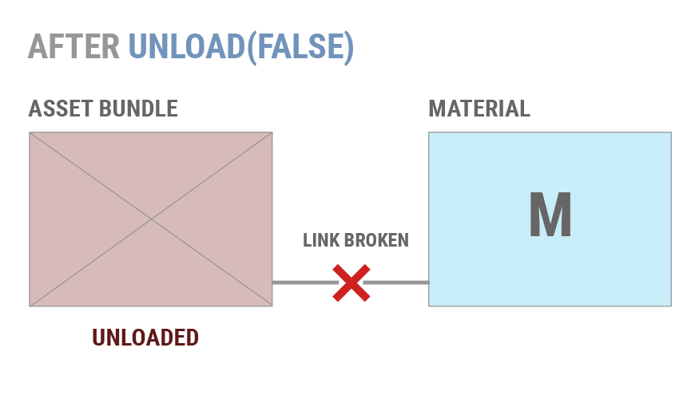
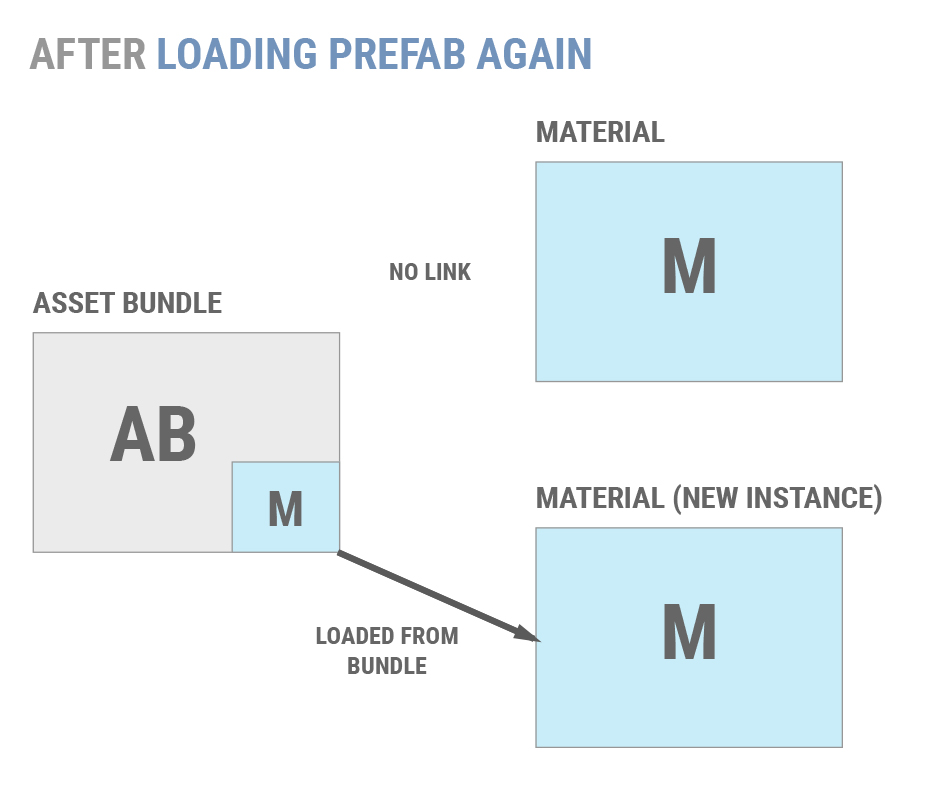

# AssetBundle

**AssetBundle** 是一个存档文件，包含可在运行时加载的特定于平台的资源（模型、纹理、预制件、音频剪辑甚至整个场景）。AssetBundle 可以表达彼此之间的依赖关系；例如 AssetBundle A 中的材质可以引用 AssetBundle B 中的纹理。为了通过网络进行有效传递，可以根据用例要求选用内置算法来压缩 AssetBundle（LZMA 和 LZ4）。

AssetBundle 可用于可下载内容（DLC），减小初始安装大小，加载针对最终用户平台优化的资源，以及减轻运行时内存压力。

## AssetBundle 中有什么？

问得好，实际上“AssetBundle”可以指两种不同但相关的东西。

首先是磁盘上的实际文件。对于这种情况，我们称之为 AssetBundle 存档，在本文档中简称“存档”。存档可以被视为一个容器，就像文件夹一样，可以在其中包含其他文件。这些附加文件包含两种类型：序列化文件和资源文件。序列化文件包含分解为各个对象并写入此单个文件的资源。资源文件只是为某些资源（纹理和音频）单独存储的二进制数据块，允许我们有效地在另一个线程上从磁盘加载它们。

其次是通过代码进行交互以便从特定存档加载资源的实际 AssetBundle 对象。此对象包含一个映射，即从已添加到此存档的资源的所有文件路径到按需加载的资源所包含的对象之间的映射。

# AssetBundle 工作流程

要开始使用 AssetBundle，请按照以下步骤操作。有关每个工作流程的更多详细信息，请参阅本文档这一部分的其他页面。

## 为 AssetBundle 分配资源

要为 AssetBundle 分配指定资源，请按照下列步骤操作：

1. 从 Project 视图中选择要为捆绑包分配的资源 
2. 在 Inspector 中检查对象 
3. 在 Inspector 底部，应该会看到一个用于分配 AssetBundle 和变体的部分： 
4. 左侧下拉选单分配 AssetBundle，而右侧下拉选单分配变量 
5. 单击左侧下拉选单，其中显示“None”，表示当前注册的 AssetBundle 名称 
6. 单击“New…”以创建新的 AssetBundle 
7. 输入所需的 AssetBundle 名称。请注意，AssetBundle 名称支持某种类型的文件夹结构，具体取决于您输入的内容。要添加子文件夹，请用“/”分隔文件夹名称。例如：AssetBundle 名称“environment/forest”将在 environment 子文件夹下创建名为 forest 的捆绑包 
8. 一旦选择或创建了 AssetBundle 名称，便可以重复此过程在右侧下拉选单中分配或创建变体名称（如果需要）。构建 AssetBundle 不需要变体名称

要阅读有关 AssetBundle 分配和相关策略的更多信息，请参阅关于[为 AssetBundle 准备资源](https://docs.unity.cn/cn/2018.4/Manual/AssetBundles-Preparing.html) 的文档。

## 构建 AssetBundle

在 Assets 文件夹中创建一个名为 Editor 的文件夹，并将包含以下内容的脚本放在该文件夹中：

```
using UnityEditor;
using System.IO;

public class CreateAssetBundles
{
    [MenuItem("Assets/Build AssetBundles")]
    static void BuildAllAssetBundles()
    {
        string assetBundleDirectory = "Assets/AssetBundles";
        if(!Directory.Exists(assetBundleDirectory))
{
    Directory.CreateDirectory(assetBundleDirectory);
}
BuildPipeline.BuildAssetBundles(assetBundleDirectory, BuildAssetBundleOptions.None, BuildTarget.StandaloneWindows);
    }
}
```

此脚本将在 Assets 菜单底部创建一个名为“Build AssetBundles”的菜单项，该菜单项将执行与该标签关联的函数中的代码。单击 Build AssetBundles 时，将随构建对话框一起显示一个进度条。此过程将会获取带有 AssetBundle 名称标签的所有资源，并将它们放在 assetBundleDirectory 定义的路径中的文件夹中。

有关此代码执行情况的更多详细信息，请参阅关于[构建 AssetBundle](https://docs.unity.cn/cn/2018.4/Manual/AssetBundles-Building.html) 的文档。

## 将 AssetBundle 上传到场外存储

此步骤对每个用户都是不同的，因此 Unity 不能告诉您应该具体如何操作。如果计划将 AssetBundle 上传到第三方托管站点，请在此步中执行该操作。如果正在严格执行本地开发并打算将所有 AssetBundle 都放在磁盘上，请跳转到下一步。

## 加载 AssetBundle 和资源

打算从本地存储加载的用户可能会对 AssetBundles.LoadFromFile API 感兴趣。该 API 如下所示：

```c#
public class LoadFromFileExample extends MonoBehaviour {
    function Start() {
        var myLoadedAssetBundle = AssetBundle.LoadFromFile(Path.Combine(Application.streamingAssetsPath, "myassetBundle"));
        if (myLoadedAssetBundle == null) {
            Debug.Log("Failed to load AssetBundle!");
            return;
        }
        var prefab = myLoadedAssetBundle.LoadAsset.<GameObject>("MyObject");
        Instantiate(prefab);
    }
}
```

`LoadFromFile` 获取捆绑包文件的路径。

如果是自己托管 AssetBundle 并需要将它们下载到游戏中，应使用 UnityWebRequest API。下面是一个示例：

```c#
IEnumerator InstantiateObject()

    {
        string uri = "file:///" + Application.dataPath + "/AssetBundles/" + assetBundleName;
        UnityEngine.Networking.UnityWebRequest request = UnityEngine.Networking.UnityWebRequest.GetAssetBundle(uri, 0);
        yield return request.Send();
        AssetBundle bundle = DownloadHandlerAssetBundle.GetContent(request);
        GameObject cube = bundle.LoadAsset<GameObject>("Cube");
        GameObject sprite = bundle.LoadAsset<GameObject>("Sprite");
        Instantiate(cube);
        Instantiate(sprite);
    }
```

`GetAssetBundle(string, int)` 获取 AssetBundle 的位置以及要下载的捆绑包的版本。在这个例子中，我们仍然指向一个本地文件，但字符串 uri 可以指向托管 AssetBundle 的任何 url。

UnityWebRequest 有一个特定的句柄来处理 AssetBundle：`DownloadHandlerAssetBundle`，可根据请求获取 AssetBundle。

无论使用哪种方法，现在都可以访问 AssetBundle 对象了。对该对象需要使用 `LoadAsset<T>(string)`，此函数将获取尝试加载的资源的类型 `T` 以及对象的名称（作为捆绑包内部的字符串）。这将返回从 AssetBundle 加载的任何对象。可以像使用 Unity 中的任何对象一样使用这些返回的对象。例如，如果要在场景中创建游戏对象，只需调用 `Instantiate(gameObjectFromAssetBundle)`。

有关用于加载 AssetBundle 的 API 的更多信息，请参阅关于[本机使用 AssetBundle](https://docs.unity.cn/cn/2018.4/Manual/AssetBundles-Native.html) 的文档。

# 为 AssetBundle 准备资源

使用 AssetBundle 时，可以任意将任何资源分配给所需的任何捆绑包。但是，在设置捆绑包时需要考虑某些策略。以下分组策略旨在用于您认为适合的具体项目。可以根据需要随意混合和搭配这些策略。

## 逻辑实体分组

逻辑实体分组是指根据资源所代表的项目功能部分将资源分配给 AssetBundle。这包括各种不同部分，比如用户界面、角色、环境以及在应用程序整个生命周期中可能经常出现的任何其他内容。

### 示例

- 捆绑用户界面屏幕的所有纹理和布局数据
- 捆绑一个/一组角色的所有模型和动画
- 捆绑在多个关卡之间共享的景物的纹理和模型

逻辑实体分组非常适合于可下载内容 (DLC)，因为通过这种方式将所有内容隔离后，可以对单个实体进行更改，而无需下载其他未更改的资源。

为了能够正确实施此策略，最大诀窍在于，负责为各自捆绑包分配资源的开发人员必须熟悉项目使用每个资源的准确时机和场合。

## 类型分组

根据此策略，可以将相似类型的资源（例如音频轨道或语言本地化文件）分配到单个 AssetBundle。

要构建供多个平台使用的 AssetBundle，类型分组是最佳策略之一。例如，如果音频压缩设置在 Windows 和 Mac 平台上完全相同，则可以自行将所有音频数据打包到 AssetBundle 并重复使用这些捆绑包，而着色器往往使用更多特定于平台的选项进行编译，因此为 Mac 构建的着色器捆绑包可能无法在 Windows 上重复使用。此外，这种方法非常适合让 AssetBundle 与更多 Unity 播放器版本兼容，因为纹理压缩格式和设置的更改频率低于代码脚本或预制件。

## 并发内容分组

并发内容分组是指将需要同时加载和使用的资源捆绑在一起。可以将这些类型的捆绑包用于基于关卡的游戏（其中每个关卡包含完全独特的角色、纹理、音乐等）。有时可能希望确保其中一个 AssetBundle 中的资源与该捆绑包中的其余资源同时使用。依赖于并发内容分组捆绑包中的单个资源会导致加载时间显著增加。您将被迫下载该单个资源的整个捆绑包。

并发内容分组捆绑包最常见的用例是针对基于场景的捆绑包。在此分配策略中，每个场景捆绑包应包含大部分或全部场景依赖项。

请注意，项目绝对可以也应该根据您的需求混用这些策略。对任何给定情形使用最优资源分配策略可以大大提高项目的效率。

例如，一个项目可能决定将不同平台的用户界面 (UI) 元素分组到各自的 Platform-UI 特定捆绑包中，但按关卡/场景对其交互式内容进行分组。

无论遵循何种策略，下面这些额外提示都有助于掌控全局：

- 将频繁更新的对象与很少更改的对象拆分到不同的 AssetBundle 中
- 将可能同时加载的对象分到一组。例如模型及其纹理和动画
- 如果发现多个 AssetBundle 中的多个对象依赖于另一个完全不同的 AssetBundle 中的单个资源，请将依赖项移动到单独的 AssetBundle。如果多个 AssetBundle 引用其他 AssetBundle 中的同一组资源，一种有价值的做法可能是将这些依赖项拉入一个共享 AssetBundle 来减少重复。
- 如果不可能同时加载两组对象（例如标清资源和高清资源），请确保它们位于各自的 AssetBundle 中。
- 如果一个 AssetBundle 中只有不到 50% 的资源经常同时加载，请考虑拆分该捆绑包
- 考虑将多个小型的（少于 5 到 10 个资源）但经常同时加载内容的 AssetBundle 组合在一起
- 如果一组对象只是同一对象的不同版本，请考虑使用 AssetBundle 变体

# 构建 AssetBundle

在有关 [AssetBundle 工作流程](https://docs.unity.cn/cn/2018.4/Manual/AssetBundles-Workflow.html)的文档中，我们有一个代码示例将三个参数传递给 `BuildPipeline.BuildAssetBundles` 函数。让我们深入了解一下这方面。

_Assets/AssetBundles_：这是 AssetBundle 要输出到的目录。可以将其更改为所需的任何输出目录，只需确保在尝试构建之前文件夹实际存在。

#### uildAssetBundleOptions

可以指定几个具有各种效果的不同 `BuildAssetBundleOptions`。请参阅关于 [BuildAssetBundleOptions](https://docs.unity.cn/cn/2018.4/ScriptReference/BuildAssetBundleOptions.html) 的脚本 API 参考查看所有这些选项的表格。

虽然可以根据需求变化和需求出现而自由组合 `BuildAssetBundleOptions`，但有三个特定的 `BuildAssetBundleOptions` 可以处理 AssetBundle 压缩：

- `BuildAssetBundleOptions.None`：此捆绑包选项使用 LZMA 格式压缩，这是一个压缩的 LZMA 序列化数据文件流。LZMA 压缩要求在使用捆绑包之前对整个捆绑包进行解压缩。此压缩使文件大小尽可能小，但由于需要解压缩，加载时间略长。值得注意的是，在使用此 BuildAssetBundleOptions 时，为了使用捆绑包中的任何资源，必须首先解压缩整个捆绑包。
  解压缩捆绑包后，将使用 LZ4 压缩技术在磁盘上重新压缩捆绑包，这不需要在使用捆绑包中的资源之前解压缩整个捆绑包。最好在包含资源时使用，这样，使用捆绑包中的一个资源意味着将加载所有资源。这种捆绑包的一些用例是打包角色或场景的所有资源。
  由于文件较小，建议仅从异地主机初次下载 AssetBundle 时才使用 LZMA 压缩。通过 [UnityWebRequestAssetBundle](https://docs.unity.cn/cn/2018.4/ScriptReference/Networking.UnityWebRequestAssetBundle.html) 加载的 LZMA 压缩格式 Asset Bundle 会自动重新压缩为 LZ4 压缩格式并缓存在本地文件系统上。如果通过其他方式下载并存储捆绑包，则可以使用 [AssetBundle.RecompressAssetBundleAsync](https://docs.unity.cn/cn/2018.4/ScriptReference/AssetBundle.RecompressAssetBundleAsync.html) API 对其进行重新压缩。
- `BuildAssetBundleOptions.UncompressedAssetBundle`：此捆绑包选项采用使数据完全未压缩的方式构建捆绑包。未压缩的缺点是文件下载大小增大。但是，下载后的加载时间会快得多。
- `BuildAssetBundleOptions.ChunkBasedCompression`：此捆绑包选项使用称为 LZ4 的压缩方法，因此压缩文件大小比 LZMA 更大，但不像 LZMA 那样需要解压缩整个包才能使用捆绑包。LZ4 使用基于块的算法，允许按段或“块”加载 AssetBundle。解压缩单个块即可使用包含的资源，即使 AssetBundle 的其他块未解压缩也不影响。

使用 `ChunkBasedCompression` 时的加载时间与未压缩捆绑包大致相当，额外的优势是减小了占用的磁盘大小。

#### BuildTarget

`BuildTarget.Standalone`：这里我们告诉构建管线，我们要将这些 AssetBundle 用于哪些目标平台。可以在关于 [BuildTarget](https://docs.unity.cn/cn/2018.4/ScriptReference/BuildTarget.html) 的脚本 API 参考中找到可用显式构建目标的列表。但是，如果不想在构建目标中进行硬编码，请充分利用 `EditorUserBuildSettings.activeBuildTarget`，它将自动找到当前设置的目标构建平台，并根据该目标构建 AssetBundle。

一旦正确设置构建脚本，最后便可以开始构建资源包了。如果是按照上面的脚本示例进行的操作，请单击 **Assets** > **Build AssetBundles** 以开始该过程。

现在已经成功构建了 AssetBundle，您可能会注意到 AssetBundles 目录包含的文件数量超出了最初的预期。确切地说，是多出了 2*(n+1) 个文件。让我们花点时间详细了解一下 `BuildPipeline.BuildAssetBundles` 产生的结果。

对于在编辑器中指定的每个 AssetBundle，可以看到一个具有 AssetBundle 名称+“.manifest”的文件。

随后会有一个额外捆绑包和清单的名称不同于先前创建的任何 AssetBundle。相反，此包以其所在的目录（构建 AssetBundle 的目录）命名。这就是清单捆绑包。我们以后会对此进行详细讨论并介绍使用方法。

#### AssetBundle 文件

这是缺少 .manifest 扩展名的文件，其中包含在运行时为了加载资源而需要加载的内容。

AssetBundle 文件是一个存档，在内部包含多个文件。此存档的结构根据它是 AssetBundle 还是场景 AssetBundle 可能会略有不同。以下是普通 AssetBundle 的结构：


场景 AssetBundle 与普通 AssetBundle 的不同之处在于，它针对场景及其内容的串流加载进行了优化。

#### 清单文件

对于生成的每个捆绑包（包括附加的清单捆绑包），都会生成关联的清单文件。清单文件可以使用任何文本编辑器打开，并包含诸如循环冗余校验 (CRC) 数据和捆绑包的依赖性数据之类的信息。对于普通 AssetBundle，它们的清单文件将如下所示：

```
ManifestFileVersion: 0
CRC: 2422268106
Hashes:
  AssetFileHash:
    serializedVersion: 2
    Hash: 8b6db55a2344f068cf8a9be0a662ba15
  TypeTreeHash:
    serializedVersion: 2
    Hash: 37ad974993dbaa77485dd2a0c38f347a
HashAppended: 0
ClassTypes:
- Class: 91
  Script: {instanceID: 0}
Assets:
  Asset_0: Assets/Mecanim/StateMachine.controller
Dependencies: {}
```

其中显示了包含的资源、依赖项和其他信息。

生成的清单捆绑包将有一个清单，但看起来更可能如下所示：

```
ManifestFileVersion: 0
AssetBundleManifest:
  AssetBundleInfos:
    Info_0:
      Name: scene1assetbundle
      Dependencies: {}
```

这将显示 AssetBundle 之间的关系以及它们的依赖项。就目前而言，只需要了解这个捆绑包中包含 AssetBundleManifest 对象，这对于确定在运行时加载哪些捆绑包依赖项非常有用。要了解有关如何使用此捆绑包和清单对象的更多信息，请参阅有关[本机使用 AssetBundle](https://docs.unity.cn/cn/2018.4/Manual/AssetBundles-Native.html) 的文档。

# AssetBundle 依赖项

如果一个或多个 `UnityEngine.Objects` 包含对位于另一个捆绑包中的 `UnityEngine.Object` 的引用，则 AssetBundle 可以变为依赖于其他 AssetBundle。如果 `UnityEngine.Object` 包含对任何 AssetBundle 中未包含的 `UnityEngine.Object` 的引用，则不会发生依赖关系。在这种情况下，在构建 AssetBundle 时，捆绑包所依赖的对象的副本将复制到捆绑包中。如果多个捆绑包中的多个对象包含对未分配给捆绑包的同一对象的引用，则每个对该对象具有依赖关系的捆绑包将创建其自己的对象副本并将其打包到构建的 AssetBundle 中。

如果 AssetBundle 中包含依赖项，则在加载尝试实例化的对象之前，务必加载包含这些依赖项的捆绑包。Unity 不会尝试自动加载依赖项。

参考以下示例，__Bundle 1__ 中的材质引用了 **Bundle 2** 中的纹理：

在此示例中，在从 **Bundle 1** 加载材质之前，需要将 **Bundle 2** 加载到内存中。加载 **Bundle 1** 和 **Bundle 2** 的顺序无关紧要，重要的是在从 **Bundle 1** 加载材质之前应加载 **Bundle 2**。在下一部分，我们将讨论如何使用我们在上一部分介绍的 `AssetBundleManifest` 对象在运行时确定并加载依赖项。

# 本机使用 AssetBundle

可以使用四种不同的 API 来加载 AssetBundle。它们的行为根据加载捆绑包的平台和构建 AssetBundle 时使用的压缩方法（未压缩、LZMA 和 LZ4）而有所不同。

我们必须使用的四个 API 是：

- [AssetBundle.LoadFromMemoryAsync](https://docs.unity.cn/ScriptReference/AssetBundle.LoadFromMemoryAsync.html?_ga=1.226802969.563709772.1479226228)
- [AssetBundle.LoadFromFile](https://docs.unity.cn/ScriptReference/AssetBundle.LoadFromFile.html?_ga=1.259297550.563709772.1479226228)
- [WWW.LoadfromCacheOrDownload](https://docs.unity.cn/ScriptReference/WWW.LoadFromCacheOrDownload.html?_ga=1.226802969.563709772.1479226228)
- [UnityWebRequest](https://docs.unity.cn/ScriptReference/Networking.UnityWebRequest.html?_ga=1.259297550.563709772.1479226228) 的 [DownloadHandlerAssetBundle ](https://docs.unity.cn/ScriptReference/Networking.DownloadHandlerAssetBundle.html?_ga=1.264500235.563709772.1479226228)（Unity 5.3 或更高版本）

## AssetBundle.LoadFromMemoryAsync

[AssetBundle.LoadFromMemoryAsync](https://docs.unity.cn/cn/2018.4/ScriptReference/AssetBundle.LoadFromMemoryAsync.html)

此函数采用包含 AssetBundle 数据的字节数组。也可以根据需要传递 CRC 值。如果捆绑包采用的是 LZMA 压缩方式，将在加载时解压缩 AssetBundle。LZ4 压缩包则会以压缩状态加载。

以下是如何使用此方法的一个示例：

```c#
using UnityEngine;
using System.Collections;
using System.IO;

public class Example : MonoBehaviour
{
    IEnumerator LoadFromMemoryAsync(string path)
    {
        AssetBundleCreateRequest createRequest = AssetBundle.LoadFromMemoryAsync(File.ReadAllBytes(path));
        yield return createRequest;
        AssetBundle bundle = createRequest.assetBundle;
        var prefab = bundle.LoadAsset<GameObject>("MyObject");
        Instantiate(prefab);
    }
}
```

但是，这不是实现 LoadFromMemoryAsync 的唯一策略。File.ReadAllBytes(path) 可以替换为获得字节数组的任何所需过程。

## AssetBundle.LoadFromFile

[AssetBundle.LoadFromFile](https://docs.unity.cn/cn/2018.4/ScriptReference/AssetBundle.LoadFromFile.html)

从本地存储中加载未压缩的捆绑包时，此 API 非常高效。如果捆绑包未压缩或采用了数据块 (LZ4) 压缩方式，LoadFromFile 将直接从磁盘加载捆绑包。使用此方法加载完全压缩的 (LZMA) 捆绑包将首先解压缩捆绑包，然后再将其加载到内存中。

如何使用 `LoadFromFile` 的一个示例：

```
public class LoadFromFileExample extends MonoBehaviour {
    function Start() {
        var myLoadedAssetBundle = AssetBundle.LoadFromFile(Path.Combine(Application.streamingAssetsPath, "myassetBundle"));
        if (myLoadedAssetBundle == null) {
            Debug.Log("Failed to load AssetBundle!");
            return;
        }
        var prefab = myLoadedAssetBundle.LoadAsset.<GameObject>("MyObject");
        Instantiate(prefab);
    }
}
```

注意：在使用 Unity 5.3 或更早版本的 Android 设备上，尝试从流媒体资源 (Streaming Assets) 路径加载 AssetBundle 时，此 API 将失败。这是因为该路径的内容将驻留在压缩的 .jar 文件中。Unity 5.4 和更高版本则可以将此 API 调用与流媒体资源一起使用。

## WWW.LoadFromCacheOrDownload

[WWW.LoadFromCacheOrDownload](https://docs.unity.cn/cn/2018.4/ScriptReference/WWW.LoadFromCacheOrDownload.html)

**即将弃用（使用 UnityWebRequest）**

此 API 对于从远程服务器下载 AssetBundle 或加载本地 AssetBundle 非常有用。这是一个陈旧且不太理想的 UnityWebRequest API 版本。

从远程位置加载 AssetBundle 将自动缓存 AssetBundle。如果 AssetBundle 被压缩，则将启动工作线程来解压缩捆绑包并将其写入缓存。一旦捆绑包被解压缩并缓存，它就会像 AssetBundle.LoadFromFile 一样加载。

如何使用 `LoadFromCacheOrDownload` 的一个示例：

```
using UnityEngine;
using System.Collections;

public class LoadFromCacheOrDownloadExample : MonoBehaviour
{
    IEnumerator Start ()
    {
            while (!Caching.ready)
                    yield return null;

        var www = WWW.LoadFromCacheOrDownload("http://myserver.com/myassetBundle", 5);
        yield return www;
        if(!string.IsNullOrEmpty(www.error))
        {
            Debug.Log(www.error);
            yield return;
        }
        var myLoadedAssetBundle = www.assetBundle;

        var asset = myLoadedAssetBundle.mainAsset;
    }
}
```

由于在 WWW 对象中缓存 AssetBundle 字节所需的内存开销，建议所有使用 WWW.LoadFromCacheOrDownload 的开发人员都应该确保自己的 AssetBundle 保持较小的大小 - 最多只有几兆字节。此外，还建议在有限内存平台（如移动设备）上运行的开发人员确保其代码一次只下载一个 AssetBundle，以此避免内存峰值。

如果缓存文件夹没有任何空间来缓存其他文件，LoadFromCacheOrDownload 将以迭代方式从缓存中删除最近最少使用的 AssetBundle，直到有足够的空间来存储新的 AssetBundle。如果无法腾出空间（因为硬盘已满，或者缓存中的所有文件当前都处于使用状态），LoadFromCacheOrDownload() 将不会使用缓存，而将文件流式传输到内存中

为了强制执行 LoadFromCacheOrDownload，需要更改版本参数（第二个参数）。仅当传递给函数的版本与当前缓存的 AssetBundle 的版本匹配，才会从缓存加载 AssetBundle。

## UnityWebRequest

[UnityWebRequest](https://docs.unity.cn/cn/2018.4/ScriptReference/Networking.UnityWebRequest.GetAssetBundle.html)

UnityWebRequest 有一个特定 API 调用来处理 AssetBundle。首先，需要使用 `UnityWebRequest.GetAssetBundle` 来创建 Web 请求。返回请求后，请将请求对象传递给 `DownloadHandlerAssetBundle.GetContent(UnityWebRequest)`。`GetContent` 调用将返回 AssetBundle 对象。

下载捆绑包后，还可以在 [DownloadHandlerAssetBundle](https://docs.unity.cn/cn/2018.4/ScriptReference/Networking.DownloadHandlerAssetBundle.html) 类上使用 `assetBundle` 属性，从而以 `AssetBundle.LoadFromFile` 的效率加载 AssetBundle。

以下示例说明了如何加载包含两个游戏对象的 AssetBundle 并实例化这些游戏对象。要开始这个过程，我们只需要调用 `StartCoroutine(InstantiateObject())`;

```
IEnumerator InstantiateObject()

    {
        string uri = "file:///" + Application.dataPath + "/AssetBundles/" + assetBundleName;        UnityEngine.Networking.UnityWebRequest request = UnityEngine.Networking.UnityWebRequest.GetAssetBundle(uri, 0);
        yield return request.Send();
        AssetBundle bundle = DownloadHandlerAssetBundle.GetContent(request);
        GameObject cube = bundle.LoadAsset<GameObject>("Cube");
        GameObject sprite = bundle.LoadAsset<GameObject>("Sprite");
        Instantiate(cube);
        Instantiate(sprite);
    }
```

使用 UnityWebRequest 的优点在于，它允许开发人员以更灵活的方式处理下载的数据，并可能消除不必要的内存使用。这是比 UnityEngine.WWW 类更新和更优的 API。

#### 从 AssetBundle 加载资源

现在已经成功下载 AssetBundle，因此是时候最终加载一些资源了。

通用代码片段：

```
T objectFromBundle = bundleObject.LoadAsset<T>(assetName);
```

T 是尝试加载的资源类型。

决定如何加载资源时有几个选项。我们有 `LoadAsset`、`LoadAllAssets` 及其各自的异步对应选项 `LoadAssetAsync` 和 `LoadAllAssetsAsync`。

同步从 AssetBundle 加载资源的方法如下：

加载单个游戏对象：

```
GameObject gameObject = loadedAssetBundle.LoadAsset<GameObject>(assetName);
```

加载所有资源：

```
Unity.Object[] objectArray = loadedAssetBundle.LoadAllAssets();
```

现在，在前面显示的方法返回要加载的对象类型或对象数组的情况下，异步方法返回 [AssetBundleRequest](https://docs.unity.cn/cn/2018.4/ScriptReference/AssetBundleRequest.html)。在访问资源之前，需要等待此操作完成。加载资源：

```
AssetBundleRequest request = loadedAssetBundleObject.LoadAssetAsync<GameObject>(assetName);
yield return request;
var loadedAsset = request.asset;
```

以及

```
AssetBundleRequest request = loadedAssetBundle.LoadAllAssetsAsync();
yield return request;
var loadedAssets = request.allAssets;
```

加载资源后，就可以开始了！可以像使用 Unity 中的任何对象一样使用加载的对象。

#### 加载 AssetBundle 清单

加载 AssetBundle 清单可能非常有用。特别是在处理 AssetBundle 依赖关系时。

要获得可用的 [AssetBundleManifest](https://docs.unity.cn/cn/2018.4/ScriptReference/AssetBundleManifest.html) 对象，需要加载另外的 AssetBundle（与其所在的文件夹名称相同的那个）并从中加载 AssetBundleManifest 类型的对象。

加载清单本身的操作方法与 AssetBundle 中的任何其他资源完全相同：

```
AssetBundle assetBundle = AssetBundle.LoadFromFile(manifestFilePath);
AssetBundleManifest manifest = assetBundle.LoadAsset<AssetBundleManifest>("AssetBundleManifest");
```

现在，可以通过上面示例中的清单对象访问 `AssetBundleManifest` API 调用。从这里，可以使用清单获取所构建的 AssetBundle 的相关信息。此信息包括 AssetBundle 的依赖项数据、哈希数据和变体数据。

别忘了在前面的部分中，我们讨论过 AssetBundle 依赖项以及如果一个捆绑包对另一个捆绑包有依赖性，那么在从原始捆绑包加载任何资源之前，需要加载哪些捆绑包？清单对象可以动态地查找加载依赖项。假设我们想要为名为“assetBundle”的 AssetBundle 加载所有依赖项。

```
AssetBundle assetBundle = AssetBundle.LoadFromFile(manifestFilePath);
AssetBundleManifest manifest = assetBundle.LoadAsset<AssetBundleManifest>("AssetBundleManifest");
string[] dependencies = manifest.GetAllDependencies("assetBundle"); //传递想要依赖项的捆绑包的名称。
foreach(string dependency in dependencies)
{
    AssetBundle.LoadFromFile(Path.Combine(assetBundlePath, dependency));
}
```

现在已经加载 AssetBundle、AssetBundle 依赖项和资源，因此是时候讨论如何管理所有这些已加载的 AssetBundle 了。

## 管理已加载的 AssetBundle

另请参阅：Unity 学习教程 - [管理已加载的 AssetBundle (Managing Loaded AssetBundles)](https://unity3d.com/fr/learn/tutorials/topics/best-practices/assetbundle-usage-patterns#Managing_Loaded_Assets)

从活动场景中删除对象时，Unity 不会自动卸载对象。资源清理在特定时间触发，也可以手动触发。

了解何时加载和卸载 AssetBundle 非常重要。不正确地卸载 AssetBundle 会导致在内存中复制对象或其他不良情况，例如缺少纹理。

关于 AssetBundle 管理最重要的事情就是何时调用

[AssetBundle.Unload(bool)](https://docs.unity.cn/cn/2018.4/ScriptReference/AssetBundle.Unload.html); 以及应该将 true 还是 false 传递给函数调用。Unload 是一个非静态函数，可用于卸载 AssetBundle。此 API 会卸载正在调用的 AssetBundle 的标头信息。该参数指示是否还要卸载通过此 AssetBundle 实例化的所有对象。

`AssetBundle.Unload(true)` 卸载从 AssetBundle 加载的所有游戏对象（及其依赖项）。这不包括复制的游戏对象（例如实例化的游戏对象），因为它们不再属于 AssetBundle。发生这种情况时，从该 AssetBundle 加载的纹理（并且仍然属于它）会从场景中的游戏对象消失，因此 Unity 将它们视为缺少纹理。

假设材质 M 是从 AssetBundle AB 加载的，如下所示。

如果调用 AB.Unload(true)，活动场景中的任何 M 实例也将被卸载并销毁。

如果改作调用 AB.Unload(false)，那么将会中断 M 和 AB 当前实例的链接关系。




如果稍后再次加载 AB 并且调用 AB.LoadAsset()，则 Unity 不会将现有 M 副本重新链接到新加载的材质。而是将加载 M 的两个副本。




通常，使用 `AssetBundle.Unload(false)` 不会带来理想情况。大多数项目应该使用 `AssetBundle.Unload(true)` 来防止在内存中复制对象。

大多数项目应该使用 `AssetBundle.Unload(true)` 并采用一种方法来确保对象不会重复。两种常用方法是：

- 在应用程序生命周期中具有明确定义的卸载瞬态 AssetBundle 的时间点，例如在关卡之间或在加载屏幕期间。
- 维护单个对象的引用计数，仅当未使用所有组成对象时才卸载 AssetBundle。这允许应用程序卸载和重新加载单个对象，而无需复制内存。

如果应用程序必须使用 `AssetBundle.Unload(false)`，则只能以两种方式卸载单个对象：

- 在场景和代码中消除对不需要的对象的所有引用。完成此操作后，调用 [Resources.UnloadUnusedAssets](https://docs.unity.cn/cn/2018.4/ScriptReference/Resources.UnloadUnusedAssets.html)。
- 以非附加方式加载场景。这样会销毁当前场景中的所有对象并自动调用 [Resources.UnloadUnusedAssets](https://docs.unity.cn/cn/2018.4/ScriptReference/Resources.UnloadUnusedAssets.html)。

如果不想自己管理加载资源包、依赖项和资源，可能需要使用 AssetBundle Manager。

# AssetBundle Manager

AssetBundle Manager 已被弃用，因此 Asset Store 中不再提供该工具。仍然可从 AssetBundleDemo [Bitbucket 代码仓库](https://bitbucket.org/Unity-Technologies/assetbundledemo)下载该工具。

AssetBundle Manager 是 Unity 制作的一个工具，用于进一步简化 AssetBundles 的使用。

下载和导入 AssetBundle Manager 软件包不仅会添加新的 API 调用来加载和使用 AssetBundle，还会添加一些 Editor 功能来简化工作流程。可以在 Assets 菜单选项下找到此功能。

这个新的部分将包含以下选项：

## 模拟模式

启用模拟模式允许 AssetBundle Manager 使用 AssetBundle，但不需要实际构建捆绑包本身。编辑器会查看已分配到 AssetBundle 的资源并直接使用资源，而不实际从 AssetBundle 中提取资源。

使用模拟模式的主要优点是可以修改、更新、添加和删除资源，而无需每次都重新构建和部署 AssetBundle。

值得注意的是，AssetBundle 变体不适用于模拟模式。如果需要使用变体，可以选择本地 AssetBundle 服务器 (Local AssetBundle Server)。

## 本地 AssetBundle 服务器

AssetBundle Manager 还可以启动本地 AssetBundle 服务器，该服务器可用于在编辑器或本地构建（包括移动端）中测试 AssetBundle。

要让本地 AssetBundle 服务器工作，规定必须在项目的根目录中创建一个名为 AssetBundles 的文件夹，该文件夹与 Assets 文件夹应处于同一级别。例如：


创建文件夹后，需要将 AssetBundle 构建到此文件夹。为此，请从新菜单选项中选择 Build AssetBundles。随后会将资源包构建到该目录。

现在已经构建了 AssetBundle（或已决定使用模拟模式），并准备开始加载 AssetBundle。让我们看看通过 AssetBundle Manager 可以使用的新 API 调用。

## AssetBundleManager.Initialize()

此函数将加载 AssetBundleManifest 对象。开始使用 AssetBundle Manager 在资源中加载此对象之前，需要首先调用此对象。在一个非常简单的示例中，初始化 AssetBundle Manager 可能如下所示：

```
IEnumerator Start()

{
    yield return StartCoroutine(Initialize());
}
IEnumerator Initialize()
{
    var request = AssetBundleManager.Initialize();
if (request != null)
    yield return StartCoroutine(request);
}
```

AssetBundle Manager 使用在 Initialize() 期间加载的清单来帮助处理幕后的许多功能，包括依赖项管理。

## 加载资源

让我们直截了当一点。当前您正在使用 AssetBundle Manager，已对其进行初始化，现在已准备好加载一些资源。我们来看看如何加载 AssetBundle 并从该捆绑包实例化一个对象：

```c#
IEnumerator InstantiateGameObjectAsync (string assetBundleName, string assetName)

{
    // 从 assetBundle 加载资源。
    AssetBundleLoadAssetOperation request = AssetBundleManager.LoadAssetAsync(assetBundleName, assetName, typeof(GameObject) );
    if (request == null)
        yield break;
    yield return StartCoroutine(request);
    // 获取资源。
    GameObject prefab = request.GetAsset<GameObject> ();
    if (prefab != null)
        GameObject.Instantiate(prefab);
}
```

AssetBundle Manager 异步执行所有加载操作，因此会返回一个加载操作请求，该请求在调用 yield return StartCoroutine(request); 时加载包。此后我们需要做的就是调用 GetAsset<T>() 以从 AssetBundle 中加载游戏对象。

## 加载场景

如果有一个 AssetBundle 名称分配给一个场景，而且需要加载该场景，那么需要遵循一个稍微不同的代码路径。模式大致相同，但略有区别。从 AssetBundle 加载场景的方法如下：

```c#
IEnumerator InitializeLevelAsync (string levelName, bool isAdditive)

{
    // 从 assetBundle 加载关卡。
    AssetBundleLoadOperation request = AssetBundleManager.LoadLevelAsync(sceneAssetBundle, levelName, isAdditive);
    if (request == null)
        yield break;
    yield return StartCoroutine(request);
}
```

如您所见，加载场景也是异步的，LoadLevelAsync 返回一个加载操作请求，需要将其传递给 StartCoroutine 以加载场景。

## 加载变体

使用 AssetBundle Manager 加载变体实际上并不会更改在场景或资源中加载的代码。只需要设置 AssetBundleManager 的 ActiveVariants 属性即可。

ActiveVariants 属性是一个字符串数组。只需构建一个字符串数组，在其中包含在将它们分配给资源时创建的变体的名称。使用 hd 变量加载场景 AssetBundle 的方法如下。

```c#
IEnumerator InitializeLevelAsync (string levelName, bool isAdditive, string[] variants)

{
    //设置 activeVariants。
    AssetBundleManager.ActiveVariants = variants;
    // 从 assetBundle 加载关卡。
    AssetBundleLoadOperation request = AssetBundleManager.LoadLevelAsync(variantSceneAssetBundle, levelName, isAdditive);
    if (request == null)
        yield break;
    yield return StartCoroutine(request);
}
```

此处将会传入在代码中其他位置构建的字符串数组（可能来自按钮点击或其他情况）。这样将会加载与设定的活动变体相匹配的捆绑包（如果可用）。

# 修补 AssetBundle

修补 AssetBundle 很简单，只需要下载新的 AssetBundle 并替换现有的 AssetBundle。如果使用 `WWW.LoadFromCacheOrDownload` 或 `UnityWebRequest` 来管理应用程序的缓存 AssetBundle，则将不同的版本参数传递给所选 API 将触发新 AssetBundle 的下载。

在修补系统中要解决的更难的问题是检测要替换的 AssetBundle。修补系统需要两个信息列表：

- 当前已下载的 AssetBundle 及其版本控制信息的列表
- 服务器上的 AssetBundle 及其版本控制信息的列表

修补程序应下载服务器端 AssetBundle 列表并比较这些 AssetBundle 列表。应重新下载缺少的 AssetBundle 或已更改版本控制信息的 AssetBundle。

也可以编写一个自定义系统来检测 AssetBundle 的更改。自己编写系统的大多数开发人员会选择对 AssetBundle 文件列表使用行业标准数据格式（例如 JSON）和并使用标准 C# 类（例如 MD5）来计算校验和。

Unity 使用以确定方式排序的数据构建 AssetBundle。因此，具有自定义下载程序的应用程序可以实现差异修补。

Unity 不提供任何内置的差异修补机制，并且 `WWW.LoadFromCacheOrDownload` 和 `UnityWebRequest` 在使用内置缓存系统时都不会执行差异修补。如果需要差异修补，则必须编写自定义下载程序。

# 故障排除

本部分将介绍使用 AssetBundle 的项目中常见的几个问题。

## 资源重复

当对象构建到 AssetBundle 中时，Unity 5 的 AssetBundle 系统会查找对象的所有依赖项。这是使用资源数据库完成的。此依赖关系信息用于确定包含在 AssetBundle 中的对象集。

显式分配给 AssetBundle 的对象将仅构建到该 AssetBundle 中。当对象的 AssetImporter 将其 assetBundleName 属性设置为非空字符串时，表示“显式指定”该对象。

未显式分配到 AssetBundle 中的任何对象将包含在所有 AssetBundle 中，这些 AssetBundle 会包含一个或多个引用该未标记对象的对象。

如果将两个不同的对象分配给两个不同的 AssetBundle，但两者都引用了一个共同的依赖项对象，那么该依赖项对象将被复制到两个 AssetBundle 中。复制的依赖项也将被实例化，这意味着依赖项对象的两个副本将被视为具有不同标识符的不同对象。这将增加应用程序的 AssetBundle 的总大小。如果应用程序加载对象的两个父项，则还会导致将两个不同的对象副本加载到内存中。

有几种方法可以解决这个问题：

1. 确保构建到不同 AssetBundle 中的对象不共享依赖项。任何共享依赖项的对象都可以放在同一个 AssetBundle 中，而不会复制它们的依赖项。

```
* 对于具有许多共享依赖项的项目，此方法通常不可行。这种情况下可能生成单独的 AssetBundle，必须高度频繁进行重建和重新下载，因此很不方便或高效。
```

2. 对 AssetBundle 进行分段，确保不会同时加载两个共享依赖项的 AssetBundle。

```
* 此方法可能适用于某些类型的项目，例如基于关卡的游戏。但是，仍然会不必要地增加项目的 AssetBundle 大小，并增加构建时间和加载时间。
```

3. 确保所有依赖项资源都构建到自己的 AssetBundle 中。这样可以完全消除重复资源的风险，但也带来了复杂性。应用程序必须跟踪 AssetBundle 之间的依赖关系，并确保在调用任何 AssetBundle.LoadAsset API 之前加载了正确的 AssetBundle。

Unity 5 通过位于 UnityEditor 命名空间中的 AssetDatabase API 来跟踪对象依赖项。正如命名空间的名称所示，此 API 仅在 Unity Editor 中可用，而不能在运行时使用。可使用 AssetDatabase.GetDependencies 查找特定对象或资源的所有直接依赖项。请注意，这些依赖项可能还有自己的依赖项。此外，可使用 AssetImporter API 查询分配了任何特定对象的 AssetBundle。

通过组合 AssetDatabase 和 AssetImporter API，可以编写一个 Editor 脚本，确保将所有 AssetBundle 的直接或间接依赖项都分配给 AssetBundle，或者不会有两个 AssetBundle 共享尚未分配给 AssetBundle 的依赖项。由于复制资源的内存成本，建议所有项目都采用这样的脚本。

## 精灵图集重复

以下部分将介绍 Unity 5 的资源依赖性计算代码在与自动生成的精灵图集结合使用时出现的奇怪行为。

任何自动生成的精灵图集都将与生成精灵图集的精灵对象一起分配到同一个 AssetBundle。如果精灵对象被分配给多个 AssetBundle，则精灵图集将不会被分配给 AssetBundle 并且将被复制。如果精灵对象未分配给 AssetBundle，则精灵图集也不会分配给 AssetBundle。

为了确保精灵图集不重复，请确保标记到相同精灵图集的所有精灵都被分配到同一个 AssetBundle。

## Android 纹理

由于 Android 生态系统中存在严重的设备碎片，因此通常需要将纹理压缩为多种不同的格式。虽然所有 Android 设备都支持 ETC1，但 ETC1 不支持具有 Alpha 通道的纹理。如果应用程序不需要 OpenGL ES 2 支持，解决该问题的最简单方法是使用所有 Android OpenGL ES 3 设备都支持的 ETC2。

大多数应用程序需要在不支持 ETC2 的旧设备上发布。解决这个问题的一种方法是使用 Unity 5 的 AssetBundle 变体。（有关其他方案的详细信息，请参阅 Unity 的 Android 优化指南。）

要使用 AssetBundle 变体，必须将无法使用 ETC1 完全压缩的所有纹理隔离到仅包含纹理的 AssetBundle 中。接下来，使用供应商特有的纹理压缩格式（如 DXT5、PVRTC 和 ATITC），创建这些 AssetBundle 的足够多变体来支持 Android 生态系统中不支持 ETC2 的部分。对于每个 AssetBundle 变体，应将包含的纹理的 TextureImporter 设置更改为适合变体的压缩格式。

在运行时，可以使用 [SystemInfo.SupportsTextureFormat](http://docs.unity.cn/ScriptReference/SystemInfo.SupportsTextureFormat.html?_ga=1.141687282.1751468213.1479139860) API 检测对不同纹理压缩格式的支持情况。应使用此信息来选择和加载含有以受支持格式压缩的纹理的 AssetBundle 变体。

有关 Android 纹理压缩格式的更多信息，请查看[此处](http://developer.android.com/guide/topics/graphics/opengl.html#textures)。

## iOS 文件句柄过度使用

Unity 5.3.2p2 中修复了以下部分中描述的问题。最新版本的 Unity 不受此问题的影响。

在 Unity 5.3.2p2 之前的版本中，Unity 将在加载 AssetBundle 的整个时间内保留 AssetBundle 的打开文件句柄。这在大多数平台上都不是问题。但是，iOS 将一个进程可以同时打开的文件句柄数量限制为 255。如果加载 AssetBundle 导致超出此限制，则加载调用将失败，并显示“Too Many Open File Handles”错误。

对于试图将内容划分为数百或数千个 AssetBundle 的项目而言，这是一个常见问题。

对于无法升级到修补版 Unity 的项目来说，临时解决方案如下：

- 通过合并相关的 AssetBundle 减少正在使用的 AssetBundle 数量
- 使用 AssetBundle.Unload(false) 关闭 AssetBundle 的文件句柄，并手动管理加载的对象的生命周期

# Unity Asset Bundle Browser 工具

**注意**：此工具是 Unity 标准功能之外的额外功能。要访问此工具，必须从 [GitHub](https://github.com/Unity-Technologies/AssetBundles-Browser) 下载并安装，该过程独立于标准 Unity Editor 的下载和安装。

此工具使用户能够查看和编辑 Unity 项目的资源包的配置。它将阻止会创建无效捆绑包的编辑，并告知现有捆绑包的任何问题。此外还会提供基本的构建功能。

通过使用此工具，无需选择资源并在 Inspector 中手动设置资源包。它可以放入 5.6 或更高版本的任何 Unity 项目中。此工具将在 **Window** > **AssetBundle Browser** 中创建一个新菜单项。捆绑包的配置和构建功能在新窗口中拆分为两个选项卡。


### 需要 Unity 5.6+

# 用法 - 配置 (Configure)

注意：此实用程序处于预发布状态，因此我们建议在使用之前创建项目的备份。

此窗口提供了一个类似资源管理器的界面，用于管理和修改项目中的资源包。首次打开时，该工具将在后台解析所有捆绑包数据，缓慢标记所检测到的警告或错误。它会尽其所能与项目保持同步，但不能始终了解工具之外的活动。要强制快速刷新错误检测，或者使用外部更改来更新工具，请单击左上角的 Refresh 按钮。

该窗口分为四个部分：捆绑包列表、捆绑包详细信息、资源列表和资源详细信息。

### 捆绑包列表

左侧面板显示项目中所有捆绑包的列表。可用功能：

- 选择一个或一组捆绑包在资源列表面板中查看捆绑包中的资源列表。
- 带变体的捆绑包为深灰色，可以展开来显示变体列表。
- 右键单击或慢速双击可重命名捆绑包或捆绑包文件夹。
- 如果捆绑包有任何错误、警告或信息消息，则右侧会出现一个图标。将鼠标悬停在图标上可获取更多信息。
- 如果一个捆绑包中至少有一个场景（使其成为一个场景捆绑包）和显式包含的非场景资源，它将被标记为有错误。在修复之前不会构建此捆绑包。
- 具有重复资源的捆绑包将标有警告（下面“资源列表”部分中提供关于重复的更多信息）
- 空捆绑包将标有信息消息。由于多种原因，空捆绑包不是很稳定，有时可能会从此列表中消失。
- 捆绑包的文件夹将使用包含的捆绑包中的最高消息进行标记。
- 要解决捆绑包中包含的重复资源，可以采取以下操作：
  - 右键单击单个捆绑包可将确定为重复的所有资源移动到新捆绑包中。
  - 右键单击多个捆绑包，将资源从所有选定的重复捆绑包移动到新捆绑包中，或仅移动到选定项中共享的捆绑包。
  - 还可以将重复资源从资源列表面板拖到捆绑包列表中，从而将它们显式包含在捆绑包中。如需了解与此相关的更多信息，请参阅下面的资源列表功能集。
- 右键单击或按 DEL 键可删除捆绑包。
- 拖动捆绑包可将它们移入和移出文件夹，或合并它们。
- 将资源从 Project Explorer 拖到捆绑包中可添加资源。
- 将资源拖到空白区域可创建新捆绑包。
- 右键单击可创建新捆绑包或捆绑包文件夹。
- 右键单击“Convert to Variant”可转换为变体
  - 这将为所选捆绑包添加一个变体（最初称为“newvariant”）。
  - 当前处于选定捆绑包中的所有资源都将移至新变体中
  - 即将发布：检测变体之间的不匹配。

图标表示捆绑包是标准捆绑包还是场景捆绑包。

表示标准捆绑包的图标

表示场景捆绑包的图标

### 捆绑包详细信息

左下方面板显示捆绑包列表面板中的选定捆绑包的详细信息。此面板将显示以下信息（如果有）：

- 捆绑包总大小。这是所有资源占用的磁盘大小总和。
- 当前捆绑包依赖的捆绑包
- 与当前捆绑包关联的任何消息（错误/警告/信息）。

### 资源列表

右上方面板提供捆绑包列表中选择的任何捆绑包中包含的资源列表。可用功能：

- 查看预计包含在捆绑包中的所有资源。按任何列标题对资源列表排序。
- 查看显式包含在捆绑包中的资源。这些是已显式分配给捆绑包的资源。Inspector 将反映包含的捆绑包，在此视图中，它们将在资源名称旁边显示捆绑包名称。
- 查看隐式包含在捆绑包中的资源。这些资源将对资源名称旁边的捆绑包的名称显示 *auto*。如果在 Inspector 中查看这些资源，它们将对分配的捆绑包显示 *None*。
  - 由于对另一个包含资源的依赖关系，这些资源已经添加到所选捆绑包。只有未显式分配给捆绑包的资源才会隐式包含在捆绑包中。
  - 请注意，此隐式包含列表可能不完整。材质和纹理存在并非始终正确显示的已知问题。
  - 由于多个资源可以共享依赖关系，因此将给定资源隐式包含在多个捆绑包中是很常见的。如果该工具检测到这种情况，将使用警告图标来标记捆绑包和相关资源。
  - 要修复重复包含项的警告，可以手动将资源移动到新捆绑包中，或者右键单击捆绑包并选择“Move duplicate”选项之一。
- 将资源从 Project Explorer 拖到此视图中可将它们添加到选定的捆绑包中。仅当选择了一个捆绑包并且资源类型可兼容（将场景拖放到场景捆绑包上等）时，此选项才有效。
- 将资源（显式或隐式）从资源列表拖到捆绑包列表中（将它们添加到不同的捆绑包或新创建的捆绑包）。
- 右键单击或按 DEL 键可从捆绑包中删除资源（不从项目中删除资源）。
- 选择或双击资源可在 Project Explorer 中显示它们。

请注意关于在捆绑包中包含文件夹的说明。可以将资源文件夹（从 Project Explorer）分配给捆绑包。在浏览器中查看时，文件夹本身将列为显式，而内容为隐式。这反映了用于将资源分配给捆绑包的优先级系统。例如，假设游戏在 Assets/Prefabs 中有五个预制件，然后将文件夹“Prefabs”标记为一个捆绑包，并将其中一个实际预制件（“PrefabA”）标记为另一个捆绑包。构建后，“PrefabA”将在一个捆绑包中，其他四个预制件将在另一个捆绑包中。

### 资源详细信息

右下方面板可显示在资源列表面板中选择的资源的详细信息。此面板不具有交互性，但会显示以下信息（如果有）：

- 资源的完整路径。
- 隐式包含在捆绑包中的原因（如果为隐式）。
- 警告的原因（如果有警告）。
- 错误的原因（如果有错误）。

### 故障排除

- *无法重命名或删除特定的捆绑包。*首次将此工具添加到现有项目时偶尔会导致此问题。请通过 Unity 菜单系统强制重新导入资源来刷新数据。

# 用法 - 构建 (Build)

Build 选项卡提供基本构建功能来帮助您开始使用资源包。在大多数专业情况下，用户最后需要更高级的构建设置。如果无法满足需求，任何人都可以使用此工具中的构建代码作为一个起点来编写自己的代码。界面：

- *Build Target* - 构建捆绑包的目标平台
- *Output Path* - 用于保存构建的捆绑包的路径。默认为 AssetBundles/。可以手动编辑该路径，也可以选择“Browse”。要恢复默认命名约定，请点击“Reset”。
- *Clear Folders* - 在构建之前删除构建路径文件夹中的所有数据。
- *Copy to StreamingAssets* - 构建完成后，将结果复制到 Assets/StreamingAssets。对测试很有用，但不会用于生产。
- *Advanced Settings*
  - *Compression* - 在无压缩、标准 LZMA 压缩或基于块的 LZ4 压缩之间进行选择。
  - *Exclude Type Information* - 在资源包中不包括类型信息
  - *Force Rebuild* - 重新构建需要构建的捆绑包。与“Clear Folders”不同，因为此选项不会删除不再存在的捆绑包。
  - *Ignore Type Tree Changes* - 在执行增量构建检查时忽略类型树更改。
  - *Append Hash* - 将哈希附加到资源包名称。
  - *Strict Mode* - 如果在此期间报告任何错误，则构建无法成功。
  - *Dry Run Build* - 进行干运行构建。
- *Build* - 执行构建。


## 建议

1. 把资源包部署在StreamingAssets中——用BuildAssetBundleOptions.ChunkBasedCompression方式打包并用AssetBundle.LoadFromFileAsync来加载它，这提供了数据压缩和最快加载的性能，并且内存开销等于读取缓冲器。
2. 下载资源包时，使用默认的打包选项（LZMA压缩），并且用LoadFromCacheOrDownload/WebRequest来下载和缓存它。这样为了进一步加载，会有最好的压缩比和AssetBundle.LoadFromFile加载性能。
3. 加密包——使用BuildAssetBundleOptions.ChunkBasedCompression选项打包，并且用LoadFromMemoryAsync加载。（这基本是唯一使用LoadFromMemoryAsync加载的情况）
4. 自定义压缩——使用BuildAssetBundleOptions.UncompressedAssetBundle选项来打包，并且在用自定义的压缩方式解压资源包后，使用AssetBundle.LoadFromFileAsync来加载。

通常应该选择异步的方式进行加载，因为这样不会阻塞主线程，并且能对加载操作有效的排序，千万不要在同一时间里调用同步和异步函数，这可能会引起主线程的停顿。