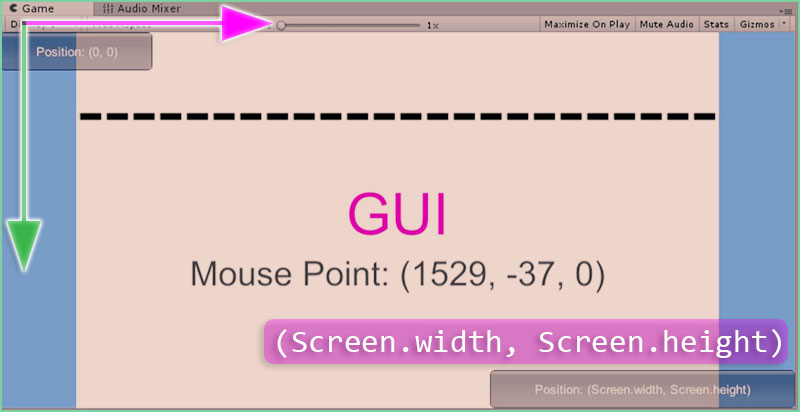
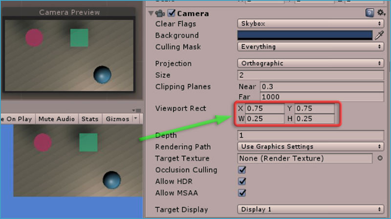
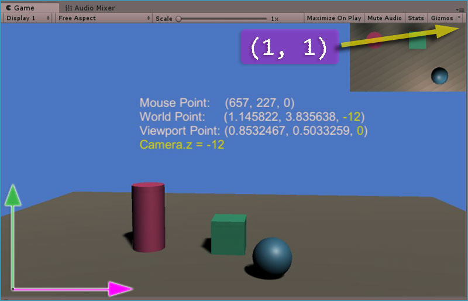

# unity的坐标系统

几经折磨，还是痛定思痛，决定好好的研究一哈游戏中的坐标系统，先从unity开始，可能很多，也可能不多，但是研究了你才会了解究竟是什么样子的。

[toc]

## 坐标系分类

我们的坐标系分为右手坐标系和左手坐标系，我是这么区分的，拿出右手，大拇指指向z轴正方向，手心法线方向和X正方向一致，握手指，手指指向y轴正方向为右手坐标系，相反，y轴负方向为左手坐标系。


除了 3D 世界中的坐标系，还有其他的几个坐标系也非常常用，比如我们经常要把世界三维坐标系转换成我们最终屏幕中的二维坐标系，或者把手机屏幕的二维坐标系转化成游戏世界中的三维坐标系等，各个坐标系各有特别，不能混用。

## 坐标体系

Unity3D 当中基本的坐标体系主要有下面这四种：

1. 世界坐标系(World Space)
2. 屏幕坐标系(Screen Space)
3. 视口坐标系(Viewport Space)
4. GUI界面坐标系(GUI System)


### GUI界面的坐标体系

可以在ui界面中绘制一个button来测试一哈：

```c#
private void OnGUI()
{
    if (GUI.Button(new Rect(0f, 0f, 160f, 40f), "Click Me"))
    {
        //button clicked and do something here...
    }
}
```

它的原点 `(0, 0)` 在最左上角，因为屏幕宽度是 `Screen.width` ，高度是 `Screen.height` ，所以 GUI 体系右下角的坐标为： `(Screen.width, Screen.height)` 。



### 视口viewport坐标体系

当我们使用多个相机，在同一场景中显示多个视口的时候，我们就需要用上视口坐标系了。

视口坐标系对于场景的显示非常重要，对于新手来说，我们经常使用一个相机就够了，但是当需要使用到多个视口的时候，就必须关注视口坐标系了，大家可以在相机Camera的属性中看到Viewport Rect就是视口坐标系的设置。



一个相机对应一个视口，视口预览（ Camera Preview ）展示了相机所看到的所有物体，很显然，它默认大小是 `(width = 1, height = 1)` ，位置也是从 0 到 1 ，这个位置就是我们所讨论的坐标系：左下角为 `(0, 0)` ，右上角是 `(1, 1)` 。，一般视口坐标系主要用在相机显示中，我们简单的进行 `Viewport Rect` 的设置就可以了。

 `Ctrl + Shift + F` ，可以快速设置相机视口到当前场景窗口的视口位置。下图是视口坐标系和鼠标在屏幕上的坐标系的转换结果：



## 屏幕Screen坐标系

因为我们最终发布的游戏都是要到各种不同的屏幕上的，所以屏幕坐标系显得尤为重要，比如经常处理的鼠标相关事件或者手机屏幕上的触摸反馈，这些原始数据都是和屏幕坐标系相关的。

屏幕坐标系处理起来很简单直接，`Input.mousePosition获取的就是鼠标在屏幕中的位置坐标`。屏幕坐标系中原点位于左下角，那么右上角就是(Screen.width, Screen.height), 还有一个z，一般是0。其实屏幕坐标系转换成世界坐标系后z的取值一般是取决于相机的，一般我们去将屏幕坐标系转换成世界坐标系都是使用camera来作为基准的，此时注意，如果Camera的位置，不为(0,0)的话，需要注意，转换过来的是相对于Camera的世界坐标，需要再次根据Camera的位置进行做换，坐标z等于Camera的z。

我们在控制相机的时候，因为屏幕显示的就是相机所看到的内容，而屏幕的宽高比直接影响相机的显示，也就是Aspect Ratio的值。

我们要重视相机的宽高比 `Camera.aspect` 的值，一般我们会保持相机宽高比不变，然后通过改变相机的视口尺寸 `Camera.orthographicSize` 来显示场景中需要显示的物体。

## 世界World的三维坐标

世界坐标是我们最常用的坐标系，`transform.position`都是返回物体的世界坐标值，即使你所使用的是子物体。例如将鼠标位置转换成世界坐标：

```c#
var position = Input.mousePosition;
var worldPosition = Camera.main.ScreenToWorldPoint(position);
```

在游戏中，我们经常处理子物体的相对transform值，我们把父节点当做世界坐标，子物体当做世界中的物体，使用这个函数就能转换了。

unity中的相对坐标计算函数例子：

```c#
//获取的是世界坐标
var childPosition = childObject.transform.position;
//转化为父物体下的相对坐标，相当于位于父物体世界中
var relativePosition = parentObject.transform.InverseTransformPoint(childPosition);
//转化为世界坐标，注意：这里不能传入 childPosition ，因为 childPosition 就是世界坐标
var worldPosition = parentObject.transform.InverseTransformPoint(relativePosition);
//所以，下面结果是相等的！
print(childPosition == worldPosition);

```

