# 创建游戏玩法

## 停用父游戏对象

停用父游戏对象时，也会停用其所有子游戏对象。

此停用会覆盖所有子游戏对象上的 `activeSelf` 设置，因此 Unity 会使父级下的整个层级视图将变为非活动状态。这不会更改子游戏对象上 `activeSelf` 属性的值，因此重新激活父对象时，子对象将恢复到其原始状态。这意味着无法通过读取 **activeSelf** 属性来确定子游戏对象当前是否在场景中处于活动状态。而应该使用 [activeInHierarchy](https://docs.unity.cn/cn/2018.4/ScriptReference/GameObject-activeInHierarchy.html) 属性，该属性将考虑父对象的覆盖效果。

如果希望更改游戏对象的子游戏对象的 **activeSelf** 设置，但不更改父对象的设置，可以使用如下代码：

```c#
void DeactivateChildren(GameObject g, bool a) 
{
    g.activeSelf = a;
    
    foreach (Transform child in g.transform) 
    {
        DeactivateChildren(child.gameObject, a);
    }
}
```

# 标签

**标签 (Tag)** 是可分配给一个或多个__游戏对象__的参考词。例如，可为玩家控制的角色定义“Player”标签，并为非玩家控制的角色定义“Enemy”标签。还可以使用“Collectable”标签定义玩家可在场景中收集的物品。

标签有助于识别游戏对象以便于编写脚本。通过使用标签，不需要使用拖放方式手动将游戏对象添加到脚本的公开属性，因此可以节省在多个游戏对象中使用相同脚本代码的时间。

标签对[碰撞体](https://docs.unity.cn/cn/2018.4/Manual/CollidersOverview.html)控制脚本中的触发器很有用；例如，需要通过标签确定玩家是否与敌人、道具或可收集物进行交互。

通过设置 [GameObject.FindWithTag()](https://docs.unity.cn/cn/2018.4/ScriptReference/GameObject.FindWithTag.html) 函数，可以查找包含所需标签的游戏对象。以下示例便使用了 GameObject.FindWithTag()。该函数在具有“Respawn”标签的游戏对象位置实例化 `respawnPrefab`：

```c#
using UnityEngine;
using System.Collections;

public class Example : MonoBehaviour {
    public GameObject respawnPrefab;
    public GameObject respawn;
    void Start() {
        if (respawn == null)
            respawn = GameObject.FindWithTag("Respawn");
        
        Instantiate(respawnPrefab, respawn.transform.position, respawn.transform.rotation) as GameObject;
    }
}
```

## 创建新标签

在 **Inspector** 中，游戏对象的名称下面会显示 **Tag** 和 **Layer** 下拉菜单。


要创建新标签，请选择 **Add Tag…**。随即在 Inspector 中打开[标签和层管理器 (Tag and Layer Manager)](https://docs.unity.cn/cn/2018.4/Manual/class-TagManager.html)。请注意，一旦命名了标签，以后就无法重命名。

层类似于标签，但用于定义 Unity 应该如何在场景中渲染游戏对象。请参阅有关[层](https://docs.unity.cn/cn/2018.4/Manual/Layers.html)的文档以了解更多信息。

## 应用标签

在 **Inspector** 中，游戏对象的名称下面会显示 **Tag** 和 **Layer** 下拉菜单。要将现有标签应用于游戏对象，请打开 **Tags** 下拉选单，然后选择要应用的标签。游戏对象现在便与此标签关联。

## 提示

- 只能为游戏对象分配一个标签。
- Unity 包含一些未出现在标签管理器中的内置标签：
  - **Untagged**
  - **Respawn**
  - **Finish**
  - **EditorOnly**
  - **MainCamera**
  - **Player**
  - **GameController**
- 可以使用任何喜欢的词作为标签。甚至可以使用短语，但这种情况下可能需要增加 Inspector 的宽度才能看到标签的全名。

# 静态游戏对象

许多优化需要知道对象是否可在游戏过程中移动。有关**静态**（即非移动）对象的信息通常可在 Editor 中预先计算，因为此类对象不会因对象位置的变化而无效。例如，可以通过将多个静态对象组合成称为_批次_的单个大对象来优化渲染。

游戏对象的 Inspector 在右上角有一个 *Static* 复选框和菜单，用于向 Unity 中的各种不同系统告知该对象不会移动。对于每个系统，可以单独将对象标记为静态，因此可以选择在不能带来优势的情况下不计算对象的静态优化。

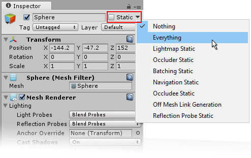在 Inspector 中查看游戏对象时显示的 Static 复选框和下拉菜单

## 静态设置

*Everything* 和 *Nothing* 针对使用该游戏对象的所有系统同时启用或禁用静态状态。这些系统包括：

- [光照贴图 (Lightmapping)](https://docs.unity.cn/cn/2018.4/Manual/GIIntro.html)：场景的高级光照；
- [遮挡物和被遮挡物 (Occluder and Occludee)](https://docs.unity.cn/cn/2018.4/Manual/OcclusionCulling.html)：基于特定摄像机位置的对象可见性进行渲染优化；
- [批处理 (Batching)](https://docs.unity.cn/cn/2018.4/Manual/DrawCallBatching.html)：通过将多个对象组合成一个更大的对象来进行渲染优化；
- [导航 (Navigation)](https://docs.unity.cn/cn/2018.4/Manual/Navigation.html)：使角色能够在场景中协商障碍物的系统；
- [网格外链接 (Off-mesh Links)](https://docs.unity.cn/cn/2018.4/Manual/class-OffMeshLink.html)：导航系统在场景的不连续区域之间建立的连接。
- [反射探针 (Reflection Probe)](https://docs.unity.cn/cn/2018.4/Manual/class-ReflectionProbe.html)：捕捉周围各个方向的球形视图。

# 保存工作

## 保存对当前场景的更改（“Save Scene”）

场景更改包括对层级视图中任何对象的修改。例如，添加、移动或删除游戏对象，还包括在 Inspector 中更改层级视图游戏对象的参数。

要保存对场景的更改，请从 File 菜单中选择 Save Scene，或按 **Ctrl/Cmd + S**。 这样可以保存当前对场景的更改*并*执行“**Save Project**”（见下文）。

**这意味着执行“Save Scene”时，\*所有内容\*都会保存。**

## 保存项目范围的变更（“Save Project”）

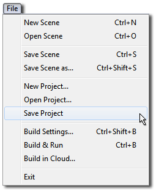

可在 Unity 中进行的某些更改不是特定于场景的，而是*项目范围的*。通过从 File 菜单中选择“Save Project”，可以独立于场景更改来保存这些设置。

使用“Save Project”不会保存对场景的更改，只保存项目范围的更改。例如，如果使用临时场景对预制件进行了一些更改，则可能希望保存项目，而不保存对场景的更改。

使用“Save Project”时保存的项目范围更改包括：

### 所有“Project Settings”：

使用“Save Project”时，将保存每个“Project Settings”菜单项的所有设置，例如自定义输入轴、用户定义的标签或图层以及物理重力强度。

Project Settings 菜单

保存项目时，对这些设置的更改将保存在 Library 文件夹中：

- **Input**：保存为 ´InputManager.asset´
- **Tags** And Layers：保存为 ´TagManager.asset´
- **Audio**：保存为 ´AudioManager.asset´
- **Time**：保存为 ´TimeManager.asset´
- **Player**：保存为 ´ProjectSettings.asset´
- **Physics**：保存为 ´DynamicsManager.asset´
- **Physics 2D**：保存为 ´Physics2DSettings.asset´
- **Quality**：保存为 ´QualitySettings.asset´
- **Graphics**：保存为 ´GraphicsSettings.asset´
- **Network**：保存为 ´NetworkManager.asset´
- **Editor**：保存为 ´EditorUserSettings.asset´

### “Build Settings”

Build Settings 也作为 ´EditorBuildSettings.asset´ 保存在 Library 文件夹中。

### Project 窗口中对资源的更改

与项目范围设置一起保存的还有对*没有“Apply”按钮的*资源的更改，例如对以下任何一项的更改：

- 材质参数
- 预制件
- 动画控制器（状态机）
- 化身遮罩
- 没有“Apply”按钮的任何其他资源更改

## 立即写入磁盘的更改（无需保存）：

有些类型的更改会立即写入磁盘，根本不需要执行“Save”操作。这些更改包括：

### 要求用户按“Apply”按钮的任何导入设置更改

大多数资源类型的导入设置都要求按下“Apply”按钮才能使更改生效。此操作会导致根据新设置重新导入资源。点击 Apply 按钮后会立即保存这些更改。例如：

- 更改图像资源的纹理类型
- 更改 3D 模型资源的缩放因子
- 更改音频资源的压缩设置
- 具有“Apply”按钮的任何其他导入设置更改

### 立即保存的其他更改：

一些其他类型的数据会立即或自动保存到磁盘，无需执行“Save”操作：

- 创建新资源，例如：新材质或预制件（但不包括对这些资源进行的后续更改）
- 烘焙光照数据（烘焙完成时保存）
- 烘焙导航数据（烘焙完成时保存）
- 烘焙遮挡剔除数据（烘焙完成时保存）
- 脚本执行顺序更改（按下“Apply”后，此数据保存在每个脚本的 .meta 文件中）

# 预制件

Unity 的**预制件**系统允许创建、配置和存储游戏对象及其所有组件、属性值和子游戏对象作为可重用资源。预制件资源充当模板，在此模板的基础之上可以在场景中创建新的预制件实例。

如果要在场景中的多个位置或项目中的多个场景之间重用以特定方式配置的游戏对象，比如非玩家角色 (NPC)、道具或景物，则应将此游戏对象转换为预制件。这种方式比简单复制和粘贴游戏对象更好，因为预制件系统可以自动保持所有副本同步。

对预制件资源所做的任何编辑都会自动反映在该预制件的实例中，因此可以轻松地对整个项目进行广泛的更改，而无需对资源的每个副本重复进行相同的编辑。

可将[预制件嵌套](https://docs.unity.cn/cn/2018.4/Manual/NestedPrefabs.html)在另一个预制件中，从而创建在多个级别易于编辑的复杂对象层级视图。

但是，这并不意味着所有预制件实例都必须完全相同。如果希望预制件的某些实例与其他实例不同，则可以[覆盖](https://docs.unity.cn/cn/2018.4/Manual/PrefabInstanceOverrides.html)各个预制件实例的设置。还可以创建预制件的[变体](https://docs.unity.cn/cn/2018.4/Manual/PrefabVariants.html)，从而将一系列覆盖组合在一起成为有意义的预制件变化。

如果游戏对象在一开始不存在于场景中，而希望[在运行时实例化游戏对象](https://docs.unity.cn/cn/2018.4/Manual/InstantiatingPrefabs.html)（例如，使能量块、特效、飞弹或 NPC 在游戏过程中的正确时间点出现），那么也应该使用预制件。

使用预制件的一些常见示例包括：

- 环境资源 - 例如，在一个关卡附近多次使用的某种树（如上面的截屏所示）。
- 非玩家角色 (NPC) - 例如，某种类型的机器人可能会在游戏的多个关卡之间多次出现。它们的移动速度或声音可能不同（使用*覆盖*）。
- 飞弹 - 例如，海盗的大炮可能会在每次射击时实例化炮弹预制件。
- 玩家主角 - 玩家预制件可能被放置在游戏每个关卡（不同场景）的起点。

# 在预制件模式下编辑预制件

要编辑预制件资源，请在预制件模式下将其打开。预制件模式允许您单独查看和编辑预制件资源的内容（独立于场景中的所有其他对象）。在预制件模式下所做的更改会影响该预制件的所有实例。


## 进入和退出预制件模式

可通过多种方法在预制件模式下开始编辑预制件，包括：

- 在 Project 窗口中双击预制件
- 使用 Hierarchy 窗口中预制件旁边的箭头按钮
- 单击预制件资源的 Inspector 窗口中的“Open”按钮

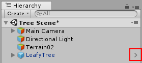Hierarchy 窗口中预制件旁边的箭头按钮

进入预制件模式会使 Scene 视图和 Hierarchy 窗口仅显示该预制件的内容。在此处，预制件的根是常规游戏对象：没有蓝色的预制件实例图标。

## Auto Save

预制件模式在 Scene 视图的右上角有一个 **Auto Save** 设置。启用此设置后，对预制件所做的任何更改都会自动保存到预制件资源。默认情况下会启用 *Auto Save*。

## 编辑环境

可为预制件模式指定一个场景作为__编辑环境__，这样便可以根据选择的背景（而不是空场景）编辑预制件。这对于了解预制件与游戏中的典型景物的对比情况非常有用。

在预制件模式下，指定为编辑环境的场景中的对象是不可选择的，也不会在 Hierarchy 窗口中显示。这是为了让您专注于编辑预制件而不会意外地选择其他不相关的对象，并且没有混乱的 Hierarchy 窗口。

要将场景设置为编辑环境，请打开 [Editor](https://docs.unity.cn/cn/2018.4/Manual/class-EditorManager.html) 窗口（顶部菜单：__Edit > Project Settings__，然后选择 **Editor** 类别），然后选择 **Prefab Editing Environment** 部分。对于“非 UI”预制件，请使用 **Regular Environment** 设置，而对于 UI 预制件，请使用 **UI Environment** 设置。UI 预制件是在根上具有[矩形变换 (Rect Transform)](https://docs.unity.cn/cn/2018.4/Manual/class-RectTransform.html) 组件而不是常规变换组件的预制件。“非 UI”预制件是具有常规变换组件的预制件。

Editor Project Settings 中的预制件编辑环境设置

# 实例覆盖

__实例覆盖__允许在预制件实例之间创建变化，同时仍将这些实例关联到同一预制件资源。

修改预制件资源时，更改将反映在其所有实例中。但是，也可以直接对单个实例进行修改。这样做会在该特定实例上创建__实例覆盖__。

例如，假设有一个预制件资源“Robot”，放置在游戏中的多个关卡中。但是，“Robot”的每个实例都有不同的速度值，并分配了不同的音频剪辑。

有四种不同的__实例覆盖__类型：

- 覆盖属性的值
- 添加组件
- 删除组件
- 添加子游戏对象

预制件实例存在一些限制：无法更改属于预制件的游戏对象的父级，且无法删除属于预制件的游戏对象。但是，可以停用游戏对象，这种操作很适合取代游戏对象删除操作（这算作属性覆盖）。

在 Inspector 窗口中，实例覆盖的名称标签以**粗体**显示，左边距使用蓝线显示。向预制件实例添加新组件时，边距位置的蓝线将涵盖整个组件。

Inspector 窗口显示的预制件实例覆盖了“Dynamic Occluded”属性，并添加了 Rigidbody 组件作为覆盖。

添加和删除的组件在 Inspector 中的相应图标上也有加减符号标示，而添加的游戏对象在 Hierarchy 窗口中的相应图标上有一个加号标示。

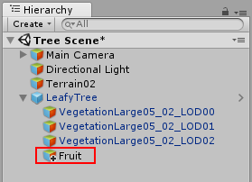Hierarchy 窗口显示的预制件实例添加了一个名为“Fruit”的子游戏对象作为覆盖。

## 覆盖优先

预制件实例上覆盖的属性值始终优先于预制件资源的值。这意味着，如果更改预制件资源的属性，对覆盖该属性的实例没有任何影响。

如果对预制件资源进行更改，但未按预期更新所有实例，则应检查实例上是否覆盖了该属性。最好仅在确实必要时才使用实例覆盖，因为如果整个项目中有大量实例覆盖，则很难判断对预制件资源的更改是否对所有实例都有影响。


## 对齐根据特定预制件实例而定

预制件实例的__对齐__是一种特殊情况，与其他属性的处理方式不同。**对齐__值绝不会从预制件资源传递到预制件实例。这意味着对齐值始终可与预制件资源的对齐不同，而不是作为显式实例覆盖。具体而言，对齐表示预制件实例的根变换的** Position__ 和 **Rotation** 属性，对于矩形变换，还包括 **Width**、**Height**、**Margins**、**Anchors** 和 **Pivot** 属性。

这是因为要求预制件的多个实例采用相同的位置和旋转是极其罕见的情况。更常见的情况是希望预制件实例具有不同的位置和旋转，因此 Unity 不会将它们视为预制件覆盖。

# 通过预制件的实例编辑预制件

与普通游戏对象相比，预制件实例的根的 Inspector 有三个额外的控件：__Open**、**Select__ 和 **Overrides**。

预制件实例的 Inspector 窗口中的三个预制件控件

**Open** 按钮在预制件模式下打开实例所在的预制件资源，然后可以编辑预制件资源，从而更改其所有实例。**Select** 按钮在 Project 窗口中选择用于生成此实例的预制件资源。**Overrides** 按钮打开 Overrides 下拉窗口。

## Overrides 下拉选单

**Overrides** 下拉窗口显示预制件实例上的所有覆盖。还允许将实例的覆盖应用于预制件资源，或将实例上的覆盖恢复为预制件资源上的值。只有根预制件实例会显示 **Overrides** 下拉选单按钮，其他预制件内的预制件不会显示此按钮。

**Overrides** 下拉窗口可以应用或恢复单个预制件覆盖，或一次性应用或恢复所有预制件覆盖。

- **应用**覆盖会修改预制件资源。此操作会将覆盖（当前仅在您的预制件实例上）置于资源之上。这意味着预制件资源现在具有该修改，而预制件实例不再具有该修改作为覆盖。
- **还原**覆盖会修改预制件实例。此操作实质上会丢弃您的覆盖并将其恢复为预制件资源的状态。

下拉窗口以修改、添加和删除的组件以及添加的游戏对象（包括其他预制件）的形式显示实例更改列表。

查看预制件实例时，Inspector 窗口中的 Overrides 下拉选单

要检查条目，请单击该条目。此时将出现一个浮动视图，其中显示更改并允许您还原或应用该更改。

Overrides 下拉窗口中选中了添加的组件覆盖

对于修改了值的组件，此视图会显示预制件资源上组件值与预制件实例上已修改组件的并排比较。这样就可以将原始预制件资源值与当前覆盖进行比较，从而可以决定是要还原还是应用这些值。

在下面的示例中，预制件资源和预制件实例上都存在“Fruit”子游戏对象，但实例上的缩放已增大。此缩放增大结果就是一个实例覆盖，两者的视图可以在 **Overrides** 下拉窗口中进行并排比较。

具有比较视图的 Overrides 下拉选单，其中显示了预制件实例子游戏对象的变换 (Transform) 组件中的修改值

**Overrides** 下拉窗口还有 **Revert All** 和 **Apply All** 按钮，用于一次性还原或应用所有更改。如果在其他预制件中有预制件，则 **Apply All** 按钮始终适用于最外面的预制件，即在根游戏对象上具有 **Overrides** 下拉选单按钮的预制件。


## 上下文菜单

除了 Overrides 下拉窗口，还可以使用 Inspector 中的上下文菜单来**还原**和**应用**各个覆盖。

被覆盖的属性以粗体显示。可以通过上下文菜单还原或应用这些属性：

单个属性的上下文菜单

可通过组件标题的齿轮下拉选单按钮或上下文菜单还原或应用已修改的组件：

修改的组件的上下文菜单

添加的组件在图标上有一个叠加的加号标示。可通过组件标题的齿轮下拉选单按钮或上下文菜单还原或应用这些组件：

添加的组件的上下文菜单

删除的组件在图标上有一个叠加的减号标示。可通过组件标题的齿轮下拉选单按钮或上下文菜单还原或应用删除操作。还原删除操作会使组件恢复，而应用删除操作还会将组件从预制件资源中删除：

删除的组件的上下文菜单

作为子项添加到预制件实例的游戏对象（包括其他预制件）在 Hierarchy 中的图标上有一个叠加的加号标示。可通过 Hierarchy 窗口中的对象的上下文菜单还原或应用这些游戏对象：

添加的游戏对象子项的上下文菜单

# 嵌套预制件

可以在其他预制件内包含预制件实例。这称为**嵌套**预制件。嵌套预制件保留与自己的预制件资源的链接，同时也构成另一个预制件资源的一部分。


## 在预制件模式下添加嵌套预制件

在预制件模式下，可以像在场景中一样添加和使用预制件实例。可以将预制件资源从 Project 窗口拖动到 Hierarchy 窗口或 Scene 视图，由此从已打开的预制件中的该资源创建预制件实例。

**注意**：在预制件模式下打开的预制件的根游戏对象不会显示蓝色立方体预制件图标，但是其他预制件的所有实例都会显示该图标。还可以为这些预制件实例添加覆盖，就像在场景中使用预制件实例一样。

左：在预制件模式下，"Oil Can"预制件包含（嵌套)在“Robot”预制件中。右：场景中的“Robot”预制件实例包含“Oil Can”。


## 通过预制件的实例嵌套预制件

还可以将预制件实例作为子项添加到场景中的另一个预制件实例，而无需进入预制件模式，就像可以添加任何其他游戏对象一样。这样添加的预制件实例在 Hierarchy 窗口中的图标上会叠加一个加号标示，表示这是对外层预制件的特定实例的覆盖。

添加的预制件可以按照与其他覆盖相同的方式（通过 Overrides 下拉窗口，或通过 Hierarchy 中游戏对象的上下文菜单）还原或应用于外层预制件，如[通过预制件的实例编辑预制件](https://docs.unity.cn/cn/2018.4/Manual/EditingPrefabViaInstance.html)中所述。Overrides 下拉选单按钮仅位于外层预制件上。应用后的预制件不再显示加号标示，因为它不再是覆盖，而是已经嵌套在外层预制件资源本身中。但是，该预制件却会保留蓝色立方体图标，因为它本身是一个预制件实例，并会保留与自己的预制件资源的连接。

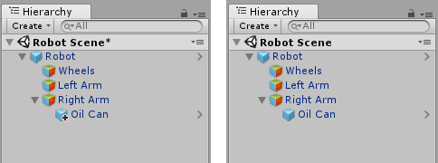左：“Oil Can”预制件作为覆盖添加到“Robot”预制件实例。右：“Oil Can”预制件已应用于“Robot”预制件，现在是“Robot”预制件资源的嵌套预制件。

# 预制件变体

希望预制件有一组预定义的变化时，预制件变体非常有用。

例如，您可能希望在游戏中使用几种不同类型的机器人，这些机器人全都基于同一个基本机器人预制件。但是，您可能想要一些机器人携带物品，一些机器人以不同的速度移动，或者一些机器人发出额外的声音效果。

为此，您可以设置初始机器人预制件来执行您希望所有机器人共同执行的所有基本操作，然后可以创建多个预制件变体来实现以下目的：

- 通过在脚本上使用属性覆盖来更改速度，使机器人更快移动。
- 通过将额外的游戏对象附加到手臂，使机器人携带物品。
- 通过添加一个播放生锈吱吱声的 AudioSource 组件，体现机器人具有生锈的关节。

预制件变体继承另一个称为基础预制件的预制件的属性。对预制件变体进行的覆盖优先于基础预制件的值。预制件变体可以使用任何其他预制件作为其基础预制件（包括模型预制件或其他预制件变体）。

## 创建预制件变体

可通过多种方法基于另一个预制件创建预制件变体。

可在 Project 视图中的预制件上**右键单击**，然后选择 **Create > Prefab Variant**。这样将创建所选预制件的变体，该变体最初没有任何覆盖。可以在预制件模式下打开预制件变体，然后开始为其添加覆盖。

还可以将预制件实例从 Hierarchy 窗口中**拖动**到 Project 窗口中。执行此操作时会出现一个对话框，询问是要创建新的原始预制件还是预制件变体。如果选择预制件变体，则会根据拖动的预制件实例创建新的预制件变体。先前位于该实例上的所有覆盖现在都位于新的预制件变体中。可以在预制件模式下打开该变体以添加更多覆盖或者是编辑或删除覆盖。

预制件变体将显示带有箭头的蓝色预制件图标。

Hierarchy 窗口中显示的一个基本机器人预制件，以及该预制件一个名为“Robot With Oil Can”的变体。

## 编辑预制件变体

在预制件模式下打开预制件变体时，根将显示为带有蓝色预制件图标的预制件实例。此预制件实例表示产生预制件变体的基础预制件，而不表示预制件变体本身。对预制件变体所做的任何编辑都将成为存在于变体中的该基础预制件的覆盖。

预制件模式下的预制件变体“Robot With Oil Can”。添加了“Oil Can”预制件作为基础预制件的覆盖

在上面的截屏中，即使选择 **Robot With Oil Can** 根游戏对象并单击 Inspector 中的 **Select** 按钮，也将选择基础预制件 **Robot** 而不是变体 **Robot With Oil Can__，因为预制件实例是基础预制件** Robot__ 的一个实例，而 **Select** 按钮始终选择实例来自的预制件资源。

与任何预制件实例一样，可以在预制件变体中使用预制件覆盖，例如修改的属性值、添加的组件、删除的组件以及添加的子游戏对象。也存在相同的限制：无法更改预制件变体中来自基础预制件的游戏对象的父级。也无法从预制件变体中删除存在于基础预制件中的游戏对象。但是，可以停用游戏对象（作为属性覆盖）来达到与删除游戏对象相同的效果。

**注意：**在预制件模式下编辑预制件变体时，应了解应用这些覆盖（通过 Overrides 下拉窗口或上下文菜单）会使变体的变化应用于基础预制件资源。这通常**不是**您想要的效果。预制件变体的要点是提供一种方便的方法来存储有意义且可重复使用的覆盖集合，这就是为什么这些覆盖通常应该保留为覆盖而不要应用于基本预制件资源的原因。为了说明这一点，如果将额外的 **Oil Can** 游戏对象应用于基础预制件资源（“基本机器人”），那么预制件资源也将具有该 **Oil Can**。**Robot With Oil Can** 变体的关键在于，只有此变体携带油罐，所以添加的 **Oil Can** 游戏对象应该留在预制件变体内作为覆盖。

打开 Overrides 下拉窗口时，始终可以在其标题中看到覆盖所针对的对象，以及覆盖存在于哪个背景中。对于预制件变体，标题将显示覆盖是针对基础预制件并存在于预制件变体中。为了使这一点更加清晰，__Apply All__ 按钮也会显示 **Apply All to Base**。

在预制件模式下编辑预制件变体时，预制件变体的 Overrides 下拉窗口

# 覆盖多个级别

在其他预制件中使用预制件或使用预制件变体时，覆盖可存在于多个级别，且相同的覆盖可应用于多个不同的预制件。


## 选择应用目标

当一个预制件实例的内部有嵌套的预制件或者是预制件变体时，可以选择应该将覆盖应用于哪个预制件。

假设一个预制件“Vase”嵌套在预制件“Table”中的，而且场景包含“Table”预制件的一个实例。

“Table”预制件中嵌套了“Vase”预制件。

在此实例上，如果“Vase”上的属性被覆盖，则可以将此覆盖应用于多个预制件：“Vase”或“Table”。

Overrides 下拉窗口中的 **Apply All** 按钮仅允许将覆盖应用于外层预制件：在本例中为“Table”。但是，通过上下文菜单或通过 Overrides 下拉窗口中各个组件的比较视图应用覆盖时，可以选择应用目标。

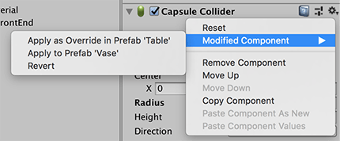

在此示例中，如果选择 **Apply to Prefab ‘Vase’**，该值将应用于“Vase”预制件资源，并用于“Vase”预制件的所有实例。

另外，如果在选择 **Apply as Override in Prefab ‘Table’**，该值将成为“Table”预制件内的“Vase”实例上的覆盖。该属性不再标记为场景内实例上的覆盖，但如果在预制件模式下打开“Table”预制件，则“Vase”预制件实例上的属性将在此处标记为覆盖。

覆盖为“Table”预制件资源中的覆盖时，“Vase”预制件资源本身完全不受影响。这意味着“Table”预制件的所有实例现在都在其“Vase”预制件实例上具有新值，但不属于“Table”预制件的其他“Vase”预制件实例不受影响。

如果“Vase”预制件本身的属性稍后改变，此更改将影响“Vase”预制件的所有实例，但该属性被覆盖的实例除外。由于属性在“Table”预制件内的“Vase”实例上被覆盖，因此更改不会影响属于“Table”实例的任何“Vase”实例。


## 应用于内层预制件也可能会影响外层预制件

将一个或多个属性应用于内层预制件资源有时也可能修改外层预制件资源，因为这些属性会在外层预制件中恢复其覆盖。

在我们的示例中，如果选择 __Apply to Prefab ‘Vase’__，且“Table”预制件具有该值的覆盖，则“Table”预制件中的此覆盖将同时恢复，使实例上的属性保留刚应用的值。如果不是这种情况，则实例上的值将在应用后立即更改。

# 解压缩预制件实例

要将预制件实例的内容恢复到常规游戏对象，请解压缩预制件实例。此操作正是创建（打包）预制件的相反操作，不同之处在于此操作不会破坏预制件资源，而是仅影响预制件实例。

可通过在 Hierarchy 窗口中右键单击预制件实例并选择 **Unpack Prefab** 来解压缩预制件实例。场景中生成的游戏对象不再与其以前的预制件资源有任何关联。预制件资源本身不受此操作的影响，并且您的项目中可能还有它的其他实例。

如果在解压缩之前在预制件实例上有任何覆盖，这些覆盖将被“烘焙”到生成的游戏对象上。也就是说，值将保持不变，但不再具有覆盖状态，因为没有需要覆盖的预制件。

如果解压缩内含嵌套预制件的预制件，则嵌套的预制件仍然是预制件实例，并且仍然关联到它们各自的预制件资源。同样，如果解压缩预制件变体，根部将会有一个新的预制件实例，即基础预制件的实例。

通常，解压缩预制件实例后生成的对象与您进入该预制件的预制件模式时看到的对象相同。这是因为预制件模式会显示预制件内部的内容，而解压缩预制件实例会解压缩预制件的内容。

如果希望将预制件实例替换为普通游戏对象并完全消除与所有预制件资源的所有关联性，则可以在 Hierarchy 窗口中右键单击该预制件实例，然后选择 **Unpack Prefab Completely**。此做法相当于解压缩预制件，并继续解压缩原先作为嵌套预制件或基础预制件出现的所有预制件实例。

可以解压缩场景中存在的预制件实例，或者存在于其他预制件中的预制件实例。

# 在运行时实例化预制件

到此为止，应该从基础层面理解了__预制件__的概念。预制件是可在整个游戏中复用的预定义__游戏对象__和__组件__的集合。如果不知道预制件是什么，建议阅读[预制件](https://docs.unity.cn/cn/2018.4/Manual/Prefabs.html)页面以查看更基本的介绍。

想要在运行时实例化复杂的游戏对象时，预制件非常方便。实例化预制件的替代方法是使用代码从头开始创建游戏对象。相对于替代方法，实例化预制件具有诸多优势：

- 可以从一行代码实例化具有完整功能的预制件。从代码创建等效的游戏对象平均需要五行代码，但可能需要更多代码行。
- 可以在场景和 Inspector 中快速轻松地设置、测试和修改预制件。
- 可以更改实例化的预制件，而无需更改将预制件实例化的代码。无需更改代码就能将简单火箭改为超级火箭。

## 常见情况

为了说明预制件的优势，让我们考虑一下适合使用预制件的一些基本情况：

1. 通过在不同位置多次创建单块“砖”预制件来筑墙。
2. 火箭发射器在发射时实例化飞行的火箭预制件。预制件包含网格、**刚体**、__碰撞体__以及自带轨迹__粒子系统__的子游戏对象。
3.  一个机器人爆炸成大量碎片。完整正常的机器人被摧毁，然后替换为残骸机器人预制件。此预制件由分成许多部件的机器人组成，所有部件都有自己的刚体和粒子系统。此方法允许将机器人炸成许多碎片（只需一行代码），用一个预制件替换一个对象。

### 筑墙

此示例旨在说明使用预制件相对于从代码创建对象的优势。

首先，利用代码来修建砖墙：

```
public class Instantiation : MonoBehaviour 
{
    void Start()
    {
        for (int y = 0; y < 5; y++) 
        {
            for (int x = 0; x < 5; x++) 
            {
                GameObject cube = GameObject.CreatePrimitive(PrimitiveType.Cube);
                cube.AddComponent<Rigidbody>();
                cube.transform.position = new Vector3(x, y, 0);
            }
        }
    }
}
```

- 要使用以上脚本，我们只需保存脚本并将其拖到空游戏对象上。
- 通过 **GameObject > Create Empty** 来创建空游戏对象。

如果执行该代码，则会在进入播放模式时看到已创建整个砖墙。有两行与每块砖的功能相关：`CreatePrimitive` 行和 `AddComponent` 行。现在还不算太差，但我们的每块砖都没有纹理。想要针对砖块执行的每个额外操作（如更改纹理、摩擦或刚体__质量__）都是额外的行。

如果事先创建预制件并执行所有设置，则使用一行代码来执行每块砖的创建和设置即可。这样一来，在决定要进行更改时，可以减轻维护和更改大量代码的工作量。对于预制件，只需进行更改和播放即可。无需更改代码。

如果将预制件用于每块砖，下面就是筑墙所需的代码。

```
//Instantiate 接受任何组件类型，因为它会实例化游戏对象 

public Transform brick;

void Start() 
{
    for (int y = 0; y < 5; y++)
    {
        for (int x = 0; x < 5; x++) 
        {
            Instantiate(brick, new Vector3(x, y, 0), Quaternion.identity);
        }
    }
}
```

此代码不仅很整洁，而且可复用性很强。没有任何信息表示我们要实例化立方体或者它必须包含刚体。所有这些都在预制件中定义，并可以在 Editor 中快速创建。

现在，我们只需创建预制件，为此我们将在 Editor 中执行此操作。以下是创建方法：

1. 选择 **GameObject > 3D Object > Cube** 
2. 选择 **Component > Physics > Rigidbody** 1.选择 **Assets > Create > Prefab** 
3. 在 **Project 视图__中，将新预制件的名称更改为“Brick” 1.将__层级视图__中创建的立方体拖入** Project 视图__中的“Brick”预制件上 __
4. __创建预制件后，可以放心地从层级视图中删除立方体（Windows 上使用 **Delete__，Mac 上使用** Command-Backspace__）

我们已创建 Brick 预制件，所以现在必须将此预制件附加到脚本中的 **brick** 变量。选择包含脚本的空游戏对象时，Brick 变量将显示在 Inspector 中。

现在，将“Brick”预制件从 Project 视图拖到 Inspector 中的 **brick** 变量上。按 Play，然后就会看到用预制件建造的墙。

这是一种可以在 Unity 中反复使用的工作流程模式。一开始，您可能想知道为什么此方法的效果会好得多，因为从代码创建立方体的脚本只增加了 2 行而已。

但是由于现在使用的是预制件，所以可以在几秒内调整预制件。想要改变所有这些实例的质量？仅在预制件中调整一次刚体即可。要将其他__材质__用于所有实例？仅将材质拖到预制件上一次即可。要更改摩擦力？将其他__物理材质__用于预制件的碰撞体。要将粒子系统添加到所有的这些盒体？仅将子项添加到预制件一次即可。

# 输入

Unity 支持键盘、游戏杆和游戏手柄输入。

可以在 [Input](https://docs.unity.cn/cn/2018.4/Manual/class-InputManager.html) 窗口中创建虚拟轴和按钮，而终端用户可以在友好的屏幕配置对话框中配置键盘输入。

可以设置游戏杆、游戏手柄、键盘和鼠标，然后通过一个简单的脚本接口访问它们。通常会使用轴和按钮来模仿游戏主机控制器。也可以访问键盘上的按键。

## 虚拟轴

从脚本中，可以通过名称访问所有虚拟轴。

每个项目在创建时都具有以下默认输入轴：

- **Horizontal** 和 **Vertical** 映射到 w、a、s、d 键和箭头键。
- **Fire1**、**Fire2** 和 **Fire3** 分别映射到 Control 键、Option (Alt) 键和 Command 键。
- **Mouse X** 和 **Mouse Y** 映射到鼠标移动的增量。
- **Window Shake X** 和 **Window Shake Y** 映射到窗口的移动。

### 添加新的输入轴

如果要添加新的虚拟轴，请选择 **Edit** > **Project Settings** 菜单，然后选择 **Input** 类别。还可以在此处更改每个轴的设置。

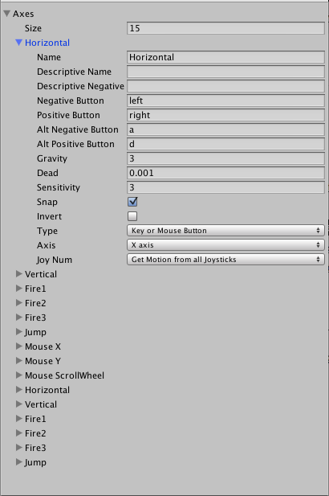

可以将每个轴映射到游戏杆上的两个按钮、鼠标或键盘键。

| ***属性：\***                 | ***功能：\***                                                |
| :---------------------------- | :----------------------------------------------------------- |
| **Name**                      | 用于从脚本中检查此轴的字符串名称。                           |
| **Descriptive Name**          | 独立构建的 **Configuration** 对话框的 Input 选项卡中显示的正值名称。 |
| **Descriptive Negative Name** | 独立构建的 **Configuration** 对话框的 Input 选项卡中显示的负值名称。 |
| **Negative Button**           | 用于向负方向推动轴的按钮。                                   |
| **Positive Button**           | 用于向正方向推动轴的按钮。                                   |
| **Alt Negative Button**       | 用于向负方向推动轴的替代按钮。                               |
| **Alt Positive Button**       | 用于向正方向推动轴的替代按钮。                               |
| **Gravity**                   | 未按下按钮的情况下，轴下降到中性点的速度（以单位/秒表示）。  |
| **Dead**                      | 模拟盲区的大小。此范围内的所有模拟设备值都会映射到中性点。   |
| **Sensitivity**               | 轴向目标值移动的速度（以单位/秒表示）。仅用于数字设备。      |
| **Snap**                      | 如果启用，按下相反方向的按钮时，轴值将重置为零。             |
| **Invert**                    | 如果启用，则**负按钮 (Negative Buttons)** 将提供正值，反之亦然。 |
| **Type**                      | 将控制此轴的输入类型。                                       |
| **轴**                        | 将控制此轴的已连接设备的轴。                                 |
| **Joy Num**                   | 将控制此轴的已连接游戏杆。                                   |

### 从脚本中使用输入轴

可以从脚本中查询当前状态，如下所示：

```
 value = Input.GetAxis ("Horizontal");
```

轴的值介于 –1 到 1 之间。中性位置为 0。 这是游戏杆输入和键盘输入的情况。

但是，Mouse Delta 和 Window Shake Delta 是鼠标或窗口在最后一帧中移动的程度。这意味着，当用户快速移动鼠标时，它可以大于 1 或小于 –1。

可以使用相同的名称创建多个轴。获取输入轴时，将返回绝对值最大的轴。这样就可以将多个输入设备分配给一个轴名称。例如，为键盘输入创建一个轴，用相同名称为游戏杆输入创建一个轴。如果用户正在使用游戏杆，则输入将来自游戏杆，否则输入将来自键盘。这样一来，不必在编写脚本时考虑输入的来源。

## 按钮名称

要将键映射到轴，必须在 **Inspector** 中的 **Positive Button** 或 **Negative Button** 属性中输入键的名称。

## Keys

键的名称遵循以下约定：

- 普通键：“a”、“b”、“c”…
- 数字键：“1”、“2”、“3”…
- 箭头键：“up”、“down”、“left”和“right”
- 键盘键：“[1]”、“[2]”、“[3]”、“[+]”和“[equals]”
- 修饰键：“right shift”、“left shift”、“right ctrl”、“left ctrl”、“right alt”、“left alt”、“right cmd”、“left cmd”
- 鼠标按钮：“mouse 0”、“mouse 1”、“mouse 2”…
- 游戏杆按钮（任何游戏杆）：“joystick button 0”、“joystick button 1”、“joystick button 2”…
- 游戏杆按钮（特定游戏杆）：“joystick 1 button 0”、“joystick 1 button 1”、“joystick 2 button 0”…
- 特殊键：“backspace”、“tab”、“return”、“escape”、“space”、“delete”、“enter”、“insert”、“home”、“end”、“page up”和“page down”
- 功能键：“f1”、“f2”、“f3”…

用于标识键的名称在脚本接口中和在 Inspector 中是相同的。

```
 value = Input.GetKey ("a");
```

另外请注意，可以使用 KeyCode 枚举参数来访问键。

# 移动设备输入

在移动设备上，[Input](https://docs.unity.cn/cn/2018.4/ScriptReference/Input.html) 类提供对触摸屏、加速度计和地理/位置输入的访问。

通过 [iOS 键盘](https://docs.unity.cn/cn/2018.4/Manual/MobileKeyboard.html)可以访问移动设备上的键盘。

### 多点触控屏幕

iPhone 和 iPod Touch 设备最多可跟踪五根手指同时触摸屏幕。可通过访问 [Input.touches](https://docs.unity.cn/cn/2018.4/ScriptReference/Input-touches.html) 属性数组来检索在最后一帧期间触摸屏幕的每根手指的状态。

Android 设备对其跟踪的手指数量没有统一限制。相反，此限制因设备而异，可能是旧设备上的双手指触摸到某些新设备上的五指触摸。

每根手指的触摸由 [Input.Touch](https://docs.unity.cn/cn/2018.4/ScriptReference/Touch.html) 数据结构表示：

| ***属性：\***     | ***功能：\***                                                |
| :---------------- | :----------------------------------------------------------- |
| **fingerId**      | 触摸的唯一索引。                                             |
| **position**      | 触摸的屏幕位置。                                             |
| **deltaPosition** | 自上一帧以来的屏幕位置变化。                                 |
| **deltaTime**     | 自上次状态变化以来经过的时间。                               |
| **tapCount**      | iPhone/iPad 屏幕能够区分用户的快速手指点击。此计数器将记录用户在不将手指移到侧面的情况下点击屏幕的次数。Android 设备不计算点击次数，此字段始终为 1。 |
| **phase**         | 描述所谓的“阶段”或触摸状态。有助于确定触摸刚开始、用户移动了手指还是刚抬起手指。 |

允许的阶段如下：

|                |                                                              |
| :------------- | :----------------------------------------------------------- |
| **Began**      | 手指刚触摸了屏幕。                                           |
| **Moved**      | 手指在屏幕上进行了移动。                                     |
| **Stationary** | 手指正在触摸屏幕但自上一帧以来尚未移动。                     |
| **Ended**      | 从屏幕上抬起了手指。这是触摸的最后一个阶段。                 |
| **Canceled**   | 由于某种情况，例如用户将设备放在他们的脸部或同时执行超过五次触摸，系统取消了对触摸的跟踪。这是触摸的最后一个阶段。 |

以下是一个示例脚本，只要用户点击屏幕，就会发出一条射线：

```c#
var particle : GameObject;
function Update () {
    for (var touch : Touch in Input.touches) {
        if (touch.phase == TouchPhase.Began) {
            // 从当前触摸坐标构造一条射线
            var ray = Camera.main.ScreenPointToRay (touch.position);
            if (Physics.Raycast (ray)) {
                // 如果命中，则创建一个粒子
                Instantiate (particle, transform.position, transform.rotation);
            }
        }
    }
}
```

### 鼠标模拟

除了原生触摸支持，Unity iOS/Android 还提供鼠标模拟功能。可使用标准 [Input](https://docs.unity.cn/cn/2018.4/ScriptReference/Input.html) 类中的鼠标功能。请注意，根据设计，iOS/Android 设备支持多指触摸。使用鼠标功能时仅支持单指触摸。此外，移动设备上的手指触摸可从一个区域移动到另一个区域，而它们之间没有移动。移动设备上的鼠标模拟将提供移动，因此与触摸输入相比非常不同。建议在早期开发期间使用鼠标模拟，但要尽快使用触摸输入。

### 加速度计

随着移动设备的移动，内置的加速度计会报告沿三维空间中的 三个主轴的线性加速度变化。硬件 将沿每个轴的加速度直接报告为重力值。值 1.0 表示沿给定轴约 +1g 的荷载，而值 –1.0 表示 –1g。如果将设备竖直握住（主屏幕按钮位于 底部）举到您正前方，则右侧为正 X 轴，上方为正 Y 轴， 指向您的方向为正 Z 轴。

可通过访问 [Input.acceleration](https://docs.unity.cn/cn/2018.4/ScriptReference/Input-acceleration.html) 属性来检索加速度计值。

以下是使用加速度计移动对象的示例脚本：

```
var speed = 10.0;
function Update () {
    var dir : Vector3 = Vector3.zero;

    // 我们假设设备与地面平行，
    // 主屏幕按钮位于右侧

    // 将设备的加速度轴重新映射到游戏坐标：
    // 1) 设备的 XY 平面映射到 XZ 平面
    // 2) 绕 Y 轴旋转 90 度
    dir.x = -Input.acceleration.y;
    dir.z = Input.acceleration.x;

    // 将加速度矢量限制为单位球体
    if (dir.sqrMagnitude > 1)
        dir.Normalize();

    // 使其每秒移动 10 米而不是每帧 10 米...
    dir *= Time.deltaTime;

    //移动对象
    transform.Translate (dir * speed);
}
```

### 低通滤波器

加速度计读数可能不稳定且噪声很大。对信号应用低通滤波可以使其平滑并消除高频噪声。

以下脚本显示了如何将低通滤波应用于加速度计读数：

```c#
var AccelerometerUpdateInterval : float = 1.0 / 60.0;
var LowPassKernelWidthInSeconds : float = 1.0;

private var LowPassFilterFactor : float = AccelerometerUpdateInterval / LowPassKernelWidthInSeconds; // 可调整
private var lowPassValue : Vector3 = Vector3.zero;
function Start () {
    lowPassValue = Input.acceleration;
}

function LowPassFilterAccelerometer() : Vector3 {
    lowPassValue = Vector3.Lerp(lowPassValue, Input.acceleration, LowPassFilterFactor);
    return lowPassValue;
}

```

# 移动键盘

在大多数情况下，Unity 将自动处理 GUI 元素的键盘输入，但也很容易通过脚本按需显示键盘。

## GUI 元素

当用户点击可编辑的 GUI 元素时，键盘将自动显示。目前，[GUI.TextField](https://docs.unity.cn/cn/2018.4/ScriptReference/GUI.TextField.html)、[GUI.TextArea](https://docs.unity.cn/cn/2018.4/ScriptReference/GUI.TextArea.html) 和 [GUI.PasswordField](https://docs.unity.cn/cn/2018.4/ScriptReference/GUI.PasswordField.html) 将显示键盘；有关更多详细信息，请参阅 [GUI 类](https://docs.unity.cn/cn/2018.4/ScriptReference/GUI.html)文档。

## 手动键盘处理

使用 **[TouchScreenKeyboard.Open()](https://docs.unity.cn/cn/2018.4/ScriptReference/TouchScreenKeyboard.Open.html)** 函数打开键盘。有关此函数所用的参数，请参阅 [TouchScreenKeyboard](https://docs.unity.cn/cn/2018.4/ScriptReference/TouchScreenKeyboard.html) 脚本参考。

## 键盘布局选项

键盘支持以下选项：

| ***属性：\***                                                | ***功能：\***                                                |
| :----------------------------------------------------------- | :----------------------------------------------------------- |
| **[TouchScreenKeyboardType.Default](https://docs.unity.cn/cn/2018.4/ScriptReference/TouchScreenKeyboardType.Default.html)** | 字母键盘。可切换到具有数字和标点符号的键盘。                 |
| **[TouchScreenKeyboardType.ASCIICapable](https://docs.unity.cn/cn/2018.4/ScriptReference/TouchScreenKeyboardType.ASCIICapable.html)** | 字母键盘。可切换到具有数字和标点符号的键盘。                 |
| **[TouchScreenKeyboardType.NumbersAndPunctuation](https://docs.unity.cn/cn/2018.4/ScriptReference/TouchScreenKeyboardType.NumbersAndPunctuation.html)** | 数字和标点符号键盘。可切换到具有字母的键盘。                 |
| **[TouchScreenKeyboardType.URL](https://docs.unity.cn/cn/2018.4/ScriptReference/TouchScreenKeyboardType.URL.html)** | 带斜线和 .com 按钮的字母键盘。可切换到具有数字和标点符号的键盘。 |
| **[TouchScreenKeyboardType.NumberPad](https://docs.unity.cn/cn/2018.4/ScriptReference/TouchScreenKeyboardType.NumberPad.html)** | 只有 0 到 9 之间的数字键盘。                                 |
| **[TouchScreenKeyboardType.PhonePad](https://docs.unity.cn/cn/2018.4/ScriptReference/TouchScreenKeyboardType.PhonePad.html)** | 用于输入电话号码的键盘。                                     |
| **[TouchScreenKeyboardType.NamePhonePad](https://docs.unity.cn/cn/2018.4/ScriptReference/TouchScreenKeyboardType.NamePhonePad.html)** | 字母键盘。可切换到电话号码键盘。                             |
| **[TouchScreenKeyboardType.EmailAddress](https://docs.unity.cn/cn/2018.4/ScriptReference/TouchScreenKeyboardType.EmailAddress.html)** | 具有 @ 符号的字母键盘。可切换到具有数字和标点符号的键盘。    |

## 文本预览

默认情况下将创建一个编辑框，并在出现后放置在键盘顶部。此编辑框用于预览用户正在键入的文本，因此文本始终对用户可见。但是，可通过将 **TouchScreenKeyboard.hideInput** 设置为 true 来禁用文本预览。请注意，此设置仅适用于某些键盘类型和输入模式。例如，不适用于电话键盘和多行文本输入。在此类情况下将始终显示编辑框。**TouchScreenKeyboard.hideInput** 是一个全局变量，会影响所有键盘。

## 可见性和键盘大小

[TouchScreenKeyboard](https://docs.unity.cn/cn/2018.4/ScriptReference/TouchScreenKeyboard.html) 中有三个键盘属性可用于确定屏幕上的键盘可见性状态和大小。

| ***属性：\*** | ***功能：\***                                                |
| :------------ | :----------------------------------------------------------- |
| **visible**   | 如果键盘在屏幕上完全可见并可用于输入字符，则返回 **true**。  |
| **area**      | 返回键盘的位置和尺寸。                                       |
| **active**    | 如果已激活键盘，则返回 **true**。此属性不是静态属性。必须具有键盘实例才能使用此属性。 |

请注意，__TouchScreenKeyboard.area__ 将返回一个矩形，该矩形的位置和大小设置为 0，直到键盘在屏幕上完全可见。不应在 **TouchScreenKeyboard.Open()** 之后立即查询此值。键盘事件的顺序如下：

- 调用 **TouchScreenKeyboard.Open()**。**TouchScreenKeyboard.active** 返回 true。**TouchScreenKeyboard.visible** 返回 false。**TouchScreenKeyboard.area** 返回 (0, 0, 0, 0)。
- 键盘滑入屏幕。所有属性保持不变。
- 键盘停止滑动。**TouchScreenKeyboard.active** 返回 true。**TouchScreenKeyboard.visible** 返回 true。**TouchScreenKeyboard.area** 返回键盘的实际位置和大小。

## 安全文本输入

可配置键盘以使其在输入时隐藏符号。当用户需要输入敏感信息（例如密码）时，此功能非常有用。要在启用安全文本输入的情况下手动打开键盘，请使用以下代码：

```c#
TouchScreenKeyboard.Open("", TouchScreenKeyboardType.Default, false, false, true);
```

## 警报键盘

要显示带有黑色半透明背景而不是经典不透明背景的键盘，请调用 **TouchScreenKeyboard.Open()**，如下所示：

```c#
TouchScreenKeyboard.Open("", TouchScreenKeyboardType.Default, false, false, true, true);
```

# 变换组件

__变换组件__用于存储游戏对象的位置、旋转、缩放和父子化状态，因此非常重要。游戏对象始终附加一个变换组件，无法删除变换组件或创建没有变换组件的游戏对象。

## 编辑变换组件

在 3D 空间中可在 X、Y 和 Z 轴上操作变换组件，但在 2D 空间中只能在 X 和 Y 轴上操作。在 Unity 中，这些轴分别由红色、绿色和蓝色表示。

## 父子化

父子化是使用 Unity 时需要理解的最重要概念之一。当一个游戏对象是另一个游戏对象的__父__项时，__子__游戏对象完全跟随其父项移动、旋转和缩放。可将父子化看作是手臂与身体之间的关系；每当身体移动时，手臂也随之移动。子对象也可以有自己的子项，以此类推。所以，手可以视为手臂的“子项”，然后每只手都有几根手指，等等。任何一个对象都可以有多个子项，但只有一个父项。这些多级父子关系形成了变换组件的_层级视图*。层级视图最顶层的对象（即层级视图中唯一没有父项的对象）称为__根*_。

将 __Hierarchy 视图__中的任何游戏对象拖到另一个游戏对象上即可创建父项。这样就会在这两个游戏对象之间建立父子关系。

请注意，Inspector 中任何子游戏对象的 Transform 值都是相对于父项 Transform 值显示的结果。这些值称为__局部坐标__。回到刚才身体和手臂的类比，身体的位置可能会随着人的行走而移动，但手臂相对于身体的位置不变。在进行场景构建时，通常使用子对象的局部坐标就足够了，但在游戏中通常需要找到这些对象在世界空间或__全局坐标__中的确切位置。变换组件的脚本 API 具有局部和全局位置、旋转和缩放的单独属性，还允许在局部和全局坐标之间转换任何点。

## 非一致缩放的限制

非一致缩放是指变换组件中的 **Scale** 具有不同的 x、y 和 z 值；例如 (2, 4, 2)。相反，一致缩放则具有相同 x、y 和 z 值；例如 (3, 3, 3)。在一些特殊情况下，非一致缩放可能很有用，但这种缩放方式会导致一致缩放所没有的一些奇怪现象：

- 某些组件不完全支持非一致缩放。例如，有些组件具有由 **radius** 属性定义的圆形或球形元素，这些组件包括__球形碰撞体 (Sphere Collider)**、**胶囊碰撞体 (Capsule Collider)**、**光源 (Light)__ 和__音频源 (Audio Source)__。在这种情况下，圆形形状不会像预期的那样在非一致缩放下变成椭圆形，而是仍然保持圆形。
- 当子对象具有非一致缩放的父项并且相对于该父项旋转时，子对象可能看起来是倾斜或“截断”的。有些组件支持简单的非一致缩放，但在有这种倾斜的情况下无法正常工作。例如，倾斜的__盒型碰撞体 (Box Collider)__ 无法准确匹配渲染网格的形状。
- 出于性能原因，如果父项非一致缩放，子对象在旋转时不会自动更新其缩放比例。因此，当缩放比例最终_更新_时，子对象的形状可能会突然发生变化，例如在子对象与父项分离的情况下。

## 缩放比例的重要性

变换组件的缩放比例决定了网格在建模应用程序中的大小与该网格在 Unity 中的大小之间的差异。Unity 中的网格大小（因此也就是变换组件的缩放比例）_非常_重要，尤其是在物理模拟过程中。默认情况下，物理引擎假定世界空间中的一个单位对应于一米。如果一个对象非常大，可能会出现“慢动作”问题；模拟实际上自生效以来是正确的，但您会看到非常大的对象滞后很远的距离。

有三个因素会影响对象的缩放比例：

- 网格在 3D 建模应用程序中的大小。
- 对象的 **Import Settings** 中的 **Mesh Scale Factor** 设置。
- 变换组件的 **Scale** 值。

理想情况下，不应在变换组件中调整对象的 **Scale** 设置。最好的选择是以真实比例创建模型，这样就不必更改变换组件的比例。次好的选择是在具体网格的 **Import Settings** 中调整导入网格时的比例。有些优化是基于导入大小进行的，因此实例化调整了比例值的对象可能会降低性能。有关更多信息，请参阅[刚体 (Rigidbody)](https://docs.unity.cn/cn/2018.4/Manual/class-Rigidbody.html) 组件参考页面上关于优化缩放比例的部分。

## 关于使用变换组件的提示

- 在设置变换组件的父子关系时，一种有用的做法是在添加子项之前将父项的位置设置为 <0,0,0>。这意味着子项的局部坐标将与全局坐标相同，因此更容易确保子项处于正确位置。
- __粒子系统__不受变换组件的__缩放比例__所影响。为了缩放粒子系统，需要修改系统的粒子发射器、动画器和渲染器中的属性。
- 如果使用__刚体__进行物理模拟，请务必阅读[刚体](https://docs.unity.cn/cn/2018.4/Manual/class-Rigidbody.html)组件参考页面上的 Scale 属性。
- 可通过偏好设置（菜单：__Unity > Preferences__，然后选择 **Colors & keys** 面板）更改变换轴（和其他 UI 元素）的颜色。
- 更改缩放比例会影响子项转换组件的位置。例如，将父项的缩放比例调整到 (0,0,0) 将使所有子项相对于父项位于 (0,0,0) 位置。

# 约束

约束组件将游戏对象的位置、旋转或缩放与另一个游戏对象关联。受约束的游戏对象像关联到的游戏对象一样移动、旋转或缩放。

Unity 支持以下类型的约束组件：

- [Aim](https://docs.unity.cn/cn/2018.4/Manual/class-AimConstraint.html)：旋转受约束的游戏对象以朝向关联的游戏对象。
- [Look At](https://docs.unity.cn/cn/2018.4/Manual/class-LookAtConstraint.html)：将受约束的游戏对象旋转到关联的游戏对象（简化的 Aim Constraint）。
- [Parent](https://docs.unity.cn/cn/2018.4/Manual/class-ParentConstraint.html)：使受约束的游戏对象跟随关联的游戏对象移动和旋转。
- [Position](https://docs.unity.cn/cn/2018.4/Manual/class-PositionConstraint.html)：像关联的游戏对象一样移动受约束的游戏对象。
- [Rotation](https://docs.unity.cn/cn/2018.4/Manual/class-RotationConstraint.html)：像关联的游戏对象一样旋转受约束的游戏对象。
- [Scale](https://docs.unity.cn/cn/2018.4/Manual/class-ScaleConstraint.html)：像关联的游戏对象一样缩放受约束的游戏对象。

## 关联到游戏对象

使用约束组件中的 **Sources** 列表可指定要关联到的游戏对象。

例如，要让十字准线跟随 2D 射击游戏中玩家的宇宙飞船，请在十字准线上添加一个 **Position Constraint** 组件。要将十字准线关联到宇宙飞船，请导航到 **Position Constraint** 组件，然后将宇宙飞船游戏对象添加到 **Sources** 列表中。当玩家移动宇宙飞船时，十字准线随之移动。

十字准线的位置约束 (Position Constraint)。十字准线跟随玩家的宇宙飞船（红色)。

一个约束可以关联到多个源游戏对象。在这种情况下，约束使用其源游戏对象的平均位置、旋转或缩放。例如，要将光源指向一组游戏对象，请将 **Aim Constraint** 组件添加到光源游戏对象。然后，在 **Sources** 列表中添加要接受光照的游戏对象。**Aim Constraint** 将光源定向至其光源的平均位置。

Unity 按照源游戏对象在 **Sources** 列表中出现的顺序来对源游戏对象求值。该顺序对 **Position Constraint** 和 **Scale Constraint** 组件没有影响。但是，顺序会对 **Parent Constraint**、**Rotation Constraint** 和 **Aim Constraint** 组件产生影响。要获得所需的结果，请通过拖放各项来重新排序 **Sources** 列表。

可以约束一系列游戏对象。例如，假如想让小鸭子排成一排跟随它们的妈妈。应将 **Position Constraint** 组件添加到游戏对象 *Duckling1*。在 **Sources** 列表中，关联到 *MotherDuck*。然后，将 **Position Constraint** 添加到 *Duckling2_，而后者再关联到* Duckling1*。当* MotherDuck_ 游戏对象在场景中移动时，_Duckling1_ 跟随 *MotherDuck_，_Duckling2* 跟随 *Duckling1*。

请避免创建循环约束，因为这会在游戏过程中导致不可预测的更新。

## 设置约束属性

使用 [Inspector 窗口](https://docs.unity.cn/cn/2018.4/Manual/UsingTheInspector.html)可更改约束中的常用属性。

Position Constraint 的 Weight 和 Constraint Settings

使用 **Weight** 属性可以改变约束的影响。权重 1 会使约束更新游戏对象的速度与其源游戏对象的速度相同。权重为 0 会完全消除约束的影响。每个源游戏对象也有一个单独的权重。

在 **Constraint Settings** 中，使用 **At Rest** 属性可以指定当 **Weight** 为 0 或未选中 **Freeze Axes** 中相应属性时要使用的 X、Y 和 Z 值。

使用 **Constraint Settings** 中的 **Offset** 属性可以指定约束游戏对象时要使用的 X、Y 和 Z 值。

使用 **Freeze Axes** 设置可以切换约束可以实际修改的轴。

## 激活和锁定约束

可以在两个方面使用约束：激活和锁定。

通过激活约束可以对受约束的游戏对象的位置、旋转或缩放进行求值。Unity 不会对非活动约束进行求值。

通过锁定约束可以移动、旋转或缩放游戏对象。锁定的约束会控制游戏对象的[变换组件](https://docs.unity.cn/cn/2018.4/Manual/Transforms.html)的相关部分。无法使用锁定的约束手动移动、旋转或缩放游戏对象。也无法编辑 **Constraint Settings**。

要手动编辑游戏对象的位置、旋转或缩放，请解锁其约束。如果约束处于活动状态的同时未锁定，则在您移动、旋转或缩放受约束的游戏对象或其源游戏对象时，约束会更新 **Constraint Settings**。

向游戏对象添加约束组件时，约束在默认情况下处于非活动状态并且未锁定。因此，允许在激活和锁定约束之前微调受约束游戏对象和源游戏对象的位置、旋转和缩放。

为方便起见，__Activate__ 和 **Zero** 按钮可以更新 __Constraint Settings__：

- **Activate：保存相对于源游戏对象的当前偏移量，然后激活并锁定受约束的游戏对象**。
- __Zero__：重置位置、旋转或缩放以匹配源游戏对象，然后激活并锁定受约束的游戏对象。

## 动画化和组合约束

使用动画剪辑可以修改受约束的游戏对象关联到的源游戏对象。当动画修改源游戏对象时，约束会修改受约束的游戏对象。

还可以在约束组件中动画化属性。例如，使用 Parent Constraint 将角色的剑从他们的手中移到他们的背后。首先，将一个 Parent Constraint 添加到剑游戏对象。在 **Sources** 列表中，将约束关联到角色的手和角色的脊椎。要动画化剑，请为每个源的权重添加关键帧。要动画化剑从背部移动到手中的动作，请添加关键帧来将手的权重从 0 更改为 1，并添加关键帧来将脊椎权重从 1 更改为 0。

可以向同一个游戏对象添加多种类型的约束组件。更新游戏对象时，Unity 会按照约束组件在 [Inspector 窗口](https://docs.unity.cn/cn/2018.4/Manual/UsingTheInspector.html)中的先后出现顺序来对这些组件求值。一个游戏对象只能包含同一类型的一个约束组件。例如，不能添加多个 Position Constraint。

## 导入约束

从 Autodesk® Maya® 和 MotionBuilder® 将 FBX 文件导入 Unity Editor 时，可以包含约束。单击 Import Settings 窗口的 [Animation 选项卡](https://docs.unity.cn/cn/2018.4/Manual/class-AnimationClip.html)，然后选中 __Import Constraints__：

选中了 Import Constraints 选项的 Import Settings 窗口

对于 FBX 文件中的每个约束，Unity 会自动添加相应的约束组件并将其关联到正确的游戏对象。

## 添加和编辑约束

要添加约束组件，请执行以下操作：

1.选择要约束的游戏对象。

2.在 Inspector 窗口中，单击 **Add Component** 查找要添加的约束类型，然后单击该约束进行添加。

3.要将源游戏对象添加到新约束，请将该游戏对象从 Hierarchy 视图（或从 Scene 视图）拖到 **Sources** 列表中。

4.移动、旋转或缩放受约束的游戏对象及其源游戏对象。

5.要激活约束，请单击 **Activate** 或 **Zero__，或者选中** Is Active__ 和 **Lock**。

要编辑约束组件，请执行以下操作：

1.在 Editor 中选择受约束的游戏对象。

2.要调整 **At Rest** 或 **Offset** 字段，请使用 Inspector 窗口展开 **Constraint Settings__，取消选中** Lock__，然后编辑值。

3.要指定约束更新的轴，请展开 **Constraint Settings__，然后选中** Freeze Axes__ 中的属性。

4.要将源游戏对象添加到约束，请执行以下操作：

```
* 如果 Sources 列表中没有空字段，请单击列表底部的 +。

* 将要用作约束源的游戏对象从场景中拖动到 __Sources__ 列表中。
```

5.要删除某个源游戏对象，请在 **Sources** 列表中选择它，然后单击列表底部的减号 (**-**)。

6.要在 **Sources** 列表中重新排序源游戏对象，请单击要移动的每个游戏对象左侧的双横线图标，然后向上或向下拖动。

```
__注意：__在 __Sources__ 列表中，顺序对 Position、Rotation 和 Scale 约束
没有影响。但是，顺序确实会影响 Parent Constraint 和 Aim Constraint 移动或旋转
游戏对象的方式。
```

7.选中 **Is Active** 和 **Lock**。

# 目标约束 (Aim Constraints)

Aim Constraint 可旋转游戏对象以朝向其源游戏对象。

同时，Aim Constraint 旋转游戏对象以跟随其源游戏对象，还可针对另一个轴保持一致方向。例如，将 Aim Constraint 添加到摄像机。要在约束瞄准摄像机时保持摄像机直立，请指定摄像机的向上轴和向上的方向以使其对齐。

使用 **Up Vector** 可指定受约束游戏对象的向上轴。使用 **World Up Vector** 可指定向上方向。当 Aim Constraint 旋转游戏对象以朝向其源游戏对象时，约束也会将受约束游戏对象的向上轴与向上方向对齐。

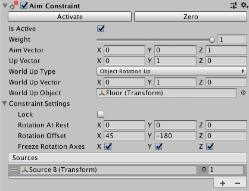Aim Constraint 组件

### 属性

| **Property:**           | **Function:**                                                |                                                              |
| :---------------------- | :----------------------------------------------------------- | ------------------------------------------------------------ |
| **Activate**            | After you rotate the constrained GameObject and move its source GameObjects, click **Activate** to save this information. **Activate** saves the current offset from the source GameObjects in **Rotation At Rest** and **Rotation Offset**, then checks **Is Active** and **Lock**. |                                                              |
| **Zero**                | Sets the rotation of the constrained GameObject to the source GameObjects. Zero resets the **Rotation At Rest** and **Rotation Offset** fields, then checks **Is Active** and **Lock**. |                                                              |
| **Is Active**           | Toggles whether or not to evaluate the Constraint. To also apply the Constraint, make sure **Lock** is checked. |                                                              |
| **Weight**              | The strength of the Constraint. A weight of 1 causes the Constraint to rotate this GameObject at the same rate that its source GameObjects move. A weight of 0 removes the effect of the Constraint completely. This weight affects all source GameObjects. Each GameObject in the **Sources** list also has a weight. |                                                              |
| **Aim Vector**          | Specifies the axis which faces the direction of its source GameObjects. For example, to specify that the GameObject should orient only its positive Z axis to face the source GameObjects, enter an **Aim Vector** of 0, 0, 1 for the X, Y, and Z axes, respectively. |                                                              |
| **Up Vector**           | Specifies the up axis of this GameObject. For example, to specify that the GameObject should always keep its positive Y axis pointing upward, enter an **Up Vector** of 0, 1, 0 for the X, Y, and Z axes, respectively. |                                                              |
| **World Up Type**       | Specifies the axis for the upward direction. The Aim Constraint uses this vector to align the up axis of the GameObject the upward direction. |                                                              |
|                         | Scene Up                                                     | The Y axis of the scene.                                     |
|                         | Object Up                                                    | The Y axis of the GameObject referred to by **World Up Object**. |
|                         | Object Up Rotation                                           | The axis specified by **World Up Vector** of the GameObject referred to by **World Up Object**. |
|                         | Vector                                                       | The World Up Vector.                                         |
|                         | None                                                         | Do not use a World Up vector.                                |
| **World Up Vector**     | Specifies the vector to use for the **Object Up Rotation** and **Vector** choices in **World Up Type**. |                                                              |
| **World Up Object**     | Specifies the GameObject to use for the **Object Up** and **Object Up Rotation** choices in **World Up Type**. |                                                              |
| **Constraint Settings** |                                                              |                                                              |
|                         | Lock                                                         | Toggle to let the Constraint rotate the GameObject. Uncheck this property to edit the rotation of this GameObject. You can also edit the Rotation At Rest and Rotation Offset properties. If Is Active is checked, the Constraint updates the Rotation At Rest or Rotation Offset properties for you as you rotate the GameObject or its source GameObjects. When you are satisfied with your changes, check Lock to let the Constraint control this GameObject. This property has no effect in Play Mode. |
|                         | Rotation At Rest                                             | The X, Y, and Z values to use when Weight is 0 or when the corresponding Freeze Rotation Axes are not checked. To edit these fields, uncheck Lock. |
|                         | Rotation Offset                                              | The X, Y, and Z offset from the rotation that is calculated by the Constraint. To edit these fields, uncheck Lock. |
|                         | Freeze Rotation Axes                                         | Check X, Y, or Z to allow the Constraint to control the corresponding axes. Uncheck an axis to stop the Constraint from controlling it. This allows you to edit, animate, or script the unfrozen axis. |
| **Sources**             | The list of GameObjects that constrain this GameObject. Unity evaluates source GameObjects in the order that they appear in this list. This order affects how this Constraint rotates the constrained GameObject. To get the result you want, drag and drop items in this list. Each source has a weight from 0 to 1. |                                                              |

# Look At 约束 (Look At Constraints)

Look At Constraint 可旋转游戏对象以朝向其源游戏对象。通常在[摄像机](https://docs.unity.cn/cn/2018.4/Manual/class-Camera.html)上应用 Look At Constraint 来跟随一个或多个游戏对象。此外，如果[导入目标摄像机](https://docs.unity.cn/cn/2018.4/Manual/FBXImporter-Model.html#CameraImportProperties)，Unity 将使用目标对象作为源游戏对象创建具有 Look At Constraint 的摄像机。

Look At Constraint 是 [Aim](https://docs.unity.cn/cn/2018.4/Manual/class-AimConstraint.html) Constraint 的简化版。Aim Constraint 允许选择哪个轴跟随约束游戏对象，而 Look At Constraint 始终跟随 z 轴。

可以将 Look At Constraint 的向上方向设置为另一个游戏对象的 y 轴，也可以指定围绕 z 轴（瞄准轴）的旋转。

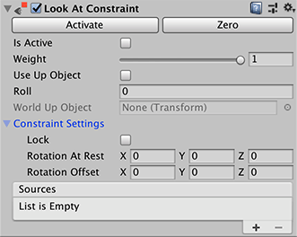Look At Constraint 组件

## 属性

| **属性：**              | **功能：**                                                   |
| :---------------------- | :----------------------------------------------------------- |
| **Is Active**           | 启用此选项可评估约束。若还要应用约束，请启用 **Lock** 属性。 |
| **Weight**              | 设置约束的强度。有效值的范围从 0（约束无效）到 1（此游戏对象按照与其源游戏对象移动相同的速率旋转）。  此权重值同等程度影响所有源游戏对象，但您也可以在 **Sources** 列表中单独更改每个游戏对象的权重。 |
| **Use Up Object**       | 启用此选项可将此游戏对象的向上矢量设置为 **World Up Object** 的 y 轴。如果禁用此选项，则向上矢量将设置为 **Roll** 值。游戏对象的向上矢量确定了向上方向。 |
| **Roll**                | 设置沿 z 轴的旋转角度（以度为单位）以用于此游戏对象的向上矢量（向上方向）。  仅当禁用 **Use Up Object** 时可用。 |
| **World Up Object**     | 在此处引用需要用作向上矢量参考的游戏对象。设置此引用后，该向上矢量游戏对象的 y 轴将成为受约束游戏对象的向上方向。  仅当启用 **Use Up Object** 时可用。 |
| **Constraint Settings** |                                                              |
| **Lock**                | 启用此选项可让约束旋转游戏对象（应用约束）。如果禁用此选项，则可以修改游戏对象的旋转以及 **Rotation At Rest** 和 **Rotation Offset** 属性。在对更改满意后，选中 Lock 以便让约束控制此游戏对象。  此属性在播放模式下无效。 |
| **Rotation At Rest**    | 设置受约束游戏对象停止时的 X、Y 和 Z 方向。当总权重（包括所有源游戏对象的各个权重）加起来为 0 时，游戏对象就会停止。  要修改此属性，请禁用 **Lock**。 |
| **Rotation Offset**     | 设置相对于受约束方向（由约束计算的旋转）的 X、Y 和 Z 偏移。  要修改此属性，请禁用 **Lock**。 |
| **Sources**             | 约束此游戏对象的游戏对象列表。Unity 按照源游戏对象在此列表中出现的顺序来评估源游戏对象。  此顺序会影响此约束如何旋转受约束的游戏对象（由于旋转累积方式）。要获得所需的结果，请拖放此列表中的项。不同顺序会产生不同的结果。  列表中的每个条目都包含对游戏对象的引用及其权重（即约束影响）。Unity 计算此列表中的源游戏对象的平均值，您可以通过更改每个源游戏对象的权重来调整影响。例如，如果有两个源游戏对象（立方体和球体）并想将摄像机更多地集中在球体上，则可以将球体的权重设置为 1（最大值），而将立方体的权重设置为 0.5。 |

球体（权重 = 1）与立方体（权重 = 0.5)之间的影响

# 父约束 (Parent Constraints)

Parent Constraint 将移动并旋转游戏对象，就好像它是 Hierarchy 窗口中另一个游戏对象的子项一样。不过，该组件提供了一些优势，这是将某个游戏对象变为另一个游戏对象的父项所不能实现的，具体包括：

- Parent Constraint 不会影响缩放比例。
- 一个 Parent Constraint 可以链接到多个游戏对象。
- 游戏对象不必是 Parent Constraint 链接到的游戏对象的子项。
- 可以通过指定权重以及每个源游戏对象的权重来改变约束的影响。

例如，要将一把剑放在角色的手中，应将 Parent Constraint 组件添加到剑游戏对象上。在 Parent Constraint 的 **Sources** 列表中，链接到角色的手。这样，剑的移动将被约束到手的位置和旋转。

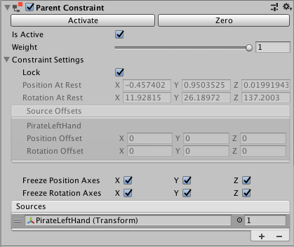

# 位置约束 (Position Constraints)

Position Constraint 组件移动游戏对象来跟随其源游戏对象。

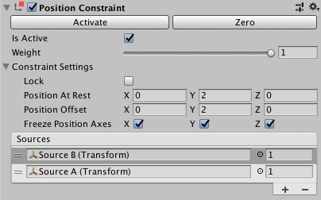

# 旋转约束 (Rotation Constraints)

Rotation Constraint 组件旋转游戏对象来匹配其源游戏对象的旋转情况。

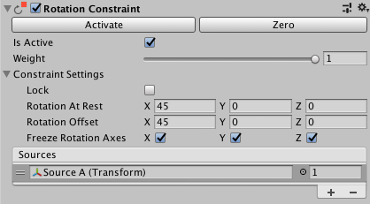

# 缩放约束 (Scale Constraints)

Scale Constraint 组件可调整游戏对象的大小来匹配其源游戏对象的比例。

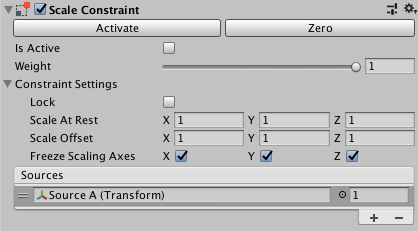

# Unity 中的旋转和方向

## 摘要

**3D 应用程序中的旋转通常以两种方式之一表示：四元数或欧拉角。每种方式都有自己的用途和缺点。Unity 在内部使用四元数表示，但在 Inspector 中显示等效的欧拉角值以便于进行编辑。**

## 欧拉角与四元数的区别

### 欧拉角

欧拉角具有更简单的表示形式，即按顺序应用的 X、Y 和 Z 的三个角度值。要将欧拉旋转应用于特定对象，则依次应用每个旋转值，作为围绕其对应轴的旋转。

- **优点**：欧拉角具有直观的“可读”格式，由三个角度组成。
- **优点**：欧拉角可表示通过大于 180 度转向从一个方向到另一个方向的旋转
- **局限性**：欧拉角受到[万向锁 (Gimbal Lock)](https://en.wikipedia.org/wiki/Gimbal_lock) 的影响。当依次施加三个旋转时，第一个或第二个旋转可能导致第三个轴的方向与先前两个轴之一相同。这意味着已失去“自由度”，因为不能围绕唯一轴应用第三个旋转值。

### 四元数

四元数可用于表示对象的方向或旋转。此表示方式在内部由四个数字组成（在 Unity 中称为 x、y、z 和 w），但是这些数字不代表角度或轴，您通常不需要直接访问它们。除非特别想深入研究[四元数的数学原理](https://en.wikipedia.org/wiki/Quaternions_and_spatial_rotation)，否则只需要知道四元数代表 3D 空间中的旋转即可，通常不需要知道或修改 x、y 和 z 属性。

与矢量可以表示位置或方向（从原点测量方向）的方式相同，四元数可以表示方向或旋转：从旋转“原点”或“[Identity](https://docs.unity.cn/cn/2018.4/ScriptReference/Quaternion-identity.html)”测量旋转。由于旋转的这种测量方式（从一个方向到另一个方向），因此四元数不能表示超过 180 度的旋转。

- **优点**：四元数旋转不受万向锁的影响。
- **局限性**：单个四元数不能表示任何方向超过 180 度的旋转。
- **局限性**：四元数的数字表示在直观上难以理解。

在 Unity 中，所有游戏对象旋转都在内部存储为四元数，因为这种表示方式的好处超过了局限性。

但是，在 Transform Inspector 中，我们使用欧拉角显示旋转，因为这种形式更容易理解和编辑。在 Inspector 中输入的用于游戏对象旋转的新值将在后台转换为该对象的新四元数旋转值。

游戏对象的旋转在 Inspector 中以欧拉角的形式显示和编辑，但在内部存储为四元数

此外还有一个副作用，在 Inspector 中可以输入游戏对象的旋转值，例如 **X：0，Y：365，Z：0**。但是，该值不能表示为四元数，所以点击 Play 时会看到该对象的旋转值变为 **X：0，Y：5，Z：0**（或近似的值）。这是因为旋转已被转换为四元数，而四元数没有“完整的 360 度旋转加 5 度”的概念，而是简单地设置为与旋转结果相同的方向。

## 对脚本的影响

处理脚本中的旋转时，应使用 Quaternion 类及其函数来创建和修改旋转值。在某些情况下，使用欧拉角也是有效的，但应记住： - 应使用处理欧拉角的 Quaternion 类函数 - 从旋转中检索、修改和重新应用欧拉值可能会导致意外的副作用。

### 直接创建和操作四元数

Unity 的 Quaternion 类具有许多函数可用于创建和操作旋转，而无需使用任何欧拉角。例如：

创建：

- [Quaternion.LookRotation](https://docs.unity.cn/cn/2018.4/ScriptReference/Quaternion.LookRotation.html)
- [Quaternion.AngleAxis](https://docs.unity.cn/cn/2018.4/ScriptReference/Quaternion.AngleAxis.html)
- [Quaternion.FromToRotation](https://docs.unity.cn/cn/2018.4/ScriptReference/Quaternion.FromToRotation.html)

操作：

- [Quaternion.Slerp](https://docs.unity.cn/cn/2018.4/ScriptReference/Quaternion.Slerp.html)
- [Quaternion.Inverse](https://docs.unity.cn/cn/2018.4/ScriptReference/Quaternion.Inverse.html)
- [Quaternion.RotateTowards](https://docs.unity.cn/cn/2018.4/ScriptReference/Quaternion.RotateTowards.html)
- [Transform.Rotate](https://docs.unity.cn/cn/2018.4/ScriptReference/Transform.Rotate.html) 和 [Transform.RotateAround](https://docs.unity.cn/cn/2018.4/ScriptReference/Transform.RotateAround.html)

但是，有时需要在脚本中使用欧拉角。在这种情况下，应注意必须将角度保存在变量中，并仅使用这些变量作为欧拉角*应用*于旋转。虽然可*从*四元数中检索欧拉角，但如果进行检索、修改和重新应用，则会出现问题。

下面是一些常犯**错误**的示例：使用假设的示例来尝试围绕 X 轴以每秒 10 度的速度旋转对象。应***避免\***此类情况：

```c#
    // 旋转脚本错误 #1
        // 此处的错误在于我们正在修改四元数的 x 值
        // 此值不表示角度，不会产生所需的结果
    
        void Update () {
    
            var rot = transform.rotation;
            rot.x += Time.deltaTime * 10;
            transform.rotation = rot;
        
        } 
    // 旋转脚本错误 #2
        // 此处的错误在于我们正在从四元数读取、修改再写入
        // 欧拉值。因为这些值是从四元数计算的，
        // 所以每个新的旋转可能会返回非常不同的欧拉角，而这可能会受到万向锁的影响。
        
        void Update () {
        
            var angles = transform.rotation.eulerAngles;
            angles.x += Time.deltaTime * 10;
            transform.rotation = Quaternion.Euler(angles);

        } 
```

以下是在脚本中***正确\***使用欧拉角的示例：

```c#
    // 正确使用欧拉角的旋转脚本。
        // 此处我们将欧拉角存储在一个类变量中，并仅使用
        // 该变量作为欧拉角进行应用，但我们从不依赖于读回欧拉值。
        
        float x;
        void Update () {
        
            x += Time.deltaTime * 10;
            transform.rotation = Quaternion.Euler(x,0,0);

        }
```

## 对动画的影响

许多 3D 制作包以及 Unity 自己的内部[动画窗口](https://docs.unity.cn/cn/2018.4/Manual/AnimationEditorGuide.html)均允许使用欧拉角来指定动画期间的旋转。

这些旋转值通常可能超过四元数可表示的范围。例如，如果一个对象应当就地旋转 720 度，这可以用欧拉角“X：0，Y：720，Z：0”表示。但这不能通过四元数值来表示。

### Unity 的动画窗口

在 Unity 自己的动画窗口中，有一些选项允许指定如何进行旋转插值：使用四元数插值还是欧拉插值。通过指定欧拉插值，即告诉 Unity 您希望使用角度指定全范围运动。但是，使用四元数旋转，即表示仅希望旋转以特定方向结束，因此 Unity 将使用四元数插值并在最短距离内旋转到达该位置。请参阅[使用动画曲线](https://docs.unity.cn/cn/2018.4/Manual/animeditor-AnimationCurves.html)以了解与此有关的更多信息。

### 外部动画源

导入来自外部的动画时，这些文件通常包含欧拉格式的旋转关键帧动画。默认情况下，Unity 会重新采样这些动画，并为动画中的每个帧生成一个新的四元数关键帧，从而避免任何关键帧之间的旋转可能超过四元数的有效范围的情况。

例如，假设有两个关键帧，相隔 6 帧，X 的值在第一个关键帧上为 0，在第二个关键帧上为 270。如果不重新采样，这两个关键帧之间的四元数插值将在相反方向上旋转 90 度，因为这是从第一个方向到第二个方向的最短路径。但是，通过在每个帧上重新采样和添加关键帧，关键帧之间现在只有 45 度，因此旋转将正常工作。

不过，仍然存在一些情况，即使使用重新采样，导入动画的四元数表示可能还是与原来不够匹配，因此，在 Unity 5.3 及更高版本中，可选择关闭动画重新采样，这样就可以在运行时改用原始的欧拉动画关键帧。想了解更多相关信息，请参阅[欧拉曲线旋转的动画导入](https://docs.unity.cn/cn/2018.4/Manual/AnimationEulerCurveImport.html)。

# 光源

__光源__是每个场景必不可少的部分。虽然网格和纹理定义了场景的形状和外观，但光源定义了 3D 环境的颜色和氛围。在每个场景中可能会使用多个光源。让这些光源协同工作需要一些精力，但可能会带来非常令人惊叹的结果。

可通过 **GameObject > Light** 菜单将光源添加到场景中。然后从出现的子菜单中选择所需的光源格式。添加光源后，可以像任何其他游戏对象一样操作光源。此外，可使用 **Component > Rendering > Light** 将光源 (Light) 组件添加到任何选定的游戏对象。

## 渲染路径

Unity 支持不同的__渲染路径__。这些路径主要影响光源和阴影，因此根据游戏要求选择正确的渲染路径可以提高项目的性能。 有关渲染路径的更多信息，可访问[渲染路径部分](https://docs.unity.cn/cn/2018.4/Manual/RenderingPaths.html)。

## 更多信息

有关光源工作原理的更多信息，请参阅[光照概述](https://docs.unity.cn/cn/2018.4/Manual/Lighting.html)页面。有关如何使用光源组件的更多信息，请查看[光照参考](https://docs.unity.cn/cn/2018.4/Manual/class-Light.html)。

# 摄像机

正如电影中使用摄像机向观众展现故事一样，Unity 中的__摄像机__用于向玩家展示游戏世界。在场景中至少要有一个摄像机，但也可以有多个摄像机。多个摄像机可以提供双人分屏或营造高级自定义效果。可以将摄像机动画化，也可以通过物理方式来控制摄像机。基本上能够想象的任何东西都可以通过摄像机来呈现，还可以使用典型或独特摄像机来适应游戏风格。

有关摄像机工作原理的更多信息，请参阅“图形概述”部分中的[摄像机](https://docs.unity.cn/cn/2018.4/Manual/CamerasOverview.html)页面。

# 添加随机游戏元素

随机选择的项或值在许多游戏中都很重要。本部分将介绍如何使用 Unity 的内置随机函数来实现一些常见的游戏机制。

## 从数组中选择一个随机项

随机选取一个数组元素归结为选择零和数组最大索引值（等于数组的长度减去 1）之间的一个随机整数。使用内置的 Random.Range 函数可以轻松实现：

```
 var element = myArray[Random.Range(0, myArray.Length)];
```

请注意，Random.Range 从包含第一个参数但不包含第二个参数的范围内返回一个值，因此在此处使用 myArray.Length 会得到正确的结果。

## 选择具有不同概率的项

有时需要随机选择项，但有些项比其他项被选中的几率更高。例如，NPC 在遇到玩家时可能会以几种不同的方式做出反应：

- 友好问候的几率为 50%
- 逃跑的几率为 25%
- 立即攻击的几率为 20%
- 提供金钱作为礼物的几率为 5%

可将这些不同的结果可视化为一张纸条，该纸条分成几个部分，每个部分占据纸条总长度的一个比例。占据的比例等于选择结果的概率。选择行为相当于沿着纸条的长度选择一个随机点（例如通过投掷飞镖），然后查看该点处于哪个部分.

在脚本中，纸条实际上是一个浮点数组，其中的浮点数按顺序包含项的不同概率。随机点是通过将 Random.value 乘以数组中所有浮点数的总和得到的（这些数值不需要加起来等于 1；重点是不同值的相对大小）。要找到该点“位于”哪个数组元素，首先要检查它是否小于第一个元素中的值。如果是，则第一个元素便是选中的元素。否则，从该点值中减去第一个元素的值，然后将其与第二个元素进行比较，依此类推，直到找到正确的元素。在代码中表示为以下所示的内容：

```c#
 float Choose (float[] probs) {

        float total = 0;

        foreach (float elem in probs) {
            total += elem;
        }

        float randomPoint = Random.value * total;

        for (int i= 0; i < probs.Length; i++) {
            if (randomPoint < probs[i]) {
                return i;
            }
            else {
                randomPoint -= probs[i];
            }
        }
        return probs.Length - 1;
    }

```

## 加权连续随机值

如果结果是不连续的，那么浮点数组方法会很有效，但在某些情况下希望产生更连续的结果；比如说，希望随机化一个宝箱中发现的金块数量，并希望能够出现 1 到 100 之间的任何数字，但让更小数字的概率更高。使用浮点数组方法来执行此算法将需要设置一个包含 100 个浮点数（即纸条上的部分）的数组，这是很不实用的方法；如果不局限于整数而是想要在该范围内的任何数字，则不可能使用这种方法。

一种适用于连续结果的更好方法是使用 AnimationCurve 将“原始”随机值转换为“加权”值；通过绘制不同的曲线形状，可产生不同的权重。代码编写起来也更简单：

```c#
//C#

float CurveWeightedRandom(AnimationCurve curve) {
    return curve.Evaluate(Random.value);
}
```


这条曲线在开始和结束时都很平缓，因此这些值接近极值的几率较高，而中间的陡峭部分表示得到这些值的几率较低。另外请注意，使用此曲线时，高度值已向上移动：曲线底部为 1，曲线顶部为 10，这意味着曲线产生的值将在 1–10 范围内，而不是像以前的曲线那样在 0–1 范围内。

请注意，这些曲线并非概率论指南中可能介绍的概率分布曲线，而更像是反向累积概率曲线。

通过在一个脚本上定义 AnimationCurve 公共变量，可使用 Inspector 窗口直观查看和编辑曲线，而无需计算值。

这种方法会产生浮点数。如果要计算整数结果（例如，需要 82 个金块，而不是 82.1214 个金块），可将计算值传递给 Mathf.RoundToInt() 之类的函数。

## 列表洗牌

一种常见的游戏机制是从一组已知的项中进行选择，但让这些项以随机顺序到达。例如，一副纸牌通常需要洗牌，因此不会以可预测的顺序绘制。为了对数组中的项进行随机洗牌，可访问每个元素，然后将其与数组中位于随机索引处的另一个元素进行交换：

```c#
//C#

    void Shuffle (int[] deck) {
        for (int i = 0; i < deck.Length; i++) {
            int temp = deck[i];
            int randomIndex = Random.Range(0, deck.Length);
            deck[i] = deck[randomIndex];
            deck[randomIndex] = temp;
        }
    }
```

## 从一组无重复的项中选择

一种常见的任务是从一组中随机选取一些项，但不可多次选取同一项。例如，可能希望在一些随机生成点生成多个 NPC，但要确保每个点只生成一个 NPC。为实现此目的，可按顺序遍历这些项，随机决定是否将每一项添加到所选集合中。当访问每一项时，该项被选取的概率等于仍然需要的项数除以仍然可供选择的项数。

例如，假设有 10 个可用的生成点，但只能选择其中 5 个。选择第一项的概率为 5/10，即 0.5。如果选择了该项，那么第二项的概率将是 4/9，即 0.44（即仍然需要 4 项，还剩下 9 项可供选择）。但是，如果未选择第一项，那么第二项的概率将是 5/9，即 0.56（即仍然需要 5 项，还剩下 9 项可供选择）。这一直持续到该集合包含所需的 5 项为止。可使用如下所示的代码实现此算法：

```c#

//C#

    Transform[] spawnPoints;

    Transform[] ChooseSet (int numRequired) {
        Transform[] result = new Transform[numRequired];

        int numToChoose = numRequired;

        for (int numLeft = spawnPoints.Length; numLeft > 0; numLeft--) {

            float prob = (float)numToChoose/(float)numLeft;

            if (Random.value <= prob) {
                numToChoose--;
                result[numToChoose] = spawnPoints[numLeft - 1];

                if (numToChoose == 0) {
                    break;
                }
            }
        }
        return result;
    }
```

## 空间中的随机点

通过将 Vector3 的每个分量设置为 Random.value 返回的值可以选择立方体中的随机点：

```c#
 var randVec = Vector3(Random.value, Random.value, Random.value);
```

这种算法可在边长为一个单位的立方体内部给出一个点。只需将矢量的 X、Y 和 Z 分量乘以期望的边长即可缩放该立方体。如果其中一个轴设置为零，则该点将始终位于单个平面内。例如，在“地面”上选取随机点通常需要随机设置 X 和 Z 分量并将 Y 分量设置为零。

当体积为球体时（即，希望从原点开始的给定半径内选取随机点时），可使用 Random.insideUnitSphere 乘以所需的半径：

```c#
 var randWithinRadius = Random.insideUnitSphere * radius;
```

请注意，如果将结果矢量的某个分量设置为零，则*不能*在圆内获得正确的随机点。尽管该点确实是随机点并且位于正确的半径内，但是概率严重偏向于圆的边缘，因此点分布将非常不均匀。对于此任务，应改用 Random.insideUnitCircle：

```c#
 var randWithinCircle = Random.insideUnitCircle * radius;
```
