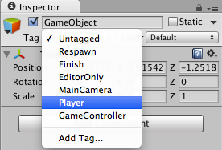
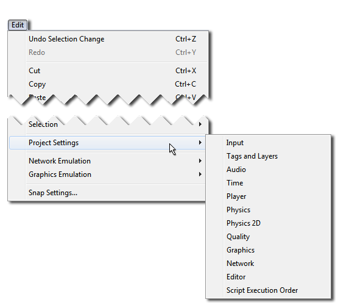
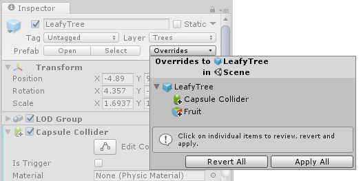
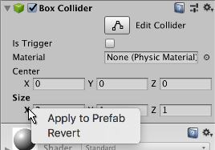
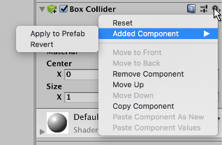
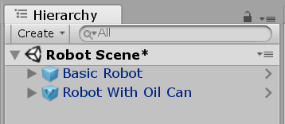
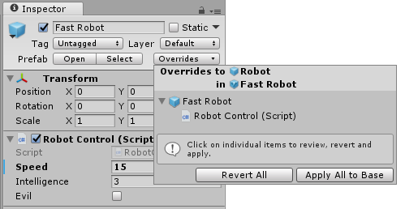

# 创建游戏玩法

## 停用父游戏对象

停用父游戏对象时，也会停用其所有子游戏对象。

此停用会覆盖所有子游戏对象上的 `activeSelf` 设置，因此 Unity 会使父级下的整个层级视图将变为非活动状态。这不会更改子游戏对象上 `activeSelf` 属性的值，因此重新激活父对象时，子对象将恢复到其原始状态。这意味着无法通过读取 **activeSelf** 属性来确定子游戏对象当前是否在场景中处于活动状态。而应该使用 [activeInHierarchy](https://docs.unity.cn/cn/2018.4/ScriptReference/GameObject-activeInHierarchy.html) 属性，该属性将考虑父对象的覆盖效果。

如果希望更改游戏对象的子游戏对象的 **activeSelf** 设置，但不更改父对象的设置，可以使用如下代码：

```c#
void DeactivateChildren(GameObject g, bool a) 
{
    g.activeSelf = a;
    
    foreach (Transform child in g.transform) 
    {
        DeactivateChildren(child.gameObject, a);
    }
}
```

# 标签

**标签 (Tag)** 是可分配给一个或多个__游戏对象__的参考词。例如，可为玩家控制的角色定义“Player”标签，并为非玩家控制的角色定义“Enemy”标签。还可以使用“Collectable”标签定义玩家可在场景中收集的物品。

标签有助于识别游戏对象以便于编写脚本。通过使用标签，不需要使用拖放方式手动将游戏对象添加到脚本的公开属性，因此可以节省在多个游戏对象中使用相同脚本代码的时间。

标签对[碰撞体](https://docs.unity.cn/cn/2018.4/Manual/CollidersOverview.html)控制脚本中的触发器很有用；例如，需要通过标签确定玩家是否与敌人、道具或可收集物进行交互。

通过设置 [GameObject.FindWithTag()](https://docs.unity.cn/cn/2018.4/ScriptReference/GameObject.FindWithTag.html) 函数，可以查找包含所需标签的游戏对象。以下示例便使用了 GameObject.FindWithTag()。该函数在具有“Respawn”标签的游戏对象位置实例化 `respawnPrefab`：

```c#
using UnityEngine;
using System.Collections;

public class Example : MonoBehaviour {
    public GameObject respawnPrefab;
    public GameObject respawn;
    void Start() {
        if (respawn == null)
            respawn = GameObject.FindWithTag("Respawn");
        
        Instantiate(respawnPrefab, respawn.transform.position, respawn.transform.rotation) as GameObject;
    }
}
```

## 创建新标签

在 **Inspector** 中，游戏对象的名称下面会显示 **Tag** 和 **Layer** 下拉菜单。



要创建新标签，请选择 **Add Tag…**。随即在 Inspector 中打开[标签和层管理器 (Tag and Layer Manager)](https://docs.unity.cn/cn/2018.4/Manual/class-TagManager.html)。请注意，一旦命名了标签，以后就无法重命名。

层类似于标签，但用于定义 Unity 应该如何在场景中渲染游戏对象。请参阅有关[层](https://docs.unity.cn/cn/2018.4/Manual/Layers.html)的文档以了解更多信息。

## 应用标签

在 **Inspector** 中，游戏对象的名称下面会显示 **Tag** 和 **Layer** 下拉菜单。要将现有标签应用于游戏对象，请打开 **Tags** 下拉选单，然后选择要应用的标签。游戏对象现在便与此标签关联。

## 提示

- 只能为游戏对象分配一个标签。
- Unity 包含一些未出现在标签管理器中的内置标签：
  - **Untagged**
  - **Respawn**
  - **Finish**
  - **EditorOnly**
  - **MainCamera**
  - **Player**
  - **GameController**
- 可以使用任何喜欢的词作为标签。甚至可以使用短语，但这种情况下可能需要增加 Inspector 的宽度才能看到标签的全名。

# 静态游戏对象

许多优化需要知道对象是否可在游戏过程中移动。有关**静态**（即非移动）对象的信息通常可在 Editor 中预先计算，因为此类对象不会因对象位置的变化而无效。例如，可以通过将多个静态对象组合成称为_批次_的单个大对象来优化渲染。

游戏对象的 Inspector 在右上角有一个 *Static* 复选框和菜单，用于向 Unity 中的各种不同系统告知该对象不会移动。对于每个系统，可以单独将对象标记为静态，因此可以选择在不能带来优势的情况下不计算对象的静态优化。

在 Inspector 中查看游戏对象时显示的 Static 复选框和下拉菜单

## 静态设置

*Everything* 和 *Nothing* 针对使用该游戏对象的所有系统同时启用或禁用静态状态。这些系统包括：

- [光照贴图 (Lightmapping)](https://docs.unity.cn/cn/2018.4/Manual/GIIntro.html)：场景的高级光照；
- [遮挡物和被遮挡物 (Occluder and Occludee)](https://docs.unity.cn/cn/2018.4/Manual/OcclusionCulling.html)：基于特定摄像机位置的对象可见性进行渲染优化；
- [批处理 (Batching)](https://docs.unity.cn/cn/2018.4/Manual/DrawCallBatching.html)：通过将多个对象组合成一个更大的对象来进行渲染优化；
- [导航 (Navigation)](https://docs.unity.cn/cn/2018.4/Manual/Navigation.html)：使角色能够在场景中协商障碍物的系统；
- [网格外链接 (Off-mesh Links)](https://docs.unity.cn/cn/2018.4/Manual/class-OffMeshLink.html)：导航系统在场景的不连续区域之间建立的连接。
- [反射探针 (Reflection Probe)](https://docs.unity.cn/cn/2018.4/Manual/class-ReflectionProbe.html)：捕捉周围各个方向的球形视图。

# 保存工作

## 保存对当前场景的更改（“Save Scene”）

场景更改包括对层级视图中任何对象的修改。例如，添加、移动或删除游戏对象，还包括在 Inspector 中更改层级视图游戏对象的参数。

要保存对场景的更改，请从 File 菜单中选择 Save Scene，或按 **Ctrl/Cmd + S**。 这样可以保存当前对场景的更改*并*执行“**Save Project**”（见下文）。

**这意味着执行“Save Scene”时，\*所有内容\*都会保存。**

## 保存项目范围的变更（“Save Project”）


可在 Unity 中进行的某些更改不是特定于场景的，而是*项目范围的*。通过从 File 菜单中选择“Save Project”，可以独立于场景更改来保存这些设置。

使用“Save Project”不会保存对场景的更改，只保存项目范围的更改。例如，如果使用临时场景对预制件进行了一些更改，则可能希望保存项目，而不保存对场景的更改。

使用“Save Project”时保存的项目范围更改包括：

### 所有“Project Settings”：

使用“Save Project”时，将保存每个“Project Settings”菜单项的所有设置，例如自定义输入轴、用户定义的标签或图层以及物理重力强度。

Project Settings 菜单

保存项目时，对这些设置的更改将保存在 Library 文件夹中：

- **Input**：保存为 ´InputManager.asset´
- **Tags** And Layers：保存为 ´TagManager.asset´
- **Audio**：保存为 ´AudioManager.asset´
- **Time**：保存为 ´TimeManager.asset´
- **Player**：保存为 ´ProjectSettings.asset´
- **Physics**：保存为 ´DynamicsManager.asset´
- **Physics 2D**：保存为 ´Physics2DSettings.asset´
- **Quality**：保存为 ´QualitySettings.asset´
- **Graphics**：保存为 ´GraphicsSettings.asset´
- **Network**：保存为 ´NetworkManager.asset´
- **Editor**：保存为 ´EditorUserSettings.asset´

### “Build Settings”

Build Settings 也作为 ´EditorBuildSettings.asset´ 保存在 Library 文件夹中。

### Project 窗口中对资源的更改

与项目范围设置一起保存的还有对*没有“Apply”按钮的*资源的更改，例如对以下任何一项的更改：

- 材质参数
- 预制件
- 动画控制器（状态机）
- 化身遮罩
- 没有“Apply”按钮的任何其他资源更改

## 立即写入磁盘的更改（无需保存）：

有些类型的更改会立即写入磁盘，根本不需要执行“Save”操作。这些更改包括：

### 要求用户按“Apply”按钮的任何导入设置更改

大多数资源类型的导入设置都要求按下“Apply”按钮才能使更改生效。此操作会导致根据新设置重新导入资源。点击 Apply 按钮后会立即保存这些更改。例如：

- 更改图像资源的纹理类型
- 更改 3D 模型资源的缩放因子
- 更改音频资源的压缩设置
- 具有“Apply”按钮的任何其他导入设置更改

### 立即保存的其他更改：

一些其他类型的数据会立即或自动保存到磁盘，无需执行“Save”操作：

- 创建新资源，例如：新材质或预制件（但不包括对这些资源进行的后续更改）
- 烘焙光照数据（烘焙完成时保存）
- 烘焙导航数据（烘焙完成时保存）
- 烘焙遮挡剔除数据（烘焙完成时保存）
- 脚本执行顺序更改（按下“Apply”后，此数据保存在每个脚本的 .meta 文件中）

# 预制件

Unity 的**预制件**系统允许创建、配置和存储游戏对象及其所有组件、属性值和子游戏对象作为可重用资源。预制件资源充当模板，在此模板的基础之上可以在场景中创建新的预制件实例。

如果要在场景中的多个位置或项目中的多个场景之间重用以特定方式配置的游戏对象，比如非玩家角色 (NPC)、道具或景物，则应将此游戏对象转换为预制件。这种方式比简单复制和粘贴游戏对象更好，因为预制件系统可以自动保持所有副本同步。

对预制件资源所做的任何编辑都会自动反映在该预制件的实例中，因此可以轻松地对整个项目进行广泛的更改，而无需对资源的每个副本重复进行相同的编辑。

可将[预制件嵌套](https://docs.unity.cn/cn/2018.4/Manual/NestedPrefabs.html)在另一个预制件中，从而创建在多个级别易于编辑的复杂对象层级视图。

但是，这并不意味着所有预制件实例都必须完全相同。如果希望预制件的某些实例与其他实例不同，则可以[覆盖](https://docs.unity.cn/cn/2018.4/Manual/PrefabInstanceOverrides.html)各个预制件实例的设置。还可以创建预制件的[变体](https://docs.unity.cn/cn/2018.4/Manual/PrefabVariants.html)，从而将一系列覆盖组合在一起成为有意义的预制件变化。

如果游戏对象在一开始不存在于场景中，而希望[在运行时实例化游戏对象](https://docs.unity.cn/cn/2018.4/Manual/InstantiatingPrefabs.html)（例如，使能量块、特效、飞弹或 NPC 在游戏过程中的正确时间点出现），那么也应该使用预制件。

使用预制件的一些常见示例包括：

- 环境资源 - 例如，在一个关卡附近多次使用的某种树（如上面的截屏所示）。
- 非玩家角色 (NPC) - 例如，某种类型的机器人可能会在游戏的多个关卡之间多次出现。它们的移动速度或声音可能不同（使用*覆盖*）。
- 飞弹 - 例如，海盗的大炮可能会在每次射击时实例化炮弹预制件。
- 玩家主角 - 玩家预制件可能被放置在游戏每个关卡（不同场景）的起点。

# 在预制件模式下编辑预制件

要编辑预制件资源，请在预制件模式下将其打开。预制件模式允许您单独查看和编辑预制件资源的内容（独立于场景中的所有其他对象）。在预制件模式下所做的更改会影响该预制件的所有实例。


## 进入和退出预制件模式

可通过多种方法在预制件模式下开始编辑预制件，包括：

- 在 Project 窗口中双击预制件
- 使用 Hierarchy 窗口中预制件旁边的箭头按钮
- 单击预制件资源的 Inspector 窗口中的“Open”按钮

Hierarchy 窗口中预制件旁边的箭头按钮

进入预制件模式会使 Scene 视图和 Hierarchy 窗口仅显示该预制件的内容。在此处，预制件的根是常规游戏对象：没有蓝色的预制件实例图标。

## Auto Save

预制件模式在 Scene 视图的右上角有一个 **Auto Save** 设置。启用此设置后，对预制件所做的任何更改都会自动保存到预制件资源。默认情况下会启用 *Auto Save*。

## 编辑环境

可为预制件模式指定一个场景作为__编辑环境__，这样便可以根据选择的背景（而不是空场景）编辑预制件。这对于了解预制件与游戏中的典型景物的对比情况非常有用。

在预制件模式下，指定为编辑环境的场景中的对象是不可选择的，也不会在 Hierarchy 窗口中显示。这是为了让您专注于编辑预制件而不会意外地选择其他不相关的对象，并且没有混乱的 Hierarchy 窗口。

要将场景设置为编辑环境，请打开 [Editor](https://docs.unity.cn/cn/2018.4/Manual/class-EditorManager.html) 窗口（顶部菜单：__Edit > Project Settings__，然后选择 **Editor** 类别），然后选择 **Prefab Editing Environment** 部分。对于“非 UI”预制件，请使用 **Regular Environment** 设置，而对于 UI 预制件，请使用 **UI Environment** 设置。UI 预制件是在根上具有[矩形变换 (Rect Transform)](https://docs.unity.cn/cn/2018.4/Manual/class-RectTransform.html) 组件而不是常规变换组件的预制件。“非 UI”预制件是具有常规变换组件的预制件。

Editor Project Settings 中的预制件编辑环境设置

# 实例覆盖

__实例覆盖__允许在预制件实例之间创建变化，同时仍将这些实例关联到同一预制件资源。

修改预制件资源时，更改将反映在其所有实例中。但是，也可以直接对单个实例进行修改。这样做会在该特定实例上创建__实例覆盖__。

例如，假设有一个预制件资源“Robot”，放置在游戏中的多个关卡中。但是，“Robot”的每个实例都有不同的速度值，并分配了不同的音频剪辑。

有四种不同的__实例覆盖__类型：

- 覆盖属性的值
- 添加组件
- 删除组件
- 添加子游戏对象

预制件实例存在一些限制：无法更改属于预制件的游戏对象的父级，且无法删除属于预制件的游戏对象。但是，可以停用游戏对象，这种操作很适合取代游戏对象删除操作（这算作属性覆盖）。

在 Inspector 窗口中，实例覆盖的名称标签以**粗体**显示，左边距使用蓝线显示。向预制件实例添加新组件时，边距位置的蓝线将涵盖整个组件。

Inspector 窗口显示的预制件实例覆盖了“Dynamic Occluded”属性，并添加了 Rigidbody 组件作为覆盖。

添加和删除的组件在 Inspector 中的相应图标上也有加减符号标示，而添加的游戏对象在 Hierarchy 窗口中的相应图标上有一个加号标示。

Hierarchy 窗口显示的预制件实例添加了一个名为“Fruit”的子游戏对象作为覆盖。

## 覆盖优先

预制件实例上覆盖的属性值始终优先于预制件资源的值。这意味着，如果更改预制件资源的属性，对覆盖该属性的实例没有任何影响。

如果对预制件资源进行更改，但未按预期更新所有实例，则应检查实例上是否覆盖了该属性。最好仅在确实必要时才使用实例覆盖，因为如果整个项目中有大量实例覆盖，则很难判断对预制件资源的更改是否对所有实例都有影响。


## 对齐根据特定预制件实例而定

预制件实例的__对齐__是一种特殊情况，与其他属性的处理方式不同。**对齐__值绝不会从预制件资源传递到预制件实例。这意味着对齐值始终可与预制件资源的对齐不同，而不是作为显式实例覆盖。具体而言，对齐表示预制件实例的根变换的** Position__ 和 **Rotation** 属性，对于矩形变换，还包括 **Width**、**Height**、**Margins**、**Anchors** 和 **Pivot** 属性。

这是因为要求预制件的多个实例采用相同的位置和旋转是极其罕见的情况。更常见的情况是希望预制件实例具有不同的位置和旋转，因此 Unity 不会将它们视为预制件覆盖。

# 通过预制件的实例编辑预制件

与普通游戏对象相比，预制件实例的根的 Inspector 有三个额外的控件：__Open**、**Select__ 和 **Overrides**。

预制件实例的 Inspector 窗口中的三个预制件控件

**Open** 按钮在预制件模式下打开实例所在的预制件资源，然后可以编辑预制件资源，从而更改其所有实例。**Select** 按钮在 Project 窗口中选择用于生成此实例的预制件资源。**Overrides** 按钮打开 Overrides 下拉窗口。

## Overrides 下拉选单

**Overrides** 下拉窗口显示预制件实例上的所有覆盖。还允许将实例的覆盖应用于预制件资源，或将实例上的覆盖恢复为预制件资源上的值。只有根预制件实例会显示 **Overrides** 下拉选单按钮，其他预制件内的预制件不会显示此按钮。

**Overrides** 下拉窗口可以应用或恢复单个预制件覆盖，或一次性应用或恢复所有预制件覆盖。

- **应用**覆盖会修改预制件资源。此操作会将覆盖（当前仅在您的预制件实例上）置于资源之上。这意味着预制件资源现在具有该修改，而预制件实例不再具有该修改作为覆盖。
- **还原**覆盖会修改预制件实例。此操作实质上会丢弃您的覆盖并将其恢复为预制件资源的状态。

下拉窗口以修改、添加和删除的组件以及添加的游戏对象（包括其他预制件）的形式显示实例更改列表。

查看预制件实例时，Inspector 窗口中的 Overrides 下拉选单

要检查条目，请单击该条目。此时将出现一个浮动视图，其中显示更改并允许您还原或应用该更改。

Overrides 下拉窗口中选中了添加的组件覆盖

对于修改了值的组件，此视图会显示预制件资源上组件值与预制件实例上已修改组件的并排比较。这样就可以将原始预制件资源值与当前覆盖进行比较，从而可以决定是要还原还是应用这些值。

在下面的示例中，预制件资源和预制件实例上都存在“Fruit”子游戏对象，但实例上的缩放已增大。此缩放增大结果就是一个实例覆盖，两者的视图可以在 **Overrides** 下拉窗口中进行并排比较。

具有比较视图的 Overrides 下拉选单，其中显示了预制件实例子游戏对象的变换 (Transform) 组件中的修改值

**Overrides** 下拉窗口还有 **Revert All** 和 **Apply All** 按钮，用于一次性还原或应用所有更改。如果在其他预制件中有预制件，则 **Apply All** 按钮始终适用于最外面的预制件，即在根游戏对象上具有 **Overrides** 下拉选单按钮的预制件。


## 上下文菜单

除了 Overrides 下拉窗口，还可以使用 Inspector 中的上下文菜单来**还原**和**应用**各个覆盖。

被覆盖的属性以粗体显示。可以通过上下文菜单还原或应用这些属性：

单个属性的上下文菜单

可通过组件标题的齿轮下拉选单按钮或上下文菜单还原或应用已修改的组件：

修改的组件的上下文菜单

添加的组件在图标上有一个叠加的加号标示。可通过组件标题的齿轮下拉选单按钮或上下文菜单还原或应用这些组件：

添加的组件的上下文菜单

删除的组件在图标上有一个叠加的减号标示。可通过组件标题的齿轮下拉选单按钮或上下文菜单还原或应用删除操作。还原删除操作会使组件恢复，而应用删除操作还会将组件从预制件资源中删除：

删除的组件的上下文菜单

作为子项添加到预制件实例的游戏对象（包括其他预制件）在 Hierarchy 中的图标上有一个叠加的加号标示。可通过 Hierarchy 窗口中的对象的上下文菜单还原或应用这些游戏对象：

添加的游戏对象子项的上下文菜单

# 嵌套预制件

可以在其他预制件内包含预制件实例。这称为**嵌套**预制件。嵌套预制件保留与自己的预制件资源的链接，同时也构成另一个预制件资源的一部分。


## 在预制件模式下添加嵌套预制件

在预制件模式下，可以像在场景中一样添加和使用预制件实例。可以将预制件资源从 Project 窗口拖动到 Hierarchy 窗口或 Scene 视图，由此从已打开的预制件中的该资源创建预制件实例。

**注意**：在预制件模式下打开的预制件的根游戏对象不会显示蓝色立方体预制件图标，但是其他预制件的所有实例都会显示该图标。还可以为这些预制件实例添加覆盖，就像在场景中使用预制件实例一样。

左：在预制件模式下，"Oil Can"预制件包含（嵌套)在“Robot”预制件中。右：场景中的“Robot”预制件实例包含“Oil Can”。


## 通过预制件的实例嵌套预制件

还可以将预制件实例作为子项添加到场景中的另一个预制件实例，而无需进入预制件模式，就像可以添加任何其他游戏对象一样。这样添加的预制件实例在 Hierarchy 窗口中的图标上会叠加一个加号标示，表示这是对外层预制件的特定实例的覆盖。

添加的预制件可以按照与其他覆盖相同的方式（通过 Overrides 下拉窗口，或通过 Hierarchy 中游戏对象的上下文菜单）还原或应用于外层预制件，如[通过预制件的实例编辑预制件](https://docs.unity.cn/cn/2018.4/Manual/EditingPrefabViaInstance.html)中所述。Overrides 下拉选单按钮仅位于外层预制件上。应用后的预制件不再显示加号标示，因为它不再是覆盖，而是已经嵌套在外层预制件资源本身中。但是，该预制件却会保留蓝色立方体图标，因为它本身是一个预制件实例，并会保留与自己的预制件资源的连接。

左：“Oil Can”预制件作为覆盖添加到“Robot”预制件实例。右：“Oil Can”预制件已应用于“Robot”预制件，现在是“Robot”预制件资源的嵌套预制件。

# 预制件变体

希望预制件有一组预定义的变化时，预制件变体非常有用。

例如，您可能希望在游戏中使用几种不同类型的机器人，这些机器人全都基于同一个基本机器人预制件。但是，您可能想要一些机器人携带物品，一些机器人以不同的速度移动，或者一些机器人发出额外的声音效果。

为此，您可以设置初始机器人预制件来执行您希望所有机器人共同执行的所有基本操作，然后可以创建多个预制件变体来实现以下目的：

- 通过在脚本上使用属性覆盖来更改速度，使机器人更快移动。
- 通过将额外的游戏对象附加到手臂，使机器人携带物品。
- 通过添加一个播放生锈吱吱声的 AudioSource 组件，体现机器人具有生锈的关节。

预制件变体继承另一个称为基础预制件的预制件的属性。对预制件变体进行的覆盖优先于基础预制件的值。预制件变体可以使用任何其他预制件作为其基础预制件（包括模型预制件或其他预制件变体）。

## 创建预制件变体

可通过多种方法基于另一个预制件创建预制件变体。

可在 Project 视图中的预制件上**右键单击**，然后选择 **Create > Prefab Variant**。这样将创建所选预制件的变体，该变体最初没有任何覆盖。可以在预制件模式下打开预制件变体，然后开始为其添加覆盖。

还可以将预制件实例从 Hierarchy 窗口中**拖动**到 Project 窗口中。执行此操作时会出现一个对话框，询问是要创建新的原始预制件还是预制件变体。如果选择预制件变体，则会根据拖动的预制件实例创建新的预制件变体。先前位于该实例上的所有覆盖现在都位于新的预制件变体中。可以在预制件模式下打开该变体以添加更多覆盖或者是编辑或删除覆盖。

预制件变体将显示带有箭头的蓝色预制件图标。

Hierarchy 窗口中显示的一个基本机器人预制件，以及该预制件一个名为“Robot With Oil Can”的变体。

## 编辑预制件变体

在预制件模式下打开预制件变体时，根将显示为带有蓝色预制件图标的预制件实例。此预制件实例表示产生预制件变体的基础预制件，而不表示预制件变体本身。对预制件变体所做的任何编辑都将成为存在于变体中的该基础预制件的覆盖。

预制件模式下的预制件变体“Robot With Oil Can”。添加了“Oil Can”预制件作为基础预制件的覆盖

在上面的截屏中，即使选择 **Robot With Oil Can** 根游戏对象并单击 Inspector 中的 **Select** 按钮，也将选择基础预制件 **Robot** 而不是变体 **Robot With Oil Can__，因为预制件实例是基础预制件** Robot__ 的一个实例，而 **Select** 按钮始终选择实例来自的预制件资源。

与任何预制件实例一样，可以在预制件变体中使用预制件覆盖，例如修改的属性值、添加的组件、删除的组件以及添加的子游戏对象。也存在相同的限制：无法更改预制件变体中来自基础预制件的游戏对象的父级。也无法从预制件变体中删除存在于基础预制件中的游戏对象。但是，可以停用游戏对象（作为属性覆盖）来达到与删除游戏对象相同的效果。

**注意：**在预制件模式下编辑预制件变体时，应了解应用这些覆盖（通过 Overrides 下拉窗口或上下文菜单）会使变体的变化应用于基础预制件资源。这通常**不是**您想要的效果。预制件变体的要点是提供一种方便的方法来存储有意义且可重复使用的覆盖集合，这就是为什么这些覆盖通常应该保留为覆盖而不要应用于基本预制件资源的原因。为了说明这一点，如果将额外的 **Oil Can** 游戏对象应用于基础预制件资源（“基本机器人”），那么预制件资源也将具有该 **Oil Can**。**Robot With Oil Can** 变体的关键在于，只有此变体携带油罐，所以添加的 **Oil Can** 游戏对象应该留在预制件变体内作为覆盖。

打开 Overrides 下拉窗口时，始终可以在其标题中看到覆盖所针对的对象，以及覆盖存在于哪个背景中。对于预制件变体，标题将显示覆盖是针对基础预制件并存在于预制件变体中。为了使这一点更加清晰，__Apply All__ 按钮也会显示 **Apply All to Base**。

在预制件模式下编辑预制件变体时，预制件变体的 Overrides 下拉窗口

# 覆盖多个级别

在其他预制件中使用预制件或使用预制件变体时，覆盖可存在于多个级别，且相同的覆盖可应用于多个不同的预制件。


## 选择应用目标

当一个预制件实例的内部有嵌套的预制件或者是预制件变体时，可以选择应该将覆盖应用于哪个预制件。

假设一个预制件“Vase”嵌套在预制件“Table”中的，而且场景包含“Table”预制件的一个实例。

“Table”预制件中嵌套了“Vase”预制件。

在此实例上，如果“Vase”上的属性被覆盖，则可以将此覆盖应用于多个预制件：“Vase”或“Table”。

Overrides 下拉窗口中的 **Apply All** 按钮仅允许将覆盖应用于外层预制件：在本例中为“Table”。但是，通过上下文菜单或通过 Overrides 下拉窗口中各个组件的比较视图应用覆盖时，可以选择应用目标。


在此示例中，如果选择 **Apply to Prefab ‘Vase’**，该值将应用于“Vase”预制件资源，并用于“Vase”预制件的所有实例。

另外，如果在选择 **Apply as Override in Prefab ‘Table’**，该值将成为“Table”预制件内的“Vase”实例上的覆盖。该属性不再标记为场景内实例上的覆盖，但如果在预制件模式下打开“Table”预制件，则“Vase”预制件实例上的属性将在此处标记为覆盖。

覆盖为“Table”预制件资源中的覆盖时，“Vase”预制件资源本身完全不受影响。这意味着“Table”预制件的所有实例现在都在其“Vase”预制件实例上具有新值，但不属于“Table”预制件的其他“Vase”预制件实例不受影响。

如果“Vase”预制件本身的属性稍后改变，此更改将影响“Vase”预制件的所有实例，但该属性被覆盖的实例除外。由于属性在“Table”预制件内的“Vase”实例上被覆盖，因此更改不会影响属于“Table”实例的任何“Vase”实例。


## 应用于内层预制件也可能会影响外层预制件

将一个或多个属性应用于内层预制件资源有时也可能修改外层预制件资源，因为这些属性会在外层预制件中恢复其覆盖。

在我们的示例中，如果选择 __Apply to Prefab ‘Vase’__，且“Table”预制件具有该值的覆盖，则“Table”预制件中的此覆盖将同时恢复，使实例上的属性保留刚应用的值。如果不是这种情况，则实例上的值将在应用后立即更改。

# 解压缩预制件实例

要将预制件实例的内容恢复到常规游戏对象，请解压缩预制件实例。此操作正是创建（打包）预制件的相反操作，不同之处在于此操作不会破坏预制件资源，而是仅影响预制件实例。

可通过在 Hierarchy 窗口中右键单击预制件实例并选择 **Unpack Prefab** 来解压缩预制件实例。场景中生成的游戏对象不再与其以前的预制件资源有任何关联。预制件资源本身不受此操作的影响，并且您的项目中可能还有它的其他实例。

如果在解压缩之前在预制件实例上有任何覆盖，这些覆盖将被“烘焙”到生成的游戏对象上。也就是说，值将保持不变，但不再具有覆盖状态，因为没有需要覆盖的预制件。

如果解压缩内含嵌套预制件的预制件，则嵌套的预制件仍然是预制件实例，并且仍然关联到它们各自的预制件资源。同样，如果解压缩预制件变体，根部将会有一个新的预制件实例，即基础预制件的实例。

通常，解压缩预制件实例后生成的对象与您进入该预制件的预制件模式时看到的对象相同。这是因为预制件模式会显示预制件内部的内容，而解压缩预制件实例会解压缩预制件的内容。

如果希望将预制件实例替换为普通游戏对象并完全消除与所有预制件资源的所有关联性，则可以在 Hierarchy 窗口中右键单击该预制件实例，然后选择 **Unpack Prefab Completely**。此做法相当于解压缩预制件，并继续解压缩原先作为嵌套预制件或基础预制件出现的所有预制件实例。

可以解压缩场景中存在的预制件实例，或者存在于其他预制件中的预制件实例。

# 在运行时实例化预制件

到此为止，应该从基础层面理解了__预制件__的概念。预制件是可在整个游戏中复用的预定义__游戏对象__和__组件__的集合。如果不知道预制件是什么，建议阅读[预制件](https://docs.unity.cn/cn/2018.4/Manual/Prefabs.html)页面以查看更基本的介绍。

想要在运行时实例化复杂的游戏对象时，预制件非常方便。实例化预制件的替代方法是使用代码从头开始创建游戏对象。相对于替代方法，实例化预制件具有诸多优势：

- 可以从一行代码实例化具有完整功能的预制件。从代码创建等效的游戏对象平均需要五行代码，但可能需要更多代码行。
- 可以在场景和 Inspector 中快速轻松地设置、测试和修改预制件。
- 可以更改实例化的预制件，而无需更改将预制件实例化的代码。无需更改代码就能将简单火箭改为超级火箭。

## 常见情况

为了说明预制件的优势，让我们考虑一下适合使用预制件的一些基本情况：

1. 通过在不同位置多次创建单块“砖”预制件来筑墙。
2. 火箭发射器在发射时实例化飞行的火箭预制件。预制件包含网格、**刚体**、__碰撞体__以及自带轨迹__粒子系统__的子游戏对象。
3.  一个机器人爆炸成大量碎片。完整正常的机器人被摧毁，然后替换为残骸机器人预制件。此预制件由分成许多部件的机器人组成，所有部件都有自己的刚体和粒子系统。此方法允许将机器人炸成许多碎片（只需一行代码），用一个预制件替换一个对象。

### 筑墙

此示例旨在说明使用预制件相对于从代码创建对象的优势。

首先，利用代码来修建砖墙：

```
public class Instantiation : MonoBehaviour 
{
    void Start()
    {
        for (int y = 0; y < 5; y++) 
        {
            for (int x = 0; x < 5; x++) 
            {
                GameObject cube = GameObject.CreatePrimitive(PrimitiveType.Cube);
                cube.AddComponent<Rigidbody>();
                cube.transform.position = new Vector3(x, y, 0);
            }
        }
    }
}
```

- 要使用以上脚本，我们只需保存脚本并将其拖到空游戏对象上。
- 通过 **GameObject > Create Empty** 来创建空游戏对象。

如果执行该代码，则会在进入播放模式时看到已创建整个砖墙。有两行与每块砖的功能相关：`CreatePrimitive` 行和 `AddComponent` 行。现在还不算太差，但我们的每块砖都没有纹理。想要针对砖块执行的每个额外操作（如更改纹理、摩擦或刚体__质量__）都是额外的行。

如果事先创建预制件并执行所有设置，则使用一行代码来执行每块砖的创建和设置即可。这样一来，在决定要进行更改时，可以减轻维护和更改大量代码的工作量。对于预制件，只需进行更改和播放即可。无需更改代码。

如果将预制件用于每块砖，下面就是筑墙所需的代码。

```
//Instantiate 接受任何组件类型，因为它会实例化游戏对象 

public Transform brick;

void Start() 
{
    for (int y = 0; y < 5; y++)
    {
        for (int x = 0; x < 5; x++) 
        {
            Instantiate(brick, new Vector3(x, y, 0), Quaternion.identity);
        }
    }
}
```

此代码不仅很整洁，而且可复用性很强。没有任何信息表示我们要实例化立方体或者它必须包含刚体。所有这些都在预制件中定义，并可以在 Editor 中快速创建。

现在，我们只需创建预制件，为此我们将在 Editor 中执行此操作。以下是创建方法：

1. 选择 **GameObject > 3D Object > Cube** 
2. 选择 **Component > Physics > Rigidbody** 1.选择 **Assets > Create > Prefab** 
3. 在 **Project 视图__中，将新预制件的名称更改为“Brick” 1.将__层级视图__中创建的立方体拖入** Project 视图__中的“Brick”预制件上 __
4. __创建预制件后，可以放心地从层级视图中删除立方体（Windows 上使用 **Delete__，Mac 上使用** Command-Backspace__）

我们已创建 Brick 预制件，所以现在必须将此预制件附加到脚本中的 **brick** 变量。选择包含脚本的空游戏对象时，Brick 变量将显示在 Inspector 中。

现在，将“Brick”预制件从 Project 视图拖到 Inspector 中的 **brick** 变量上。按 Play，然后就会看到用预制件建造的墙。

这是一种可以在 Unity 中反复使用的工作流程模式。一开始，您可能想知道为什么此方法的效果会好得多，因为从代码创建立方体的脚本只增加了 2 行而已。

但是由于现在使用的是预制件，所以可以在几秒内调整预制件。想要改变所有这些实例的质量？仅在预制件中调整一次刚体即可。要将其他__材质__用于所有实例？仅将材质拖到预制件上一次即可。要更改摩擦力？将其他__物理材质__用于预制件的碰撞体。要将粒子系统添加到所有的这些盒体？仅将子项添加到预制件一次即可。

