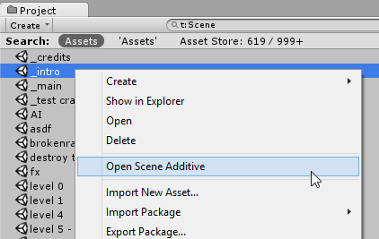
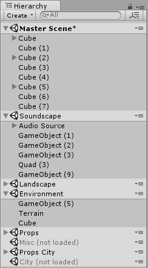
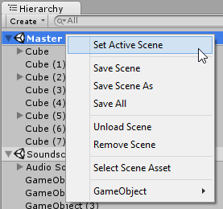
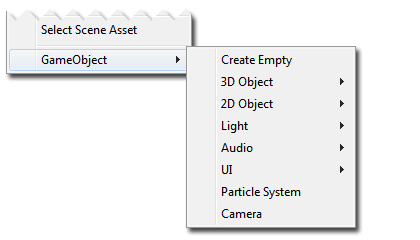
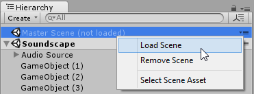
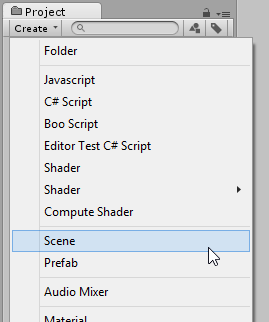

# 多场景编辑

# 多场景编辑

多场景编辑允许同时在 Editor 中打开多个场景，并简化运行时场景管理。

在 Editor 中打开多个场景的功能允许创建大型流媒体世界，并在协作场景编辑时改进工作流程。

本页介绍以下内容：

- Editor 中的多场景编辑集成
- Editor 脚本和运行时脚本 API
- 当前的已知问题

## 在 Editor 中

要打开新场景并将其添加到层级视图中的当前场景列表，请在场景资源的上下文菜单中选择 *Open Scene Additive*，或将一个或多个场景从 Project 窗口拖动到 Hierarchy 窗口中。

Open Scene Additive 会将所选场景资源添加到层级视图中显示的当前场景

在 Editor 中打开多个场景时，每个场景的内容将在 Hierarchy 窗口中单独显示。每个场景的内容都显示在场景分隔栏下方，该分隔栏会显示场景的名称及其保存状态。

Hierarchy 窗口显示了同时打开的多个场景

场景存在于层级视图中时，可**加载**或**卸载**场景以显示或隐藏每个场景中包含的游戏对象。此操作与在 Hierarchy 窗口中**添加**和**删除**场景的操作不同。

层级视图中的场景分隔栏可折叠场景内容，如果加载了大量场景，此功能有助于导航层级视图。

处理多个场景时，每个被修改的场景都需要保存其更改，因此可能有多个未保存的场景同时处于打开状态。未保存更改的场景将在场景分隔栏中的名称旁边显示一个星号。

场景分隔栏中的星号表示此场景有未保存的更改

每个场景都可以通过分隔栏中的上下文菜单进行单独保存。从 File 菜单中选择“Save Scene”或按 Ctrl/Cmd + S 将保存对**所有**打开场景的更改。

场景分割栏中的上下文菜单允许对所选场景执行其他操作。

#### 加载的场景的场景分割栏菜单

| **Set Active Scene**   | This allows you to specify which scene new Game Objects are created/instantiated in. There must always be one scene marked as the active scene |
| ---------------------- | ------------------------------------------------------------ |
| **Save Scene**         | Saves the changes to the selected scene only.                |
| **Save Scene As**      | Saves the selected scene (along with any current modifications) as a new Scene asset. |
| **Save All**           | Saves changes to all scenes.                                 |
| **Unload Scene**       | Unloads the scene, but keeps the scene in the Hierarchy window. |
| **Remove Scene**       | Unloads and removes the scene from the Hierarchy window.     |
| **Select Scene Asset** | Selects the scene’s asset in the Project window.             |
| **GameObject**         | Provides a sub-menu allowing you to create GameObjects in the selected scene. The menu mirrors the creatable items available in Unity’s main GameObject menu. (shown below) |

场景分割栏菜单中的 GameObject 子菜单

#### 卸载的场景的场景分割栏菜单：

| **Load Scene**         | Loads the scene’s contents                       |
| ---------------------- | ------------------------------------------------ |
| **Remove Scene**       | Remove the scene from the Hierarchy window.      |
| **Select Scene Asset** | Selects the scene’s asset in the Project window. |

## 烘焙包含多个场景的光照贴图

要一次烘焙多个场景的**光照贴图数据**，应打开要烘焙的场景，在 Lighting 窗口中关闭“Auto”模式，然后单击 Build 按钮以构建光照。

光照计算的输入是所有场景中的静态几何体和光源。因此，阴影和 GI 光反弹将适用于所有场景。但是，光照贴图和实时 GI 数据拆分为每个场景单独加载/卸载的数据。光照贴图和实时 GI 数据图集在场景之间拆分。这意味着，场景之间的光照贴图永远不会共享，卸载场景时可以放心卸载光照贴图。目前始终会共享光照探针数据，并会同时加载所有烘焙在一起的场景的所有光照探针。

或者，可在 Editor 脚本中使用 [Lightmapping.BakeMultipleScenes](https://docs.unity.cn/cn/2018.4/ScriptReference/Lightmapping.BakeMultipleScenes.html) 函数自动为多个场景构建光照贴图。

## 烘焙包含多个场景的导航网格数据

要一次烘焙多个场景的**导航网格数据**，应打开要烘焙的场景，然后单击 Navigation 窗口中的 Bake 按钮。导航网格数据将烘焙到单个资源中，由所有已加载的场景共享。数据将保存到与当前活动场景名称匹配的文件夹中（例如 ActiveSceneName/NavMesh.asset）。所有加载的场景都将共享此导航网格资源。烘焙导航网格后，应保存受影响的场景，使场景到导航网格的引用持久化。

或者，可在 Editor 脚本中使用 [NavMeshBuilder.BuildNavMeshForMultipleScenes](https://docs.unity.cn/cn/2018.4/ScriptReference/AI.NavMeshBuilder.BuildNavMeshForMultipleScenes.html) 函数自动为多个场景构建导航网格数据。

## 烘焙包含多个场景的遮挡剔除数据

要一次烘焙多个场景的**遮挡剔除数据**，请打开要烘焙的场景，打开遮挡剔除窗口（菜单：__Window__ > **Rendering** > **Occlusion Culling__），然后单击** Bake__ 按钮。遮挡数据将保存到与当前活动场景名称匹配的文件夹内一个名为 *OcclusionCullingData.asset* 的资源中。例如：_Assets/ActiveSceneName/OcclusionCullingData.asset_。在每个打开的场景中会添加对数据的引用。烘焙遮挡剔除后，应保存受影响的场景，使场景到遮挡的引用持久化。

每当以累加方式加载场景时，如果该场景具有与活动场景相同的遮挡数据引用，则会从遮挡数据中初始化该场景的静态渲染器和入口剔除信息。此后，遮挡剔除系统认为所有静态渲染器和入口都已烘焙到单个场景中。

## 播放模式

在播放模式下，在层级视图中有多个场景时，将显示一个额外的场景，名为 *DontDestroyOnLoad*。

在 Unity 5.3 之前，要在播放模式下实例化的任何标记为“DontDestroyOnLoad”的对象仍将显示在层级视图中。这些对象不被视为任何场景的一部分，但是为了让 Unity 仍然显示这些对象，并让您检查这些对象，这些对象现在显示为特殊 DontDestroyOnLoad 场景的一部分。

您无法访问 DontDestroyOnLoad 场景，该场景在运行时不可用。

## 特定于场景的设置

许多设置是特定于每个场景的。如下：

- RenderSettings 和 LightmapSettings（均位于 Lighting 窗口中）
- 导航网格设置
- 遮挡剔除窗口中的场景设置

具体工作原理是每个场景将管理自己的设置，只有与该场景相关的设置才会保存到场景文件中。

如果打开了多个场景，则用于渲染和导航网格的设置是**活动场景**中的设置。这意味着，如果要更改场景的设置，必须仅打开一个场景并更改设置，或者使相关场景成为活动场景并更改设置。

如果在 Editor 中或在运行时切换活动场景，则会应用新场景中的所有设置并替换所有先前的设置。

## 脚本

### Editor 脚本

对于 Editor 脚本，我们提供了一个 [Scene 结构](https://docs.unity.cn/cn/2018.4/ScriptReference/SceneManagement.Scene.html) 和 [EditorSceneManager](https://docs.unity.cn/cn/2018.4/ScriptReference/SceneManagement.EditorSceneManager.html) API 以及一个 [SceneSetup](https://docs.unity.cn/cn/2018.4/ScriptReference/SceneManagement.SceneSetup.html) 实用程序类。

[Scene 结构](https://docs.unity.cn/cn/2018.4/ScriptReference/SceneManagement.Scene.html)在 Editor 中和运行时都可用，并包含一些与场景本身相关的只读属性，例如其名称和资源路径。

[EditorSceneManager 类](https://docs.unity.cn/cn/2018.4/ScriptReference/SceneManagement.EditorSceneManager.html)仅在 Editor 中可用。该类派生自 SceneManager，并具有许多函数，使用这些函数即可通过 Editor 脚本实现上述所有多场景编辑功能。

[SceneSetup 类](https://docs.unity.cn/cn/2018.4/ScriptReference/SceneManagement.SceneSetup.html)是一个小实用程序类，用于存储有关当前层级视图中的场景的信息。

[Undo](https://docs.unity.cn/cn/2018.4/ScriptReference/Undo.html) 和 [PrefabUtility](https://docs.unity.cn/cn/2018.4/ScriptReference/PrefabUtility.html) 类已扩展为支持多个场景。现在可以使用 [PrefabUtility.InstantiatePrefab](https://docs.unity.cn/cn/2018.4/ScriptReference/PrefabUtility.InstantiatePrefab.html) 在给定场景中实例化预制件，并可使用 [Undo.MoveGameObjectToScene](https://docs.unity.cn/cn/2018.4/ScriptReference/Undo.MoveGameObjectToScene.html) 以不可撤销的方式将对象移动到场景的根目录。

**注意**：*要使用 `Undo.MoveGameObjectToScene`，必须确保游戏对象已经位于当前场景的根目录中。*

### 运行时脚本

对于运行时脚本，可在 [SceneManager](https://docs.unity.cn/cn/2018.4/ScriptReference/SceneManagement.SceneManager.html) 类中找到用于处理多个场景的函数（如 **LoadScene** 和 **UnloadScene**）。

## 注意

在 File 菜单中，*Save Scene As* 将仅保存活动场景。*Save Scene* 将保存所有已修改的场景，并会提示命名无标题场景（如果存在）。

通过 Project 窗口的 Create 菜单创建新的场景资源

## 提示和技巧

通过在拖动场景时按住 Alt，可将场景添加到层级视图，同时使其保持_卸载_状态。这样允许在稍后需要时再加载场景。

可使用 Project 窗口中的 *Create* 菜单创建新场景。新场景将包含游戏对象的默认设置。

为避免每次重新启动 Unity 时都必须设置层级视图，或为了方便存储不同的设置，可使用 [EditorSceneManager.GetSceneManagerSetup](https://docs.unity.cn/cn/2018.4/ScriptReference/SceneManagement.EditorSceneManager.GetSceneManagerSetup.html) 获取一个描述当前设置的 SceneSetup 对象列表。然后，可将这些对象序列化为 ScriptableObject 或其他对象以及可能要存储的有关场景设置的所有其他信息。要恢复层级视图，只需重新创建 SceneSetup 列表并使用 [EditorSceneManager.RestoreSceneManagerSetup](https://docs.unity.cn/cn/2018.4/ScriptReference/SceneManagement.EditorSceneManager.RestoreSceneManagerSetup.html)。

若要在运行时获取加载的场景列表，只需使用 [GetSceneAt](https://docs.unity.cn/cn/2018.4/ScriptReference/SceneManagement.SceneManager.GetSceneAt.html) 获取 sceneCount 并遍历这些场景。

可通过 [GameObject.scene](https://docs.unity.cn/cn/2018.4/ScriptReference/GameObject-scene.html) 获取游戏对象所属的场景，并可使用 [SceneManager.MoveGameObjectToScene](https://docs.unity.cn/cn/2018.4/ScriptReference/SceneManagement.SceneManager.MoveGameObjectToScene.html) 将游戏对象移动到场景的根目录。

建议避免使用 DontDestroyOnLoad 来保持需要在多次场景加载后仍存在的管理器游戏对象。相反，应创建一个包含所有管理器的**管理器场景**，并使用 [SceneManager.LoadScene(**, LoadSceneMode.Additive)](https://docs.unity.cn/cn/2018.4/ScriptReference/SceneManagement.SceneManager.LoadScene.html) 和 [SceneManager.UnloadScene](https://docs.unity.cn/cn/2018.4/ScriptReference/SceneManagement.SceneManager.UnloadScene.html) 来管理游戏进度。

## 已知问题

- 在编辑模式下不支持并会阻止跨场景引用。在播放模式下允许这种引用，因为无法保存场景。