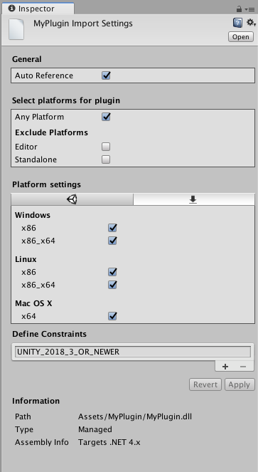
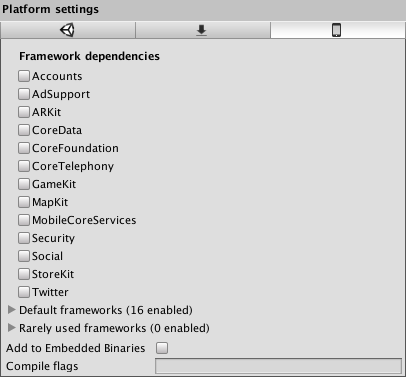
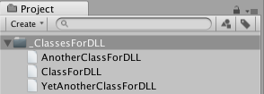

# 插件

在 Unity 中，通常使用脚本来创建功能，但也可使用__插件__形式包含 Unity 外部创建的代码。可在 Unity 中使用两种插件：_托管插件_和_原生插件_。

_托管插件_是使用 Visual Studio 等工具创建的托管 .NET 程序集。此类插件仅包含 .NET 代码，因此无法访问 .NET 库不支持的任何功能。但是，Unity 使用的标准 .NET 工具可以访问托管代码来编译脚本。因此，托管插件代码和 Unity 脚本代码之间几乎没有用法差异，唯一的区别是插件在 Unity 外部编译而成，因此源代码可能不可用。

_原生插件_是特定于平台的本机代码库。此类插件可访问操作系统调用和第三方代码库等功能；Unity 无法通过其他方式使用这些功能。但是，Unity 的工具无法以托管库的方式访问这些库。例如，如果忘记将托管插件文件添加到项目中，您将收到标准编译器错误消息。如果也忘记将原生插件添加到项目中，则只会在尝试运行项目时看到错误报告。

本部分将介绍如何创建插件以及在 Unity 项目中使用插件。

# Plugin Inspector

使用 Plugin Inspector 可指定 Unity 加载和引用插件文件时依据的条件。还可以为插件指定其他平台特定的各种设置。

在 Project 窗口中选择插件一个文件来查看 Plugin Inspector：

“MyPlugin.dll”的 Plugin Inspector

## General

***\*Auto Reference\**** 设置用于控制项目中其他程序集和程序集定义引用插件文件的方式。

如果选中 ***\*Auto Reference\****（默认设置），则所有预定义程序集和程序集定义自动引用插件文件。如果要显式声明对插件的引用，请取消选中 ***\*Auto Reference\****。

使用 Assembly Definition Inspector 窗口可以声明对程序集定义的插件文件的引用。请参阅[脚本编译和程序集定义文件](https://docs.unity.cn/cn/2018.4/Manual/ScriptCompilationAssemblyDefinitionFiles.html)以了解更多信息。

***\*重要信息：\****取消选中 ***\*Auto Reference\**** 时，不能从 Unity 为项目创建的预定义程序集引用插件。这些预定义程序集包含项目中尚未使用程序集定义文件分配给其他程序集的所有脚本。如果一个插件已取消选中 **Auto Reference** 属性，只有使用程序集定义文件创建的程序集中包含的代码才能引用该插件中的类、函数或其他资源。

若要限制可引用插件（通过显式声明对该插件的所有引用）的范围，请将 **Auto Reference** 设置为 false。例如，如果项目中只有一组脚本使用插件，那么可以为这些脚本创建一个程序集定义文件，并创建对该插件的显式引用。因为在整个项目中不再自动引用该插件，所以项目中的其他脚本不会误用该插件。（多个程序集可以使用该插件，但是所有程序集必须显式声明此依赖关系。）另外，如果更改插件，则只需重新编译相关程序集，而不必重新编译整个项目。

还可以使用对插件的显式引用，防止资源包中使用的插件与导入了此包的项目中的其他代码发生冲突。

## Select platforms for plugin

使用 **Select platforms for plugin** 设置可以定义一些与插件文件兼容并要使用该插件文件的平台。平台列表包括 Editor 本身（适用于播放模式以及编辑时运行的任何脚本）、Standalone 以及安装了 Unity 构建支持包的平台（例如 Android、iOS 和 WebGL）。

可以选中 **Any Platform** 并（可选）排除个别平台。或者也可以取消选中 **Any Platform** 并（可选）包含个别平台。

## Platform settings

选择平台后，可从下面单独的 **Platform Settings** 部分中指定其他选项，例如 CPU 类型和特定操作系统。Inspector 窗口的此区域包含每个选定平台的选项卡。一些平台没有设置，或只有少数设置（例如 CPU 和操作系统选择）。

如有可能，Inspector 仅显示适用于特定平台上的插件类型的设置。例如，对于带有 .dll 扩展名的原生插件文件，Inspector 只显示适用于 Windows 的选项，因为此类插件只能用于 Windows。

**注意：**无法卸载原生插件。如果 Editor 已经加载一个插件，那么即使在同一 Editor 会话中更改了该插件的设置，该插件仍会保持加载。必须重新启动 Unity 才能卸载该插件。

#### Editor 设置

使用 Editor 平台设置可以指定插件兼容的 CPU 架构和操作系统。

Editor 选项卡中的选项

大多数托管插件与任何 CPU 和操作系统都兼容，但是原生插件通常只与单个操作系统兼容，并且根据其编译方式，可能只与单个 CPU 架构兼容。

例如，如果选择 **CPU X86**，Unity 会在运行旧版本的 32 位 Editor 时加载插件，但是在运行 64 位版时不加载插件。

同样，如果选择 **OS Windows**，Unity 会在 Windows 系统上运行 Editor 时加载插件，但在 OS X 或 Linux 系统上运行时不加载插件。

#### 独立平台设置

对于独立平台（Windows、OS X、Linux），可以选择与库兼容的 CPU 架构。对于托管库，除非访问特定的系统 API，否则它们通常与任何操作系统和架构都兼容。原生库仅与单个操作系统兼容，但可能与 32 位和/或 64 位 CPU 架构兼容。

另请参阅：[独立平台的 Player 设置](https://docs.unity.cn/cn/2018.4/Manual/class-PlayerSettingsStandalone.html)。

#### 通用 Windows 平台

通用 Windows 平台插件设置将在相应的部分中具体介绍。请参阅：

- [通用 Windows 平台：.NET 脚本后端上的插件](https://docs.unity.cn/cn/2018.4/Manual/windowsstore-plugins.html)
- [通用 Windows 平台：IL2CPP 脚本后端上的插件](https://docs.unity.cn/cn/2018.4/Manual/windowsstore-plugins-il2cpp.html)

#### Android

对于可能与 Android 兼容的插件文件，可以选择 CPU 架构。所选的架构必须与编译库时针对的架构匹配。Unity 不会验证是否已选择正确的设置。

#### iOS 和 tvOS

iOS 和 tvOS 设置可用于指定插件所依赖的 iOS 框架（如有）。

iOS 插件设置，显示了 Framework 依赖项 (Framework dependencies)

对于动态加载的库，以及包含动态加载的库或运行时需要加载的任何资产和资源的捆绑包和框架，请选中 **Add to Embedded Binaries** 选项。选中此选项后，Unity 将设置 Xcode 项目选项，从而将插件文件复制到最终应用程序包。

对于必须编译到构建中的插件源代码文件，可以在 **Compile Flags** 字段中指定编译时需要的任何标志。

**## Define Constraints**

使用 ***\*Define Constraints\**** 设置可以指定一些符号，必须定义（或取消定义）这些符号才能使用插件文件。

Unity 仅在已满足所有 ***\*Define Constraints\**** 时才加载和引用插件。约束的作用与 C# 中的 `#if` 预处理器指令类似，但在程序集级别（而不是脚本级别）运行。必须定义 ***\*Define Constraints\**** 设置中的所有符号，才能满足这些约束。还可以用否定 `!`（叹号）符号作为符号的前缀，指定必须取消定义该符号。例如，如果在 ***\*Define Constraints\**** 中指定以下符号：

Define Constraints

当*未*定义符号 `ENABLE_IL2CPP` 且*已*定义符号 `UNITY_2018_3_OR_NEWER` 时，满足这些约束。或者换言之，仅在 Unity 2018.3 或更高版本的非 IL2CPP 脚本运行时中才加载和引用此程序集。

可以使用 Unity 的任何内置定义符号或者项目的 **Scripting Define Symbols** Player 设置中定义的任何符号。请参阅[平台相关的编译](https://docs.unity.cn/cn/2018.4/Manual/[PlatformDependentCompilation](PlatformDependentCompilation))以了解更多信息（包括内置符号的列表）。请注意，__Scripting Define Symbols__ 设置与具体平台相关。确保在所有相关平台上都定义了必要的符号。

## 插件检测

Unity 通过文件扩展名来检测 Assets 文件夹中的文件是否为插件。具有以下扩展名的文件将视为插件：

- .dll
- .winmd
- .so
- .jar
- .aar
- .xex
- .def
- .suprx
- .prx
- .sprx
- .rpl
- .cpp
- .cc
- .c
- .h
- .jslib
- .jspre
- .bc
- .a
- .m
- .mm
- .swift
- .xib

Unity 还将某些文件夹视为捆绑插件。Unity 并不在此类文件夹中寻找其他插件文件，所以文件夹中的所有内容被视为单个插件。在文件夹包含以下扩展名之一时，Unity 会检测该文件夹是否为捆绑插件：

- .framework
- .bundle
- .plugin

最后，Unity 将父级路径与 **Assets/Plugins/Android/** 完全匹配的文件夹视为 Android 库插件文件夹。Unity 对此类文件夹的处理方式与包含特殊扩展名 .plugin、.bundle 和 .framework 的文件夹相同。

## 默认设置

Unity 根据插件所在的文件夹，设置插件文件的导入设置的默认值：

| **文件夹**                                                   | **默认设置**                                                 |
| :----------------------------------------------------------- | :----------------------------------------------------------- |
| **Assets/../Editor**                                         | 将插件设置为仅与 Editor 兼容，在构建到平台时不会使用。       |
| **Assets/../Editor/**（**x86** 或 **x86_64** 或 **x64**）    | 将插件设置为仅与 Editor 兼容，根据子文件夹分配 CPU 值。      |
| **Assets/../Plugins/**（**x86_64** 或 **x64**）              | 将 x64 独立平台插件设置为兼容。                              |
| **Assets/../Plugins/x86**                                    | 将 x86 独立平台插件设置为兼容。                              |
| **Assets/Plugins/Android/**（**x86** 或 **armeabi** 或 **armeabi-v7a**） | 将插件设置为仅与 Android 兼容，如果存在 CPU 子文件夹，还会设置 CPU 值。 |
| **Assets/Plugins/iOS**                                       | 将插件设置为仅与 iOS 兼容。                                  |
| **Assets/Plugins/WSA/**（**x86** 或 **ARM**）                | 将插件设置为仅与通用 Windows 平台兼容，如果存在 CPU 子文件夹，还会设置 CPU 值。可使用 Metro 关键字代替 WSA。 |
| **Assets/Plugins/WSA/**（**SDK80** 或 **SDK81** 或 **PhoneSDK81**） | 同上，还会设置 SDK 值，此后也可以添加 CPU 子文件夹。出于兼容性原因，SDK81 - Win81，PhoneSDK81 - WindowsPhone81。 |
| **Assets/Plugins/Tizen**                                     | 将插件设置为仅与 Tizen 兼容。                                |
| **Assets/Plugins/PS4**                                       | 将插件设置为仅与 Playstation 4 兼容。                        |

# 托管插件

通常，脚本作为源代码文件保存在项目中，并在每次源代码更改时由 Unity 进行编译。但是，也可以使用外部编译器将脚本编译为**动态链接库** (DLL)。然后可以将生成的 DLL 添加到项目中，并且它包含的类可以像普通脚本一样附加到对象。

在 Unity 中，使用脚本通常比使用 DLL 更容易。但是，可以访问以 DLL 形式提供的第三方 Mono 代码。在开发自己的代码时，可以将代码编译为 DLL 并将其添加到 Unity 项目，这样就能使用 Unity 不支持的编译器。有时可能还希望提供不含源代码的 Unity 代码（例如，对于 Asset Store 产品），此时 DLL 便是一种简单的方法。

## 创建 DLL

为了创建 DLL，首先需要一个合适的编译器。并非所有能生成 .NET 代码的编译器都能保证与 Unity 协同工作，因此在使用编译器进行重要工作之前，建议使用一些可用的代码来测试该编译器是否兼容。如果 DLL 不包含依赖于 Unity API 的代码，则可以使用适当的编译器选项将其直接编译为 DLL。如果确实想使用 Unity API，则需要将 Unity 自己的 DLL 提供给编译器。在 Mac 上，这些都包含在应用程序包中（可以使用上下文菜单中的 Show Package Contents 命令来查看这个包的内部结构：右键单击或按住 Ctrl 键并单击 Unity 应用程序）：

Unity DLL 的路径通常是

```
/Applications/Unity/Unity.app/Contents/Managed/
```

…并有两个名为 UnityEngine.dll 和 UnityEditor.dll 的 DLL。

在 Windows 上，可以在 Unity 应用程序附带的文件夹中找到这些 DLL。路径通常为

```
C:\Program Files\Unity\Editor\Data\Managed
```

…对于 Mac OS，这些 DLL 的名称也是一样的。

编译 DLL 的具体选项将根据使用的编译器而有所不同。例如，Mono C# 编译器的命令行 **mcs** 在 Mac OS 上可能如下所示：

```
mcs -r:/Applications/Unity/Unity.app/Contents/Managed/UnityEngine.dll -target:library ClassesForDLL.cs
```

这里，*-r* 选项指定要包含在构建中的库的路径，在本例中为 UnityEngine 库的路径。*-target* 选项指定需要的构建类型；“library”一词用于选择 DLL 构建。最后，要编译的源文件的名称是 _ClassesForDLL.cs_（假设此文件位于当前工作文件夹中，但可以根据需要使用完整路径来指定文件）。假设一切顺利，生成的 DLL 文件将很快出现在与源文件相同的文件夹中。

## 使用 DLL

编译完成后，可以像任何其他资源一样将 DLL 文件直接拖入 Unity 项目。DLL 资源有一个折叠三角形，可用于显示库中的单独类。从 MonoBehaviour 派生的类可以像普通脚本一样拖到游戏对象上。非 MonoBehaviour 类可以按常规方式直接在其他脚本中使用。

具有可见类并可折叠的 DLL

## 关于 Visual Studio 的分步操作指南

本部分将介绍如何使用 Visual Studio 构建和集成简单的 DLL 示例，以及如何为 DLL 准备调试会话。

### 设置项目

首先，打开 Visual Studio 并创建一个新项目。在 Visual Studio 中，应选择 **File > New > Project__，然后选择** Visual C# > Class Library__。

然后，需要填写新库的信息：

- **Name** 是命名空间（在此示例中使用“DLLTest”作为名称）。
- **Location** 是项目的父文件夹。
- **Solution name** 是项目的文件夹。

接下来，应该添加对 Unity DLL 的引用。在 Visual Studio 中，在 Solution Explorer 中打开 *References* 的上下文菜单，然后选择 **Add Reference**。然后，选择选项 Browse > select file__。

在此阶段，可以选择所需的 DLL 文件。在 Mac OS X 上，文件路径为：

```
Applications/Unity.app/Contents/Managed/UnityEngine.dll
```

在 Windows 中，路径为：

```
Program Files\Unity\Editor\Data\Managed\UnityEngine.dll
```

### 代码

对于此示例，请在 Solution Browser 中将类重命名为 `MyUtilities`，并将其代码替换为以下代码：

```
using System;   
using UnityEngine;

namespace DLLTest {

    public class MyUtilities {
    
        public int c;

        public void AddValues(int a, int b) {
            c = a + b;  
        }
    
        public static int GenerateRandom(int min, int max) {
            System.Random rand = new System.Random();
            return rand.Next(min, max);
        }
    }
}
```

代码准备好后，请构建项目以便生成 DLL 文件及其调试符号。

### 在 Unity 中使用 DLL

对于此示例，请在 Unity 中创建一个新项目，并将构建的文件 <项目文件夹>/bin/Debug/DLLTest.dll 复制到 Assets 文件夹中。然后，在 Assets 文件夹中创建一个名为“Test”的 C# 脚本，并将其内容替换为以下代码：

```
using UnityEngine;
using System.Collections;
using DLLTest;

public class Test : MonoBehaviour {

     void Start () {
        MyUtilities utils = new MyUtilities();
        utils.AddValues(2, 3);
        print("2 + 3 = " + utils.c);
     }
    
     void Update () {
        print(MyUtilities.GenerateRandom(0, 100));
     }
}
```

将此脚本附加到场景中的对象并按 Play 时，Console 窗口中将显示 DLL 代码的输出。

### 设置 DLL 的调试会话

首先，应为 DLL 准备调试符号。在 Visual Studio 中，在命令提示符下执行命令，将 <项目文件夹>\bin\Debug\DLLTest.pdb 作为参数传递：

```
Program Files\Unity\Editor\Data\Mono\lib\mono\2.0\pdb2mdb.exe
```

然后，将转换后的文件 *<项目文件夹>\bin\Debug\DLLTest.dll.mdb* 复制到 *Assets/Plugins* 中。

完成此设置后，可以按常规方式在 Unity 中调试使用 DLL 的代码。有关调试的更多信息，请参阅[脚本工具](https://docs.unity.cn/cn/2018.4/Manual/ScriptingTools.html)部分。

### 编译“不安全”的 C# 代码

Unity 允许编译[“不安全”的 C# 代码](https://docs.microsoft.com/en-us/dotnet/csharp/language-reference/keywords/unsafe)，但需要启用该功能。要执行此操作，请选择 **Edit** > **Project Settings__，然后选择** Player__ 类别。展开 **Other Settings** 面板以显示 **Allow ‘unsafe’ Code** 复选框。

# 原生插件

Unity 广泛支持原生__插件__，即用 C、C++、Objective-C 等编写的原生代码库。插件允许游戏代码（用 Javascript 或 C# 编写）调用这些库中的函数。此功能允许 Unity 与中间件库或现有的 C/C++ 游戏代码集成。

为了使用原生插件，首先需要使用基于 C 的语言编写函数来访问所需的任何功能并将它们编译到库中。在 Unity 中，还需要创建一个 C# 脚本来调用本机库中的函数。

原生插件应提供一个简单的 C 接口供 C# 脚本随后向其他用户脚本公开。当某些低级渲染事件发生时（例如，创建图形设备时），Unity 也可以调用原生插件导出的函数，请参阅[原生插件接口](https://docs.unity.cn/cn/2018.4/Manual/NativePluginInterface.html)页面以了解详细信息。

## 示例

具有单个函数的非常简单的本机库可能具有如下所示的源代码：

```
    float FooPluginFunction () { return 5.0F; }
```

要从 Unity 中访问此代码，可使用如下代码：

```
    using UnityEngine;
        using System.Runtime.InteropServices;

        class SomeScript : MonoBehaviour {

           #if UNITY_IPHONE
   
           // 在 iOS 上，插件以静态方式链接到
           //可执行文件中，因此我们必须使用 __Internal 作为
           // 库名。
           [DllImport ("__Internal")]

           #else

           // 其他平台会动态加载插件，因此
           // 传递插件动态库的名称。
           [DllImport ("PluginName")]
    
           #endif

           private static extern float FooPluginFunction ();

           void Awake () {
              // 在插件中调用 FooPluginFunction
              // 并将 5 输出到控制台
              print (FooPluginFunction ());
           }
        }
```

请注意，使用 Javascript 时，需要使用以下语法，其中 DLLName 表示所编写的插件的名称，如果编写的是静态链接的本机代码，则需要使用“__Internal”：

```
    @DllImport (DLLName)
        static private function FooPluginFunction () : float {};
```

## 创建原生插件

通常，插件是在目标平台上使用本机代码编译器构建的。由于插件函数使用基于 C 的调用接口，因此在使用 C++ 或 Objective-C 时必须避免名称错用问题。

## 其他信息

- [原生插件接口](https://docs.unity.cn/cn/2018.4/Manual/NativePluginInterface.html)（如果要在插件中进行渲染，则需要此接口）
- [Mono 互操作性与本机库](http://www.mono-project.com/Interop_with_Native_Libraries)
- [MSDN 上的 P-invoke 文档](http://msdn2.microsoft.com/en-us/library/fzhhdwae.aspx)

# 构建适用于桌面平台的插件

本页面将介绍适用于桌面平台 (Windows/Mac OS X/Linux) 的[原生代码插件](https://docs.unity.cn/cn/2018.4/Manual/Plugins.html)。

## 构建适用于 Mac OS X 的插件

在 Mac OSX 上，以捆绑包的形式部署[插件](https://docs.unity.cn/cn/2018.4/Manual/Plugins.html)。可使用 XCode 按以下方法创建捆绑包项目：选择 **File > NewProject…**，然后选择 **Bundle** > **Carbon/Cocoa Loadable Bundle__（使用 XCode 3）或** OS X__ > **Framework & Library** > __Bundle__（使用 XCode 4）

如果使用 C++ (.cpp) 或 Objective-C (.mm) 来实现该插件，则必须确保使用 C 链接来声明函数以免发生[名称错用问题](http://en.wikipedia.org/wiki/Name_mangling)。

```
extern "C" {
  float FooPluginFunction ();
}
```

## 构建适用于 Windows 的插件

Windows 上的插件是具有导出函数的 DLL 文件。实际上，任何可创建 DLL 文件的语言或开发环境均可用于创建插件。 与 Mac OSX 一样，应使用 C 链接来声明所有 C++ 函数以免发生名称错用问题。

## 构建适用于 Linux 的插件

Linux 上的插件是具有导出函数的 `.so` 文件。这些库通常用 C 或 C++ 编写而成，但也可使用任何语言编写。 与其他平台一样，应使用 C 链接来声明所有 C++ 函数以免发生名称错用问题。

## 32 位和 64 位库

对于需要 32 位和/或 64 位插件的问题，处理方式因平台而异。

### Windows 和 Linux

在 Windows 和 Linux 上，可以手动管理插件（例如，在构建 64 位播放器之前，将 64 位库复制到 `Assets/Plugins` 文件夹中，在构建 32 位播放器之前，将 32 位库复制到 `Assets/Plugins` 文件夹中），或者可以将 32 位版本的插件放在 `Assets/Plugins/x86` 中，将 64 位版本的插件放在 `Assets/Plugins/x86_64` 中。默认情况下，Editor 将首先查看特定于架构的子目录，如果该目录不存在，则从 `Assets/Plugins` 根文件夹中复制插件。

请注意，对于通用 Linux 构建，需要使用特定于架构的子目录（在进行通用 Linux 构建时，Editor 不会从 `Assets/Plugins` 根文件夹中复制任何插件）。

### Mac OS X

对于 Mac OS X，应将插件构建为包含 32 位和 64 位架构的通用二进制文件。

## 使用 C# 中的插件

构建捆绑包后，应将其放在 Unity 项目的 **Assets > Plugins** 文件夹中（或适当的特定于架构的子目录中）。在 C# 脚本中定义如下所示的函数时，Unity 将按名称查找捆绑包：

```
[DllImport ("PluginName")]
private static extern float FooPluginFunction ();
```

请注意，__PluginName__ 不应包含库前缀和文件扩展名。例如，插件文件的实际名称在 Windows 上为 PluginName.dll，在 Linux 上为 libPluginName.so。 请注意，每次更改插件中的代码时，都需要在项目中重新编译脚本，否则插件将没有最新的编译代码。

## 部署

对于跨平台插件，必须在 Plugins 文件夹中包含 .bundle（对于 Mac）、.dll（对于 Windows）和 .so（对于 Linux）文件。 然后便不需要您执行任何其他操作，Unity 会自动为目标平台选择正确的插件并将其包含在播放器中。

## 示例

### 最简单的插件

此插件项目只实现了一些非常基本的操作（打印一个数字，打印一个字符串，将两个浮点数相加，将两个整数相加）。如果这是您的第一个 Unity 插件，此示例可能会有所帮助。 此项目位于[此处](https://docs.unity.cn/cn/2018.4/uploads/Examples/SimplestPluginExample-4.0.zip)，其中包含 Windows、Mac 和 Linux 项目文件。

### 使用 C++ 代码渲染

[原生插件接口](https://docs.unity.cn/cn/2018.4/Manual/NativePluginInterface.html)页面上提供了一个在 Unity 中使用多线程渲染技术的多平台插件示例。

# 低级原生插件接口

除了基本脚本接口之外，Unity 中的[原生代码插件](https://docs.unity.cn/cn/2018.4/Manual/Plug-ins)还可以在发生某些事件时接收回调。这主要用于实现插件中的低级渲染，并使低级渲染能够与 Unity 的多线程渲染一起使用。

定义 Unity 所公开的接口的头文件随 Editor 一起提供。

## 接口注册表

插件应导出 `UnityPluginLoad` 和 `UnityPluginUnload` 函数来处理主要的 Unity 事件。请参阅 `IUnityInterface.h` 以查看正确的签名。提供给插件的 `IUnityInterfaces` 是为了访问更多的 Unity API。

```
# include "IUnityInterface.h"
# include "IUnityGraphics.h"
// Unity 插件加载事件
extern "C" void UNITY_INTERFACE_EXPORT UNITY_INTERFACE_API
    UnityPluginLoad(IUnityInterfaces* unityInterfaces)
{
    IUnityGraphics* graphics = unityInterfaces->Get<IUnityGraphics>();
}
```

## 访问图形设备

插件可通过获取 `IUnityGraphics` 接口来访问通用图形设备功能。在早期版本的 Unity 中，必须导出 `UnitySetGraphicsDevice` 函数才能接收图形设备上的事件的相关通知。从 Unity 5.2 开始，新的 IUnityGraphics 接口（位于 `IUnityGraphics.h` 中）提供了一种注册回调的方式。

```
# include "IUnityInterface.h"
# include "IUnityGraphics.h"
    
static IUnityInterfaces* s_UnityInterfaces = NULL;
static IUnityGraphics* s_Graphics = NULL;
static UnityGfxRenderer s_RendererType = kUnityGfxRendererNull;
    
// Unity 插件加载事件
extern "C" void UNITY_INTERFACE_EXPORT UNITY_INTERFACE_API
    UnityPluginLoad(IUnityInterfaces* unityInterfaces)
{
    s_UnityInterfaces = unityInterfaces;
    s_Graphics = unityInterfaces->Get<IUnityGraphics>();
        
    s_Graphics->RegisterDeviceEventCallback(OnGraphicsDeviceEvent);
        
    // 在插件加载时运行 OnGraphicsDeviceEvent(initialize)
    // 在图形设备已初始化的情况下不错过该事件
    OnGraphicsDeviceEvent(kUnityGfxDeviceEventInitialize);
}
    
// Unity 插件卸载事件
extern "C" void UNITY_INTERFACE_EXPORT UNITY_INTERFACE_API
    UnityPluginUnload()
{
    s_Graphics->UnregisterDeviceEventCallback(OnGraphicsDeviceEvent);
}
    
static void UNITY_INTERFACE_API
    OnGraphicsDeviceEvent(UnityGfxDeviceEventType eventType)
{
    switch (eventType)
    {
        case kUnityGfxDeviceEventInitialize:
        {
            s_RendererType = s_Graphics->GetRenderer();
            //TODO：用户初始化代码
            break;
        }
        case kUnityGfxDeviceEventShutdown:
        {
            s_RendererType = kUnityGfxRendererNull;
            //TODO：用户关闭代码
            break;
        }
    case kUnityGfxDeviceEventBeforeReset:
        {
            //TODO：用户 Direct3D 9 代码
            break;
        }
    case kUnityGfxDeviceEventAfterReset:
        {
            //TODO：用户 Direct3D 9 代码
            break;
        }
    };
}
```

## 渲染线程上的插件回调

如果平台和可用 CPU 数允许，则在 Unity 中的渲染可以是多线程的。当使用多线程渲染时，执行这些渲染 API 命令的线程完全独立于运行 MonoBehaviour 脚本的线程。因此，您的插件并非总是可以立即开始进行渲染，因为它可能会干扰渲染线程此时正在进行的工作。

为了从插件中进行**任何**渲染，应从脚本中调用 [GL.IssuePluginEvent](https://docs.unity.cn/cn/2018.4/ScriptReference/GL.IssuePluginEvent.html)。这将导致从渲染线程调用提供的本机函数。例如，如果从摄像机的 OnPostRender 函数调用 GL.IssuePluginEvent，则在该摄像机已完成渲染后，您将立即获得插件回调。

在 `IUnityGraphics.h` 中提供了 `UnityRenderingEvent` 回调的签名。 原生插件代码示例：

```
// 用于处理特定渲染事件的插件函数
static void UNITY_INTERFACE_API OnRenderEvent(int eventID)
{
    //TODO：用户渲染代码
}
    
// 自由定义的函数，用于将回调传递给特定于插件的脚本
extern "C" UnityRenderingEvent UNITY_INTERFACE_EXPORT UNITY_INTERFACE_API
    GetRenderEventFunc()
{
    return OnRenderEvent;
}
```

托管插件代码示例：

```
# if UNITY_IPHONE &amp;&amp; !UNITY_EDITOR
[DllImport ("__Internal")]
# else
[DllImport("RenderingPlugin")]
# endif
private static extern IntPtr GetRenderEventFunc();
    
// 对要在渲染线程上调用的特定回调进行排队
GL.IssuePluginEvent(GetRenderEventFunc(), 1);
```

现在还可通过 [CommandBuffer.IssuePluginEvent](https://docs.unity.cn/cn/2018.4/ScriptReference/Rendering.CommandBuffer.IssuePluginEvent.html) 将此类回调添加到 CommandBuffer。

## 使用 OpenGL 图形 API 的插件

有两种 OpenGL 对象：跨 OpenGL 上下文共享的对象（纹理、缓冲、渲染缓冲、采样器、查询、着色器和程序对象）和每个 OpenGL 的上下文对象（顶点数组、帧缓冲、程序管线、变换反馈和同步对象）。

Unity 使用多个 OpenGL 上下文。在初始化和关闭 Editor 和播放器时，我们依赖于**主**上下文，但我们使用专用上下文进行渲染。因此，在 `kUnityGfxDeviceEventInitialize` 和 `kUnityGfxDeviceEventShutdown` 事件期间无法创建每个上下文的对象。

例如，原生插件在 `kUnityGfxDeviceEventInitialize` 事件期间无法创建顶点数组对象并在 `UnityRenderingEvent` 回调中使用该对象，因为活动上下文不是顶点数组对象创建期间使用的上下文。

## 示例

Bitbucket 上提供了一个低级渲染插件的示例：**[bitbucket.org/Unity-Technologies/graphicsdemos](https://bitbucket.org/Unity-Technologies/graphicsdemos)**（NativeRenderingPlugin 文件夹）。该示例展示了两个方面：

- 在完成所有常规渲染后，从 C++ 代码渲染旋转三角形。
- 从 C++ 代码填充程序化纹理（使用 Texture.GetNativeTexturePtr 来访问该纹理）。

该项目适用于：

- 装有 Direct3D 9、Direct3D 11、Direct3D 12 和 OpenGL 的 Windows (Visual Studio 2015)。
- 装有 Metal 和 OpenGL 的 Mac OS X (Xcode)。
- 装有 Direct3D 11 和 Direct3D 12 的通用 Windows 平台。
- WebGL

# 低级原生插件 Profiler API

[Unity Profiler](https://docs.unity.cn/cn/2018.4/Manual/Profiler.html) 原生插件可以通过脚本从 Unity 中提取数据，以便在诸如 Razor (PS4)、PIX（Xbox、Windows）、Chrome Tracing、ETW、ITT、Vtune 和 Telemetry 之类的外部工具中进行分析。Unity Profiler 记录事件，Profiler [原生插件](https://docs.unity.cn/cn/2018.4/Manual/NativePlugins.html)[ API](https://docs.unity.cn/cn/2018.4/Manual/NativePlugins.html) 将这些事件公开给第三方性能分析 API，后者再将它们传递给相关的分析工具。

以下 Unity Profiler 功能有助于捕获用于性能分析的检测数据：

- __类别__：Unity 将性能分析数据分组到不同类别，例如渲染 (Rendering)、脚本 (Scripting) 和动画 (Animation)，并为每个类别指定颜色。这有助于在 Profiler 窗口中直观区分数据类型。Profiler 原生插件 API 可以获取这些颜色，以便可以在外部性能分析器中使用它们。

- __用途标志__：Unity Profiler 将以下用途标志应用于事件标记以帮助过滤数据：

  - 描述一个标记在 Unity Editor 或开发或发布播放器中是否可用的可用性标志。
  - 与您在 Editor 中执行的任务类型相关的详细级别，以及任务所需的信息级别（例如，内部、调试或用户级别）。

  用途标志可用于在将数据传递给外部工具之前对数据进行过滤以减少生成的数据量，并在外部工具中过滤数据以减少信息中的干扰。

- __帧事件__：Profiler 原生插件 API 可以在外部性能分析器中执行帧时间分析。

- __线程性能分析__：Unity 在线程（例如，主线程、渲染线程和作业系统工作线程）上执行大量工作。您可以使用 Profiler 原生插件 API 在任何线程上启用性能分析。

## 插件 API 回调

原生 Profiler 插件 API 提供了 Unity 子系统与第三方性能分析 API 之间的接口。此 API 由 *IUnityProfilerCallbacks* 头公开，并由 Unity 存储在 Unity 安装目录的 *<UnityInstallPath>\Editor\Data\PluginAPI* 文件夹中。

要使用 Unity Profiler 在外部性能分析器中生成的检测数据，请使用以下最少量的回调：

1.`RegisterCreateCategoryCallback`：每当 Unity 创建一个类别时，Profiler 都会获取类别名称和颜色，并注册此回调。

2.`RegisterCreateMarkerCallback`：每当 Unity 创建一个标记时，Profiler 都会获取标记名称、类别和用途标志，并注册此回调。UnityProfilerMarkerDesc 表示一个持久性指针，可用于过滤 RegisterMarkerEventCallback 中的标记。

3.`RegisterMarkerEventCallback`：使用 Unity Profiler 等效工具跟踪外部性能分析器 push/pop 标记，并为给定的标记注册事件回调。Unity Profiler 在发生限定范围的检测事件或单次事件时运行指定的回调。您还可以将内存分配和垃圾收集事件作为标记进行跟踪。Unity 将这些事件分别表示为 `GC.Alloc` 和 `GC.Collect`。

4.`RegisterFrameCallback`：将样本封装到逻辑帧中以便在没有帧概念的外部性能分析器中使用，并注册当 Unity 启动下一个逻辑 CPU 帧时由 Unity Profiler 运行的回调。

5.`RegisterCreateThreadCallback`：每当 Unity 注册一个用于性能分析的线程时，Profiler 都会获取内部线程名称，并为该线程注册此回调。

## 用途示例

### 最小的示例

以下示例显示如何将开始和结束事件发送到外部性能分析器：

```
| #include <IUnityInterface.h>
# include <IUnityProfilerCallbacks.h><br/>
static IUnityProfilerCallbacks* s_UnityProfilerCallbacks = NULL;
static void UNITY_INTERFACE_API MyProfilerEventCallback(
    const UnityProfilerMarkerDesc* markerDesc,
    UnityProfilerMarkerEventType eventType,
    unsigned short eventDataCount,
    const UnityProfilerMarkerData* eventData, void* userData)
{
    switch (eventType)
    {
        case kUnityProfilerMarkerEventTypeBegin:
        {
            MyProfilerPushMarker(markerDesc->name);
            break;
        }
        case kUnityProfilerMarkerEventTypeEnd:
        {
            MyProfilerPopMarker(markerDesc->name);
            break;
        }
    }
}
static void UNITY_INTERFACE_API MyProfilerCreateEventCallback(
    const UnityProfilerMarkerDesc* markerDesc, void* userData)
{
    s_UnityProfilerCallbacks->
      RegisterEventCallback(markerDesc, MyProfilerEventCallback, NULL);
}
extern "C" void UNITY_INTERFACE_EXPORT UNITY_INTERFACE_API UnityPluginLoad(IUnityInterfaces* unityInterfaces)
{
    s_UnityProfilerCallbacks = unityInterfaces->Get<IUnityProfilerCallbacks>();
    s_UnityProfilerCallbacks->
      RegisterCreateEventCallback(&MyProfilerCreateEventCallback, NULL);
}
extern "C" void UNITY_INTERFACE_EXPORT UNITY_INTERFACE_API UnityPluginUnload()
{
    s_UnityProfilerCallbacks->
      UnregisterCreateEventCallback(&MyProfilerCreateEventCallback, NULL);
    s_UnityProfilerCallbacks->
      UnregisterEventCallback(NULL, &MyProfilerEventCallback, NULL);
}
```

__注意__：要从所有标记中取消注册给定的回调，请将第一个参数设置为 NULL 后运行 UnregisterEventCallback。

### UnitySystracePlugin 示例

您可以每帧动态注册和取消注册标记回调。以下示例说明了如何根据第三方性能分析状态通过启用和禁用回调来最大限度降低性能分析开销。

```
| static void UNITY_INTERFACE_API SystraceFrameCallback(void* userData)
{
    bool isCapturing = ATrace_isEnabled();
    if (isCapturing != s_isCapturing)
    {
        s_isCapturing = isCapturing;
        if (isCapturing)
        {
            s_UnityProfilerCallbacks-><br/>              RegisterCreateMarkerCallback(SystraceCreateEventCallback, NULL);
        }
        else
        {
            s_UnityProfilerCallbacks->
              UnregisterCreateMarkerCallback(SystraceCreateEventCallback, NULL);
            s_UnityProfilerCallbacks->
              UnregisterMarkerEventCallback(NULL, SystraceEventCallback, NULL);
        }
    }
}
```

__注意__：为了最大限度减少回调开销，可以仅在捕获期间注册回调。

Systrace API 提供了 ATrace_isEnabled API，用于确定是否已启用捕获。您可以逐帧进行此检查以动态启用或禁用回调。有关更高级用途的示例，请参阅 [UnitySystracePlugin 代码仓库](https://github.com/Over17/UnitySystracePlugin)。

## 有用的标记

Unity 具有以下包含有用元数据的标记：

### Profiler.DefaultMarker

Unity 为 [Profiler.BeginSample](https://docs.unity.cn/cn/2018.4/ScriptReference/Profiling.Profiler.BeginSample.html) 和 [Profiler.EndSample](https://docs.unity.cn/cn/2018.4/ScriptReference/Profiling.Profiler.EndSample.html) 事件保留的标记。`kUnityProfilerMarkerEventTypeBegin eventType` 对应于 `Profiler.BeginSample` 事件并具有以下数据：

- Int32：`UnityEngine.Object` 实例 ID，如果未指定对象，则为 0。
- UInt16 数组：传递给 `Profiler.BeginSample` 的 UTF16 字符串。此大小以字节为单位。
- UInt32：类别索引。

### GC.Alloc

与垃圾收集分配相对应的标记。该标记提供以下数据：

- Int64：分配大小。

# 低级原生插件渲染扩展

除了[低级原生插件接口](https://docs.unity.cn/cn/2018.4/Manual/NativePluginInterface.html)之外，Unity 还支持低级渲染扩展，这些扩展可在发生特定事件时接收回调。这主要用于实现和控制插件中的低级渲染，并使低级渲染能够与 Unity 的多线程渲染一起使用。

由于此扩展的低级特性，可能需要在创建设备之前预先加载插件。目前约定以名称为基础：插件名称必须以 *GfxPlugin* 开头（例如：_GfxPluginMyNativePlugin_）。

Unity 公开的渲染扩展定义位于随 Editor 提供的文件 *IUnityRenderingExtensions.h* 中（请参阅文件路径 _Unity\Editor\Data\PluginAPI_）。

支持原生插件的所有平台都支持这些扩展。

## 渲染扩展 API

要利用渲染扩展，插件应导出 *UnityRenderingExtEvent* 以及选择性导出 *UnityRenderingExtQuery*。include 文件中提供了大量文档。

## 渲染线程上的插件回调

只要 Unity 触发其中一个内置事件，就会通过 *UnityRenderingExtEvent* 调用插件。还可使用脚本通过 [CommandBuffer.IssuePluginEventAndData](https://docs.unity.cn/cn/2018.4/ScriptReference/Rendering.CommandBuffer.IssuePluginEventAndData.html) 或 [CommandBuffer.IssuePluginCustomBlit](https://docs.unity.cn/cn/2018.4/ScriptReference/Rendering.CommandBuffer.IssuePluginCustomBlit.html) 将回调添加到 CommandBuffers。

# 低级原生插件着色器编译器访问

除了[低级原生插件接口](https://docs.unity.cn/cn/2018.4/Manual/NativePluginInterface.html)之外，Unity 还支持对着色器编译器的低级访问，从而允许用户将不同的变体注入着色器。这也是一种事件驱动的方法：当某些内置事件发生时，插件将接收回调。

Unity 公开的着色器编译器访问扩展定义位于 IUnityShaderCompilerAccess.h 中，随 Editor 提供。

目前仅在 D3D11 上支持这些扩展。随后将有更多平台支持这些扩展。

## 着色器编译器访问扩展 API

为了利用渲染扩展，插件应导出 UnityShaderCompilerExtEvent。include 文件中提供了大量文档。

只要 Unity 触发其中一个内置事件，就会通过 UnityShaderCompilerExtEvent 调用插件。还可使用脚本通过 CommandBuffer.IssuePluginEventAndData 或 CommandBuffer.IssuePluginCustomBlit 命令将回调添加到 CommandBuffers。

除了基本脚本接口之外，Unity 中的[原生代码插件](https://docs.unity.cn/cn/2018.4/Manual/Plugins.html)还可以在发生某些事件时接收回调。这主要用于实现插件中的低级渲染，并使低级渲染能够与 Unity 的多线程渲染一起使用。

定义 Unity 所公开的接口的头文件随 Editor 一起提供。

## 着色器编译器访问配置接口

Unity 提供了一个配置着色器编译器访问的接口 (IUnityShaderCompilerExtPluginConfigure)。此接口由插件用于保留自己的关键字并配置着色器程序和 GPU 程序编译器掩码（应该调用插件的着色器或 GPU 程序的类型）

