# 窗口知识点

[toc]

## Project窗口

各个资源在右侧面板中显示为图标，这些图标指示了资源的类型（脚本、材质、子文件夹等）。可使用面板底部的滑动条调整图标大小；如果滑动条移动到最左侧，这些图标将替换为层级列表视图。滑动条左侧的空白位置显示当前选定项，包括该项的完整路径（如果正在执行搜索）。

项目结构列表上方是 **Favorites** 部分，可在其中保存常用项以方便访问。可将所需项从项目结构列表拖动到 Favourites 部分，也可在此处保存搜索查询结果（请参阅下面的**搜索**）。

### 搜索

浏览器具有强大的搜索功能，对于在大型或不熟悉的项目中查找资源特别有用。基本搜索将根据搜索框中输入的文本过滤资源

如果输入多个搜索词，则搜索范围会缩小，因此如果输入 _coastal scene_，只会查找名称中同时包含“coastal”和“scene”的资源（即，搜索词通过 AND 逻辑结合）。

搜索栏右侧有三个按钮。第一个按钮可根据资源类型进一步过滤搜索到的资源。

继续向右的下一个按钮根据资源标签来过滤资源（可在 [Inspector](https://docs.unity.cn/cn/current/Manual/UsingTheInspector.html) 中为资源设置标签）。由于标签的数量可能非常庞大，因此标签菜单有自己的迷你搜索过滤框。

请注意，这些过滤条件的工作原理是在搜索文本中添加额外的搜索词。以“t:”开头的搜索词按指定的资源类型进行过滤，而“l:”按标签过滤。如果知道要查找的具体内容，可直接在搜索框中输入这些搜索词，无需使用菜单。一次可搜索多个类型或标签。添加几个类型将使搜索扩展以便包括所有指定的类型（即，多个类型通过 OR 逻辑结合）。添加多个标签会将搜索范围缩小到具有任意指定标签的项（即，多个标签将通过 OR 逻辑组合在一起）。

Project Browser 的搜索也可应用于 Unity **Asset Store** 中可用的资源。如果从痕迹导航栏的菜单中选择 __Asset Store__，则会显示 Asset Store 中与查询匹配的所有免费和付费资源。按类型和标签搜索的工作方式与 Unity 项目相同。首先根据资源名称检查搜索查询词，然后按顺序检查资源包名称、资源包标签和资源包描述（因此，名称中包含搜索词的项的排名将高于资源包描述中包含该搜索词的项）。

### 快捷键

| **F**              | 定格所选项（即，在包含文件夹中显示所选资源）                 |
| ------------------ | ------------------------------------------------------------ |
| **Tab**            | 在第一列和第二列之间移动焦点（两列）                         |
| **Ctrl/Cmd + F**   | 聚焦搜索字段                                                 |
| **Ctrl/Cmd + A**   | 选择列表中的所有可见项                                       |
| **Ctrl/Cmd + D**   | 复制所选资源                                                 |
| **Delete**         | 删除并显示对话框 (Win)                                       |
| **Delete + Shift** | 删除而不显示对话框 (Win)                                     |
| **Delete + Cmd**   | 删除而不显示对话框 (OSX)                                     |
| **Enter**          | 开始重命名所选项 (OSX)                                       |
| **Cmd + 向下箭头** | 打开所选资源 (OSX)                                           |
| **Cmd + 向上箭头** | 跳转到父文件夹（OSX，两列）                                  |
| **F2**             | 开始重命名所选项 (Win)                                       |
| **Enter**          | 打开所选资源 (Win)                                           |
| **Backspace**      | 跳转到父文件夹（Win，两列）                                  |
| **向右箭头**       | 展开所选项（树视图和搜索结果）。如果该项已展开，则将选择其第一个子项。 |
| **向左箭头**       | 折叠所选项（树视图和搜索结果）。如果该项已折叠，则将选择其父项。 |
| **Alt + 向右箭头** | 将资源显示为预览时展开项                                     |
| **Alt + 向左箭头** | 将资源显示为预览时折叠项                                     |

## Scene窗口

### 场景视图辅助图标 (Scene Gizmo) 位于 Scene 视图的右上角。此控件用于显示 Scene 视图摄像机的当前方向，并允许快速修改视角和投影模式。

场景视图辅助图标在立方体的每一面都有一个锥形臂。最前面的锥形臂标有 **X**、**Y** 和 **Z**。单击任何锥形轴臂会将 Scene 视图摄像机对齐到该锥形轴臂所代表的轴（例如：顶视图、左视图和前视图）。还可以右键单击该立方体来显示一个包含视角列表的菜单。要返回默认视角，请右键单击场景视图辅助图标，然后单击 **Free**。

此外还可启用和关闭__透视图 (Perspective)**。这种情况下会在__透视图 (Perspective)** 和__正交视图 (Orthographic)__（有时称为“等距”）之间更改 Scene 视图的投影模式。为此，请单击场景视图辅助图标中心的立方体或其下方的文本。正交视图没有透视，可与其中一个锥形轴臂的单击操作结合使用来获得前视图、顶视图或侧视图。

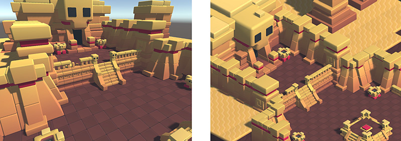在透视模式（左）和正交模式（右)下显示的场景

在正交模式下以顶视图和前视图显示的同一场景

如果 Scene 视图处于一个尴尬的视点（颠倒或是让人感到困惑的角度），请按住 Shift 键并单击场景视图辅助图标中心的立方体，即可返回__透视图__，使用从侧面和略微从上方观察的角度查看场景。

单击场景视图辅助图标右上角的挂锁可启用或禁用场景的旋转。禁用场景旋转后，右键单击鼠标可以平移视图而不是旋转视图。此时的功能与手形工具 (Hand tool) 相同

请注意，在 __2D 模式__中，不显示场景视图辅助图标，因为此情况下唯一的选择是让视图垂直于 XY 平面。

### 在Scene视图中移动、旋转、缩放

移动、旋转和缩放是 Scene 视图导航中的关键操作。Unity 提供了几种方法来执行这些操作以提供最大的便利性：

### 箭头移动

可使用__箭头键__在场景中移动，就好像在场景中“走动”一样。向上和向下箭头使摄像机朝所在方向前后移动。向左和向右箭头可横向平移视图。使用箭头时按住 **Shift** 键可以加快移动速度。

### 手形工具

选择手形工具（快捷键：__Q__）时，可使用以下鼠标控制方式：

 __移动：__单击并拖动可拖动摄像机。

 **旋转：__按住** Alt__，然后左键单击并拖动可围绕当前轴心点旋转摄像机。此选项在 2D 模式下不可用，因为该模式下采用正交视图。

 **缩放：__按住** Alt__，然后单击鼠标右键并拖动可缩放 Scene 视图。在 Mac 上也可以按住 __Control__，然后左键单击并拖动。

按住 **Shift** 可提高移动和缩放的速度。

### 飞越模式

使用__飞越模式 (Flythrough mode)__ 可以通过第一人称飞行来导航 Scene 视图，类似于在许多游戏中导航的方式。

- 单击并按住鼠标右键。
- 使用鼠标移动视图，使用 **WASD** 键向左/向右/向前/向后移动，使用 **Q** 和 **E** 键向上和向下移动。
- 按住 **Shift** 键可以加快移动速度。

飞越模式是专为__透视模式__设计的。在__正交模式__中，按住鼠标右键并移动鼠标会使摄像机旋转。

请注意，飞越模式在 2D 模式中不可用。相反，按住鼠标右键并移动鼠标可以在 Scene 视图中平移。

### 将视图居中于游戏对象上

要将 Scene 视图居中于游戏对象上，请在 Hierarchy 窗口中选择该游戏对象，然后将鼠标移到 Scene 视图上并按 **F**。此功能也可在菜单栏中的 **Edit** > **Frame Selected** 下找到。要将视图锁定到游戏对象（即使游戏对象正在移动），请按 **Shift+F**。此功能也可在菜单栏中的 **Edit** > **Lock View to Selected** 下找到。

### 游戏对象定位

要选择游戏对象，请在 [Scene 视图](https://docs.unity.cn/cn/current/Manual/UsingTheSceneView.html)中单击该游戏对象，或在 [Hierarchy 窗口](https://docs.unity.cn/cn/current/Manual/Hierarchy.html)中单击其名称。要选择或取消选择多个游戏对象，请在单击时按住 **Shift** 键，或拖拽一个矩形来框选多个游戏对象。

Unity 会在 Scene 视图中突出显示选择的游戏对象及其子项。默认情况下，选择轮廓颜色为橙色，子项轮廓颜色为蓝色。还可以选择以其他颜色突出显示所选游戏对象的线框。在 Unity Preferences 窗口（在 macOS 上选择 **Unity > Preferences__，或在 Windows 上选择** Edit > Preferences__）中可以更改所有这些轮廓突出显示颜色。

如果选择了四个变换组件工具之一，则选择的游戏对象还会在 Scene 视图中显示辅助图标：

工具栏中的第一个工具__手形工具 (Hand Tool)__ 用于平移场景。**移动 (Move)**、**旋转 (Rotate)**、**缩放 (Scale)**、**矩形变换 (Rect Transform)** 和__变换 (Transform)__ 工具用于编辑各个游戏对象。要更改游戏对象的[变换](https://docs.unity.cn/cn/current/Manual/class-Transform.html)组件，请使用鼠标操纵任何辅助图标轴，或直接在 Inspector 中的__变换__组件的数字字段中输入值。

或者，也可以使用热键选择四个__变换__模式之一：__W__ 表示移动，__E__ 表示旋转，__R__ 表示缩放，__T__ 表示矩形变换，__Y__ 表示变换。

### 位置

单击左侧的 **Pivot**/**Center** 按钮可在 **Pivot** 和 **Center** 之间切换。

- **Pivot** 将辅助图标定位在网格的实际轴心点。
- **Center** 将辅助图标定位在游戏对象渲染边界的中心。

### 旋转

单击右侧的 **Local**/**Global** 按钮可在 **Local** 和 **Global** 之间切换。

- **Local** 保持辅助图标相对于游戏对象的旋转。
- **Global** 将辅助图标固定在世界空间方向。

### 单位对齐

使用__移动__工具或__变换__工具拖动任何辅助图标轴时，按住 **Control** 键（Mac 上为 **Command** 键）可对齐到 **Snap Settings__（菜单：__Edit** > **Snap Settings…**）中定义的增量

### 表面对齐

使用__移动__工具在中心拖动时，按住 **Shift** 和 **Control__（Mac 上为** Command__）可快速将游戏对象对齐到任何__碰撞体__的交叉点。

### 观察旋转

使用__旋转__工具时，按住 **Shift** 和 **Control__（Mac 上为** Command__）可将游戏对象朝任何__碰撞体__表面上的一个点旋转。

### 顶点对齐

使用__顶点对齐__可快速组合场景：从给定的网格中获取任何顶点，并将该顶点放置在与您选择的任何其他网格中的任何顶点相同的位置。例如，使用顶点对齐在赛车游戏中精确对齐路段，或者在网格的顶点定位能量块。

按照以下步骤使用顶点对齐：

1.选择要操作的网格，并确保__移动__工具或__变换__工具处于活动状态。

2.按住 **V** 键激活顶点对齐模式。

3.将光标移动到网格上要用作轴心点的顶点上。

4.当光标位于所需顶点上方时按住鼠标左键，将网格拖动到另一个网格上的任何其他顶点旁边。

5.对结果感到满意时，松开鼠标按键和 **V** 键（__Shift+V__ 用作此功能的开关）。

**注意：**可将顶点对齐到顶点，将顶点对齐到表面，将轴心对齐到顶点。

### Scene视图控制栏

在 Scene 视图控制栏中可以选择用于查看场景的各种选项，还可以控制是否启用光照和音频。这些控件仅在开发期间影响 Scene 视图，对构建的游戏没有影响。

## 绘制模式 (Draw mode) 菜单

第一个下拉菜单选择要用于描绘场景的__绘制模式__。可用选项为：

### Shading mode

- __Shaded__：显示表面时使纹理可见。
- __Wireframe__：使用线框表示形式绘制网格。
- __Shaded Wireframe__：显示网格纹理并叠加线框。

### Miscellaneous

- __Shadow Cascades__：显示方向光[阴影级联](https://docs.unity.cn/cn/2018.4/Manual/DirLightShadows.html)。
- __Render Paths__：使用颜色代码显示每个对象的[渲染路径](https://docs.unity.cn/cn/2018.4/Manual/RenderingPaths.html)：蓝色表示[延迟着色](https://docs.unity.cn/cn/2018.4/Manual/RenderTech-DeferredShading.html)，绿色表示[延迟光照](https://docs.unity.cn/cn/2018.4/Manual/RenderTech-DeferredLighting.html)，黄色表示[前向渲染](https://docs.unity.cn/cn/2018.4/Manual/RenderTech-ForwardRendering.html)，红色表示[顶点光照](https://docs.unity.cn/cn/2018.4/Manual/RenderTech-VertexLit.html)。
- __Alpha Channel__：用 Alpha 渲染颜色。
- __Overdraw__：将对象渲染为透明的“轮廓”。透明的颜色会累积，因此可以轻松找到一个对象绘制在另一个对象上的位置。
- __Mipmaps__：使用颜色代码显示理想的纹理大小：红色表示纹理大于必要值（在当前距离和分辨率下）；蓝色表示纹理可以更大。当然，理想的纹理大小取决于游戏运行的分辨率以及摄像机与特定表面的接近程度。
- __Texture Streaming__：根据游戏对象在[纹理串流](https://docs.unity.cn/cn/2018.4/Manual/TextureStreaming.html)系统中的状态，将游戏对象着色为绿色、红色或蓝色。如需了解更多信息，请参阅有关[纹理串流调试](https://docs.unity.cn/cn/2018.4/Manual/TextureStreaming.html#Debugging)的文档。

### Deferred

通过这些模式，可以单独查看 G 缓冲区的每个元素（__Albedo**、**Specular**、**Smoothness__ 和 __Normal__）。请参阅有关[延迟着色](https://docs.unity.cn/cn/2018.4/Manual/RenderTech-DeferredShading.html)的文档以了解更多信息。

### 全局光照

可使用以下模式来可视化[全局光照](https://docs.unity.cn/cn/2018.4/Manual/GlobalIllumination.html)系统的各个方面：__UV Charts**、**Systems**、**Albedo**、**Emissive**、**Irradiance**、**Directionality**、**Baked**、**Clustering__ 和 **Lit Clustering**。请参阅有关 [GI 可视化](https://docs.unity.cn/cn/2018.4/Manual/GIVis.html)的文档以了解每种模式。

### Material Validator

**材质验证器 (Material Validator)** 有两种模式：__Albedo__ 和 **Metal Specular**。使用这些模式可以检查基于物理的材质是否使用建议范围内的值。请参阅[基于物理的材质验证器](https://docs.unity.cn/cn/2018.4/Manual/MaterialValidator.html)以了解更多信息。

## 2D、Lighting 和 Audio 开关

在 **Render Mode** 菜单的右侧有三个按钮，用于打开或关闭 Scene 视图的某些选项：

- __2D__：在场景的 2D 和 3D 视图之间切换。在 2D 模式下，摄像机朝向正 z 方向，x 轴指向右方，y 轴指向上方。
- __Lighting__：打开或关闭 Scene 视图光照（光源、对象着色等）。
- __Audio__：打开或关闭 Scene 视图音频效果。

## Effects 按钮和菜单

该菜单（由 **Audio** 按钮右侧的小山丘图标激活）具有在 Scene 视图中启用或禁用渲染效果的选项。

- __Skybox__：在场景的背景中渲染的天空盒纹理
- __Fog__：视图随着与摄像机之间的距离变远而逐渐消褪到单调颜色。
- __Flares__：光源上的镜头光晕。
- __Animated Materials__：定义动画化的材质是否显示动画

**Effects** 按钮本身充当一次性启用或禁用所有效果的开关。

## Gizmos 菜单

Gizmos 菜单包含用于控制对象、图标和辅助图标的显示方式的许多选项。此菜单在 Scene 视图和 [Game 视图](https://docs.unity.cn/cn/2018.4/Manual/GameView.html)中均可用。请参阅有关 [Gizmos 菜单](https://docs.unity.cn/cn/2018.4/Manual/GizmosMenu.html)手册页的文档以了解更多信息。

## 搜索框

控制栏上最右边的控制项是一个搜索框，可按照名称和/或类型过滤 Scene 视图中的项（可使用搜索框左侧的小菜单对此进行选择）。与搜索过滤条件匹配的项集合也将显示在 Hierarchy 视图中（默认情况下，该视图位于 Scene 视图的左侧）。

# Gizmos 菜单

[Scene 视图](https://docs.unity.cn/cn/2018.4/Manual/UsingTheSceneView.html)和 [Game 视图](https://docs.unity.cn/cn/2018.4/Manual/GameView.html)都有 **Gizmos** 菜单。单击 Scene 视图或 Game 视图的工具栏中的 **Gizmos** 按钮，即可访问 **Gizmos** 菜单。

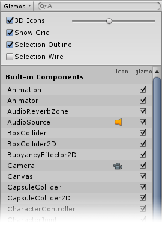Scene 视图或 Game 视图窗口之上的 Gizmos 菜单

| **属性**                | **功能**                                                     |
| :---------------------- | :----------------------------------------------------------- |
| **3D Icons**            | **3D Icons** 复选框控制是否在 Scene 视图中由 Editor 绘制 3D 组件图标（例如光源和摄像机的图标）。  勾选 **3D Icons** 复选框后，组件图标由 Editor 根据组件与摄像机的距离进行缩放，并被场景中的游戏对象遮挡。可使用滑动条来控制外观的总体大小。未勾选 **3D Icons** 复选框时，以固定大小绘制组件图标，且这些图标始终绘制在 Scene 视图中所有游戏对象之上。  请参阅下面的[辅助图标和图标](https://docs.unity.cn/cn/2018.4/Manual/GizmosMenu.html#GizmosIcons)以查看图像以及更多信息。 |
| **Show Grid**           | **Show Grid** 复选框用于在 Scene 视图中打开（选中）和关闭（取消选中）标准场景测量网格。要更改网格的颜色，请访问 **Unity** > **Preferences** > **Colors__，然后更改** Grid__ 设置。  此选项仅在 Scene 视图的 Gizmos 菜单中可用；无法在 Game 视图的 Gizmos 菜单中启用该选项。  请参阅下面的 [Show Grid](https://docs.unity.cn/cn/2018.4/Manual/GizmosMenu.html#ShowGrid) 以查看图像以及更多信息。 |
| **Selection Outline**   | 选中 **Selection Outline** 可以通过彩色轮廓来显示所选的游戏对象，并用另一种彩色轮廓显示其子项。默认情况下，Unity 以橙色突出显示所选游戏对象，而以蓝色突出显示子游戏对象。  **注意：__此选项仅在 Scene 视图的 Gizmos 菜单中可用；无法在 Game 视图的 Gizmos 菜单中启用该选项。  请参阅下面的 [Selection Outline 和 Selection Wire](https://docs.unity.cn/cn/2018.4/Manual/GizmosMenu.html#SelectionOutlineWire) 以查看图像以及更多信息。\| \|** Selection Wire**\| 选中** Selection Wire__ 可以在显示所选的游戏对象时使其线框网格可见。要更改 Selection Wire 的颜色，请选择 **Unity** > **Preferences** > **Colors__，然后更改** Selected Wireframe__ 设置。  此选项仅在 Scene 视图的 Gizmos 菜单中可用；无法在 Game 视图的 Gizmos 菜单中启用该选项。  请参阅下面的 [Selection Outline 和 Selection Wire](https://docs.unity.cn/cn/2018.4/Manual/GizmosMenu.html#SelectionOutlineWire) 以查看图像以及更多信息。 |
| **Built-in Components** | **Built-in Components** 列表决定了具有图标或辅助图标的所有组件类型是否显示图标和辅助图标。  请参阅下面的 [Built-in Components](https://docs.unity.cn/cn/2018.4/Manual/GizmosMenu.html#Components) 以了解更多信息。 |

## 辅助图标和图标

### 辅助图标

__辅助图标__是与场景中的游戏对象相关联的图形。有些辅助图标仅在选择游戏对象时才会显示，而其他辅助图标由 Editor 显示（无论选择什么游戏对象）。这些辅助图标通常是线框，使用代码而不是位图图形来绘制，还可以交互。**摄像机**辅助图标和**光线方向**辅助图标（如下图所示）是内置辅助图标的两个示例；还可以使用脚本来创建自己的辅助图标。请参阅[了解视锥体](https://docs.unity.cn/cn/2018.4/Manual/UnderstandingFrustum.html)相关文档以了解有关摄像机的更多信息。

有些辅助图标是被动图形覆盖层，显示来供参考（例如，**光线方向**辅助图标用于显示光线的方向）。其他辅助图标具有交互性，例如[音频源 (AudioSource)](https://docs.unity.cn/cn/2018.4/Manual/class-AudioSource.html) **球形范围**辅助图标，可以单击并拖动此辅助图标来调整音频源的最大范围。

**移动**、**缩放**、__旋转__和__变换__工具也是交互式辅助图标。请参阅关于[游戏对象定位](https://docs.unity.cn/cn/2018.4/Manual/PositioningGameObjects.html)的文档以了解关于这些工具的更多信息。

摄像机辅助图标和光源辅助图标。这些辅助图标仅在被选中时才可见。

请参阅 [OnDrawGizmos](https://docs.unity.cn/cn/2018.4/ScriptReference/MonoBehaviour.OnDrawGizmos.html) 函数的脚本参考页面以了解关于在脚本中实现自定义辅助图标的更多信息。

### 图标

可以在 Game 视图或 Scene 视图中显示__图标__。图标是扁平、公告牌式覆盖层，可以用来清楚地指示在处理游戏时游戏对象在游戏中的位置。**摄像机**图标和**光源**图标便是内置图标的示例；还可以将您自己的图标分配给游戏对象或各个脚本（请参阅关于[分配图标](https://docs.unity.cn/cn/2018.4/Manual/AssigningIcons.html)的文档以了解如何执行此操作）。

## Show Grid

**Show Grid** 功能可在场景平面上启用网格。以下图像显示了网格在 Scene 视图中的显示情况：

要更改网格的颜色，请选择 **Unity** > **Preferences** > **Colors__，然后更改** Grid__ 设置。在此图像中，Scene 视图网格为深蓝色，因此在浅色地板上更显眼：

## Selection Outline 和 Selection Wire

### Selection Outline

启用 **Selection Outline** 后，所选游戏对象及其子游戏对象周围将显示轮廓。默认情况下，Unity 以橙色显示所选游戏对象的轮廓，而以蓝色显示子游戏对象的轮廓。可以在 Unity 偏好设置中更改这些颜色（请参阅下文的[选择颜色](https://docs.unity.cn/cn/2018.4/Manual/GizmosMenu.html#SelectionColors)）。

选择游戏对象时，Unity 会显示其所有子游戏对象（以及它们的子游戏对象，依此类推）的轮廓，但不会显示父游戏对象（或它们的父游戏对象，依此类推）的轮廓。

### Selection Wire

启用 **Selection Wire** 后，在 Scene 视图或 Hierarchy 窗口中选择游戏对象时，将在 Scene 视图中显示该游戏对象的线框网格：

### 选择颜色

可为选择线框设置自定义颜色。

1.选择 **Unity > Preferences** (macOS) 或 **Edit > Preferences** (Windows) 以打开 [Preferences](https://docs.unity.cn/cn/2018.4/Manual/Preferences.html) 编辑器。 1.在 Colors 选项卡上，更改以下一种或多种颜色： * (A) **Selected Children Outline__：所选游戏对象的子项的轮廓颜色。 \* (B)** Selected Outline__：所选游戏对象的轮廓颜色。 * (C) __Wireframe Selected__：所选游戏对象的线框的轮廓颜色。

## Built-in Components

使用 **Built-in Components** 列表可以控制具有图标或辅助图标的所有组件类型是否显示图标和辅助图标。

此处未列出某些内置组件类型（例如刚体），因为它们不会在 Scene 视图中显示图标或辅助图标。只会列出具有图标或辅助图标的组件。

Editor 还在此处列出一些项目脚本（位于内置组件之上）。如下：

- 已分配图标的脚本（请参阅关于[分配图标](https://docs.unity.cn/cn/2018.4/Manual/AssigningIcons.html)的文档）。
- 实现 [OnDrawGizmos](https://docs.unity.cn/cn/2018.4/ScriptReference/MonoBehaviour.OnDrawGizmos.html) 函数的脚本。
- 实现 [OnDrawGizmosSelected](https://docs.unity.cn/cn/2018.4/ScriptReference/MonoBehaviour.OnDrawGizmosSelected.html) 函数的脚本。

**icon** 列显示或隐藏每个列出的组件类型的图标。单击 **icon** 列下的小图标即可切换该图标的可视性。如果菜单中的图标为全彩色，该图标将显示在 Scene 视图中；如果图标在菜单中显示为灰色，该图标将在 Scene 视图中不可见。带有自定义图标的所有脚本都会显示一个下拉菜单小箭头。单击此箭头可以显示图标选择器 (icon selector) 菜单，可以在其中更改脚本的图标。

**注**：如果列表中的项具有辅助图标而没有图标，则 icon 列中没有它的选项。

勾选 **Gizmo** 列中的复选框可以选择 Editor 是否为特定组件类型绘制辅助图标图形。例如，碰撞体具有预定义的线框辅助图标来显示其形状，而摄像机具有辅助图标来显示[视锥体](https://docs.unity.cn/cn/2018.4/Manual/UnderstandingFrustum.html)。自有的脚本可以绘制适合自身用途的自定义辅助图标；应实现 [OnDrawGizmos](https://docs.unity.cn/cn/2018.4/ScriptReference/MonoBehaviour.OnDrawGizmos.html) 或 [OnDrawGizmosSelected](https://docs.unity.cn/cn/2018.4/ScriptReference/MonoBehaviour.OnDrawGizmosSelected.html) 来执行此操作。取消选中此列中的复选框可以关闭这些辅助图标。

**注意**：如果列表中的项具有图标而没有辅助图标，则此列中没有它的复选框。

# Game 视图

从游戏中的摄像机渲染 Game 视图。该视图代表最终发布的游戏。需要使用一个或多个摄像机来控制玩家在玩游戏时实际看到的内容。有关摄像机的更多信息，请查看[摄像机组件页面](https://docs.unity.cn/cn/2018.4/Manual/class-Camera.html)。

可使用工具栏中的按钮来控制 Editor 播放模式以及查看发布的游戏的播放情况。在播放模式下，所做的任何更改都是暂时的，在退出播放模式后将会重置。Editor UI 会变暗来提醒此情况。

## Game 视图控制栏

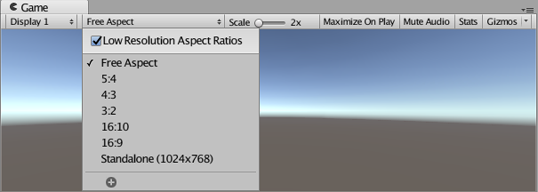

| **按钮**             | **功能**                                                     |                                                              |
| :------------------- | :----------------------------------------------------------- | ------------------------------------------------------------ |
| **显示屏**           | 如果场景中有多个摄像机，可单击此按钮从摄像机列表中进行选择。默认情况下，此按钮设置为 **Display 1**。（可以在摄像机模块中的 **Target Display** 下拉菜单下将显示分配给摄像机。） |                                                              |
| **Aspect**           | 可选择不同值来测试游戏在具有不同宽高比的显示器上的显示效果。默认情况下，此设置为 **Free Aspect**。 |                                                              |
|                      | **Low Resolution Aspect Ratios**                             | 如果要模拟更旧显示屏的像素密度，请选中此框：选择宽高比后，此功能会降低 Game 视图的分辨率。Game 视图位于非 Retina 显示屏上时，此复选框始终处于启用状态。 |
| **Scale 滑动条**     | 向右滚动可放大并更详细地检查游戏屏幕的区域。设备分辨率高于 Game 视图窗口大小的情况下，该滚动条还可缩小视图以查看整个屏幕。在游戏停止或暂停时，也可以使用滚轮和鼠标中键来执行此操作。 |                                                              |
| **Maximize on Play** | 单击按钮启用：进入播放模式时，使用此按钮可使 Game 视图最大化（Editor 窗口的 100%）以便进行全屏预览。 |                                                              |
| **Mute audio**       | 单击按钮启用：进入播放模式时，使用此按钮可将任何游戏内的音频静音。 |                                                              |
| **Stats**            | 单击此按钮可以切换 Statistics 覆盖层，其中包含有关游戏音频和图形的[渲染统计信息](https://docs.unity.cn/cn/2018.4/Manual/RenderingStatistics.html)。这对于在播放模式下监控游戏性能非常有用。 |                                                              |
| **Gizmos**           | 单击此按钮可切换[辅助图标](https://docs.unity.cn/cn/2018.4/Manual/GizmosMenu.html)的可见性。要在播放模式下仅查看某些类型的辅助图标，请单击 **Gizmos** 一词旁边的下拉箭头，然后仅选中要查看的辅助图标类型的复选框。（请参阅以下的辅助图标选项。） |                                                              |

## Gizmos 菜单

Gizmos 菜单包含用于控制对象、图标和辅助图标的显示方式的许多选项。此菜单在 Scene 视图和 Game 视图中均可用。请参阅有关 [Gizmos 菜单](https://docs.unity.cn/cn/2018.4/Manual/GizmosMenu.html)的文档以了解更多信息。

## 高级选项

右键单击 Game 选项卡可以显示 Game 视图的高级选项。

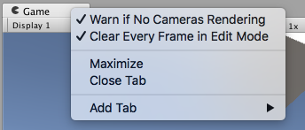

__Warn if No Cameras Rendering__：此选项默认为启用状态：如果没有摄像机渲染到屏幕，会显示警告。这对于诊断意外删除或禁用摄像机等问题非常有用。除非故意不使用摄像机来渲染游戏，否则应将此选项保持启用状态。

__Clear Every Frame in Edit Mode__：此选项默认为启用状态：在游戏未播放时，会每帧清除 Game 视图。这可以防止在配置游戏时出现拖尾效果。除非在未处于播放模式时依赖于前一帧的内容，否则应将此选项保持启用状态。

# Hierarchy 窗口

打开 Unity 新项目时的默认 Hierarchy 窗口视图

**Hierarchy** 窗口会列出当前场景中的每个游戏对象（在本指南中称为“对象”）。其中一些对象是资源文件的直接实例（如 3D 模型），其他则是预制件的实例，这是构成游戏大部分内容的自定义对象。在场景中添加和删除对象时，这些对象也会在层级视图中相应显示和消失。

默认情况下，对象在 Hierarchy 窗口中按其生成顺序列出。可以通过向上或向下拖动对象，或通过使对象成为“子”或“父”对象来对其重新排序（见下文）。

## 父子化

Unity 使用一种称为**父子化**的概念。创建一组对象时，最顶层对象或场景被称为“父对象”，而在其下面分组的所有对象被称为“子对象”或“子项”。还可以创建嵌套的父子对象（称为顶级父对象的“后代”）。

在此图中，**Child** 和 **Child 2** 是 **Parent** 的子对象。**Child 3** 是 **Child 2** 的子对象，也是 **Parent** 的后代。

单击父对象的下拉箭头（位于其名称的左侧）可显示或隐藏其子项。在按住 Alt 键的同时单击下拉箭头可以切换父对象的所有后代对象（不仅仅包括直接子对象）的可见性。

### 设定子对象

要使任何对象成为另一对象的“子项”，请将目标子对象拖放到层级视图中的目标父对象上。

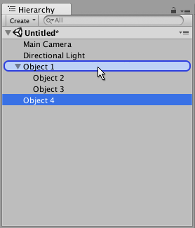在此图中，**Object 4**（选定对象）被拖到目标父对象 **Object 1**（以蓝色胶囊形状突出显示)上。

还可以将对象拖放到其他对象旁边，使这些对象成为“同级”：即同一父对象下的子对象。将对象拖到现有对象的上方或下方，直到出现水平蓝线，然后将对象放下，即可将其放在现有对象旁边。

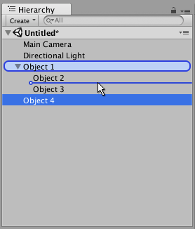在此图中，**Object 4**（选定对象）被拖动到 **Object 2** 与 **Object 3** 之间（以蓝色水平线指示），从而作为这两个对象的同级而放置在父对象 **Object 1**（以蓝色胶囊形状突出显示)之下。

子对象会继承父对象的移动和旋转。要了解与此相关的更多信息，请参阅关于[变换组件](https://docs.unity.cn/cn/2018.4/Manual/class-Transform.html)的文档。

## 字母数字排序

Hierarchy 窗口中对象的顺序可以更改为字母数字顺序。在菜单栏中，选择 **Edit > Preferences**（在 Windows 中）或者选择 **Unity > Preferences**（在 OS X 中），启动 **Preferences** 窗口。选中 **Enable Alpha Numeric Sorting**。

选中此复选框时，Hierarchy 窗口的右上角会出现一个图标，允许在 **Transform** 排序（默认值）或 **Alphabetic** 排序之间切换。

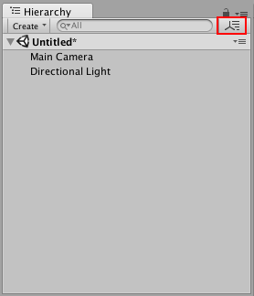

## 多场景编辑

可以在 Hierarchy 窗口中同时打开多个场景。要查找与此相关的更多信息，请参阅[多场景编辑](https://docs.unity.cn/cn/2018.4/Manual/MultiSceneEditing.html)页面。

# Inspector 窗口

Unity Editor 中的项目由多个[游戏对象](https://docs.unity.cn/cn/2018.4/Manual/GameObjects.html)组成，而这些游戏对象包含脚本、声音、网格和其他图形元素（如光源）。Inspector 窗口（有时称为“Inspector”）显示有关当前所选游戏对象的详细信息，包括所有附加的[组件](https://docs.unity.cn/cn/2018.4/Manual/Components.html)及其属性，并允许修改场景中的游戏对象的功能。

## 检查游戏对象

使用 Inspector 可以查看和编辑 Unity Editor 中几乎所有内容（包括物理游戏元素，如游戏对象、资源和材质）的属性和设置，以及 Editor 内的设置和偏好设置。

在 [Hierarchy](https://docs.unity.cn/cn/2018.4/Manual/Hierarchy.html) 或 [Scene](https://docs.unity.cn/cn/2018.4/Manual/UsingTheSceneView.html) 视图中选择游戏对象时，Inspector 将显示该游戏对象的所有组件和材质的属性。使用 Inspector 可以编辑这些组件和材质的设置。

上图显示的 Inspector 中选择了 Main Camera 游戏对象。除了游戏对象的 Position、Rotation 和 Scale 值之外，还可以编辑 Main Camera 的所有属性。

当游戏对象附加了自定义脚本组件时，Inspector 会显示该脚本的公共变量。可以像编辑 Editor 的内置组件的设置一样将这些变量作为设置进行编辑。这意味着可以轻松地在脚本中设置参数和默认值，而无需修改任何代码。

## 检查资源

在 [Project 窗口](https://docs.unity.cn/cn/2018.4/Manual/ProjectView.html)中选择[资源](https://docs.unity.cn/cn/2018.4/Manual/AssetWorkflow.html)后，Inspector 将显示关于如何导入资源和在运行时（游戏在 Editor 中或已发布的版本中运行时）使用该资源的设置。

每种类型的资源都有一组不同的设置。以下各图显示了 Inspector 的一些示例，其中展示了其他资源类型的导入设置：

[模型导入设置](https://docs.unity.cn/cn/2018.4/Manual/class-FBXImporter.html)窗口的 [Model 选项卡](https://docs.unity.cn/cn/2018.4/Manual/FBXImporter-Model.html)：

[音频剪辑导入设置](https://docs.unity.cn/cn/2018.4/Manual/class-AudioClip.html)窗口：

Inspector 窗口显示了音频文件的导入设置

[纹理导入设置](https://docs.unity.cn/cn/2018.4/Manual/class-TextureImporter.html)窗口：

Inspector 窗口显示了纹理的导入设置

## 预制件

如果选择了预制件，则 Inspector 窗口中会提供一些额外的选项。

有关更多信息，请参阅关于[预制件](https://docs.unity.cn/cn/2018.4/Manual/Prefabs.html)的文档。

## 项目设置

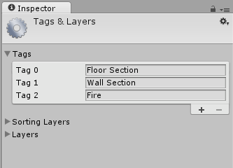Inspector 窗口显示了 **Tags & Layers** 项目设置面板

选择任何项目设置类别（菜单：__Editor__ > __Project Settings__）时，这些设置将显示在 Inspector 窗口中。有关更多信息，请参阅关于[项目设置](https://docs.unity.cn/cn/2018.4/Manual/comp-ManagerGroup.html)的文档。

## 图标和标签

可为游戏对象和脚本分配自定义图标。这些图标显示在 Scene 视图中，同时还有光源和摄像机等游戏对象的内置图标。

有关图标和标签的更多信息，请参阅关于[分配图标](https://docs.unity.cn/cn/2018.4/Manual/AssigningIcons.html)的 Unity 文档。

## 对组件重新排序

要在 Inspector 窗口中对组件重新排序，请将组件的标题从一个位置拖放到另一个位置。拖动组件标题时，会出现蓝色插入标记。此标记显示了拖动标题时可以将组件放置到的位置：

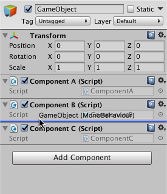在 Inspector 窗口中拖放游戏对象上的组件

只能对一个游戏对象上的组件重新排序。不能在不同的游戏对象之间移动组件。

还可以将脚本资源直接拖放到期望的位置。

选择多个游戏对象时，Inspector 会显示所选的多个游戏对象共有的所有组件。要一次性重新排序所有这些共有组件，请选择多个游戏对象，然后在 Inspector 中将组件拖放到新位置。

在 Inspector 窗口中为组件指定的顺序便是在查询用户脚本中的组件时需要使用的顺序。如果以编程方式查询组件，您将得到在 Inspector 中显示的顺序。

# 分配图标

Unity 允许为游戏对象和脚本分配自定义图标。这些图标与光源和摄像机等的内置图标一起显示在 Scene 视图中。使用 [Gizmos 菜单](https://docs.unity.cn/cn/2018.4/Manual/GizmosMenu.html)可控制在 Scene 视图中绘制图标的方式。

### 游戏对象 Select Icon 按钮

要更改游戏对象的图标，请在 Hierarchy 窗口或 Scene 视图中选择游戏对象，然后在 Inspector 窗口中的游戏对象名称左侧单击 **Select Icon** 按钮（蓝色立方体，在下图中用红色方框突出显示）。

Inspector 窗口中的游戏对象 **Select Icon** 按钮（此处以红色方框突出显示)

将图标分配给游戏对象后，图标将在 Scene 视图中显示在该游戏对象（以及之后的任何重复项）的上方。还可以将图标分配给预制件，从而将图标应用于场景中该预制件的所有实例。

### 脚本 Select Icon 按钮

要为脚本指定自定义图标，请在 Project 窗口中选择脚本，然后在 Inspector 窗口中的脚本名称左侧单击 **Select Icon** 按钮（C# 文件图标，在下图中以红色方框突出显示）。

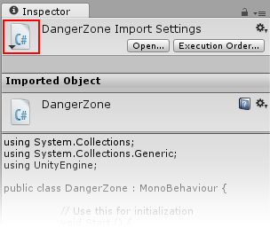Inspector 窗口中的脚本 **Select Icon** 按钮（此处以红色方框突出显示)

为脚本分配某个图标后，Scene 视图中任何附加了此脚本的游戏对象上方都会显示此图标。

## Select Icon 菜单

无论是为游戏对象还是脚本分配图标，弹出的 **Select Icon** 菜单都是相同的：

**Select Icon** 菜单包含若干个内置图标。单击某个图标将其选中，或单击 **Other…** 从项目资源中选择要用作图标的图像。

内置图标分为两类：__标签图标__和__纯图像图标__。

**标签图标**

将标签图标分配给游戏对象或脚本，可在 Scene 视图中显示游戏对象的名称。

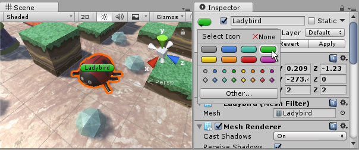分配了标签图标的游戏对象

**纯图像图标**

纯图像图标不显示游戏对象的名称。这些图标对于分配可能没有可视表示的游戏对象（例如，导航路点）非常有用。分配图标后，即可在 Scene 视图中查看并单击该图标来选择和移动本来不可见的游戏对象。

分配给多个不可见游戏对象的黄色菱形图标

项目中的任何资源图像也可以用作图标。例如，骷髅头图标可用于指示关卡中的危险区域。

骷髅头图像已分配给脚本。附加了该脚本的任何游戏对象上都会显示此图标。

**注意：**更改资源的图标后，资源本身会被标记为已修改，因此会被版本控制系统选中。

# 编辑属性

__属性__是可以在 Inspector 中编辑的组件的设置和选项。

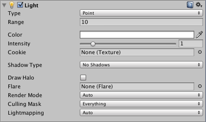光源组件显示了各种值和引用属性

属性可以大致分为_引用_（链接到其他对象和资源）或_值_（数字、复选框、颜色等）。

## 引用

可以通过将相应类型的对象或资源拖放到 Inspector 中的属性来分配引用。例如，[网格过滤器 (Mesh Filter)](https://docs.unity.cn/cn/2018.4/Manual/class-MeshFilter.html) 组件需要在项目中某处引用[网格](https://docs.unity.cn/cn/2018.4/Manual/class-Mesh.html)资源。最初创建该组件时，未分配引用：

…但可以通过将网格资源放到组件上来向其分配网格：

还可以使用__对象选择器 (Object Picker)__，为引用属性选择对象。如果单击 Inspector 中属性右侧的小圆圈图标，则会显示如下窗口：

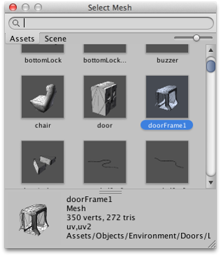

对象选择器可用于搜索和选择场景或项目资源中的对象（窗口底部的信息面板可以根据需要而升高和降低）。为引用属性选择对象只需在选择器中双击该对象即可。

引用属性为组件类型（例如[变换组件](https://docs.unity.cn/cn/2018.4/Manual/class-Transform.html)）时，可以将任何对象拖到该属性上；Unity 会查找此对象上该类型的第一个组件，然后将其分配给该引用。如果对象没有任何正确类型的组件，将拒绝该分配。

### 颜色

单击颜色属性时，将打开__拾色器__。

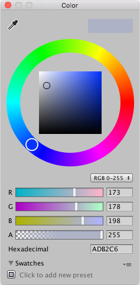Unity 拾色器窗口

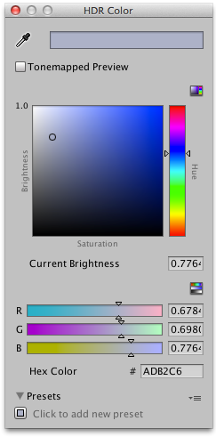HDR 拾色器窗口（单击标准着色器中的发射颜色属性或在脚本中将 ColorUsageAttribute 用于颜色时显示)

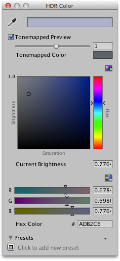HDR 拾色器窗口中显示已选中色调映射选项

Unity 使用自己的拾色器，但是在 Mac OS X 上，可以在 [Preferences](https://docs.unity.cn/cn/2018.4/Manual/Preferences.html) 中选用系统拾色器（菜单：__Unity > Preferences__，然后从 *General* 面板选择 __Use OS X Color Picker__）。

### 渐变

在图形和动画中，通常需要在空间或时间上逐渐将一种颜色混入另一种颜色。__渐变__是颜色渐进的可视表现，用于显示主要颜色（称为__停靠点__）以及这些颜色之间的所有中间色：

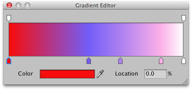

沿着渐变条底部的向上箭头表示停靠点。可以通过单击停靠点来将其选中；停靠点的值将显示在颜色框中。单击该框时将打开标准拾色器。在渐变条下方单击可以创建新的停靠点。只需单击并拖动即可更改任何停靠点的位置，还可以使用 **ctrl/cmd + delete** 来移除停靠点。

渐变条上方的向下箭头也是停靠点，但是这些停靠点对应于该点处渐变的 Alpha（透明度）。默认情况下，有两个停靠点设置为 100％ Alpha（即完全不透明），但可以添加和编辑任意数量的停靠点，具体操作方式与颜色停靠点的方式大致相同。

### 曲线

__曲线__是一个线形图，显示对输入变化值（在 X 轴上）的响应（在 Y 轴上）。

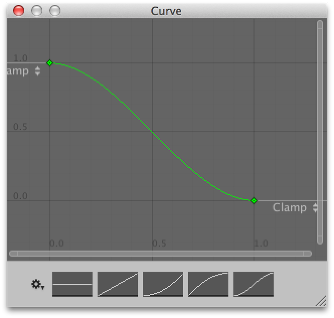曲线编辑器

曲线在 Unity 中的各种不同上下文中使用，尤其可用于动画，并且具有许多不同的选项和工具。手册的[编辑曲线](https://docs.unity.cn/cn/2018.4/Manual/EditingCurves.html)页面中对此进行了相关说明。

### 数组

脚本将数组公开为公共变量时，Inspector 将显示值编辑器，从而编辑数组的大小以及其中的值或引用。

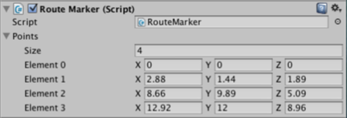具有 Vector3 数组属性的脚本

减小 *Size* 属性时，将移除数组末尾的值。增加大小时，会将当前的最后一个值复制到添加的所有新元素中。这在设置具有大致相同值的数组时非常有用 - 可以设置第一个元素，然后更改大小以将其复制到其他所有元素。

## 一次编辑多个对象

## 一次编辑多个对象

选择了两个或更多对象时，可以一起编辑这些对象共有的组件（即，将提供的值复制到所有选定对象）。

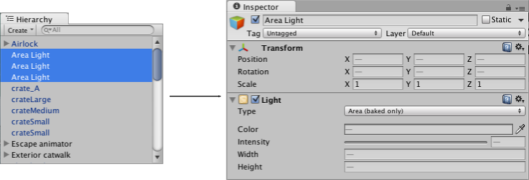Inspector 中已选择多项

如果所有选定对象的属性值相同，则将显示该值，否则，将该值显示为短划线字符。只有_所有_对象共有的组件才会显示在 Inspector 中。如果任何选定对象具有其他对象上不存在的组件，则 Inspector 将显示一条消息，指出某些组件已隐藏。属性的上下文菜单（通过右键单击属性名称标签来打开）的某些选项允许从任何所选组件设置属性值。

请注意，也可以一次编辑预制件的多个选定实例，但常规的 *Select*、*Revert* 和 *Apply* 按钮将不可用。

# 样本库

使用样本库可重用、保存和共享颜色、渐变和动画曲线。可在[拾色器 (Color Picker)](https://docs.unity.cn/cn/2018.4/Manual/EditingValueProperties.html)、[渐变编辑器 (Gradient Editor)](https://docs.unity.cn/cn/2018.4/Manual/EditingValueProperties.html) 和[曲线编辑器 (Curve Editor)](https://docs.unity.cn/cn/2018.4/Manual/EditingValueProperties.html) 中保存和选择样本。

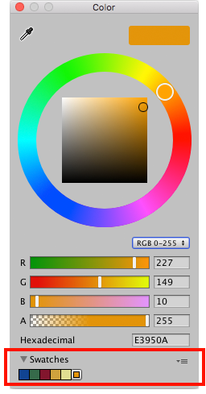Unity 拾色器中的 Swatches 部分（红色框)

样本库是保存在文件中的样本集合。Swatches 部分一次显示一个样本库。

要保存样本，请执行以下操作：

1.打开拾色器、渐变编辑器或曲线编辑器。例如，在 [Hierarchy](https://docs.unity.cn/cn/2018.4/Manual/Hierarchy.html) 窗口中选择 **Main Camera**。 1.在 [Inspector](https://docs.unity.cn/cn/2018.4/Manual/UsingTheInspector.html) 窗口中，单击 **Background Color**。 1.在拾色器窗口中，根据喜好调整颜色、渐变或曲线。 1.在 **Swatches** 中，单击轮廓框。 1.如果视图处于 List 模式，则可以选择输入样本的名称。

在 Grid 视图中保存颜色的示例

拖放样本可更改其顺序。右键单击样本可将其移动到顶部、对进行替换、重命名或删除。也可以通过按住 Alt/Option 并单击样本来将其删除。

使用 **Swatches** 中的下拉菜单：

- 选择 **List** 或 **Grid** 来更改视图。List 视图还显示样本的名称。
- 选择一个样本库。
- 选择 **Create a Library** 可创建新的样本库以及保存该样本库的位置。
- 选择 **Reveal Current Library Location** 可在 Windows 资源管理器/Mac OS Finder 中查看当前库。

默认情况下，Unity 将样本库保存在用户偏好设置中。也可以在项目中保存样本库。Unity 将项目样本库保存在 *Assets* 文件夹的 *Editor* 文件夹中。要在用户之间共享项目样本库，或将样本库包含在资源包中，请将它们添加到修订控制存储库中。

要编辑项目样本库，请执行以下操作：

1.在 [Project](https://docs.unity.cn/cn/2018.4/Manual/ProjectView.html) 窗口中选择样本库。 2.在 [Inspector](https://docs.unity.cn/cn/2018.4/Manual/UsingTheInspector.html) 窗口中，单击 **Edit**。

# Inspector 选项

Inspector Lock 和 Inspector Debug 模式是两个有助于完成工作流程的选项。

## Lock

通常，Inspector 显示当前所选对象的详细信息，但有时需要在使用其他对象时将一个对象保留在 Inspector 中。为实现此目的，Inspector 提供了 *Lock* 模式，使用 Inspector 窗口右上角的小挂锁图标即可激活该模式。

请注意，可以同时打开多个 Inspector（菜单：Inspector 选项卡菜单的 __Add Tab__），这样就可以保持一个 Inspector 锁定并使用第二个 Inspector 来显示当前选择的对象。下面的示例演示了如何添加新选项卡并将其锁定以使其保留所需视图。结果是两个 Inspector 窗口都可见，每个窗口显示不同的内容。

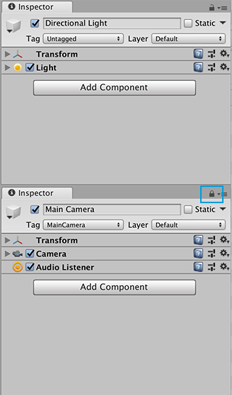添加新选项卡，将其停靠在当前 Inspector 选项卡下，然后将其锁定。

## Debug/Normal 模式

选项卡菜单上的另一个选项是在 *Normal* 模式和 *Debug* 模式之间选择。通常，Inspector 会显示资源或组件的自定义编辑器（如有），但有时直接查看属性会很方便。Debug 模式只显示属性而不显示自定义编辑器，对于脚本，该模式还显示私有变量（但是这些变量的值不能像公共变量的值那样进行编辑）。

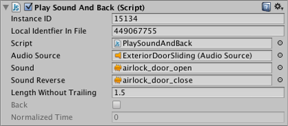在 Debug 模式下看到的脚本，带有灰显的私有变量

与 Lock 模式一样，Debug/Normal 模式分别应用于每个 Inspector，因此可以同时打开两个 Inspector 来查看两个视图。

## 保存和恢复布局

创建 Editor 窗口布局后，可以保存布局并可随时还原。可以通过展开 Layout 下拉选单（在工具栏上）并选择 **Save Layout…** 来完成此操作。为新布局命名并保存，然后只需从 Layout 下拉选单中选择此名称即可将恢复此布局。

## 项目搜索和标签

Project 视图中也有一个搜索框。此处的搜索适用于_资源_而不是场景中的实例。

可用于资源的另一个选项是按__标签__搜索以及按名称和类型搜索。标签只是一小段文本，可用于对特定资源进行分组。如果单击 Project 窗口左侧第二个标签按钮，将看到一个包含现有标签的菜单，并在顶部有一个文本框。然后，可请求分配了特定标签的资源。也可以创建新标签。例如，可添加“Vehicles”标签，以便轻松找到所有车辆资源。可在 Inspector 底部的 *Asset Labels* 框中为资源添加标签。

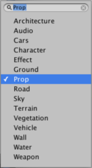添加“Prop”标签

文本框可用于过滤现有标签或输入新标签的文本；在输入时按空格键或 Enter 键即可将新标签文本添加到资源。当前应用于资源的标签会在菜单的左侧显示一个勾号标记。只需从菜单中“选择”一个已应用的标签即可删除该标记。请注意，任何资源都可以包含任意所需数量的标签，因此可同时属于多个不同的标签组。

# 其他窗口

本页面介绍的窗口涵盖了 Unity 界面的基本信息。Unity 中的其他窗口在其他页面中单独介绍：

- [Console 窗口](https://docs.unity.cn/cn/2018.4/Manual/Console.html)显示消息、警告和错误的日志。
- [Animation 窗口](https://docs.unity.cn/cn/2018.4/Manual/AnimationEditorGuide.html)可用于为场景中的对象设置动画。
- [Profiler 窗口](https://docs.unity.cn/cn/2018.4/Manual/Profiler.html)可用于调查和查找游戏中的性能瓶颈。
- [Lighting 窗口](https://docs.unity.cn/cn/2018.4/Manual/GlobalIllumination.html)可用于管理场景中的光照。
- [Occlusion Culling 窗口](https://docs.unity.cn/cn/2018.4/Manual/OcclusionCulling.html)可用于管理遮挡剔除 (Occlusion Culling) 以便提高性能。