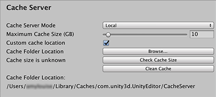
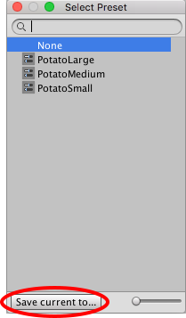
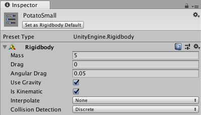

# 2D 和 3D 模式设置

创建新项目时，可以指定是以 2D 模式还是 3D 模式启动 Unity Editor。但是，也可以随时在 2D 模式和 3D 模式之间切换 Editor。可以[在此处阅读有关 2D 和 3D 项目之间差异](https://docs.unity.cn/cn/2018.4/Manual/2Dor3D.html)的更多信息。本页面将介绍如何切换模式以及切换模式时 Editor 中究竟发生哪些变化。

## 在 3D 和 2D 模式之间切换

要在 2D 或 3D 模式之间更改模式，请执行以下操作：

1.打开 [Editor](https://docs.unity.cn/cn/2018.4/Manual/class-EditorManager.html) 设置（顶部菜单：__Edit > Project Settings__，然后选择 **Editor** 类别）。 2.然后将 **Default Behavior Mode** 设置为 **2D** 或 **3D**。

使用 Editor 设置中的 Default Behavior Mode 设置将项目设置为 2D 或 3D 模式

## 2D 与 3D 模式设置

2D 或 3D 模式决定了 Unity Editor 的某些设置。下面列出了这些设置。

### 在 2D 项目模式下：

- 导入的任何图像都被假定为 2D 图像（__精灵__）并设置为__精灵__模式。
- 启用 **Sprite Packer**。
- __Scene 视图__设置为 2D。
- 默认游戏对象没有实时方向光。
- 摄像机的默认位置为 0,0,–10。（在 3D 模式下为 0,1,–10。）
- 摄像机设置为 **Orthographic**。（在 3D 模式下设置为 **Perspective**。）
- 在 Lighting 窗口中：
  - 新场景将禁用 **Skybox**。
  - **Ambient Source** 设置为 **Color**。（颜色设置为深灰色：RGB：54, 58, 66。）
  - **Precomputed Realtime GI** 设置为 off。
  - **Baked GI** 设置为 off。
  - **Auto-Building** 设置为 off。

# Preferences

Unity 提供了许多偏好设置以用于自定义 Unity Editor 的行为。

## General

Preferences 窗口中的 General 范围

**General** 偏好设置可用于在总体上自定义 Unity 的使用方式。

| **属性**                                | **功能**                                                     |                                                              |
| :-------------------------------------- | :----------------------------------------------------------- | ------------------------------------------------------------ |
| **Auto Refresh**                        | 启用此选项可在资源更改时自动更新资源。                       |                                                              |
| **Load Previous Project on Startup**    | 启用此选项可在启动时始终加载上一个项目。                     |                                                              |
| **Compress Assets on Import**           | 启用此选项可在导入期间自动压缩资源。                         |                                                              |
| **macOS Color Picker**                  | 启用此选项可使用原生 macOS 拾色器而不是 Unity 自己的拾色器。 |                                                              |
| **Disable Editor Analytics** (Pro only) | 启用此选项可禁止 Editor 自动将信息发送回 Unity。             |                                                              |
| **Show Asset Store search hits**        | 启用此选项可在 Project Browser 中显示 Asset Store 中的免费/付费资源数量。 |                                                              |
| **Verify Saving Assets**                | 如果要在退出 Unity 时单独验证要保存的资源，请启用此选项。    |                                                              |
| **Script Changes While Playing**        | 选择在 Editor 中运行游戏时脚本发生更改的情况下 Unity 采取的行为。 |                                                              |
|                                         | *Recompile And Continue Playing*                             | 重新编译脚本并继续运行场景。这是默认行为，但如果脚本依赖于任何不可序列化的数据，可能需要更改默认行为。 |
|                                         | *Recompile After Finished Playing*                           | 推迟重新编译，直到手动停止场景，从而避免发生任何中断。       |
|                                         | *Stop Playing And Recompile*                                 | 立即停止场景的重新编译，允许您快速重新启动测试。             |
| **Editor Skin**                         | 选择要在 Unity Editor 中使用的皮肤。此设置仅适用于 Plus 和 Pro 版 Unity 订阅。 |                                                              |
|                                         | *Personal*                                                   | 使用浅灰色背景和黑色文本。                                   |
|                                         | *Professional*                                               | 使用深灰色背景和白色文本。                                   |
| **Enable Alpha Numeric Sorting**        | 启用此选项可在 [Hierarchy](https://docs.unity.cn/cn/2018.4/Manual/Hierarchy.html) 窗口的右上角显示一个按钮，用于在变换 (Transform) 排序（默认）和字母数字 (Alphanumeric) 排序之间切换。 |                                                              |
| **Device To Use**                       | 选择 Unity 应该使用计算机的哪一个图形设备。除非希望 Unity 使用特定的设备，否则可以将其设为 Automatic。此设置将覆盖命令行选项中指定的任何设备。 |                                                              |


## 2D


Preferences 窗口中的 2D 范围

使用 **Max Sprite Atlas Cache Size (GB)** 偏好设置可设置[精灵图集](https://docs.unity.cn/cn/2018.4/Manual/class-SpriteAtlas.html)缓存文件夹的最大大小。Unity 会尽可能使此文件夹的大小低于此水平。


### Grid Brush

Preferences 窗口中的 Grid Brush 范围

启用 **Show Flood Fill Preview** 可在灌填 (Flood Fill) 模式下预览正在绘制的瓦片地图。默认情况下会启用此选项，但可以禁用该选项以提高大型填充区域的性能。


### Tile Palette

Preferences 窗口中的 Tile Palette 范围

从 **Tile Palette Target Edit Mode** 下拉菜单中选择一种行为以确定当某个预制件实例被选定为活动目标 (Active Target) 时如何在[瓦片面板 (Tile Palette)](https://docs.unity.cn/cn/2018.4/Manual/Tilemap-Palette.html) 中编辑此实例。

| **行为**                | **描述**                                                     |
| :---------------------- | :----------------------------------------------------------- |
| **Enable Dialog**       | 始终询问如何编辑实例（无论是在预制件模式下还是在场景中）。此为默认值。 |
| **Edit in Prefab Mode** | [在预制件模式下](https://docs.unity.cn/cn/2018.4/Manual/EditingInPrefabMode.html)编辑绘制目标。 |
| **Edit in Scene**       | [直接在场景中](https://docs.unity.cn/cn/2018.4/Manual/EditingPrefabViaInstance.html)编辑预制件实例。 |


## Cache Server

只要资源发生变化，Unity 就会自动重新导入该资源。设置缓存服务器 (Cache Server) 可以大大减少导入资源所需的时间。可以将缓存服务器设置为远程托管，也可以存储在本地计算上。

Preferences 窗口中的默认 Cache Server 范围

默认情况下会禁用 [Cache Server](https://docs.unity.cn/cn/2018.4/Manual/CacheServer.html) 类别。

要启用，请从 **Cache Server Mode** 下拉菜单中选择其他选项：

| **属性**   | **功能**                                                     |
| :--------- | :----------------------------------------------------------- |
| **Local**  | 使用此计算机上的本地缓存服务器。此时将显示[远程托管](https://docs.unity.cn/cn/2018.4/Manual/Preferences.html#remote)偏好设置。 |
| **Remote** | 使用远程计算机上托管的缓存服务器。此时将显示[本地存储](https://docs.unity.cn/cn/2018.4/Manual/Preferences.html#local)偏好设置。 |

### 本地存储

本地缓存服务器的偏好设置

仅当 **Use Cache Server** 设置为 **Local** 时，这些偏好设置才可用。

| **属性**                    | **功能**                                                     |
| :-------------------------- | :----------------------------------------------------------- |
| **Maximum Cache Size (GB)** | 指定缓存服务器在此计算机存储中的最大大小（以 GB 为单位）。最小大小为 1GB。最大大小为 200GB。 默认缓存大小为 10GB。 |
| **Custom cache location**   | 启用此选项可指定所需的缓存存储位置。                         |
| **Cache Folder Location**   | 单击 **Browse** 按钮可指定缓存的位置。                       |
| **Cache size is** …         | 用于显示当前缓存大小的消息。在单击 **Check Cache Size** 按钮之前，此消息显示为 **Cache size is unknown**。单击此按钮后，消息中将显示计算出的缓存大小。 |
| **Check Cache Size**        | 单击此按钮可查看本地缓存服务器使用的存储量。如果项目很大，此操作可能需要一些时间才能完成。 |
| **Clean Cache**             | 删除缓存的内容。                                             |

# 预设

使用预设可在多个组件和资源之间重用属性设置。

使用预设还可指定新组件的默认属性以及资源的[导入设置](https://docs.unity.cn/cn/2018.4/Manual/ImportingAssets.html)。可使用 [Presets](https://docs.unity.cn/cn/2018.4/Manual/class-PresetManager.html) 设置来查看和选择要用于默认设置的预设。

预设可用于简化团队的工作流程。甚至可以使用预设来指定 [Project Settings](https://docs.unity.cn/cn/2018.4/Manual/comp-ManagerGroup.html) 窗口（包括 **Preset** 设置本身）的设置。可使用此功能配置某个项目，然后[将其导出](https://docs.unity.cn/cn/2018.4/Manual/HOWTO-exportpackage.html)作为自定义资源包。团队成员可将此资源包[导入](https://docs.unity.cn/cn/2018.4/Manual/AssetPackages.html)其项目中。

预设功能只能在 Editor 中使用。可在 Unity Editor 的扩展中[支持预设](https://docs.unity.cn/cn/2018.4/Manual/SupportingPresets.html)。预设不能在运行时用于 Unity Player。

## 重用属性设置

通过复制和粘贴等方式即可使用预设。但是，不会将设置复制到剪贴板，而是保存设置供以后使用。与粘贴设置一样，将预设应用于某个项会更改此项中的属性。

例如，选择一个游戏对象来编辑其刚体 (RigidBody) 组件的属性。将这些设置保存到预设。然后，可将该预设应用于其他游戏对象中的刚体组件。游戏对象中的其他组件不受影响；预设仅将其设置应用于刚体组件。

可将预设存储在项目的 `Assets` 文件夹中。使用 [Project](https://docs.unity.cn/cn/2018.4/Manual/ProjectView.html) 窗口可查看并选择要在 **Inspector** 中编辑的预设。

**Project** 窗口中的预设资源示例，这些资源放置在 *Presets* 子文件夹中

## 将属性设置保存到预设

使用 **Select Preset** 窗口可保存属性设置。

**提示：**还可以在播放模式下保存预设。

要将设置保存到预设，请执行以下操作：

1.选择要重用设置的游戏对象、资源导入设置或 Project Settings 窗口。 2.在 **Inspector** 窗口中，编辑属性。 3.单击 **Inspector** 窗口右上角的 Preset 图标。
 4.在 Select Preset 窗口中，单击 **Save current to**。

随后将显示一个 File Save 对话框。

5.选择新预设的位置，输入其名称，然后单击 **Save**。

## 应用预设

要应用已保存的预设，可使用 **Select Preset** 窗口，或者将某个预设从 **Project** 窗口拖放到游戏对象上。

**注意：**应用预设会将属性从预设复制到该项。此过程不会将预设链接到该项。对预设所做的更改不会影响先前已应用预设的项。

要将预设应用于 Project Settings 窗口、现有组件或资源导入设置，请执行以下操作：

1.选择要应用预设的 Settings 窗口、游戏对象或资源导入设置。

2.在 **Inspector** 中，单击 **Preset** 图标。

3.在 **Select Preset** 窗口中，搜索并选择要应用的预设。

```
选择预设会将其应用于组件、资源或 Project Settings 窗口。
```

4.关闭 **Select Preset** 窗口。

拖放 [Project](https://docs.unity.cn/cn/2018.4/Manual/ProjectView.html) 窗口中的预设，即可将属性应用于游戏对象中的组件：

- 将预设放在 [Hierarchy](https://docs.unity.cn/cn/2018.4/Manual/Hierarchy.html) 窗口中的空字段上。Unity 会创建新的空游戏对象，并添加一个包含从预设复制的属性的组件。
- 将预设放在 **Hierarchy** 中的现有游戏对象上。Unity 会添加新组件并从预设复制属性。
- 将预设放在 [Inspector](https://docs.unity.cn/cn/2018.4/Manual/UsingTheInspector.html) 窗口中某个游戏对象的末尾。Unity 会添加新组件并从预设复制属性。
- 将预设放在 **Inspector** 中某个现有组件的名称上。Unity 会从预设复制属性。

## 对动画状态节点的过渡使用预设

可保存和应用[动画状态](https://docs.unity.cn/cn/2018.4/Manual/class-State.html)节点的预设。但是，预设中的[过渡](https://docs.unity.cn/cn/2018.4/Manual/class-Transition.html)将在预设以及应用预设的节点之间共享。例如，可将预设应用于 [Animator 窗口](https://docs.unity.cn/cn/2018.4/Manual/AnimatorWindow.html)中的两个不同节点。在 Inspector 窗口中，编辑第一个节点中某个过渡的设置。所做的更改也会显示在另一个节点中和预设中。

## 使用预设来导入资源

可保存资源[导入设置](https://docs.unity.cn/cn/2018.4/Manual/ImportingAssets.html)的预设。但是，对导入设置应用预设不会影响跨平台设置。要应用预设以使其包含跨平台设置，请将[预设设置为默认值](https://docs.unity.cn/cn/2018.4/Manual/class-PresetManager.html)，然后使用 **Reset** 命令。

还可以使用[脚本](https://docs.unity.cn/cn/2018.4/Manual/DefaultPresetsByFolder.html)根据资源在 Project 窗口中的位置将预设应用于该资源。

## 编辑预设

使用 [Inspector](https://docs.unity.cn/cn/2018.4/Manual/UsingTheInspector.html) 窗口可编辑预设资源。

**注意：**更改预设中的属性不会更新已应用预设的项。例如，如果将刚体组件的预设应用于游戏对象，然后编辑该预设，则刚体组件中的设置不会更改。

在 Inspector 窗口中编辑预设

# Build Settings

## Scenes in Build

窗口的这一部分显示了项目中将包含在构建中的场景。如果没有显示场景，则可以使用 *Add Current* 按钮将当前场景添加到构建中，或者可以从 Project 窗口将场景资源拖动到此窗口中。也可以取消选中此列表中的场景以将其从构建中排除，而无需将其从列表中删除。如果构建中不再需要某个场景，则可以通过按 Delete 键将其从场景列表中删除。

勾选并添加到 Scenes in Build 列表中的场景将包含在构建中。场景列表将用于控制场景的加载顺序。可以通过向上或向下拖动来调整场景的顺序。

## 平台列表

Scenes in Build 区域下方的 Platform 区域列出了您的 Unity 版本可用的所有平台。某些平台可能会显示为灰色，表示它们不属于您的版本，或者用于邀请您下载平台特定的构建选项。选择其中一个平台将控制将构建哪个平台。如果更改目标平台，则需要按“Switch Platform”按钮应用更改。此过程可能需要一些时间进行切换，因为可能需要使用与目标平台匹配的格式重新导入资源。当前选定的平台会在平台名称右侧显示 Unity 图标。

所选平台将显示可针对该构建进行调整的选项列表。每个平台可能有不同的选项。下面列出了这些选项。许多平台共同的选项列在本节最底部的“通用构建选项”详细信息中。

### PC, Mac & Linux Standalone

| 选项                     | 目的                                                         |
| :----------------------- | :----------------------------------------------------------- |
| Target Platform          |                                                              |
| Windows                  | 以 Windows 为构建目标                                        |
| Mac OS X                 | 以 Mac 为构建目标                                            |
| Linux                    | 以 Linux 为构建目标                                          |
| Architecture             | x86                                                          |
| x86                      | 32 位 CPU                                                    |
| x86_64                   | 64 位 CPU                                                    |
| Universal                | 所有 CPU 设备                                                |
| x86 + x86_64 (Universal) | 适用于 Linux 的所有 CPU 设备                                 |
| Server Build             | 构建播放器以供服务器使用，没有视觉元素（无头），无需任何命令行选项。启用此复选框后，Unity 使用 UNITY_SERVER define 来构建托管脚本，允许为应用程序编写服务器特有的代码。还可以构建 Windows 版本作为控制台应用程序，以便可访问 `stdin` 和 `stdout`（Unity 日志默认到达 `stdout`）。 |
| Copy PDB files           | （仅限 Windows）在构建的独立平台播放器中包含 Microsoft 程序数据库 (PDB) 文件。PDB 文件包含对调试有用的应用程序调试信息，但可能会增加播放器的大小。默认情况下会禁用此设置。 |
| Headless Mode            | 构建游戏以供服务器使用，没有视觉元素                         |

### iOS

| Option                  | Purpose                                                      |                  |
| :---------------------- | :----------------------------------------------------------- | ---------------- |
| Run in Xcode            | Select the version of Xcode to use in the build. When set to Latest version,the build uses the most recent version of Xcode on your machine. |                  |
| Run in Xcode as         |                                                              |                  |
|                         | Release                                                      | Shipping version |
|                         | Debug                                                        | Testing version  |
| Symlink Unity libraries | Reference to the Unity libraries instead of copying them into the XCode project. (Reduces the XCode project size.) |                  |

### Android

有关 Android 构建设置的信息，请参阅[构建 Android 应用程序](https://docs.unity.cn/cn/2018.4/Manual/android-BuildProcess.html)。

### WebGL

WebGL 的 Build Settings 使用本页后面显示的通用设置。

### 三星电视

三星电视的 Build Settings 使用本页后面显示的通用设置。

### Xiaomi

有关为 Xiaomi Game Center 构建项目的信息，请参阅 [Unity Xiaomi 文档](https://unity3d.com/cn/partners/xiaomi/guide)。

### 其他平台

在《用户指南》的“特定于平台的信息”部分介绍了需要 Unity 许可证的游戏主机平台和设备。

### 通用构建选项

| 选项                 | 目的                                                         |                                                              |
| :------------------- | :----------------------------------------------------------- | ------------------------------------------------------------ |
| Development Build    | 允许开发人员测试并确定构建的进展方式。                       |                                                              |
| Autoconnect Profiler | 选择 Development Build 选项后，允许性能分析器连接到构建版本。 |                                                              |
| Script Debugging     | 选择 Development Build 选项后，允许调试脚本代码。在 WebGL 上不可用。 |                                                              |
| Scripts Only Build   | 仅构建当前项目中的脚本。                                     |                                                              |
| Compression Method   | 在构建播放器时压缩项目中的数据。这些数据包括[资源](https://docs.unity.cn/cn/2018.4/Manual/AssetTypes.html)、[场景](https://docs.unity.cn/cn/2018.4/Manual/CreatingScenes.html)、[播放器](https://docs.unity.cn/cn/2018.4/Manual/class-PlayerSettings.html)设置和 [GI 数据](https://docs.unity.cn/cn/2018.4/Manual/GICache.html)。选择以下方法之一： |                                                              |
|                      | Default                                                      | 在 PC、Mac、Linux 独立平台和 iOS 上，默认情况下不进行压缩。在 Android 上，默认压缩方法是 ZIP，此方法提供比 LZ4HC 稍好的压缩结果，但数据解压缩的速度更慢。 |
|                      | LZ4                                                          | 一种快速压缩格式，对开发构建很有用。有关更多信息，请参阅 [BuildOptions.CompressWithLz4](https://docs.unity.cn/cn/2018.4/ScriptReference/BuildOptions.CompressWithLz4.html)。 |
|                      | LZ4HC                                                        | LZ4 的高度压缩变体，构建速度更慢，但对于发行版构建可以产生更好的结果。有关更多信息，请参阅 [BuildOptions.CompressWithLz4HC](https://docs.unity.cn/cn/2018.4/ScriptReference/BuildOptions.CompressWithLz4HC.html)。 |

# 特殊文件夹名称

通常可为创建的文件夹选择任何名称来组织 Unity 项目。但是，Unity 会将许多文件夹名称解释为应以特殊方式处理文件夹内容的指令。例如，必须将 Editor 脚本放在名为 **Editor** 的文件夹中才能使这些脚本正常工作。

本页面包含 Unity 使用的特殊文件夹名称的完整列表。

## Assets

**Assets** 文件夹是包含 Unity 项目使用的资源的主文件夹。Editor 中的 Project 窗口的内容直接对应于 Assets 文件夹的内容。大多数 API 函数都假定所有内容都位于 Assets 文件夹中，因此不要求显式提及该文件夹。但是，有些函数需要将 Assets 文件夹作为路径名的一部分添加（例如，[AssetDatabase](https://docs.unity.cn/cn/2018.4/ScriptReference/AssetDatabase.html) 类中的一些函数）。

## Editor

放在名为 **Editor** 的文件夹中的脚本被视为 Editor 脚本而不是运行时脚本。这些脚本在开发期间向 Editor 添加功能，并在运行时在构建中不可用。

可在 Assets 文件夹中的任何位置添加多个 Editor 文件夹。应将 Editor 脚本放在 Editor 文件夹内或其中的子文件夹内。

Editor 文件夹的具体位置会影响其脚本相对于其他脚本的编译时间（有关此方面的完整说明，请参阅[特殊文件夹和脚本编译顺序](https://docs.unity.cn/cn/2018.4/Manual/ScriptCompileOrderFolders.html)的相关文档）。使用 Editor 脚本中的 [EditorGUIUtility.Load](https://docs.unity.cn/cn/2018.4/ScriptReference/EditorGUIUtility.Load.html) 函数可从 Editor 文件夹中的 Resources 文件夹加载资源。这些资源只能通过 Editor 脚本加载，并会从构建中剥离。

**注意：**如果脚本位于 Editor 文件夹中，Unity 不允许将派生自 MonoBehaviour 的组件分配给游戏对象。

## Editor Default Resources

Editor 脚本可以使用通过 [EditorGUIUtility.Load](https://docs.unity.cn/cn/2018.4/ScriptReference/EditorGUIUtility.Load.html) 函数按需加载的资源文件。此函数在名为 **Editor Default Resources** 的文件夹中查找资源文件。

只能有一个 Editor Default Resources 文件夹，且必须将其放在项目的根目录；直接位于 Assets 文件夹中。将所需的资源文件放在此 Editor Default Resources 文件夹内或其中的子文件夹内。如果资源文件位于子文件夹中，请始终在传递给 [EditorGUIUtility.Load](https://docs.unity.cn/cn/2018.4/ScriptReference/EditorGUIUtility.Load.html) 函数的路径中包含子文件夹路径。

## Gizmos

[Gizmos](https://docs.unity.cn/cn/2018.4/ScriptReference/Gizmos.html) 允许将图形添加到 Scene 视图，以帮助可视化不可见的设计细节。[Gizmos.DrawIcon](https://docs.unity.cn/cn/2018.4/ScriptReference/Gizmos.DrawIcon.html) 函数在场景中放置一个图标，作为特殊对象或位置的标记。必须将用于绘制此图标的图像文件放在名为 **Gizmos** 的文件夹中，这样才能被 DrawIcon 函数找到。

只能有一个 Gizmos 文件夹，且必须将其放在项目的根目录；直接位于 Assets 文件夹中。将所需的资源文件放在此 Gizmos 文件夹内或其中的子文件夹内。如果资源文件位于子文件夹中，请始终在传递给 [Gizmos.DrawIcon](https://docs.unity.cn/cn/2018.4/ScriptReference/Gizmos.DrawIcon.html) 函数的路径中包含子文件夹路径。

## Plug-ins

可为项目添加[插件](https://docs.unity.cn/cn/2018.4/Manual/Plugins.html)来扩展 Unity 的功能。插件是通常用 C/C++ 编写而成的本机 DLL。这些插件可以访问第三方代码库、系统调用和其他 Unity 内置功能。请始终将插件放在名为 **Plugins** 的文件夹中，这样才能被 Unity 检测到。

只能有一个 Plugins 文件夹，且必须将其放在项目的根目录；直接位于 Assets 文件夹中。

请参阅[特殊文件夹和脚本编译顺序](https://docs.unity.cn/cn/2018.4/Manual/ScriptCompileOrderFolders.html)以了解有关此文件夹如何影响脚本编译的更多信息；并参阅 [Plugin Inspector](https://docs.unity.cn/cn/2018.4/Manual/PluginInspector.html) 以了解有关管理不同目标平台的插件的更多信息。

## Resources

可从脚本中按需加载资源，而不必在场景中创建资源实例以用于游戏。为此，应将资源放在一个名为 **Resources** 的文件夹中。通过使用 [Resources.Load](https://docs.unity.cn/cn/2018.4/ScriptReference/Resources.Load.html) 函数即可加载这些资源。

可在 Assets 文件夹中的任何位置添加多个 Resources 文件夹。将所需的资源文件放在 Resources 文件夹内或其中的子文件夹内。如果资源文件位于子文件夹中，请始终在传递给 [Resources.Load](https://docs.unity.cn/cn/2018.4/ScriptReference/Resources.Load.html) 函数的路径中包含子文件夹路径。

请注意，如果 Resources 文件夹是 Editor 的子文件夹，则其中的资源可通过 Editor 脚本加载，但会从构建中剥离。

## Standard Assets

导入标准资源包（菜单：__Assets__ > **Import Package__）时，资源将放在一个名为** Standard Assets__ 的文件夹中。除了包含资源之外，这些文件夹还会对脚本编译顺序产生影响；请参阅关于[特殊文件夹和脚本编译顺序](https://docs.unity.cn/cn/2018.4/Manual/ScriptCompileOrderFolders.html)的页面以了解更多详细信息。

只能有一个 Standard Assets 文件夹，且必须将其放在项目的根目录；直接位于 Assets 文件夹中。将所需的资源文件放在此 Standard Assets 文件夹内或其中的子文件夹内。

## StreamingAssets

尽管将资源直接合并到构建中更为常见，但有时可能希望资源以其原始格式作为单独的文件提供。例如，需要从文件系统访问视频文件，而不是用作 MovieTexture 在 iOS 上播放该视频。将一个文件放在名为 **StreamingAssets** 的文件夹中，这样就会将其按原样复制到目标计算机，然后就能从特定文件夹中访问该文件。请参阅关于[流媒体资源 (Streaming Assets)](https://docs.unity.cn/cn/2018.4/Manual/StreamingAssets.html) 的页面以了解更多详细信息。

只能有一个 StreamingAssets 文件夹，且必须将其放在项目的根目录；直接位于 Assets 文件夹中。将所需的资源文件放在此 StreamingAssets 文件夹内或其中的子文件夹内。如果资源文件位于子文件夹中，请始终在用于引用流媒体资源的路径中包含子文件夹路径。

## 隐藏的资源

在导入过程中，Unity 完全忽略 **Assets** 文件夹（或其子文件夹）中的以下文件和文件夹：

- 隐藏的文件夹。
- 以“**.**”开头的文件和文件夹。
- 以“**~**”结尾的文件和文件夹。
- 名为 **cvs** 的文件和文件夹。
- 扩展名为 **.tmp** 的文件。

这是为了防止导入由操作系统或其他应用程序创建的特殊文件和临时文件。

# 导出资源包

在构建游戏时，Unity 会存储有关资源的大量元数据，例如导入设置、其他资源的链接以及其他信息。如果要将资源转移到其他项目并保留所有此类信息，可采用__自定义资源包__形式导出资源。

请参阅[资源包](https://docs.unity.cn/cn/2018.4/Manual/AssetPackages.html)以了解关于使用（包括导入和导出）__资源包__的详细信息。

### 导出新资源包

使用 **Export Package** 可创建您自己的__自定义资源包__。

1.打开要从中导出资源的项目。 2.从菜单中选择 **Assets > Export Package…** 以弹出 **Exporting Package** 对话框。 （请参阅*图 1：Exporting Package 对话框*。） 3.在此对话框中，通过单击复选框来选择要包含在资源包中的资源。 4.将 **include dependencies** 复选框保持选中状态，即可自动选择所选资源使用的所有资源。 5.单击 **Export** 以打开文件资源管理器 (Windows) 或 Finder (Mac)，然后选择要存储资源包文件的位置。 为资源包命名，并将其保存任何所需位置。

**提示：**导出资源包时，Unity 也可以导出所有依赖项。 因此，例如，如果选择一个场景并导出包含所有依赖项的资源包，那么也将导出场景中出现的所有模型、 纹理和其他资源。 这是导出大量资源的快捷方法，无需手动定位所有资源。

图 1：Exporting Package 对话框

### 导出更新的资源包

有时可能希望更改资源包的内容并创建资源包的更新版本。 为此需要执行以下操作：

- 选择希望纳入资源包中的资源文件（选择未更改的文件和新文件）。
- 如上文的***导出资源包\***中所述，导出文件。

**注意：**可以重命名更新的资源包，而 Unity 会将其识别为更新，因此可以使用增量式命名方式，例如：MyAssetPackageVer1、MyAssetPackageVer2。

**提示：**不建议从资源包中删除文件，然后使用相同名称来替换这些文件： Unity 会将这些文件识别为不同且可能发生冲突的文件，因此在导入这些文件时会显示警告符号。 如果已删除文件，随后决定恢复此文件，最好给此文件提供一个与原名不同但相关的名称。